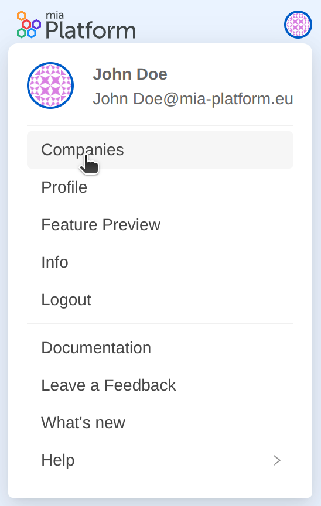

Console users have the possibility to view a list of all the Companies they belong to, and to leave them autonomously when they need it.

:::info
You need to be part of at least one Company to view the list.
:::

### Viewing your Companies

When hovering over the user profile picture, a dropdown menu appears: click on the `Your Companies` item to view the list of your Companies. 

In `Your Companies` section, a user can find information about which Companies it has access to.
For each Company, a user can identify its assigned Company role and which groups he belongs to.

### Leaving a Company

If you no longer want to be part of a Company, you can decide to leave it by clicking on the exit button placed at the end of each table row.

:::warning
You will be asked to confirm your choice. After leaving a Company, you will lose access to all its Projects and resources until you are reinstated as a member of the Company. In addition, leaving the Company will result in automatically leaving all Company groups of which you belong to.
:::

