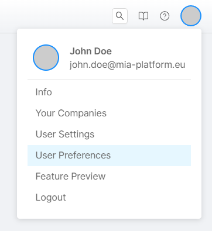
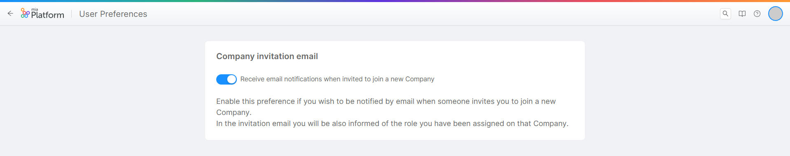

### Manage your Console Preferences
After hovering over the user profile picture, from the dropdown menu, click on the `User Preferences` item to view and manage some preferences in Console for your account. 

The preferences that you can manage are:
- **Company invitation email**: through this setting you can decide whether or not to receive an invitation email when you are added on a Company.

