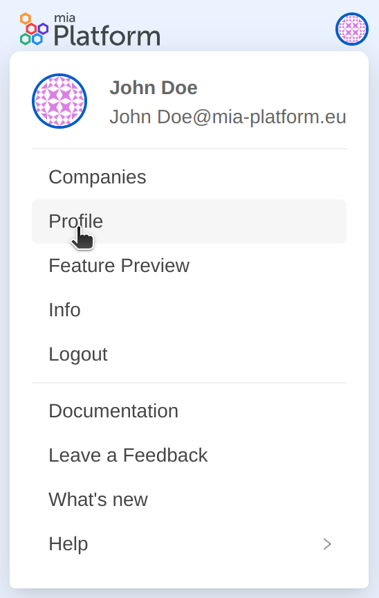

### Manage your Console Preferences

After hovering over the user profile picture, from the launchbar dropdown menu, click on the `Profile` option. Once clicked there, you will enter the section where you can view and manage the Profile Settings of the user.  
If you want to view and manage the "User preferences", you just need to select the `Preferences` tab from the menu on the left. At that point, the screen will display all the preferences that can currently be configured by the user. 

The preferences that you can manage are:

- **Company invitation email**: through this setting you can decide whether or not to receive an invitation email when you are added on a Company.

You can manage preferences simply by toggling the switch related to the specific preference. Changes will apply immediately.
