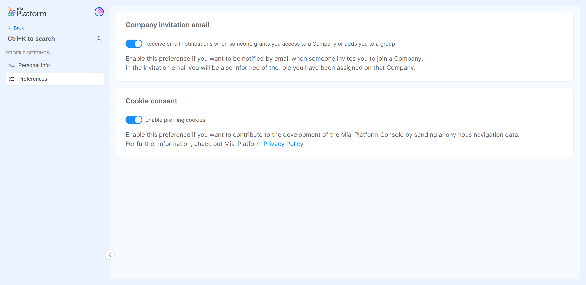

### Manage your Console Preferences
Hovering over the user profile picture, from the dropdown menu, click on the `User Preferences` item to view and manage some behaviors of the console for your account. 

The preferences that you can manage are:
- **Company invitation email**: this setting manages whether or not you receive an email notification when you are added on a new Company.

