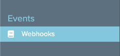
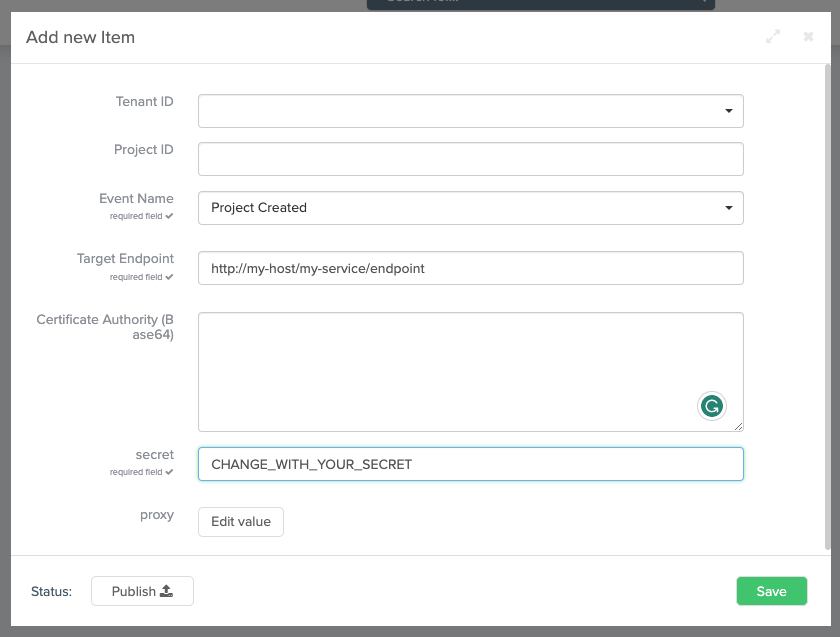

Webhooks allow you to build or set up integrations that subscribe to certain Console events. 
When one of those events is triggered, the Console will send an HTTP POST payload to the webhook's configured URL.

Webhooks can be installed on a Console instance, a specific company, or a specific project. 
Once installed, the webhook will be sent when one or more subscribed events occur.

## Events subscription

You can subscribe to events on the Console using the CMS.<br/>
The collection will be found below the new label inside the menu.



From the `Events` category, click the `Webhooks` page and the `Add new` to create a new webhook subscription.



You will be asked to provide the following parameters:

| Parameter   | Value    | required | Description                                                                                                                         |
|-------------|----------|----------|-------------------------------------------------------------------------------------------------------------------------------------|
| `tenantId`  | `string` |          | If specified, only events triggered inside the specified company will be delivered to the target URL. Must be a company identifier. |
| `projectId` | `string` |          | If specified, only events triggered inside the specified project will be delivered to the target URL. Must be a project identifier. |
| `eventName` | `string` | ✅        | The name of the event to listen to. See the [event types page](/development_suite/webhooks-and-events/events.mdx).                  |
| `target`    | `string` | ✅        | The HTTP URL that will be called when event will be triggered. Es https://service-name/api-that-recive-the-evets/                   |
| `base64CA`  | `string` |          | The Certificate Authority exposed by the target URL encoded in base64.                                                              |
| `secret`    | `string` | ✅        | The shared secret used to authenticate the events payload.                                                                          |
| `proxy.url` | `string` |          | The URL of the proxy.                                                                                                               |

## Payload authentication

The payload delivered by the Console will be authenticated using the `X-Mia-Token` header. 
This will both prevent the modification of the payload by third-parties and allow the receiver to ensure that the event 
has been triggered by the Console.

:::warning
This authentication method is not safe against replay attacks. 
It is recommended to store the latest `eventTimestamp` on the receiver side to prevent this attack.
:::

The `X-Mia-Token` header will contain the hex encoded `sha256` digest of the event payload concatenated with the provided `secret`. In formula:

```
X-Mia-Token = hex(sha256( payload + secret ))
```
