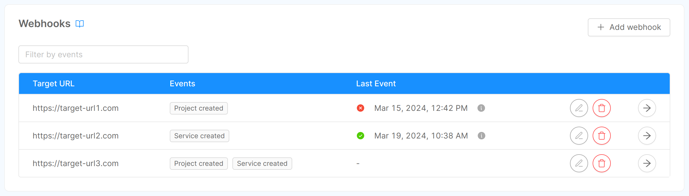
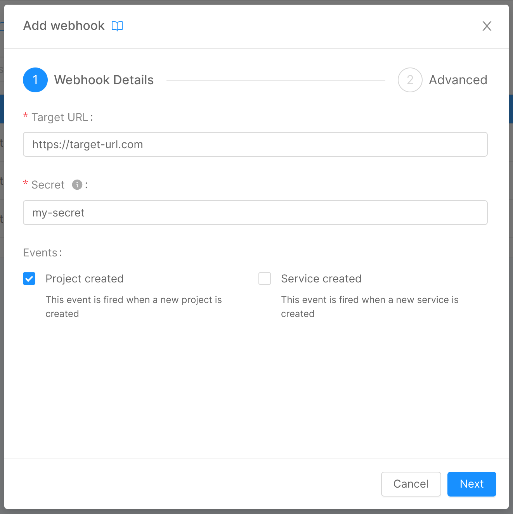
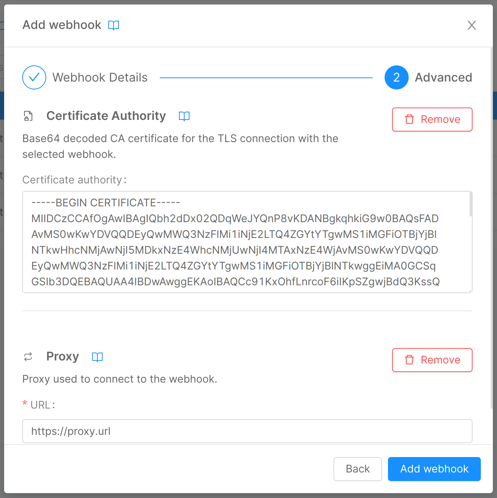
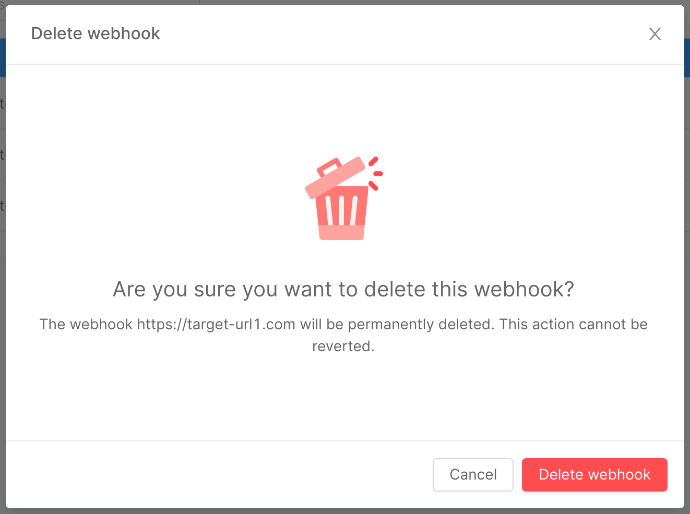

Webhooks allow you to build or set up integrations that subscribe to certain Console events. 
When one of those events is triggered, the Console will send an HTTP POST payload to the webhook's configured URL.

Webhooks can be installed on a Console instance, a specific company, or a specific project. 
Once installed, the webhook will be sent when one or more subscribed events occur.

## Webhooks Overview

Mia-Platform Console allows authorized users to manage webhooks. 

More specifically, a user can add, edit, and delete a webhook for a company. To access these features, head to the Company Overview area of the Console by clicking the related button on the home page, next to your company name.


By clicking on "Webhooks" you will be redirected to the related section, in which (assuming you already have added some webhooks) you can see a table containing some information about the webhooks:

* **Target URL**: the HTTP URL that will be called when the event is triggered;
* **Events**: the name of the events the webhook should listen to. Check them out [here](/development_suite/webhooks-and-events/events.mdx).

You can filter table data by events, add a webhook, or edit/delete a specific webhook using the related button associated with its table row.



## Add a Webhook

You can add a webhook by clicking on the "Add webhook" button, located in the page's top right corner. A modal will show up, and, through a few steps, you will be asked to enter some information related to the webhook.

### Step 1: Webhook Details



In this step, you can insert some general details about your webhook:

* **Target URL** (*required*): the HTTP URL that will be called when the event is triggered;
* **Secret** (*required*): the shared secret used to authenticate the events payload;
* **Events** (*required*): the events the webhook should listen to.

:::caution
The secret entered at this stage, for security reasons, will never again be shown to the user, who will be able to replace it with a new one but not visualize it again.
:::

### Step 2: Advanced



In this step, you can enter some optional advanced information through two expandable forms:

#### Certificate Authority

If you have set up verification of a CA for the connection to your webhook, here you can enter it through the homonymous field:

* **Certificate authority**: base64 decoded CA certificate for the TLS connection with the webhook, exposed by the target URL.

#### Proxy

If the Console needs to use a proxy to forward calls to the webhooks, here you can enter the information needed for the connection:

* **URL**: the URL used to connect to the proxy, which indicates where the proxy is exposed.

By clicking on "Add webhook", the connection to the webhook will be set, and it will appear as a new entry in the table.

## Edit a Webhook

As mentioned in the previous section, you can edit a specific webhook using the related button associated with its table row.
A click on the button will open the webhook edit modal, very similar to the one used for the add flow, with the only difference being that the secret, having already been set, is no longer a required piece of information.

## Delete a Webhook

As mentioned in the previous section, you can delete a specific webhook using the related button associated with its table row.
A click on the button will open the webhook delete modal, the operation will be confirmed upon clicking the "Delete webhook" button within the modal, which will initiate the deletion process.



## Payload authentication

The payload delivered by the Console will be authenticated using the `X-Mia-Signature` header. This will both prevent the modification of the payload by third-parties and allow the receiver to make sure that the event has been triggered by the Console.

:::warning
This authentication method is not safe against replay attacks. 
It is recommended to store the latest `eventTimestamp` on the receiver side to prevent this attack.
:::

The `X-Mia-Signature` header will contain the hex encoded `sha256` digest of the event payload concatenated with the provided `secret`. In formula:

```
X-Mia-Signature = hex(sha256( payload + secret ))
```
