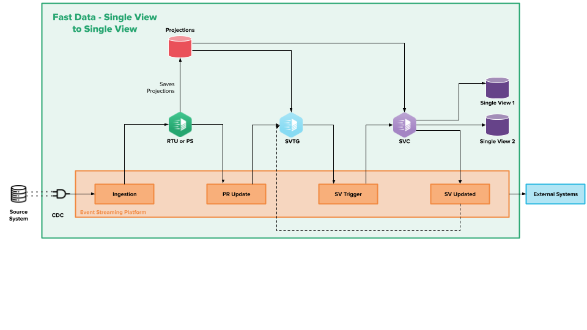
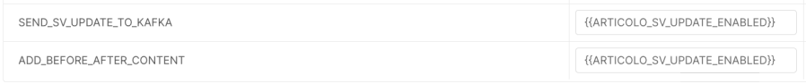

On this page, you will find:
* A collection of edge cases and possible uses of the fast-data architecture

:::warning
Before approaching this topic, be sure to have a clear understaning of the [fast-data architecture] (/fast_data/architecture.md) and the [basic concepts] (/fast_data/the_basics.md) behind it. 
:::

## Overview

Fast Data capability of retrieving and aggregating informations in near real-time from multiple different origins has proven to be a useful tool while trying to solve complex business problems. In this section you will find some examples of advanced uses of the fast-data elements for specific cases.

## Single view update triggering another single view's aggregation

You can use a single view inside your ER-Schema as you would do with projections. Doing so, you can use fields defined in a single view in another single view's aggregation.
During the aggregation, the Single View Creator will resolve the dependency from the first single view to the second, finding the document on mongodb and projecting the selected fields.

Every new aggregation of a single view will produce a new message inside the related sv-update topic. The Single View Trigger Generator will consume the message and generate a new sv-trigger message (or a projection changes record, according to your configuration) so the linked single view can be updated. 

To use this feature, you must use a Single View Trigger Generator (version >=3.1.1), together with a Single View Creator (version >=6.3.0), and set the variable SV_UPDATE_VERSION to `v2.0.0` in the latter to allow the use of sv-update messages along with pr-update messages. 

:::warning
To make sure your single view creator is generating sv-update messages after each aggregation, make sure the `SEND_SV_UPDATE_TO_KAFKA` and `ADD_BEFORE_AFTER_CONTENT` env variables are set to `true`. See [this page] (/fast_data/configuration/single_view_creator/) for further details.
:::

