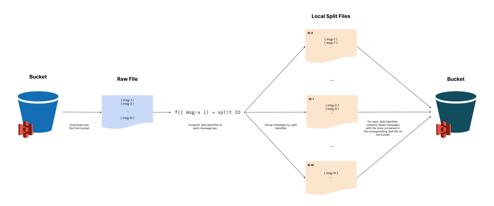

## Overview

As briefly described in the Bucket Storage Support Overview page, a Data Organizer service is in charge of processing
messages stored into the raw files written by Ingestion Storer and transform them according to the selected organizing logic.

In particular, the Data Organizer By Key plugin reads the messages from bucket files and group them by their key, so that
for each key only the latest message's payload is retained. Thus, the output of Data Organizer By Key service corresponds
to a snapshot of the latest data version.

To achieve this goal, every time a _raw_ file is written to the bucket the Data Organizer is triggered to refine its messages.
The processing consists of grouping ingestion messages by their key, removing potential duplicates and applying a deterministic
transformation to their key to compute in which output file (the _split_ file) each message should be stored.

## Bucket Organization

In order to provide a clear structure of where files are stored and foster a simple retrieval of messages from organized files it has been
decided to store files generated by the Data Organizer By Key service under its own dedicated folder. This folder can be customized
using the environment variable `BUCKET_POST_PROCESSING_FOLDER_PREFIX`. Within this folder, a set of folders is created, one for each
ingestion topic that is processed by the service. Eventually, inside this folder are stored a number of _split_ files,
specified by environmental variable `BUCKET_SPLITS`, each of which contain a set of messages whose key was mapped to the identifier of that specific file.
For example, all the messages whose key is mapped to the _split identifier_ 7 would be saved on the bucket within the _split_ file whose identifier is 7.
Split files are named using the following convention:

    <split_identifier>_<topic_name>.txt

Below is shown the process Data Organizer By Key service follows to transform messages from _raw_ files into messages of _split_ files.



:::note
Only Ingestion Storer service will write _raw_ files. Data Organizer service reads them, but it only updates _split_ files.
This allows other systems to perform different operations over the original files the and to retain the source of truth consistent across time.
:::

## Temporary Storage

Considering bucket limitations on updating files, it has been introduced a temporary storage to support the whole organization
operation. This cache is based on MongoDB and it exploits a single customizable collection to store messages between their
extraction from the bucket and their reinsertion after dividing them into each _split_ file.

To support these operations it is necessary to configure these three main indexes:

- an _unique_ index to avoid inserting duplicated messages
    ```shell
    db.<split_collection>.createIndex( { "topic": 1, "key": 1 }, { "unique": true, "name": "primary_key" } )
    ```
- an index to support messages search when they need to be selected to be transferred back on the bucket
    ```shell
    db.<split_collection>.createIndex( { "splitId": 1, "topic": 1, "doneAt": 1 }, { "name": "search_support" } )
    ```
- an index to remove old messages that have already been written back to the bucket
    ```shell
    db.<split_collection>.createIndex( { "doneAt": 1 }, { "expireAfterSeconds": 86000, "name": "housekeeping" } )
    ```

## Service Configuration

In order to connect and authenticate correctly with the bucket and Kafka, please check the relative pages:

* [Bucket connection](/fast_data/bucket_storage_support/configuration/bucket_connection.md)
* [Kafka connection](/fast_data/bucket_storage_support/configuration/kafka_connection.md)

### Environment variables

| Name                                 | Required | Description                                                                                                                                                                                                                                                                                                                  | Default Value         |
|--------------------------------------|----------|------------------------------------------------------------------------------------------------------------------------------------------------------------------------------------------------------------------------------------------------------------------------------------------------------------------------------|-----------------------|
| HTTP_PORT                            | false    | port on which endpoints are exposed                                                                                                                                                                                                                                                                                          | 3000                  |
| LOG_LEVEL                            | false    | log level employed by the service to log execution details (e.g. `DEBUG`, `INFO`, `WARN`, `ERROR`)                                                                                                                                                                                                                           | INFO                  |
| QUARKUS_SHUTDOWN_TIMEOUT             | false    | maximum number of seconds the application can take to gracefully shutdown                                                                                                                                                                                                                                                    | 30                    |
| MONGODB_URL                          | true     | connection url to the MongoDB instance where temporary data will be stored                                                                                                                                                                                                                                                   | -                     |
| MONGODB_DB_NAME                      | true     | name of the MongoDB database where temporary data will be stored                                                                                                                                                                                                                                                             | -                     |
| MONGO_SPLIT_COLLECTION               | false    | name of the MongoDB collection where temporary data will be stored                                                                                                                                                                                                                                                           | data-organizer-splits |
| KAFKA_GROUP_ID                       | true     | consumer group identifier employed by this application to share how partitions are consumed among multiple instances of the application                                                                                                                                                                                      | -                     |
| KAFKA_USERNAME                       | true     | username to connect to Kafka cluster                                                                                                                                                                                                                                                                                         | -                     |
| KAFKA_PASSWORD                       | true     | password to connect to Kafka cluster                                                                                                                                                                                                                                                                                         | -                     |
| KAFKA_SASL_MECHANISM                 | false    | SASL mechanism to employ for logging in Kafka cluster                                                                                                                                                                                                                                                                        | SCRAM-SHA-256         |
| KAFKA_DEQUEUE_STRATEGY               | false    | when no consumer group is defined on a topic, it defines which strategy should be applied to consume from the topic the first time. Defaults to `latest` ignoring existing messages                                                                                                                                          | latest                |
| KAFKA_MAX_POLL_MS                    | false    | maximum amount of milliseconds a poll operation waits before returning obtained records                                                                                                                                                                                                                                      | 500                   |
| KAFKA_MAX_POLL_RECORDS               | false    | defines the maximum number of messages that each poll operation can return. Independently of this number, each poll operation can return at most a certain amount of bytes configured in the consumer. Defaults to 500                                                                                                       | 500                   |
| BUCKET_NAME                          | true     | name of the bucket where files should be uploaded                                                                                                                                                                                                                                                                            | -                     |
| BUCKET_TYPE                          | true     | type of the bucket where file should be uploaded. Each value load a different class, behavior and might require different authentication requirements. Current possible values are `google` and `s3`                                                                                                                         | -                     |
| BUCKET_POST_PROCESSING_FOLDER_PREFIX | true     | the folder name where topics folders containing refined messages are stored. For example, when partitioning messages by key, such prefix can be `partition-by-key`. This path must be shared with the Ingestion Reloader service                                                                                             | -                     |
| BUCKET_SPLITS                        | true     | number of files onto which messages should be partitioned by their key. This number should take into account the current and future maximum number of different keys, so that not too many files are generated nor too many messages are written in each file. This value must be shared with the Ingestion Reloader service | -                     |
| BUCKET_CREDENTIALS                   | false    | filepath to the file containing the Google Storage credentials in JSON format. This variable is required only in case `BUCKET_TYPE` is set to `google`                                                                                                                                                                       | -                     |                                                                                                                                                                 |                       |

## Interface

The service has been implemented to react to events notifying a _batch file_ has been written to bucket (e.g. the one emitted by the Ingestion Storer).
In this manner, the service is able to process newer files as soon as possible and combine their messages into the set of
files that represents the latest messages snapshot (the _split_ files).
Once messages from _raw_ files are processed the service emits an output event to signal in which _split_ file messages have been stored.

### Batch File Written Input Event

The batch file written event represents the input message that triggers service execution. Here it is reported its format:

**Message Key**
```json
{
  "topic": {
    "type": "string",
    "description": "topic name of the organized messages"
  },
  "partition": {
    "type": "number",
    "description": "partition identifier"
  }
}
```

**Message Payload**
```json
{
  "filePath": {
    "type": "string",
    "description": "full filepath to retrieve saved file from bucket"
  },
  "batchTimeStart": {
    "type": "string",
    "format": "datetime",
    "description": "timestamp of the first message contained in the batch"
  },
  "batchTimeEnd": {
    "type": "string",
    "format": "datetime",
    "description": "timestamp of the last message contained in the batch"
  },
  "batchOffsetStart": {
    "type": "number",
    "description": "offset of the first message contained in the batch"
  },
  "batchOffsetEnd": {
    "type": "number",
    "description": "offset of the last message contained in the batch"
  },
  "batchSize": {
    "type": "number",
    "description": "number of messages contained in the stored file"
  }
}
```

### Batch Organized Output Event

Batch Organized event represent the notification that it is emitted every time a _split file_ is updated. Its format is the following:

**Message Key**
```json
{
  "topic": {
    "type": "string",
    "description": "topic name of the organized messages"
  }
}
```

**Message Payload**
```json
{
  "filePath": {
    "type": "string",
    "description": "full filepath to retrieve the refined file saved in the bucket"
  },
  "updatedMessages": {
    "type": "number",
    "description": "number of messages that have been added or replaced to the refined file"
  }
}
```
