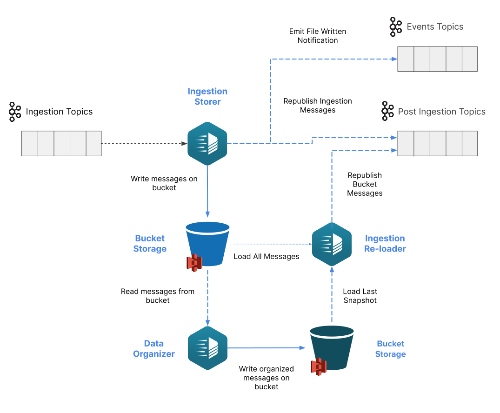

Sometimes messages must be retained for long periods of time, either for legal reasons or simply to re-ingest certain messages when needed. Exploiting the messages channel as a retention solution can be feasible but channels are usually tailored for near real-time application that deals with a huge amount of data in transit, making them a potentially expensive solution compared to other approaches where data is stored into other external systems. Another drawback about relying on the message broker's retention is that accessing very specific information might not be as easy and straightforward as the application can require. For example, to access a specific piece of data, the user would need to process sequentially a lot of messages before reaching the needed one.

Taking into account all the previous reasons and considerations we've decided to introduce the **Bucket Storage Support**,
which can be integrated easily with the Fast Data but also with any any *event-driven* system.
The Bucket Storage Support enables storing messages flowing through a channel into an external storage system,
such as a [Google Cloud Storage bucket](https://cloud.google.com/storage) or any bucket compatible with [Amazon AWS S3](https://aws.amazon.com/s3/) interface.

The main feature the Bucket Storage Support presents is the ability to **send previously consumed messages** to a specific channel.

In the context of Fast Data, Bucket Storage Support can be seamlessly integrated attaching it to the same projections ingestion topics,
which are the ones populated by a Change Data Capture (CDC) system and read by the Real-Time Updater.
In this manner, besides supporting the near-real time data flow, Fast Data messages can be archived for future usage,
either for analytics or reloading them into the system to recreate [Projections](/fast_data/the_basics.md#projection) and [Single Views](/fast_data/the_basics.md#single-view-sv)
that might have been deleted due to business requirements. More details can be found in the dedicated [page](/fast_data/bucket_storage_support/integration.md).

## Main Components

Bucket Storage Support feature involves multiple services, each of them in charge of a specific operation.
Furthermore, this new system can be easily extended by adding custom features on top of it exploiting the emitted events or processing the files in a batch manner periodically. 

### Ingestion Storer

The [Ingestion Storer](/fast_data/bucket_storage_support/configuration/ingestion_storer.md) works following a series of steps:

* consume ingestion messages (the ones that come from the CDC)
* store them inside a configured bucket storage
* produce a message on a dedicated topic representing the event of file written to the storage
* optionally forwards as-is the ingestion messages to post-ingestion topic, depending on the input topic

### Ingestion Reloader

The [Ingestion Reloader](/fast_data/bucket_storage_support/configuration/ingestion_reloader.md) is responsible for publishing
(on a specified topic) one or more messages previously consumed by the Ingestion Storer. Depending on the adopted architecture, the service may rely on the
_post-ingestion_ topics or a set new ones for the specific for _reingestion_ operation.
It is important to notice that _reingestion_ topics are configurable when the reingestion request is issued to allow
a greater flexibility in selecting target topics.   
This service exposes a series of REST APIs to cover different messages re-publishing use cases such as:
- reloading messages from a single file stored on the bucket
- reloading messages of a specific topic
- reloading messages of a specific topic in a time rage 
- reloading messages with a specific key

Optionally the reingestion process of a specific topic can be stopped before its completion using the dedicated API.

## Additional Components

Bucket Storage Support is made so that other services can use the files written into the bucket according to their own business logic.
Components that work on the bucket stored files are identified as Data Organizer plugins.
In the following sections are reported the Data Organizer services that are already offered out of the box and that can be attached
directly to the events emitted by the Ingestion Storer.

## Architecture Example

The image below shows a diagram of a possible architecture that employs all three Bucket Storage Support components.
The Ingestion Storer is connected to a set of input topics, store consumed messages on a bucket storage,
emit events related to those files written into the bucket and re-publish the input messages as is on the corresponding output topics.
The Ingestion Reloader is configured to read from the bucket and it is connected to the output topics, so that downstream systems
can read both the input messages and the re-published ones, whenever a reingestion operation is requested.

