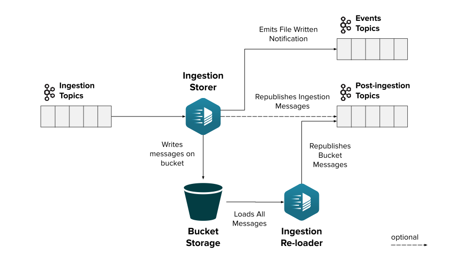

This page presents an overview of a new Fast Data add-on feature, named Bucket Storage Support.

## Overview

Application data can be stored in multiple locations and different types of database systems. Data get useful especially when
they can be easily accessed by users, aggregated, transformed and stored again to provide further functionalities and additional insights.
To foster this speed and fulfill business requirements, data are moved across different systems using streaming platforms,
such as [Apache Kafka](https://kafka.apache.org), so that applications can access only the portion of information relevant to them
and in the more appropriate format.

Sometimes, messages employed to transfer data across systems must be retained for a long period of time which might be longer
than the data access life itself (e.g. for legal reasons). On the contrary, sometimes no requirement is set on message retention,
but the system might need the ability to replay certain messages if requested, either to reload specific data that
might have already been deleted or update details that might have fallen into an inconsistent state.
Exploiting the messages channel as a retention solution could be feasible, but that depends on the adopted technologies.
Moreover, channels are usually tailored for near real-time application that deals with a huge amount of data in transit,
making them a potentially expensive solution compared to other approaches where data are offloaded to external systems.
Lastly, accessing very specific data might not be as easy and straightforward as the application requirements would demand
(for example it could require processing sequentially a lot of unnecessary messages before reaching the interested one).

Taking into account all the previous reasons and considerations, Mia-Platform decided to develop a new functionality, the Bucket Storage Support,
which can be integrated within any *event-driven* system, in particular Mia-Platform Fast Data product.
Bucket Storage Support feature enables storing messages flowing through a channel into an external object storage system,
such as a [Google Cloud Storage bucket](https://cloud.google.com/storage) or any bucket compatible with [Amazon AWS S3](https://aws.amazon.com/s3/) interface.  
The external archiving system can be configured to retain saved messages for a very long time and it enables a large array
of different applications and processing over the stored data, promoting different types of access to the messages.
The main feature that it is already available through the Bucket Storage Support is the ability to replay onto a channel messages
that were previously read and stored in the bucket.

In the context of Fast Data, Bucket Storage Support can be seamlessly integrated attaching it to the same projections ingestion topics,
which are the ones populated by a Change Data Capture (CDC) system and read by the Real-Time Updater.
In this manner, beside supporting the near-real time data flow, Fast Data messages can be archived for future usage,
either for performing analytics over those data or reloading them into the system to recreate [Projections](/fast_data/the_basics.md#projection) and [Single Views](/fast_data/the_basics.md#single-view-sv)
that might have been deleted due to business requirements. More details can be found in the dedicated [page](/fast_data/bucket_storage_support/integration.md).

## Main Components

Bucket Storage Support feature involves multiple services, each of them in charge of a specific operation.
Furthermore, this new system can be easily extended by adding custom features on top of it exploiting the emitted events or processing the files in a batch manner periodically. 

### Ingestion Storer

The [Ingestion Storer](/fast_data/bucket_storage_support/configuration/ingestion_storer.md) works following a series of steps:

* consume ingestion messages (the ones that come from the CDC)
* store them inside a configured bucket storage
* produce a message on a dedicated topic representing the event of file written to the storage
* optionally forwards as-is the ingestion messages to post-ingestion topic, depending on the input topic

### Ingestion Reloader

The [Ingestion Reloader](/fast_data/bucket_storage_support/configuration/ingestion_reloader.md) is responsible for re-publishing,
on the dedicated topic one or more messages. Depending on the adopted architecture, the service may rely on the
_post-ingestion_ topics or a set new ones for the specific for _reingestion_ operation.
It is important to notice that _reingestion_ topics are configurable when the reingestion request is issued to allow
a greater flexibility in selecting target topics.   
This service exposes a series of REST APIs to cover different messages re-publishing use cases such as:
- reloading messages from a single file stored on the bucket
- reloading messages of a specific topic
- reloading messages of a specific topic in a time rage 
- reloading messages with a specific key

Optionally the reingestion process of a specific topic can be stopped before its completion using the dedicated API.

## Additional Components

Bucket Storage Support feature is configured to allow the connection of further downstream custom services,
so that they can process the raw files written into the bucket and transform them according to their own business logic.
Components that acts on the files, combining messages from the initials ones, could be identified as _Data Organizers_, since their role tends to be to restructure how messages are stored in the bucket.

:::note
It is recommended that custom Data Organizers do to not modify nor delete the original files, but rather copy them into different custom folders. In this manner multiple types of organization processing can occur over the original files.
:::

## Architecture Example

In the following image is provided the diagram of a possible architecture that employed all the three components.
The Ingestion Storer is connected to a set of input topics, store consumed messages on a bucket storage,
emit events related to those files written into the bucket and re-publish the input messages as is on the corresponding output topics.
The Ingestion Reloader is configured to read from the bucket and it is connected to the output topics, so that downstream systems
can read both the input messages and the re-published ones, whenever a reingestion operation is requested.

