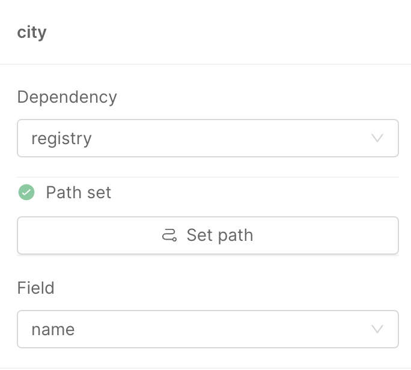
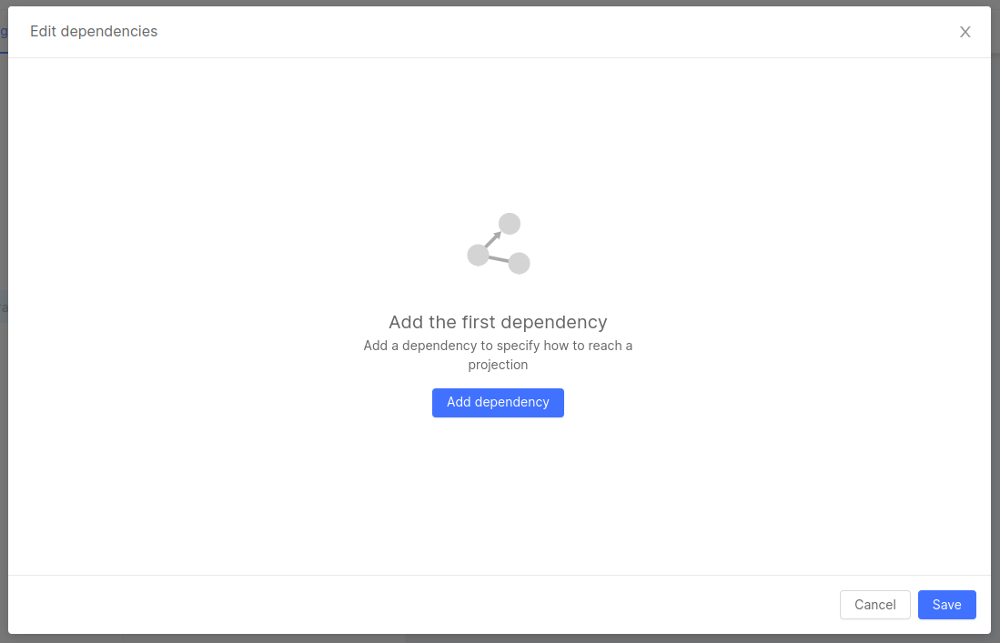
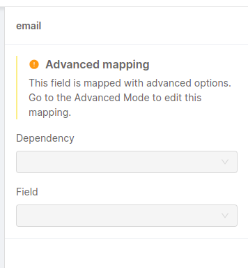

The Aggregation configuration is used by the [Single View Creator](/fast_data/architecture.md#single-view-creator-svc) to generate a document with the same structure defined in the [Single View data model](/fast_data/configuration/single_views.md#single-view-data-model) and the content calculated by aggregating data inside the projections.

The aggregation is mounted as a config map of the Single View Creator Service and might be composed by:
- a manual configuration, composed of `pipeline.js` and `mapper.js` files inside the _configuration_ config map (automatically created adding the `Single View Creator` plugin from the Mia Marketplace)
- a low-code configuration, composed of the `aggregation.json` file inside the _aggregation_ config map (automatically created adding the `Single View Creator - Low Code` plugin from the Mia Marketplace).

:::tip
We strongly recommend to use the `Single View Creator - Low Code` to simplify your experience building the aggregation configuration. We also have a a step-by-step [tutorial](/getting-started/tutorials/fast-data/low-code.mdx) that you can refer to.
:::

## Manual configuration of aggregation 

We advice to use the manual aggregation for particular cases that might not be achieved with the `Single View Creator - Low Code` which include a better support and takes care of performances and edge cases.

But in case is needed to build the aggregation logic, you'll need two files: the `pipeline.js` and the `mapper.js`. The user can review and update these files from the _Microservices_ section, selecting the Single View Creator, in the _ConfigMaps & Secrets_ section.

:::info
When selecting the `Single View Creator` plugin from the Mia Marketplace, these two files will automatically be created and already included in the service Config Map with a default content which should be changed for having a functional service.
:::

### Pipeline

It takes as input a MongoDB instance and returns a function. This function takes as input the Projection change identifier and returns an array.

If it is empty, a delete operation will be executed on the Single View identified by the `singleViewKeyGenerator` result.
If it is not empty, an upsert operation will be executed on the Single View identified by the `singleViewKeyGenerator` result.

:::note
If the pipeline returns an array with more than one element, only the first element will be used for the upsert.
:::

```js title="pipeline.js"
module.exports = (mongoDb) => {
  return async(logger, projectionChangeIdentifier) => {

    const uniqueId = projectionChangeIdentifier.UNIQUE_ID
    const MY_PROJECTION = 'projection-name'

    // retrieve data from all projections you need for your single view
    const projectionCollection = mongoDb.collection(MY_PROJECTION)
    const projectionDataById = await projectionCollection.findOne({
        UNIQUE_ID: uniqueId,
        __STATE__: 'PUBLIC'
    })

    if (!projectionDataById) {
      // it's expected to be a delete
      logger.debug({ UNIQUE_ID: uniqueId }, 'single view public data not found')
      return []
    }
    const singleViewData = projectionDataById
    logger.debug({ singleViewData }, 'single view retrieved data')

    return [
      singleViewData,
    ]
  }
}
```

### Mapper

It is a function that takes as argument the first element (if defined) of the result of the pipeline, and returns an object containing the value updated for the Single View. The object returned should match the schema of the Single View.

```js title="mapper.js"
module.exports = (logger, singleViewData) => {
  const { UNIQUE_ID, NAME } = singleViewData

  return {
    myId: UNIQUE_ID,
    name: NAME,
  }
}
```

Renaming and repositioning of the fields can be applied inside the mapper.

:::note
We suggest implementing all the aggregation logic that can be reused for all the clients that will read the Single Views inside the mapper, they should be as generic as possible.
It is a good practice to have some calculation and aggregation logic inside the Single View Creator as far as it is reusable.
If you have to apply some custom logic try to do it inside an API Adapter specific for the client.
:::

## Configuration with JSON file

An example of a minimal configuration is as follows:

```json
{
  "version": "1.0.0",
  "config": {
    "SV_CONFIG": {
      "dependencies": {
        "DOCUMENT_NAME": {
          "type": "projection",
          "on": "_identifier"
        }
      },
      "mapping": {
        "newField": "DOCUMENT_NAME.field"
      }
    }
  }
}
```

The `SV_CONFIG` field is mandatory, as it is the starting point of the configuration of the Single View. It includes the needed information to map fields of the Single View (included the `mapping` object) and which [projections](/fast_data/configuration/projections.md) will be used to retrieve those values (included the `dependencies` object).

### Dependencies

Dependencies have two properties:

* `type`: either `projection` or `config`
* `on`: either `_identifier` or some condition defined in the ER Schema.

If the dependency is of type `projection` and the `on` field is set to `_identifier`, then the data will be retrieved from the document with the matching identifier.
If the `on` property of a `projection` dependency is set to another string, then it is checked against the condition in the ER Schema that has the same name.

If the dependency is of type `config` it will not have an `on` field, and instead the whole configuration will be defined in the JSON file, using the same structure as the one in `SV_CONFIG`.

### Mapping

Each entry in the mapping has the following syntax:

```json
"singleViewFieldName": "value"
```

Where value can be one of:

* **projection field**: when it is a field taken from a Projection listed in the dependency, expressed with dot notation `"newField": "DOCUMENT_NAME.field"`
* **configuration**: when a field is an object corresponding to a resolved config dependency, expressed with the dependency name `"newField": "CONFIG_NAME"`
* **constant**: when using the constant syntax already seen in the ER diagram, e.g. `__string__[hello]`, `__integer__[42]`, `__boolean__[true]`
* **function result**: when using a custom function to compute the value of the Single View field, expressed with this syntax: `"fromFileField": "__fromFile__[fileName]"`

For functions, the specified file must be added in a config map with the correct name, and must contain a default exported function, which will be used to compute the value of the field.

The following parameters will be passed to each function:

* **logger**: the logger instance used by the service,
* **clientMongo**: the instance of MongoDB used by the service,
* **dependenciesMap**: a map containing all the dependencies already loaded in the service memory.

Let's see an example of custom function.

```js
async function myOwnCustomLogic (value) {
  // some custom logic
}

module.exports = async function(logger, clientMongo, dependenciesMap) {

    // access the order already got from the dependenciesMap
    const order = dependenciesMap.get("pr_orders")
    
    const fiscalCode = await clientMongo.collection('users').findOne({userId: order.id}).fiscalCode
    const result = await myOwnCustomLogic(fiscalCode)
    return {
      surname: result.surname,
      code: result.code
    }
}
```

The `dependenciesMap` offers a `get` method to access the dependencies already solved using the name of the dependency itself.

If the dependency you require is a Projection, the value returned will be the document of the Projection, otherwise if it's a config it will be the array of document resulting from the configuration.

If the dependencies has not been resolved, for example due to a reference which failed because of a missing document, the value will be falsy in case of Projections and an empty array in case of config.

:::warning
You are supposed to access the `dependenciesMap` **only** in read-only mode.
Write access to the `dependenciesMap` are **not** officially supported and could be removed at any time.
:::

### Join Dependency

When you want to map a Single View field to an array of values, as it usually happens in 1:N relations, you can use a config dependency with a `joinDependency` field. This means that when the config will be calculated, the `joinDependency` will be computed first, retrieving a list of all matching documents, then for each of those elements the configuration mapping will be applied, resulting in an array of elements, each having the same layout as the one specified in the config mapping.

### Advanced options

#### Using the same Projection as a Dependency multiple times under different conditions

When listing dependencies, it is mandatory that each dependency has a different name, as its name is used to identify it. When it comes to config, this is not a problem, as you can name a config dependency as you wish, but it is different when we need to deal with Projections.

For example, how would we describe a Single View of users that need to have their partner as a field? For this case we must have two references:

- a reference to the **users** that is based on their identifier to get the core of the Single View 
- a reference to a **user**, that is based on some condition linked to the marriage

For this example, we will consider the following ER Schema

```json
{
   "version":"1.0.0",
   "config":{
      "PEOPLE":{
         "outgoing":{
            "MARRIAGE":{
               "conditions":{
                  "PEOPLE_TO_MARRIAGE":{
                     "condition":{
                        "a":"id"
                     }
                  }
               }
            }
         }
      },
      "MARRIAGE":{
         "outgoing":{
            "PEOPLE":{
               "conditions":{
                  "MARRIAGE_a_TO_PEOPLE":{
                     "condition":{
                        "id":"a"
                     }
                  },
                  "MARRIAGE_b_TO_PEOPLE":{
                     "condition":{
                        "id":"b"
                     }
                  }
               }
            }
         }
      }
   }
}
```

If we tried to solve the problem without advanced options, we would write a **wrong** configuration like the following:

:::warning
The configuration below is incorrect, and presented only to clearly show the need and flexibility of aliases. Do not use this kind of configuration.
:::

```json
{
   "version":"1.1.0",
   "config":{
      "SV_CONFIG":{
         "dependencies":{
            "PEOPLE":{
               "type":"projection",
               "on":"_identifier"
            },
            "MARRIAGE":{
               "type":"projection",
               "on":"PEOPLE_TO_MARRIAGE"
            },
            "PEOPLE":{
               "type":"projection",
               "on":"MARRIAGE_b_TO_PEOPLE"
            }
         },
         "mapping":{
            "name":"PEOPLE.name",
            "marriedWith":"PEOPLE.name"
         }
      }
   }
}
```

This is incorrect, because there is ambiguity about which `PEOPLE` dependency to use in the mapping.

You can solve this problem using the `aliasOf` option, which allows to use a different name for a dependency of type `projection`. When using `aliasOf: 'PROJECTION_NAME'`, the named dependency is linked to that Projection.

:::info
The `aliasOf` field is supported from the version `1.1.0` of the `aggregation.json` which is supported from the version `3.6.0` of the Single View Creator service
:::

Now that the `aliasOf` option is clear, we can have a look at the following configuration, which solves the problem in the example:

```json
{
   "version":"1.1.0",
   "config":{
      "SV_CONFIG":{
         "dependencies":{
            "PEOPLE":{
               "type":"projection",
               "on":"_identifier"
            },
            "MARRIAGE":{
               "type":"projection",
               "on":"PEOPLE_TO_MARRIAGE"
            },
            "PARTNER":{
               "type":"projection",
               "aliasOf":"PEOPLE",
               "on":"MARRIAGE_b_TO_PEOPLE"
            }
         },
         "mapping":{
            "name":"PEOPLE.name",
            "marriedWith":"PARTNER.name"
         }
      }
   }
}
```

As you can see, we used the same Projection twice, under different conditions: the first time we matched the record based on its identifier (`PEOPLE` dependency, without alias), the second time we matched the record based on the `MARRIAGE_b_TO_PEOPLE` condition (`PARTNER` dependency, with alias).

:::tip
`aliasOf` can also be used to rename long Projection names without the need of them being re-used. Instead of using `company_department_prefix_people_table.name` we can alias the Projection to `people` and use `people.name` in the mapping! 
:::

Now let's imagine we need a `oneToMany` relationship, say, a `PEOPLE` to `CHILDREN` relationship. For that there's two things we need to consider. Let's see an example: 

```json
{
   "version": "1.3.0",
   "config": {
      "SV_CONFIG": {
         "dependencies": {
            "PEOPLE": {
               "type": "projection",
               "on": "_identifier",
            },
            "CHILDREN_CONFIG": {
               "type": "config",
            },
         },
         "mapping": {
            "name":"PEOPLE.name",
            "children": "CHILDREN_CONFIG",
         },
      },
      "CHILDREN_CONFIG": {
         "joinDependency": "CHILDREN",
         "dependencies": {
            "CHILDREN": {
               "type": "projection",
               "on": "PEOPLE_TO_CHILDREN",
               "aliasOf": "PEOPLE",
            },
         },
         "mapping": {
            "name": "CHILDREN.name",
         },
      },
   },
}
```

The first thing is that the `aliasOf` property always goes inside the `type: projection` configuration, as you can see we defined it in the `CHILDREN.dependencies.children` object instead of the `SV_CONFIG.dependencies.CHILDREN` object. The second is that we don't use `people` as a `joinDependency`, but we use the below aliased `children` instead.

#### Referencing an aliased Projection inside a dependency

You can reference a dependency under alias also in another dependency, with the `useAlias` option. Since `CHILD_TO_MOTHER` refers to the ER-Schema, which uses only the Projections name and not the dependencies name, you need to use `useAlias` to specify which is the specific dependency that refers to the Projection of the relation you want to use.

:::info
The `useAlias` field is supported from version `1.1.0` of the `aggregation.json`, which is supported from the version `3.6.0` of the Single View Creator service
:::

If we needed to use the `PARTNER` dependency as a base for another dependency (for example, if we are looking for the mother in law), a valid configuration would be:

```json
...
"PARTNER":{
  "type":"projection",
  "aliasOf":"PEOPLE",
  "on":"MARRIAGE_b_TO_PEOPLE"
},
"MOTHER_IN_LAW":{
  "type":"projection",
  "useAlias":"PARTNER",
  "on":"CHILD_TO_MOTHER",
  "aliasOf":"PEOPLE"
}
...
```

Note that we used `aliasOf` inside the `MOTHER_IN_LAW` dependency as well because we wanted to keep on using the same base Projection, but it is not mandatory, as long as you are using another Projection that is not declared elsewhere in the dependencies.

#### Changing the query that finds the Projection based on their identifier

Sometimes, when writing a dependency of a Projection that is matched on its `_identifier`, we find that the identifier has more fields than we want, or has fields with different names, which makes the automatic query mapping result in no documents found.
In this scenario, you can employ the `identifierQueryMapping` option, which provides a new query mapping for the identifier of a Projection, allowing you to have a custom way of matching documents based on their identifier.

:::info
The `identifierQueryMapping` field is supported from the version `1.1.0` of the `aggregation.json` which is supported from the version `3.6.0` of the Single View Creator service
:::

In particular, there are two main cases when this could come in handy:

1. renaming fields for querying
2. reducing the number of fields to query on

Renaming fields can be required when you want to achieve a high level of decoupling, so you avoid using the document identifier key, but instead you use a more explicit name, for example instead of `"id"` you might want to use `"my_single_view_id"`, because this clearly shows what this `"id"` refers to.
An identifier with that logic would be:

```json
{
  "my_single_view_id": "12345"
}
```

This would not match a document without a field named `my_single_view_id`. In that case, you could map that in the aggregation config in the following way:

```json
...
"PROJECTION_NAME": {
  "on": "_identifier",
  "identifierQueryMapping": {
    "id": "_identifier.my_single_view_id"
  }
}
...
```

Reducing the number of fields to query on will help you if you have a custom function for the generation of Projections changes, which includes additional fields. For example, if you need to generate a Single View in a different way based on a flag in the identifier. An identifier could have a value like the following:

```json
{
  "the_id": "12345",
  "special": "true"
}
```

The `"special"` field is not part of the single document we want to find, but it is used elsewhere in the Single View creation. To avoid having queries that do not find any element, we can map the identifier like that:

```json
...
"PROJECTION_NAME": {
  "on": "_identifier",
  "identifierQueryMapping": {
    "the_id": "_identifier.the_id"
  }
}
...
```

:::caution
Remember that for `identifierQueryMapping` to be used, you still need to explicitly set the `on` field of the dependency to `_identifier`, otherwise it will not be considered valid.
:::

#### Using conditional expressions on dependencies definitions and mappings

Dependencies are a way to gather data that will be used in the mapping section, creating the Single View, and as Single Views grow in complexity, you might need to use conditional expressions to use different dependencies configurations and/or change the mapped output of a Single View.

If you have not had this necessity yet, this might be somewhat abstract, so we will directly dive into an example.

We have a System of Records that consists of multiple Projections about jobs, one for each different job. For example, we have `DOCTOR` and `FIREFIGHTER`. If you want to create a `USER` Single View which has the information coming from its job Projection, you need a way to get a dependency which is either a `DOCTOR` or a `FIREFIGHTER`.
A naive solution could be just putting both Projections as dependencies and using both of them in the mapping. This would cause the Single View to have two different `firefighter` and `doctor` fields, one of them undefined, which is clearly not ideal.

Thanks to the `_select` option, we can create a `JOB` dependency, which will use the `DOCTOR` *or* `FIREFIGHTER` Projection based on the value of another field, as shown below:

```json
{
   "version":"1.1.0",
   "config":{
      "SV_CONFIG":{
         "dependencies":{
            "USER":{
               "type":"projection",
               "on":"_identifier"
            },
            "JOB_DESCRIPTION":{
               "type":"projection",
               "_select":{
                  "options":[
                     {
                        "when":{
                           "==":[
                              "USER.job",
                              "__string__[doctor]"
                           ]
                        },
                        "value":{
                           "aliasOf":"DOCTOR",
                           "on":"USER_to_DOCTOR"
                        }
                     },
                     {
                        "when":{
                           "==":[
                              "USER.job",
                              "__string__[firefighter]"
                           ]
                        },
                        "value":{
                           "aliasOf":"FIREFIGHTER",
                           "on":"User_to_FIREFIGHTER"
                        }
                     }
                  ],
                  "default":{
                     "aliasOf":"DOCTOR",
                     "on":"USER_to_DOCTOR"
                  }
               }
            }
         },
         "mapping":{
            "name":"USER.name",
            "job":{
               "type":"JOB_DESCRIPTION.type",
               "role":"JOB_DESCRIPTION.role"
            }
         }
      }
   }
}
```

:::info
The `_select_` field is supported from the version `1.1.0` of `aggregation.json` which is supported from version `3.6.0` of the Single View Creator service
:::

As you can see, the `_select` option has a long set of rules, which we are going to break down here.

The `_select` is a way of providing one of many different configurations for a specific dependency, based on some conditions.
Each possible configuration is an object in the `options` array. If none of the `options` has a matching condition, the value in the `default` field is used.
Each option has two fields:

1. `when`: the condition that must be matched in order to use the `value`;
2. `value`: the configuration that will be used for this dependency if the `when` condition is met.

The `when` field is an object with an operator (available operators: `==`, `!=`, `>`, `<`, `>=`, `<=`) as a field key, and its relative field value is an array of operands.
For example, using the equality operator, we can write this condition:

```json
"when":{
  "==":[
    "USER.job",
    "__string__[firefighter]"
  ]
}
```

Here, the first operand is a variable which takes its value from `USER.job`, while the second operand is a constant string: `"doctor"`. This simply means that this condition will match when the `job` field of the `USER` dependency is equal to `"doctor"`.
This pattern is repeated for all other operators, as they are binary as well.

As operand, it is possible to use constant values, in the exact same way as seen in the [ER schema](/fast_data/configuration/config_maps/erSchema.md#syntax).

:::info
Functions can also be used as value from version `1.3.0` of the `aggregation.json` which is supported from version `5.1.0` of the Single View Creator service
:::

The function works in the same way as explained in the Mapping section, with the only difference that it will accept only two parameters: 

* **logger**: the logger instance used by the service,
* **clientMongo**: the instance of mongoDB used by the service

``` javascript title="myFunc.js"
module.exports = async function(logger, clientMongo) {
   // Your code goes here
}
```

``` json
{
   "version": "1.3.0",
   "config": {
      ...
      "when":{
        "==":[
          "USER.job",
          "__fromFile__[myFunc]"
        ]
      }
   }
}
```

The `value` field is an object with exactly the same structure as a regular dependency, as it will be used as a dependency after the condition is met.

For **mappings**, the process of taking advantage of `_select` is very similar: each field in the mapping can be expressed as an object with a `_select` field that follows the same rules. Just keep in mind that the `value` here is not a dependency (with fields such as `type` and `on`), but a field of a dependency (e.g. `MY_DEPENDENCY.field_name`).

#### `null` values inside conditional expressions

From version `3.10.0` of the Single View Creator, logic expressions now accept `null` as a value:

```json
...
"withNull": {
  "_select": {
    "options": [
      {
        "when": {
          "==": [
            "JOB.age",
            null
          ]
        },
        "value": "__string__[unknown]"
      }
    ],
    "default": "__string__[foobar]"
  }
}
...
```

#### Set resolution order of dependencies

From version `4.1.0` of the Single-View-Creator, the resolution order of dependencies can be set with the field `dependencyOrder` inside the aggregation file:

```json
{
  "version": "1.1.0",
  "config": {
    "SV_CONFIG": {
      "dependencies": {
        "PEOPLE": {
          "type": "projection",
          "on": "_identifier"
        },
        "PARTNER": {
          "type": "projection",
          "aliasOf": "PEOPLE",
          "on": "MARRIAGE_TO_PEOPLE"
        },
        "MARRIAGE": {
          "type": "projection",
          "on": "PEOPLE_TO_MARRIAGE"
        },
        "CHILDREN_CONF": {
          "type": "config"
        }
      },
      "dependencyOrder": ["PEOPLE", "MARRIAGE", "PARTNER", "CHILDREN_CONF"],
      "mapping": {
        "name": "PEOPLE.name",
        "marriedWith": "PARTNER.name",
        "children": "CHILDREN_CONF"
      }
    }
  },
  "CHILDREN_CONF": {
    ...
  }
}
```

The aggregation above will be performed in the following order:

1. Find the Projection in the `PEOPLE` collection on MongoDB using `identifier` got from the Projection Change as query.
1. Find the Projection in the `MARRIAGE` collection on MongoDB using the condition defined in the ER Schema as `PEOPLE_TO_MARRIAGE`
1. Find the Projection in the `PEOPLE` (which is the collection to be used in the dependency `PARTNER`) using the condition defined in the ER Schema as `MARRIAGE_TO_PEOPLE` 
1. Calculate the aggregation defined in the `CHILDREN_CONF` config

*Why should I care about the order resolution of the dependencies?*

The order resolution is important for the correctness of the aggregation since each step of the aggregation may use documents of the previous steps. Hence, if the order of the dependencies resolution is not correct, the Single View resulting from the aggregation will probably be wrong.

:::note
Since version `v5.0.0` of Single View Creator service returning a Single View with the field `__STATE__` from the aggregation will update the Single View to that state (among the other changes).   
This means, for instance, that if you set the `__STATE__` to `DRAFT` in the `aggregation.json` the Single View updated will have the `__STATE__` equals to `DRAFT`. 
Previously, the `__STATE__` you returned was ignored, and the Single View would always have the `__STATE__` equals to `PUBLIC`.
:::

#### Aggregate documents with different `__STATE__` other than `PUBLIC`

With version `5.1.0` of the Single View Creator the `__STATE__` field in the Projection is taken into consideration when aggregating, meaning that if a dependency has its `__STATE__` set to **anything else but** `PUBLIC` it won't be added to the Single View.

In case you would like to include other states too in the aggregation process you can do it with the `onStates` field which allows you to define exactly which states you want to include to the Single View. The value is an array with any of the following states: `PUBLIC`, `DRAFT`, `TRASH`, `DELETED`.

:::info
The `onStates` field can be used from the version `1.2.0` of the `aggregation.json`
:::

Here's a working example:

```json
{
   "version": "1.2.0",
   "config": {
      "SV_CONFIG": {
         "dependencies": {
         "USER": {
            "type": "projection",
            "on": "_identifier",
            "onStates": ["PUBLIC", "DRAFT"]
         },
         "WORK": {
            "type": "projection",
            "aliasOf": "JOB",
            "on": "USER_TO_JOB",
            "onStates": ["PUBLIC", "DRAFT"]
         }
         },
         "mapping": {
            "myId": "USER.id",
            "job": "WORK.label"
         }
      }
   }
}
```

## Use the No Code

From version `11.3.0` of the Console, your project might have enabled the possibility to configure ER Schemas with the No Code feature. The new feature will be accessible in the `Single Views` section. Selecting the Single View and the _Single View Creator_ associated, the configuration page with the list of config maps will include the No Code Aggregation by selecting the `Aggregation` tab.


The new page allows creating an Aggregation from scratch with a clear visual of the Single View Data Model and with a simplified selection of fields based on the projection. It also includes a simpler way to add and manage dependencies and Join Dependencies, simplifying the configuration of the Single View Creator.

:::info
Before starting to configure the Aggregation with the No Code, [a valid ER Schema must be selected](/fast_data/configuration/config_maps/erSchema.md#use-the-no-code) for the current Single View Creator.

Otherwise, a placeholder will remind you the need of an ER Schema, blocking the access to the Aggregation configuration page.
:::

### Selection of the Base Projection

If you don't have an _aggregation_ configuration file yet, or in case it has not been modified after creating the Single View Creator, opening the `Aggregation` tab will show a placeholder that informs that a _Base Projection_ must be selected before starting configuring the aggregation.


The select field will show all the projections set in the selected ER Schema. The selection will represent the first dependency created in the aggregation that will be linked with the `identifier` object of the [Projection Changes](/fast_data/inputs_and_outputs.md#projection-change).

### How to map fields

The page will now show the list of fields, as defined in the Single View Data Model page. You can even navigate in the nested structure of fields between fields of type `object` or `array of objects` to see the child fields and manage them as well.

Clicking on a field will open a drawer to the right side of the panel that allows you to map this field, by allowing the selection of an existing dependency and a field.


The _Dependency_ selection field will include a list of existing dependencies (on top) and all the other dependencies that can be connected (based on the conditions included inside the ER Schema). 

Selecting a dependency will update the state of the _Set Path_ button and its label: if the dependency already exists, the label will inform the user that a "Path is set", indicating that the Aggregation already includes all the necessary dependencies (from the base projection - thus that dependency linked to the Projection Changes document via the `_identifier` condition) and it's already possible to select the field to complete the mapping: the _Field_  select field will now be available and the list will contain all the fields that can be used for the mapping.

The selection will automatically create the mapping. This can be noted also by the fact that all the warnings next to the name of the field will disappear.



### Automatic generation of dependencies via Path

In case the value selected in the _Dependency_ select field is a dependency that does not exist yet, the "Path not set" text will still be there, and the `Set Path` button can be clicked to open a modal that will introduce the user to a new way to create dependencies.


The modal will include all the different paths to create all the needed dependencies to proceed with the mapping. Each path will represent a step composed of different projections connected via ER Schema `one-on-one` conditions. 

In the example above, there are more ways to reach from _pr_registry_ to _pr_dishes_, and it will be possible to select the path needed for the mapping. The modal also includes a canvas to the left side, similar to the ER Schema canvas, that shows the currently selected modal to help the user to visualize the path and make the correct choice.

Click on `Next` will move to the next step of the modal where the user will be prompted to select the condition for each step of the path.


After selecting a condition for each step, a click on the `Save` button will automatically create a dependency for each step of the selected path. The mapping can continue since the _Field_ select will be enabled and the value can be selected.

### Manage the existing dependencies

The _Set Path_ modal is not the only way to add new dependencies. These can be included manually via the _Edit dependencies_ button at the bottom of the page, followed by the number of dependencies already set. This button will open a different modal that will show all the existing dependencies, giving the possibility to add or delete some.


A click on the button `+ Add dependency` will change the content of the modal to a form that will allow the user to select the starting projection, the target projection, the condition that connects said projection and - finally - a name to give to said dependency, in case you want to create [an alias](#using-the-same-projection-as-a-dependency-multiple-times-under-different-conditions).


:::info
All those fields might be automatically populated in case there's only one option available.
:::

After selecting all the fields, a click to save will add the dependency. On the other side, a click on the trash button next to each dependency will remove that dependency.

A click on the `Save`` button is required to confirm the modifications, adding the created dependencies and removing the deleted ones.

:::warning
Removing a dependency will remove also its references in the mapping (if there are any)
:::

### Create a Join Dependency with the No Code

In case it's necessary to map fields inside an array of objects, a new configuration object inside the `aggregation.json` must be created, with new dependencies starting from a [Join Dependency](#join-dependency). In the No Code Aggregation, if you open an array of objects, another _Edit dependencies_ button will show up at the bottom of the section including the fields of said array of objects. In case the Join Dependency has not been set yet, the button will include a _(0)_ to signal that there are no dependencies set.

When clicking the button, the already mentioned modal will appear but with a placeholder to invite the user to create the Join Dependency.



A click on the button `Add dependency` will open the same form used to create regular dependencies, but with the important difference to have only starting projections included in the configuration of the parent field and to have only _One To Many_ conditions, necessary to map the array of objects.

Once the selection is completed, the modal will remain open to allow the user to add more dependencies that might be used to map the fields inside the array of objects.

:::info
The term `path` refers to the route followed to reach the dependencies from which to retrieve the data to populate the fields of the single view.
The available paths are based on the ER schema that you must have previously defined in the _Projection_ section of the console and associated with the _Single View Creator No Code_ service. Since a projection can have various relationships, there could be multiple paths to reach the same dependency.
:::

### Advanced Mode

On the bottom of the page, there's a switch that will change the `Aggregation` view to its _Advanced Mode_. This is will show the `aggregation.json` file and additional custom function files that the user might want to include to use the advanced configuration of the Aggregation.

In fact, with the No Code Aggregation, it will not be possible to include the [advanced options](#advanced-options) aforementioned: this has to be included in the Advanced Mode.


In this area, you can review the aggregation in its code format, and it's possible even to update the content inside, and to add or delete some parts of the configuration. Any update via Advanced Mode will be instantly reflected when switching back to the No Code.

Despite this, it is possible to use the No Code Aggregation even if one or more fields have been mapped with one of the possible advanced options (such as the usage of a custom function from an external file, or a conditional value). In this case, the user can open the drawer related to the field, but it will be informed that an advanced configuration exists and the only way to make any change or review it is via the advanced mode.



Also, the list of dependencies available via the _Edit dependencies_ button will inform the user of the usage of the [Identifier Query Mapping](#changing-the-query-that-finds-the-projection-based-on-their-identifier) or the usage of [conditional expressions](#using-conditional-expressions-on-dependencies-definitions-and-mappings), but to review these advanced settings, the user will need to move to the Advanced Mode.

### Error and Warning management

The No Code Aggregation will try to catch any error existing, especially on pre-existing `aggregation.json` which might have an invalid structure or the JSON file is invalid.

In this case, the Advanced Mode will automatically be active, and it will not be possible to move to the No Code before to address these errors.


Moreover, the No Code Aggregation includes some warnings related to configurations that might not work correctly when running the Microservices and/or might lead to unexpected results.

One of those warnings will be shown next to the field name, in case the field is not mapped, or an error icon in case the mapping is not valid.


Also, the drawer to the right side will inform you if the dependency or the field is not valid. Anyway, clicking on the field allows the selection of a valid value and proceed with the configuration.


Errors in configured dependencies are visible inside the modal accessible via the _Edit dependencies_ button: in this case, the user will be informed if there are dependencies related to missing projections, or dependencies that are not reachable because the path is incomplete.


In this case, it is highly suggested to remove the non-valid projections and re-add them (manually with the [Set Path feature](#automatic-generation-of-dependencies-via-path)).

:::warning
The `oneOf`, `anyOf`, `allOf`, `if` and `$ref` JSON Schema operators would not make the Aggregation JSON validation fail, but are not handled in the No Code and could generate errors. Please try avoiding them when defining your Aggregation.
:::

### Reset the Aggregation

It is possible to reset the Aggregation and configure it from scratch from the _Settings_ tab, in case of mistakes in selecting the base Projection or using the ER Schema. In this tab, several general options regarding the Single View Creator are included and the first card, named _General_ shows the selected ER Schema and the selected Aggregation.


A click on the `Edit` button will open a modal that informs the user of the risks of losing the configured Aggregation before allowing the selection of a new ER Schema and/or a new base Projection. A change in one of the two values will reset the Aggregation.
