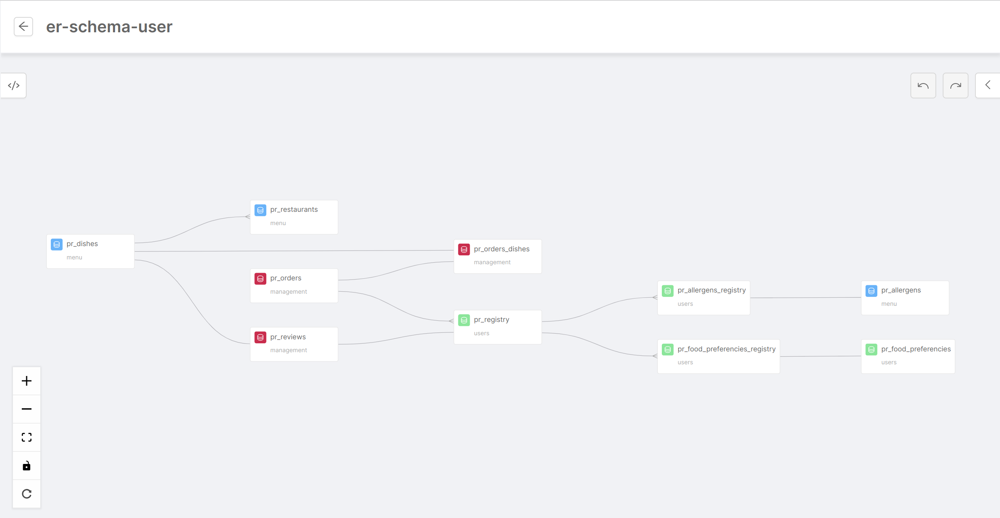
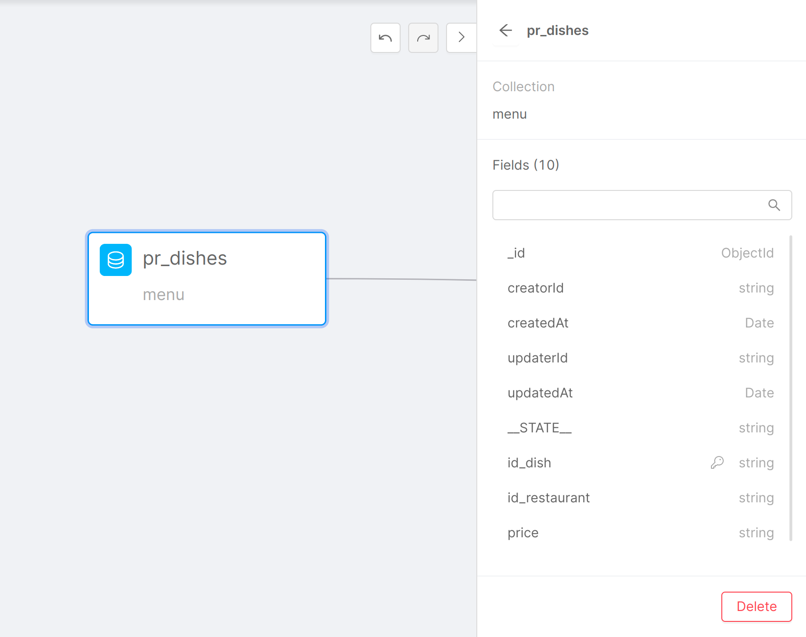
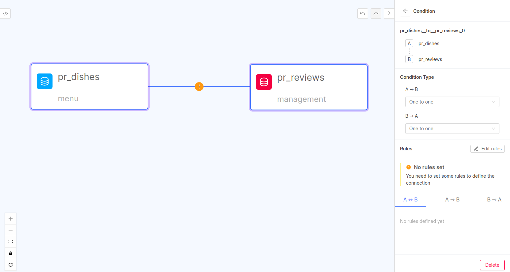
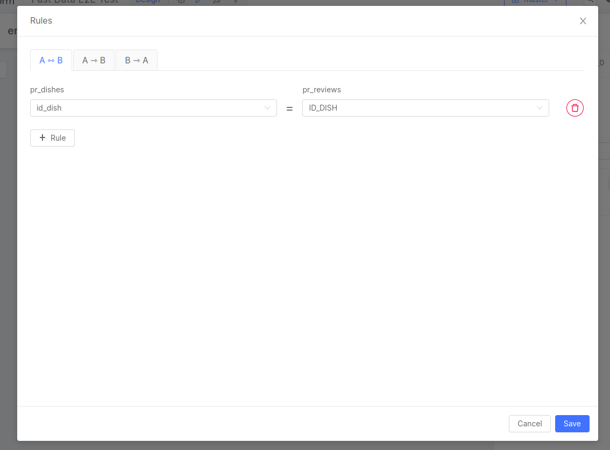

In this document we guide you through the configuration of the ER Schema (`erSchema.json`), one of the configuration files required by the [Single View Creator](/fast_data/architecture.md#single-view-creator-svc), [Real-Time Updater](/fast_data/architecture.md#real-time-updater-rtu) and [Single View Trigger Generator](/fast_data/architecture.md#single-view-trigger-generator-svtg) in a low-code situation.

:::tip
If you want to try the Fast Data Low Code with a simple example, here's a step-by-step [tutorial](/fast_data/tutorials/low-code.mdx)
:::

## Overview

The ER Schema, or Entity-Relation Schema, defines the relationships between Fast Data collections, which include [Projections](/fast_data/the_basics.md#projection), [Single Views](/fast_data/the_basics.md#single-view-sv) and [CRUD Collections](/development_suite/api-console/api-design/crud_advanced.md#what-is-a-crud).

:::caution
Don't forget to [declare your relationships both ways](#direction-of-the-relationships)!
:::

## Syntax and Configuration Properties

Here is an example of a generic ER Schema configuration file:

```json title="erSchema.json"
{
  "version": "X.Y.Z",
  "config": {
    "COLLECTION": {
      "outgoing": {
        "RELATED_COLLECTION": {
          "conditions": {
            "CONDITION_NAME": {
              "oneToMany": true,
              "condition": {
                "RELATED_COLLECTION_FIELD_NAME": "COLLECTION_FIELD_NAME"
              }
            }
          }
        }
      }
    }
  }
}
```

The ErSchema is made of the following fields:

- _version_, the current configuration version, which determines the syntax and semantics of the rest of the
  configuration. The following properties follow the `1.0.0` syntax version.
- _config_, the whole ER Schema config, which its properties are detailed in the table below.
The ErSchema is made of the following fields:
* `version`: Current configuration version, which determines the syntax and semantics of the rest of the configuration. The following properties follow the `1.0.0` syntax version.
* `config`: The whole ER Schema config
* `COLLECTION`: Name of a collection of the Console configuration. There should be a `COLLECTION` object for each collection of the Console configuration.
* `outgoing`: List of all the related collections.
* `RELATED_COLLECTION`: Name of a collection related to the `COLLECTION`. There should be one `RELATED_COLLECTION` object for each collection related to `COLLECTION`.
* `conditions`: List of conditions that connect the `COLLECTION` and the `RELATED_CONNECTION`.
* `CONDITION_NAME`: Name of the condition, this is purely for debug purposes and we suggest using the following naming convention: `COLLECTION_to_RELATED_COLLECTION` (eg. dish_to_order_dish)
* `oneToMany`: Specifies if there will be **more than one** `RELATED_COLLECTION` document related to a `COLLECTION` document. If false we will assume there will be **only one** `RELATED_COLLECTION` document related to another `COLLECTION` document. The default is `false`
* `condition`: Object literal containing the condition
* `RELATED_COLLECTION_FIELD_NAME`: A field name of the `RELATED_COLLECTION`
* `COLLECTION_FIELD_NAME`: A field name of the `COLLECTION`


:::note
All the keys in uppercase are values that you must change depending on your data, while the keys in lowercase are
keywords that should not be changed
:::

In the example presented above, the relationship between the two entities could be represented as shown in the diagram:


### Constants

<details><summary>ER Schema Configuration with constant value to validate the condition</summary>

<p>

```json title="erSchema.json"
{
  "version": "1.0.0",
  "config": {
    "pr_dishes": {
      "outgoing": {
        "pr_orders_dishes": {
          "conditions": {
            "dish_to_order_dish": {
              "condition": {
                "ID_DISH": "__string__[testID]"
              }
            }
          }
        }
      }
    }
  }
}
```

</p>
</details>

In this case, the condition will always be verified if `"ID_DISH"` is equal to `"testID"`.
The types of constants that are supported are:

* `__string__[]` which considers the value as a string.
* `__integer__[]` which considers the value as an integer.
* `__boolean__[]` which considers the value as a boolean.
* `__constant__[]` which considers the value as a string (deprecated).

:::caution
Remember that `__constant__[]` is deprecated, and it will be removed in future versions. Use `__string__[]` instead.
:::

### Query and Projection Operators

Conditions can also use [MongoDB Query and Projection Operators](https://www.mongodb.com/docs/manual/reference/operator/query/), such as `$or` and `$and`.

<details><summary>ER Schema Configuration with MongoDB Query and Projection Operators</summary>

<p>

```json title="erSchema.json"
{
  "version": "1.0.0",
  "config": {
    "pr_dishes": {
      "outgoing": {
        "pr_orders_dishes": {
          "conditions": {
            "dish_to_order_dish": {
              "oneToMany": true,
              "condition": {
                "$or": [
                  {
                    "ID_DISH": "id_dish"
                  },
                  {
                    "ID_DISH": "__string__[testID]"
                  }
                ]
              }
            }
          }
        }
      }
    }
  }
}
```

</p>
</details>

## Direction of the relationships

Normally when we write an ER Schema we think about declaring a condition in only one direction but this is not enough.

The generation of the Single View can actually be split in two main blocks, the [Strategy](/fast_data/the_basics.md#strategies) and the [Aggregation](/fast_data/configuration/single_view_creator/plugin.md#aggregation).
As you may know, the Strategy is the process by which given an update on a projection document it tells the Aggregation which Single Views need to be re-aggregated. So, given the nature of the whole process, the relationships are explored in the __opposite__ way in which the Aggregation explores them.

<details><summary>ER Schema Configuration with Strategy and Aggregation</summary>

<p>

```json title="erSchema.json"
{
  "version": "1.0.0",
  "config": {
    // Direction explored by the aggregation
    "pr_registry": {
      "outgoing": {
        "pr_orders": {
          "conditions": {
            "reg_to_order": {
              "condition": {
                "ID_USER_ORDER": "ID_USER"
              },
              "oneToMany": true
            }
          }
        }
      }
    },
    // Direction explored by the strategy
    "pr_orders": {
      "outgoing": {
        "pr_registry": {
          "conditions": {
            "order_to_reg": {
              "condition": {
                "ID_USER": "ID_USER_ORDER"
              }
            }
          }
        }
      }
    }
  }
}
```

</p>
</details>

## Use the No Code

From version `10.6.0` of the Console, your project might have enabled the possibility to configure ER Schemas with the No Code feature.



To do that, go to the _Projections_ section and click on the _ER Schemas_ tab: it will show a list of ER Schemas, ready to be opened and modified to your needs.

:::tip
When opening the _ER Schemas_ list, you should also see the ER Schemas previously configured inside the existing Single Views.
:::

You can decide to open an existing ER Schema or to create a new one. In both cases, a new page will be displayed, composed of the following three parts:

- the center of the page is a canvas where the collections and conditions already included in the ER Schema will be displayed as rectangular boxes and connection lines, respectively. In this canvas, you can review the ER Schema configuration, click on a box to see details about the related collection (like the name and the fields), click on a line to review the related condition. You can also delete collections and conditions by pressing the backspace or `Canc` key after selecting them.

- the right side includes a collapsible panel, which shows the information about a collection or condition, if selected, or the list of collections included in the Console configuration and not already added to the ER Schema: you can click on one of them to view the related details. You can also drag each collection to the canvas by yourself. This is useful if you need to include multiple collections when creating your ER Schema.

- the left side includes another collapsible panel, which shows a code editor with the current ER Schema configuration, in JSON format. You can also edit the ER Schema from there, and every update will be reflected immediately in the canvas. This JSON object is the exact ER Schema that will be used in Fast Data services and it has the same structure as the ER Schema available in the [Low Code configuration](/fast_data/configuration/single_view_creator/plugin.md).

### Adding collections to the ER Schema

To add a collection to the ER Schema, make sure that the right side panel is open (if not, click on the `<` button located in the top right of the canvas). This panel will show every collection available (not already used in the current ER Schema) from the Console configuration.

From there, you can simply drag the collection that you need to the canvas, in the position you prefer.

Otherwise, you can simply click on a collection in the panel: it will show some information about the collection (like the name of the collection itself and the list of fields) and you can click the `Add collection` button to simply have this collection automatically added in the canvas.



### Creating a new condition

To create a condition between two collections, you simply need to drag a line from one collection to another. The line must start from the handle of the collection, which is a black dot located on the right side of the collection box. From there, you can drag a line to another collection: just release the line near the center of the other collection.

:::tip
You can also create a condition starting and ending to the same collection, by dragging a line from the right handle and releasing near the left handle.
:::

When a line is created, you can click on it: you will see that the condition line and the two related collection boxes will change color, and on the right side panel you will be able to configure the condition.



This panel will allow you to configure a connection **both ways**. For example, having the image above as a reference, a condition will be created from _pr_dishes_ to _pr_reviews_ and vice versa, so you will not have to worry about creating another line for the opposite condition.

In this panel, you can see the connected collections, referred to as **A** and **B**. In the example shown in the image
above, **A** is the collection _pr_dishes_ and **B** is the collection _pr_reviews_.

You can select the _condition type_, for both the condition and its reverse, which can be one of the two values:
- _One to one_ (default), which means that the condition will fetch one document from a collection from one document to the other collection matching the condition;
- _One to many_, which means that the condition will fetch all the documents from one collection that match the condition with the document in the other collection;
You can select the _condition type_ going from _A_ to _B_ (in this example: from _pr_dishes_ to _pr_reviews_) and from _B_ to _A_ (from _pr_reviews_ to _pr_dishes_). 

:::warning
The ER Schema does not support the _One to many_ _condition type_ on both the condition and its reverse. When the _condition type_ is set to _One to many_ on one side of the condition, it will not be possible to use this _condition type_ on the other side. If an existing ER Schema contains duplicated _One to many_ conditions, a warning message will be displayed.
:::

Below are listed the rules that define conditions both ways. These rules are divided into three sections, each one with
its tab:

- _A ⟷ B_: includes all those rules that will be used in the condition from _A_ to _B_ and vice versa. In the example
  of the screenshot above, the rule `id_dish = ID_DISH` means that the condition from _pr_dishes_ to _pr_reviews_ will
  connect the `id_dish` field in _pr_dishes_ to the `ID_DISH` in _pr_reviews_, and the condition from _pr_reviews_ to
  _pr_dishes_ will connect the `ID_DISH` in _pr_reviews_ to the `id_dish` field in _pr_dishes_;
- _A → B_: includes all those rules that will be used in conditions by filtering documents of collection _A_ and
  executing queries based on comparison operations on fields of collection _B_ or constant values;
- _B → A_: includes all those rules that will be used in conditions by filtering documents of collection _B_, as
  explained above;

:::info
The Fast Data is composed by different microservices, and each one of them uses an ER Schema. You can use different ER Schemas for each service or you can decide to have an unique ER Schema containing all the cases.

If your case is the latter, defining conditions in both ways is necessary to make sure that your ER Schema can be used in any Fast Data microservice (as explained in the [Direction of the relationships](#direction-of-the-relationships) section). The panel will allow you to do that.
:::

To edit those rules (or to start adding them), you have to click on the _Edit Rules_ button: a modal will open up with the three tabs explained before. In each of them, there will be a list of rules previously created and the possibility to add new ones.

In the _A ⟷ B_ tab, you can click on the _+ Rule_ button to add a new rule, represented by a new line that includes
two drop down lists: the left one contains all the fields of the collection marked as _A_, the right one contains all
the fields of the collection marked as _B_.



If you need to delete a rule, you can click on the delete icon located next to the fields.

:::tip
You can only select fields that are included in the collection. In case you have multiple rules, you cannot select the same field multiple times.
:::

In the _A → B_ tab (and also the _B → A_, which works the same) you can click on the _+ Rule_ button to create a new
rule like the normal ones but with two important differences:

- you can decide which type of relationship between the two sides (instead of equality) based on the
  available [MongoDB comparison query operators](https://www.mongodb.com/docs/manual/reference/operator/query/#comparison);
- the right side of the expression can be a field of the other collection or a constant value;

You can also create a group of rules by clicking the _+ Group_ button. Based on [MongoDB logical query operators](https://www.mongodb.com/docs/manual/reference/operator/query/#logical), a group is a set of rules connected by the `and` (every rule in the group must be true) or `or` (at least one rule in the group must be true) logical operator.

:::info
If you select the query operator _is element of_ (`$in`) or _not an element of_ (`$nin`) to compare a field with
constant values, you will have to include all the values in the input field separated with a semicolon character (`;`).
:::


:::tip
The No Code feature has been implemented with the goal of creating ER Schemas which follow the structure of the Single View you want to create.

Keep this in mind when adding collections and conditions, to get an ER Schema which is both functional and easy to understand.
:::

### Delete a collection or a condition

You can always delete any collection or condition already configured. You have two ways of doing this.

You can do it by selecting the collection box or the condition line you want to remove and pressing the <kbd>Backspace</kbd> or the <kbd>Delete</kbd> key.

Otherwise, you can select a collection or a condition and click on the _Delete_ button in the bottom right position of
the right side panel.

:::caution
Removing a collection will also delete all the conditions starting and ending from it.
:::

### Interact with the elements in the Canvas

:::caution
The position of the elements (boxes and lines) in the canvas is automatically calculated to give the best overview of the ER Schema. You are free to reorganize collections in the canvas but these updates will not be saved when you save the configuration.
:::

The canvas is made to help you create and improve your ER Schema and also to give you a look at the whole picture of the Single View that will be created from it. To help you have the full picture of it, there are several buttons on the bottom-left side of the canvas to adjust the zoom, to lock the canvas to move around without the risk of moving boxes and lines, and an `Autolayout` button that restores the canvas elements to the best position for a complete view. 

You can also zoom in and out with the scroll wheel of the mouse.

Also, in case you make any mistake, you can use the _Undo_ and _Redo_ functionality, via the buttons at the top-right
side of the canvas or by pressing <kbd>Ctrl</kbd>+<kbd>Z</kbd> and <kbd>Ctrl</kbd>+<kbd>Y</kbd> (<kbd>Cmd</kbd>+<kbd>Z</kbd> and <kbd>Cmd</kbd>+<kbd>Y</kbd> for MacOS).

### The ER Schema code panel

Any update on the canvas will be translated into the ER Schema in real-time, and you can review this with the left side panel of the canvas.

This panel, visible by clicking on the `</>` icon, opens and closes a Code Editor which is fully working and allows you to see the structure of the ER Schema while you are updating it. This JSON structure will be the same structure that will be used in the Fast Data microservices. 

It is also possible to interact with the content of the Code Editor, like adding or removing lines. Updating the ER Schema from the Code Editor will reflect automatically in the canvas.

Also, the Code Panel allows you to copy and paste your schema into an external file. You might want to use this feature to test the ER Schema with the [Fast Data Low Code Test Template application](/fast_data/configuration/single_views.md#how-to-test-low-code-configurations). You can also export the content to the ER Schema Config Map used by the [Real-Time Updater](/fast_data/configuration/realtime_updater.md#er-schema-configuration) and the [Single View Trigger Generator](/fast_data/configuration/single_view_trigger_generator.md), or you can just use it to create another ER Schema as well.

### Error management

The No Code feature can identify the most common problems in the ER Schema and it can prevent further modifications until these problems are solved.

One of the most common errors is a non-valid JSON object passed in the left side panel. In that case, the canvas will be disabled, not allowing any other update. An error banner will appear at the top of the canvas.


Also, an error box will show up in case the JSON does not include the `version` or the `config` property (that will include the set of conditions).

Moreover, the user will be notified if, by mistake, one or more conditions refer to non-existing collections. This will not disable the canvas, but a warning message will appear at the top of the page: the box representing the non-existing collection will be marked also with a yellow exclamation mark. Opening this collection for more information will also show a warning.


## Real use case example

<details><summary>Food Delivery ER schema configuration</summary>
<p>

```json
{
  "version": "1.0.0",
  "config": {
    "pr_dishes": {
      "outgoing": {
        "pr_restaurants": {
          "conditions": {
            "dish_to_rest": {
              "condition": {
                "ID_DISH_RESTAURANT": "ID_RESTAURANT"
              }
            }
          }
        },
        "pr_orders_dishes": {
          "conditions": {
            "dish_to_order_dish": {
              "condition": {
                "ID_DISH_ORDER": "ID_DISH"
              }
            }
          }
        },
        "pr_reviews": {
          "conditions": {
            "dish_to_rev": {
              "condition": {
                "ID_DISH_REVIEW": "ID_DISH"
              }
            }
          }
        }
      }
    },
    "pr_orders_dishes": {
      "outgoing": {
        "pr_orders": {
          "conditions": {
            "order_dish_to_order": {
              "condition": {
                "ID_ORDER": "ID_DISH_ORDER"
              }
            }
          }
        },
        "pr_dishes": {
          "conditions": {
            "order_dish_to_dish": {
              "condition": {
                "ID_DISH": "ID_DISH_ORDER"
              }
            }
          }
        }
      }
    },
    "pr_orders": {
      "outgoing": {
        "pr_orders_dishes": {
          "conditions": {
            "order_to_order_dish": {
              "condition": {
                "ID_DISH_ORDER": "ID_ORDER"
              },
              "oneToMany": true
            }
          }
        },
        "pr_registry": {
          "conditions": {
            "order_to_reg": {
              "condition": {
                "ID_USER": "ID_USER_ORDER"
              }
            }
          }
        }
      }
    },
    "pr_restaurants": {
      "outgoing": {
        "pr_dishes": {
          "conditions": {
            "res_to_dish": {
              "condition": {
                "ID_RESTAURANT": "ID_DISH_RESTAURANT"
              }
            }
          }
        }
      }
    },
    "pr_allergens_registry": {
      "outgoing": {
        "pr_allergens": {
          "conditions": {
            "aller_reg_to_aller": {
              "condition": {
                "ID_ALLERGEN": "ID_ALLERGEN_REGISTRY"
              }
            }
          }
        },
        "pr_registry": {
          "conditions": {
            "aller_reg_to_reg": {
              "condition": {
                "ID_USER": "ID_USER_REGISTRY"
              }
            }
          }
        }
      }
    },
    "pr_allergens": {
      "outgoing": {
        "pr_allergens_registry": {
          "conditions": {
            "aller_to_aller_reg": {
              "condition": {
                "ID_ALLERGEN_REGISTRY": "ID_ALLERGEN"
              }
            }
          }
        }
      }
    },
    "pr_registry": {
      "outgoing": {
        "pr_orders": {
          "conditions": {
            "reg_to_order": {
              "condition": {
                "ID_USER_ORDER": "ID_USER"
              },
              "oneToMany": true
            }
          }
        },
        "pr_reviews": {
          "conditions": {
            "reg_to_rev": {
              "condition": {
                "ID_USER_REVIEW": "ID_USER"
              },
              "oneToMany": true
            }
          }
        },
        "pr_allergens_registry": {
          "conditions": {
            "reg_to_aller_reg": {
              "condition": {
                "ID_USER_REGISTRY": "ID_USER"
              },
              "oneToMany": true
            }
          }
        }
      }
    },
    "pr_reviews": {
      "outgoing": {
        "pr_registry": {
          "conditions": {
            "rev_to_reg": {
              "condition": {
                "ID_USER": "ID_USER_REVIEW"
              }
            }
          }
        },
        "pr_dishes": {
          "conditions": {
            "rev_to_dish": {
              "condition": {
                "ID_DISH": "ID_DISH_REVIEW"
              }
            }
          }
        }
      }
    }
  }
}
```

</p>
</details>

Here you can see a visual representation of the ER schema.


