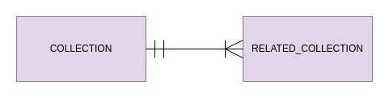

In this document we guide you through the configuration of the ER Schema, one of the configuration files required by the [Single View Creator](/fast_data/architecture.md#single-view-creator-svc), [Real Time Updater](/fast_data/architecture.md#real-time-updater-rtu) and [Single View Trigger](/fast_data/architecture.md#single-view-trigger-svt) in a low-code situation.

:::tip
If you want to try the Fast Data Low Code with a simple example, here's a step by step [tutorial](/tutorial/fast_data/fast_data_tutorial.mdx)
:::

## Overview

The ER Schema or Entity-Relation Schema defines the relationships between the collections of a [System of Records](/fast_data/the_basics.md#system-of-records-sor).

:::caution
Don't forget to [declare your relationships both ways](#direction-of-the-relationships)! 
:::

## Syntax

The ER Schema is made of the following fields:

```json title="erSchema.json"
{
  "version": "N.N.N",
  "config": {
    "COLLECTION": {
      "outgoing": {
        "RELATED_COLLECTION": {
          "conditions": {
            "CONDITION_NAME": {
              "oneToMany": true,
              "condition": {
                "RELATED_COLLECTION_FIELD_NAME": "COLLECTION_FIELD_NAME"
              }
            }
          }
        }
      }
    }
  }
}
```

* `version`: Current configuration version, which determines the syntax and semantics of the rest of the configuration. The following properties follow the `1.0.0` syntax version.
* `config`: The whole ER Schema config
* `COLLECTION`: Name of a collection of the System of Records. There should be a `COLLECTION` object for each collection of the System of Records.
* `outgoing`: List of all the related collections.
* `RELATED_COLLECTION`: Name of a collection related to the `COLLECTION`. There should be one `RELATED_COLLECTION` object for each collection related to `COLLECTION`.
* `conditions`: List of conditions that connect the `COLLECTION` and the `RELATED_CONNECTION`.
* `CONDITION_NAME`: Name of the condition, this is purely for debug purposes and we suggest using the following naming convention: `COLLECTION_to_RELATED_COLLECTION` (eg. dish_to_order_dish)
* `oneToMany`: Specifies if there will be **more than one** `RELATED_COLLECTION` document related to a `COLLECTION` document. If false we will assume there will be **only one** `RELATED_COLLECTION` document related to another `COLLECTION` document. The default is `false`
* `condition`: Object literal containing the condition
* `RELATED_COLLECTION_FIELD_NAME`: A field name of the `RELATED_COLLECTION`
* `COLLECTION_FIELD_NAME`: A field name of the `COLLECTION`

:::note
All the keys in uppercase are values that you must change depending on your data, while the keys in lowercase are keywords that should not be changed
:::

In the last example the relationship between the entities would be:



### Constants

It is also possible to define a constant value in order to validate the condition, for example:

```json title="erSchema.json"
"pr_dishes": {
  "outgoing": {
    "pr_orders_dishes": {
      "conditions": {
        "dish_to_order_dish": {
          "condition": {
            "ID_DISH": "__string__[testID]"
          }
        }
      }
    }
  }
}
```

In this case the condition will always be verified if `“ID_DISH“` is equal to `“testID“`.
The types of constants that are supported are:

* `__string__[]` which considers the value as a string.
* `__integer__[]` which considers the value as an integer.
* `__boolean__[]` which considers the value as a boolean.
* `__constant__[]` which considers the value as a string (deprecated).

:::caution
Remember that `__constant__[]` is deprecated, and it will be removed in future versions. Use `__string__[]` instead.
:::

### Query and Projection Operators

Conditions can also use MongoDB [Query and Projection Operators](https://www.mongodb.com/docs/manual/reference/operator/query/), for example:

```json title="erSchema.json"
{
  "version": "N.N.N",
  "config": {
    "pr_dishes": {
      "outgoing": {
        "pr_orders_dishes": {
          "conditions": {
            "dish_to_order_dish": {
              "oneToMany": true,
              "condition": {
                "$or": [
                  {
                    "ID_DISH": "id_dish"
                  },
                  {
                    "ID_DISH": "__string__[testID]"
                  }
                ]
              }
            }
          }
        }
      }
    }
  }
}
```

## Direction of the relationships

Normally when we write an ER Schema we think about declaring a condition in only one direction but this is not enough.

The generation of the Single View can actually be split in two main blocks, the [Strategy](/fast_data/the_basics.md#strategies) and the [Aggregation](/fast_data/configuration/single_view_creator/common.md#aggregation). As you know, the Strategy is the process by which given an update on a projection document it tells the Aggregation which Single Views need to be re-aggregated. So, given the nature of the whole process, the relationships are explored in the __opposite__ way in which the Aggregation explores them.

Example:

```json title="erSchema.json"
{
  // Direction explored by the aggregation
  "pr_registry": {
    "outgoing": {
      "pr_orders": {
        "conditions": {
          "reg_to_order": {
            "condition": {
              "ID_USER_ORDER": "ID_USER"
            },
            "oneToMany": true
          }
        }
      },
    }
  },
  // Direction explored by the strategy
  "pr_orders": {
    "outgoing": {
      "pr_registry": {
        "conditions": {
          "order_to_reg": {
            "condition": {
              "ID_USER": "ID_USER_ORDER"
            }
          }
        }
      }
    }
  },
}
```

## Real use case example

<details><summary>food delivery ER schema configuration</summary>
<p>

```json title="erSchema.json"
{
  "version": "1.0.0",
  "config": {
    "pr_dishes": {
      "outgoing": {
        "pr_restaurants": {
          "conditions": {
            "dish_to_rest": {
              "condition": {
                "dish_restaurant_id": "id_restaurant"
              }
            }
          }
        },
        "pr_orders_dishes": {
          "conditions": {
            "dish_to_order_dish": {
              "condition": {
                "dish_order_id": "id_dish"
              }
            }
          }
        },
        "pr_reviews": {
          "conditions": {
            "dish_to_rev": {
              "condition": {
                "review_dish_id": "id_dish"
              }
            }
          }
        }
      }
    },
    "pr_orders_dishes": {
      "outgoing": {
        "pr_orders": {
          "conditions": {
            "order_dish_to_order": {
              "condition": {
                "order_id": "id_order_dish"
              }
            }
          }
        },
        "pr_dishes": {
          "conditions": {
            "order_dish_to_dish": {
              "condition": {
                "id_dish": "dish_order_id"
              }
            }
          }
        }
      }
    },
    "pr_orders": {
      "outgoing": {
        "pr_orders_dishes": {
          "conditions": {
            "order_to_order_dish": {
              "condition": {
                "id_order_dish": "ID_ORDER"
              },
              "oneToMany": true
            }
          }
        },
        "pr_registry": {
          "conditions": {
            "order_to_reg": {
              "condition": {
                "ID_USER": "order_user_id"
              }
            }
          }
        }
      }
    },
    "pr_restaurants": {
      "outgoing": {
        "pr_dishes": {
          "conditions": {
            "res_to_dish": {
              "condition": {
                "id_restaurant": "dish_restaurant_id"
              }
            }
          }
        }
      }
    },
    "pr_allergens_registry": {
      "outgoing": {
        "pr_allergens": {
          "conditions": {
            "aller_reg_to_aller": {
              "condition": {
                "id_allergen": "ID_ALLERGEN_REGISTRY"
              }
            },
          }
        },
        "pr_registry": {
          "conditions": {
            "aller_reg_to_reg": {
              "condition": {
                "ID_USER": "ID_USER_REGISTRY"
              }
            }
          }
        }
      }
    },
    "pr_allergens": {
      "outgoing": {
        "pr_allergens_registry": {
          "conditions": {
            "aller_to_aller_reg": {
              "condition": {
                "ID_ALLERGEN_REGISTRY": "id_allergen"
              }
            }
          }
        }
      }
    },
    "pr_registry": {
      "outgoing": {
        "pr_orders": {
          "conditions": {
            "reg_to_order": {
              "condition": {
                "ID_USER_ORDER": "ID_USER"
              },
              "oneToMany": true
            }
          }
        },
        "pr_reviews": {
          "conditions": {
            "reg_to_rev": {
              "condition": {
                "ID_USER_REVIEW": "ID_USER"
              },
              "oneToMany": true
            }
          }
        },
        "pr_allergens_registry": {
          "conditions": {
            "reg_to_aller_reg": {
              "condition": {
                "ID_USER_REGISTRY": "ID_USER"
              },
              "oneToMany": true
            }
          }
        }
      }
    },
    "pr_reviews": {
      "outgoing": {
        "pr_registry": {
          "conditions": {
            "rev_to_reg": {
              "condition": {
                "ID_USER": "ID_USER_REVIEW"
              }
            }
          }
        },
        "pr_dishes": {
          "conditions": {
            "rev_to_dish": {
              "condition": {
                "id_dish": "review_dish_id"
              }
            }
          }
        }
      }
    }
  }
}
```
</p>
</details>

Here you can see a visual representation of the ER schema.

