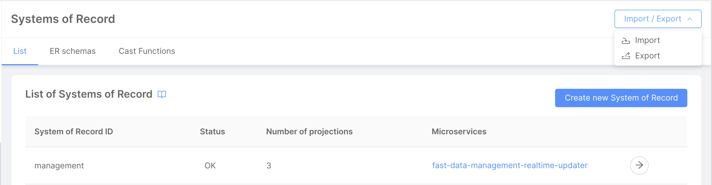
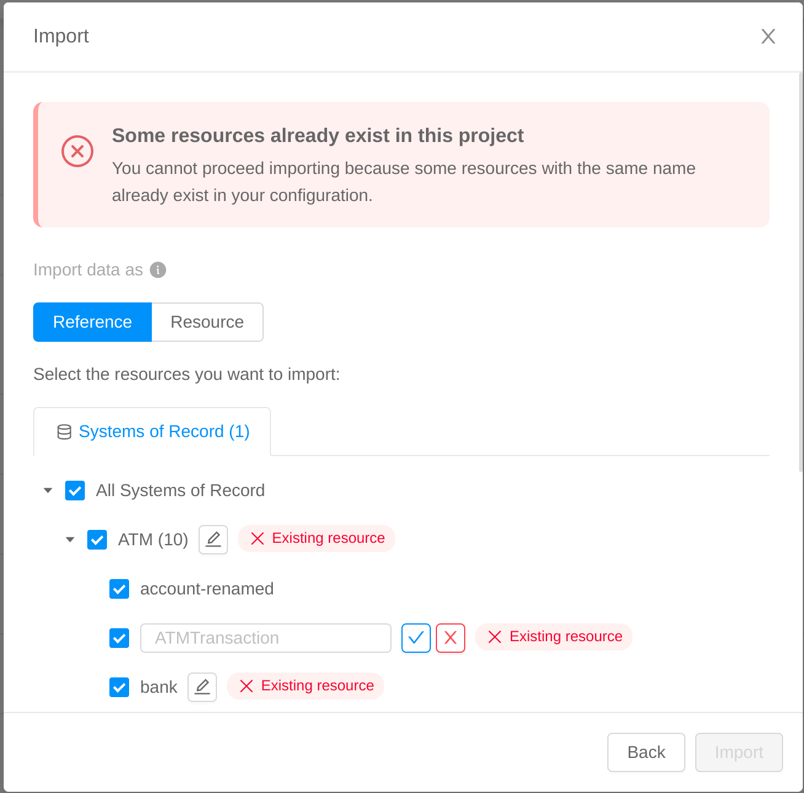

:::info
This feature is available from `v12.0.0` of Mia-Platform Console (you may have to contact your System Administrator in order to enable it).
:::

The Import / Export feature allows Fast Data users to export resources from a specific project and import them inside another one.

This feature makes it easier to access resources from other projects without having to recreate them on each environment.

The following resources can be exported:
- Custom cast functions (assigned to a Projection field)
- ER schemas
- Single Views
- Systems of Record (with all or some of their Projections)

The feature can be accessed by clicking on the `Import / Export` button, placed on the top right bar of the Systems of Record and Single Views pages. After clicking on the button, it will be possible to open the `Import` or `Export` modals.

It is also possible to import resources by clicking on the `Import` button displayed on the placeholder screen shown when no Systems of Record or Single Views have been created inside the configuration.

## Export

After clicking on the `Export` button, a modal will display exportable Fast Data resources in their respective tabs, if present.

From each tab it will be possible to select and deselect the resources to be exported.

When clicking on the `Export` button on the modal footer, a `fast-data-export-{export-timestamp}.json` file will be downloaded, containing the selected resources in `JSON` format and some information about the current project, branch and exporting time. This metadata will be useful when importing resources inside another project.

When exporting one or more ER schemas, a check will be performed on the potential related resources (such as Projections and Single Views) to make sure they are exported as well. If not already included in the export selection, another screen will be opened to display all of the ER schemas dependencies. After the `Confirm and export` button is clicked, these dependencies will be included inside the exported file.

If a custom cast function is assigned to one or more Projection fields and the Projection is exported, the cast function will be exported as well.

:::info
At the moment, nested imported resources are not exported. e.g. when exporting an ER schema imported by reference which contains a collection imported by reference as well, the collection will not be exported. 
:::

## Import

After clicking on the `Import` button, it will be possible to upload a `.json` file containing exported data inside a modal.

The imported file should follow the format of files downloaded using the `Export` feature.

If the file is valid, information about the source project, branch and exporting time will be displayed.

When clicking on the `Next` button, all of the Fast Data resources contained inside the imported file will be displayed in their respective tabs. It will be possible to select and deselect resources before completing the import process by clicking on the `Confirm and import` button.

Fast Data resources can be imported in two ways:

1) as a reference: the resources will be referenced inside the current project configuration and displayed in read-only mode. It will be possible to access their data but the resources will not be editable. A `Reference` label will be added to their name inside the Fast Data section: when hovering it, a popover will display information about the exporting source project, branch and time.

2) as a resource: the resources will be copied inside the current project configuration and displayed as if they were created directly inside the current project. It will be possible to access and edit their data.

In both cases, an error message will be displayed if some of the imported resources have the same name of resources or references already existing inside the project current configuration.

It will be possible to update references only by importing resources with the same name and from the same source project. In this case, the `Reference update` label will be displayed alongside each updated resource and its content will be overwritten inside the configuration.

:::caution
In both cases, microservices associated to each resource (such as Real-Time Updaters and their Message Formats, Single View Creators or Single View Trigger Generators) will NOT be imported. Please make sure these services have been created before deploying your configuration.
:::

:::info
Some Fast Data resources, such as Projections, can be imported as a reference only in projects that are using the Single View Trigger Generator architecture. Please check your services before importing the resources.
:::

## FAQs on Import / Export

### When should I use the Import / Export feature?

This feature can be useful in two main use cases:

#### Handling Fast Data resources split between projects

For example, imagine a company with two projects, `Project A`, which contains Systems of Record, Projections and ER schemas, and `Project B`, which contains Single Views. Users assigned to `Project A` do not have access to `Project B` and vice versa.

When configuring microservices, such as Single View Creators, users assigned to `Project B` will need an ER schema containing data about Projections (and other collections) relationships, but this data is stored inside `Project A`, which is not accessible to them.

With the Import / Export feature, users from `Project A` could easily export the ER schema and its related resources, then share the exported data with users assigned to `Project B`.

`Project B` users could then import the data as a reference, thus being now able to configure their microservices while keeping a single source of truth of their data inside `Project A`.

#### Cloning Fast Data resources from a project to another one

For example, when complex Fast Data resources are configured inside one project and are needed in their entirety or as a basis for further improvements inside another project. 

The Import / Export would prevent users from recreating two or more equal data structures in different projects. They would only need to export data from one project and import it as a resource inside another one.

### Is it better to import my data as a reference or as a resource?

That actually depends on the specific use case.

In general, importing as a reference could be the best solution when it is necessary to define precisely a Fast Data resource in one project and make sure this definition is not changing when the resource is imported elsewhere. This way, a single source of truth defines the resource inside a project and all other projects references it. These references can be updated later by importing a resource with the same name from the same source project.

When it is not necessary to keep Fast Data resources consistent between projects, or it is needed to edit them, import as a resource could be a better way.

### I am trying to import a file but I cannot complete the operation, how can I solve this?

Errors while importing a file could happen for several reasons. This errors could prevent the importing process to be completed.

The most common reason could be related to the imported `.json` file format. If the file does not contain data about Fast Data resources, it will not be possible to complete the import operation because there is nothing to be imported.

The file could also correctly contain data and be a valid `.json`, but its format could have been updated, thus making it impossible to be read by our importing algorithm.

To prevent this problems, we suggest using `.json` files generated during the export process without editing them.

Another potential error could be related to the resources naming. In fact, it is not possible to import resources with the same name of resources or references already existing inside the project current configuration.