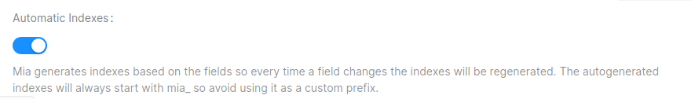

# Indexes

Collection indexes are crucial for the Fast Data to work at it's maximum efficiency. The services are constantly working with the database, querying and updating the business data to be always in sync with the source in near real-time.

## Projections

[Projections](/fast_data/the_basics.md#projection) are used by almost all of the services of the Fast Data. The following indexes must be configured for every projection so DB interaction is as quick as possible.

- **Primary key index**: Compound unique index of all the fields marked as primary key. This index will be used in the strategies execution.
- **Ingestion indexes**: Same as the "Primary key fields index" but with the addition of two fields, `__internal__counter` and `__internal__counterType`. These two fields are added to the projection's record in the database when the record is created by the [Real Time Updater](/fast_data/realtime_updater.md) so there's no need to declare them as normal fields. Make sure you declare **two indexes**, one with both fields and the other one with just the `__internal__counterType` field. As the name indicates, this indexes will be used to update the Projection's record during the ingestion process
- **Aggregation index**: Again, same as the "Primary key fields index" but adding the field `__STATE__`. As the name suggests, it will be used to query the documents for the aggregation.

:::caution
If you use manual strategies don't forget to declare the fields you use inside the Javascript files as indexes
:::

To add an index to your projection you only need to go in the card `Indexes` on your Projection's detail page.

### Automatic indexes

<!-- TODO: add to the index automation the other indexes (Aggregation index missing) -->

An automation of the indexes based on the primary key fields is available in the console. If enabled, the console will create and update all the indexes needed for that projection.

## Projection Changes

[Projection Changes](fast_data/inputs_and_outputs.md#projection-changes) are collections generated from each [System of Records](fast_data/the_basics.md#system-of-records-sor), usually following the `fd-pc-${SoR name}` pattern. To make the generation of Projection Changes as quick as possible the following indexes must be configured.

- **Generation index**: Compound unique index with the fields of the [Single View Key](fast_data/configuration/single_view_creator.md#single-view-key) or the [Identifier query mapping](fast_data/configuration/config_maps/aggregation.md#changing-the-query-that-finds-the-projection-based-on-their-identifier) and the `type` field. Remember that the identifier fields must be declared with dot notation syntax. Ex. `identifier.sv_id1`, `identifier.sv_id2`, `type`. This index is used when generating or updating Projection Changes records from the Real Time Updater or the [Single View Trigger Generator](/fast_data/single_view_trigger_generator.md).
- **Retrieval indexes**: Used to retrieve the Projection Changes information from the [Single View Creator](/fast_data/single_view_creator.md) so it knows if and what Single View needs to be re-aggregated. The first index has the fields `type` and `changes.state`, the second one has `type`, `changes.state` and `changes.inProgressAt`.

To manage the indexes of Projection Changes collections you need to go to your MongoDB CRUD section in console and use the `Indexes` card like with any other collection.

## Single Views

