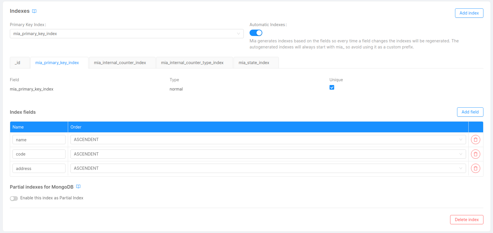
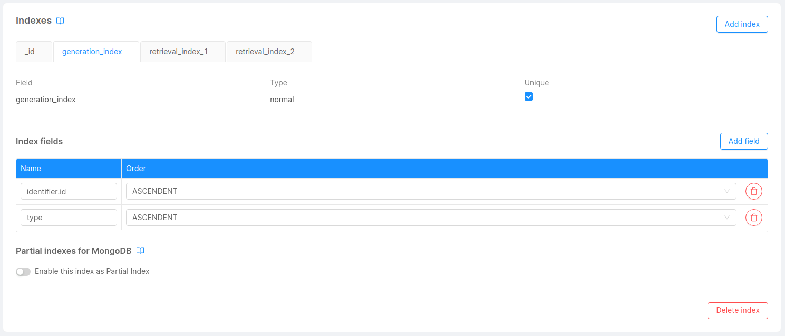
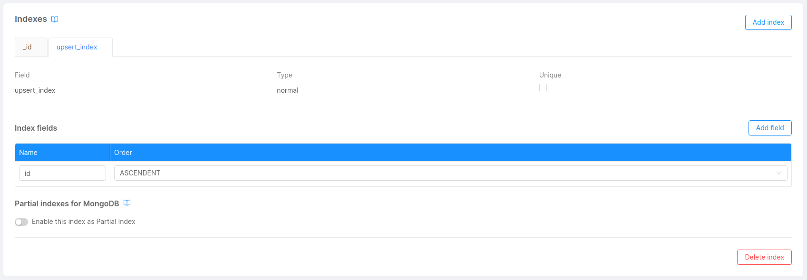

# Indexes

Collection indexes are crucial for the Fast Data to work at it's maximum efficiency. The services are constantly working with the database, querying and updating the business data to be always in sync with the source in near real-time.

## Projections

[Projections](/fast_data/the_basics.md#projection) are used by almost all of the services of the Fast Data. The following indexes must be configured for every projection so DB interaction is as quick as possible.

- **Primary key index**: Compound unique index of all the fields marked as primary key. This index will be used in the strategies execution. When using index autogeneration this index will be called `mia_primary_key_index`.
- **Ingestion indexes**: Same as the "Primary key fields index" but with the addition of two fields, `__internal__counter` and `__internal__counterType`. These two fields are added to the projection's record in the database when the record is created by the [Real-Time Updater](/fast_data/realtime_updater.md) so there's no need to declare them as normal fields. Make sure you declare **two indexes**, one with both fields and the other one with just the `__internal__counterType` field. As the name indicates, this indexes will be used to update the Projection's record during the ingestion process. When using index autogeneration these indexes will be called `mia_internal_counter_index` and `mia_internal_counter_type_index`.
- **Aggregation index**: Again, same as the "Primary key fields index" but adding the field `__STATE__`. As the name suggests, it will be used to query the documents for the aggregation. When using index autogeneration this index will be called `mia_state_index`.

:::caution
If you use manual strategies don't forget to declare the fields you use inside the Javascript files as indexes
:::

To add an index to your projection you only need to go in the card `Indexes` on your Projection's detail page.

:::tip
An automation of the indexes based on the primary key fields is available in the console. If enabled, the console will create and update **all the indexes needed** for that projection.
:::

## Projection Changes

[Projection Changes](/fast_data/inputs_and_outputs.md#projection-changes) are collections generated from each Real-Time Updater service attached to a [System of Record](/fast_data/the_basics.md#system-of-records-sor). Depending on the configuration, these collections might be automatically created or they can be [custom made](/fast_data/configuration/realtime_updater.md#projection_changes_collection).

To make the generation of Projection Changes as quick as possible the following indexes must be configured.

- **Generation index**: Compound unique index with the fields of the [Single View Key](/fast_data/configuration/single_view_creator/plugin.md#single-view-key) or the [Identifier query mapping](/fast_data/configuration/config_maps/aggregation.md#changing-the-query-that-finds-the-projection-based-on-their-identifier) and the `type` field. Remember that the identifier fields must be declared with dot notation syntax. Ex. `identifier.sv_id1`, `identifier.sv_id2`, `type`. This index is used when generating or updating Projection Changes records from the Real-Time Updater or the [Single View Trigger Generator](/fast_data/single_view_trigger_generator.md).
- **Retrieval indexes**: Used to retrieve the Projection Changes information from the [Single View Creator](/fast_data/single_view_creator.md) so it knows if and what Single View needs to be re-aggregated. The first index has the fields `type` and `changes.state`, the second one has `type`, `changes.state` and `changes.inProgressAt`.

To manage the indexes of Projection Changes collections you need to go to your MongoDB CRUD section in console and use the `Indexes` card like with any other collection.

## Single Views

Aggregating Single Views is the main goal of the Fast Data and as such their collections must be properly indexed to update the records as quick as possible. The following indexes must be configured.

- **Upsert index**: Unique index on the Single View's primary key fields defined in the Single View Key file. As you can imagine, this index is used to find and update each Single View record when aggregation is done.

To manage the indexes of your Single Views you just need to go to your Single View's detail page and edit the `Indexes` section.

## Single Views Errors

Sometimes, errors in the aggregation/sv-patch process may occur. These errors are logged in the Single View errors collections defined in the `SINGLE_VIEWS_ERRORS_COLLECTION` environment variable of the Single View Creator. The Single View Creator only inserts the new records and does not query the collection in any way. For this reason **no indexes are needed** in Single View errors collections.

On a further note, Single Views Errors provide you with a very useful set of data to monitor your Fast Data application, that's why you may want to collect such information to keep everything under control. 

For example, you may want to have a count widget on Grafana to see how many Single View Error of type `NO_SV_GENERATED` there are. For that you're probably going to configure the [MongoDB Query Exporter](https://github.com/raffis/mongodb-query-exporter) to do a query similar to `{"errorType": "NO_SV_GENERATED"}` (for more info on all the fields available check the [Inputs Outputs - Single Views Errors](/fast_data/inputs_and_outputs.md#single-view-error) section). If this is your case remember to also create indexes for all your queries to help MongoDB process all of your requests and not slow down your Fast Data application.
