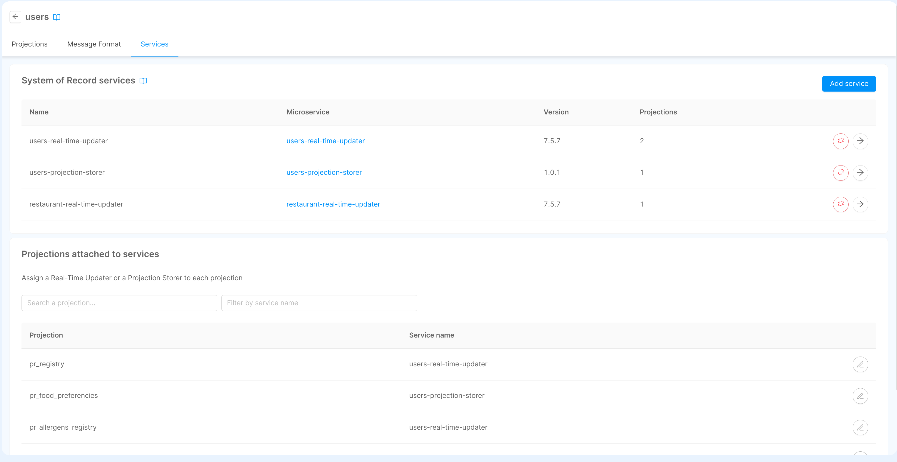
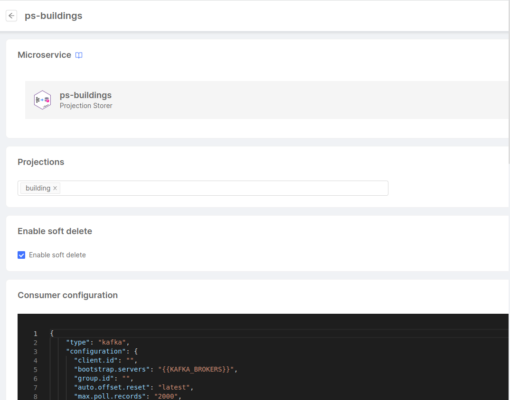
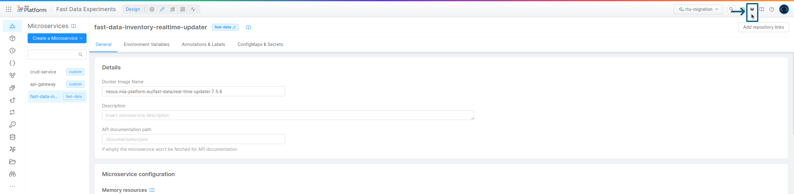
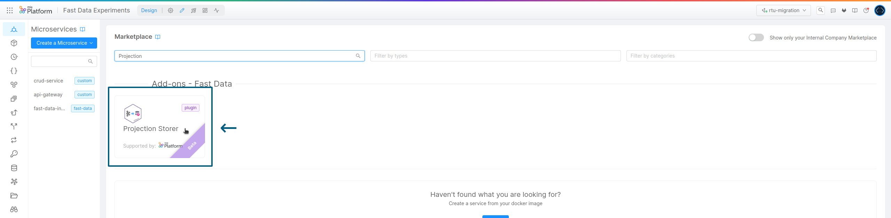
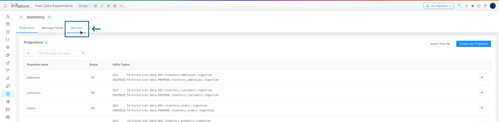
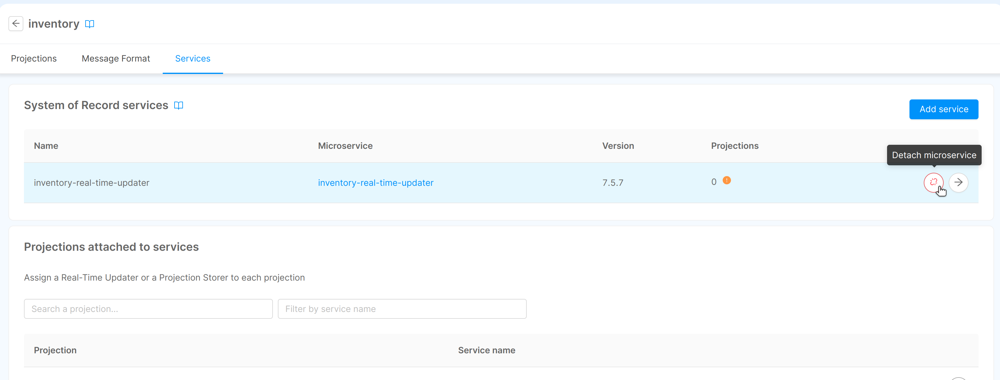
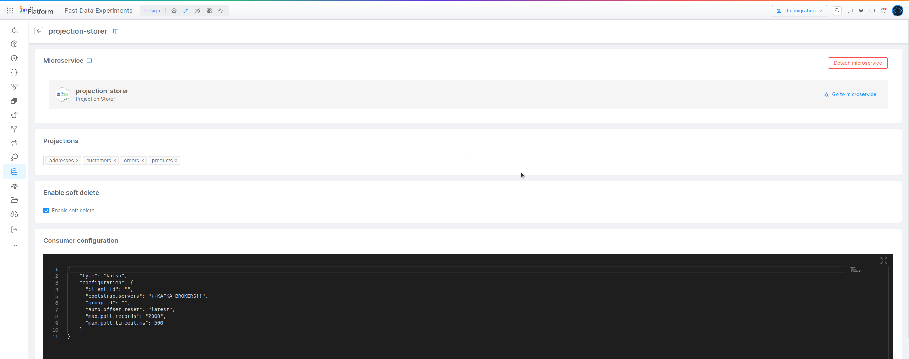
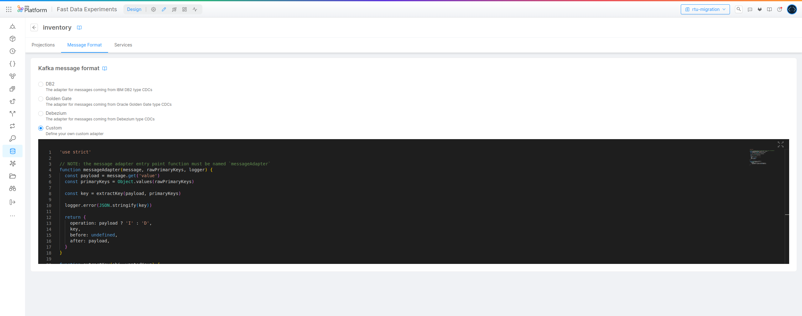

Projection Storer is the service in charge of constantly keeping up-to-date projections records with respect to change events
received from the associated System of Record. Once modifications are saved to the storage system, the service
triggers downstream components with the proper mechanism, so that Single Views can be regenerated with the latest data. 

:::info
This service partially overlap with the concerns of Real-Time Updater plugin, in particular converting in near real-time
change events into projections records. Nonetheless, it has been designed to offer a more streamlined configuration experience,
improved performances and higher reliability.

For an overview of which are Real-Time Updater's features, it is possible to read the introduction documentation [here](/fast_data/realtime_updater.md), whereas
[here](/fast_data/projection_storer.md) can be found a brief introduction to Projection Storer service.
:::

:::danger
Projection Storer plugin does not support the Fast Data [_standard_ architecture](/fast_data/architecture.md#standard-architecture).
However, it supports all the others architecture where [Projection Record Updates](/fast_data/inputs_and_outputs.md#projection-update-message) messages are emitted by the service as
triggers for the Fast Data downstream components. This means that, in order to use the Projection Storer, it will
be necessary to instantiate a [Single View Trigger Generator](/fast_data/single_view_trigger_generator.md) plugin to actually trigger the generation of Single Views.
:::

## Environment variables

| Name             | Required | Description                                                                                               | Default            |
|------------------|----------|-----------------------------------------------------------------------------------------------------------|--------------------|
| LOG_LEVEL        | &check;  | defines the service logger level, which can be `TRACE`, `DEBUG`, `INFO`, `WARN` or `ERROR`                | -                  |
| HTTP_PORT        | -        | defines the service HTTP port where status and metrics endpoints are exposed                              | 3000               |
| CONFIG_FILE_PATH | -        | defines the file path where the service configuration is found (it can either be a `json` or `yaml` file) | `conf/config.json` |

## Attach to System of Record

To evaluate data from external CDC, the Projections included in the System of Record must be attached to one or more [Real-Time Updater](/fast_data/realtime_updater.md) or Projection Storer. Services must be created in advance and they can be attached moving to the _Services_ tab of the selected System of Record.



Please remember that after attaching a Projection Storer to the Systems of Record, you must select the projections the service should evaluate to ensure the service updates those projections. To do that, you can use the table in the _Projections attached to services_ section to search the projection and attach it to a specific service. Otherwise, you can access the service configuration page by clicking on the button next to the service name and configure the list of projections from there.

:::info
Additionally, note that each projection can be evaluated by only one service.
:::

A click on the "Edit configuration" button in the row of the Projection Storer will lead to a page where the user can configure the Projection Storer.



The page will contain the following configurations:
- the Projections to be managed by the Projection Storer
- a check to enable the _Soft Delete_ (in case of a delete message received from CDC, the projection will be updated with the `__STATE__` set to `DELETED`)
- a code editor to configure the [Consumer configuration](#consumer) of the service
- a code editor to configure the [Producer configuration](#producer) of the service
- a code editor to configure the [Storage configuration](#storage) of the service

All these configurations, after executing a commit to save all the modifications, will automatically generate the Configuration File that will be saved as a config map of the service. This file will be in read-only mode and updated at any change in the service or the System of Record.

## Configuration File

In the following sections, each configuration file section is described. It is important to note that Fast Data configurator
will provide the option to configure the service without manually writing the file.

### Service Settings

Here are described the parameters intrinsic to the service that specify its behaviors. An example of service configuration
can be the following one:

```json
"settings": {
  "systemOfRecords": "inventory",
  "enableSoftDelete": true,
  "dataSourceAdapter": {
    "type": "debezium"
  },
  "castFunctions": {
    "mapToAddressType": "/app/extensions/mapToAddressType.kts",
  }
}
```

#### System of Record

| Property          | Type     | Required | Default |
|-------------------|----------|----------|---------|
| `systemOfRecord`  | `string` | -        |         |

It is the data source identifier (a name) describing from which system the service is importing data.

#### Deletion Policy

| Property           | Type      | Required | Default |
|--------------------|-----------|----------|---------|
| `enableSoftDelete` | `boolean` | -        | `true`  |

Records on the origin system may get deleted and consequently a change event requesting the removal of a document from a projection
is produced. When the service reads this event, it is possible to define which behavior is adopted in processing the delete operation,
depending on your needs.  
Indeed, the service can be configured to apply a _soft delete_ policy, meaning that projections records are not delete from the storage system, but
they are marked as `DELETED`, so that downstream components would not read those records when aggregating the Single View records.
On the contrary, the service can also adopt a _hard delete_ policy, where there projection record is removed immediately from the storage system.

This flag determines whether the _soft delete_ policy is enabled, which by default it is.

#### Message Adapter

| Property            | Type     | Required | Default             |
|---------------------|----------|----------|---------------------|
| `dataSourceAdapter` | `object` | -        | `{ "type": "db2" }` |

When consuming change events from ingestion topics, the Projection Storer needs to know how to parse them. For
this reason it is provided a convenient manner to select the message adapter. Out of the box the service supports
message formats employed by some Change Data Capture systems (CDC), which are:

- `db2`, based on the [IBM InfoSphere Data Replication for DB2](https://www.ibm.com/docs/en/db2-for-zos/13?topic=getting-started-db2-zos) CDC

    ```json
    "dataSourceAdapter": { "type":  "db2" }
    ```
- `golden-gate`, based on the [Oracle GoldenGate](https://docs.oracle.com/goldengate/c1230/gg-winux/GGCON/introduction-oracle-goldengate.htm#GGCON-GUID-EF513E68-4237-4CB3-98B3-2E203A68CBD4) CDC

    ```json
    "dataSourceAdapter": { "type":  "golden-gate" }
    ```
- `debezium`, based on the [Debezium](https://debezium.io/documentation/reference/stable/tutorial.html) CDC

    ```json
    "dataSourceAdapter": { "type":  "debezium" }
    ```

In addition to the already existing message adapters, it is also possible to provide to the service a _user-defined function_
that acts as message adapter. This function takes as input the incoming message associated to a projection, the list of
primary key fields expected for that projection and the service logger. Its goal is to process the message and produce
an object containing the description of the parsed message in a common format.  
Thus, besides defining the usage of `custom` message adapter type, in the configuration it is also necessary to provide the location of the file
containing the custom message adapter function. For example:

```json
"dataSourceAdapter": {
  "type":  "custom"
  "filepath": "/app/extensions/messageAdapter.kt"
}
```

:::note
It is important to remember to mount the custom message adapter within the plugin instance to the same location that it is defined
in the `dataSourceAdapter` configuration.
:::

Here is described the interface of the custom message adapter function:

##### Adapter Input

- `message` → a map representing the ingestion message. It contains the following properties:
  - `key`:
    - `String` (Kotlin) → a string representation of the incoming message's key. A string is returned since it is not known a priori whether it will be possible to convert it as Map object in Kotlin
    - `Buffer` (Javascript) → the raw message key of the incoming message from the ingestion topic. It can be converted to string and parsed as JSON object
  - `value`:
    - `Map<String, Any>?` (Kotlin) → a Map object that contains the payload of the incoming message from the ingestion topic, where each property corresponds to one field of the payload object
    - `Buffer` (Javascript) → the raw value that contains the payload of the incoming message from the ingestion topic. It can be converted to string and parsed as JSON object
- `primaryKeys` → the list of field names that compose the primary key identifier for that specific projection
- `logger` → service logger instance which exports leveled output functions (e.g. `info()`, `debug()`, ...)

##### Adapter Output

- `operation` → the identifier of the operation applied on the record, which can be `I` (insertion), `U` (update) or `D` (deletion)
- `key` → an object/map that contains the primary key fields for the record matching their value
- `before` → an object/map or `null`, which represents the record before the last change occurred 
- `after` → an object/map or `null`, which represents the record obtained after applying the change that triggered the ingestion event

Taking into account the above details, it is possible to implement _user-defined functions_ either in Javascript or Kotlin.
Below are provided examples for each supported programming language.

<details><summary>Custom Message Adapter Function (Kotlin - messageAdapter.kt)</summary>
<p>

```kotlin
package customMessageAdapter

import org.slf4j.Logger

// NOTE: the message adapter entry point function must be named `messageAdapter`
fun messageAdapter(message: Map<String, Any>?, primaryKeys: List<String>, logger: Logger): Any {
    val payload = message?.get("value") as? Map<*, *>?

    val key = primaryKeys
        .filter { payload?.containsKey(it) ?: false }
        .associateWith { payload?.get(it) }

    logger.debug("key: $key")

    return mapOf(
        "operation" to (if (payload.isNullOrEmpty()) { "D" } else { "I" }),
        "key" to key,
        "before" to null,
        "after" to payload,
    )
}

```

</p>
</details>

<details><summary>Custom Message Adapter Function (Javascript - messageAdapter.js)</summary>
<p>

```javascript
'use strict'

/* Custom Ingestion Message (this is just an example of how logic can be customized)
{
    "data": { ... },
    "delete": false
}
*/

// NOTE: the message adapter entry point function must be named `messageAdapter`
function messageAdapter(message, primaryKeys, logger) {
    const { value } = message

    // in this adapter it is expected that payload is always set (never empty nor null)
    const payload = JSON.parse(value.toString())
    const key = extractKey(payload?.data, primaryKeys)

    logger.trace(JSON.stringify(key))

    if (payload.delete) {
        return {
            operation: 'D',
            key,
            before: payload?.data,
            after: undefined
        }
    }

    return {
        operation: 'I',
        key,
        before: undefined,
        after: payload?.data
    }
}

function extractKey(obj, wantedKeys) {
    return Object.fromEntries(
        wantedKeys
            .filter(keyEntry => obj[keyEntry] !== undefined)
            .map(keyEntry => [keyEntry, obj[keyEntry]])
    )
}
```

</p>
</details>

<details><summary>Custom Message Adapter Function (Javascript - with empty payload management - messageAdapter.js)</summary>
<p>

```javascript
'use strict'

/* Custom Ingestion Message -> db2 like */

// NOTE: the message adapter entry point function must be named `messageAdapter`
function messageAdapter(message, primaryKeys, logger) {
    const { value, key: keyAsString } = message

    const keyObject = JSON.parse(keyAsString)
    // please notice that value is Kotlin Buffer - to obtain its length,
    // the length function should be employed. In addition, to ensure
    // compatibility also with Real-Time Updater plugin, the following check has been added 
    const valueLength = (typeof value?.length === "function")
        ? value?.length()
        : value?.length

    // in this adapter it may happen that payload is either empty or null
    const payload = (value && valueLength > 0)
        ? JSON.parse(value.toString())
        : null
    
    logger.trace('received message in custom message adapter')

    return {
        operation: payload ? 'U' : 'D',
        key: keyObject,
        before: null,
        after: payload
    }
}

// the following code allows to use the same custom function
// in both the Projection Storer and the Real-Time Updater
try {
    // export function for Real-Time Updater
    module.exports = messageAdapter
} catch (error) {
    // ignore error when importing the custom function in the Projection Storer
    // since it exploits the function name
}

```

</p>
</details>

:::caution
Within the custom message adapter script file it is possible to define multiple functions. However, it is mandatory
to define a function named `messageAdapter`, which will be treated as entry point for the custom message adapter.
:::

#### Cast Functions and Additional Cast Functions

| Property        | Type     | Required | Default |
|-----------------|----------|----------|---------|
| `castFunctions` | `object` | -        |         |

Projection Storer service allows to perform basic transformation logic on each field of projection records before writing
them onto the storage system. By default, it offers a set of predefined functions that convert a projection record field from one type
into another. For example, it allows to convert a string containing a number into an integer. Below it is shown the list of
existing functions:

- `identity` → applies the identity function (no change occurs)
- `castToString` → convert the input value into a string
- `castToInteger` → convert the input value into an integer number
- `castToFloat` → convert the input value into a decimal number
- `castUnixTimestampToISOString` → convert the input value from a Unix timestamp (e.g. `1695141357284`) to the same timestamp in ISO 8601 format (e.g. `2023-09-19T16:35:57.284Z`)
- `castStringToBoolean` → convert the string value `true` and `false` to their corresponding boolean value
- `castToDate` → convert a string or a number into a Date object
- `castToObject` → parse a JSON object represented as string into a JSON object 
- `castToArrayOfObject` → parse a JSON array represented as string into a JSON array

Whenever these functions do not cover a particular use case, it is possible to configure additional _user-defined functions_
as custom cast functions. These cast functions can be implemented either in Kotlin or Javascript, each of them written in
their own file. When the files containing the _user-defined functions_ are loaded, the service will search within them
for a function named as the key name in the configuration. The function with such name **must** exist otherwise the service will
encounter a processing error.   

The `castFunctions` property is then configurable as follows: it should be a mapping between names of custom cast functions
and the path on the service where to find the file containing its implementation.  
Here it is shown a possible example of configuring two custom cast functions:

```json
"castFunctions": {
  "mapToAddressType": "/app/extensions/mapToAddressType.kts",
  "castToTitleCase": "/app/extensions/castToTitleCase.js"
}
```

:::note
It is important to remember to mount each custom cast function or the folder containing them within the plugin instance.
Then in the `castFunctions` property they should be properly named and set the correct location to each file containing
the function's implementation. 
:::

Considering the implementation of these cast functions, they expect as input two parameters, that are the _value_ the field
to be transformed and the _field name_ represented as `string`. The output of the cast functions should be a single value
in the type expected by the data model for that specific field on which the cast function is applied.

Below is provided an example of cast functions implementation, one for each supported programming language.

<details><summary>Custom Cast Function (Kotlin - mapToAddressType.kts)</summary>
<p>

```kotlin
package castFunctions

val addressMapping = mapOf(
  1 to "SHIPPING",
  2 to "BILLING",
  3 to "LIVING",
)

// NOTE: the name of the function must correspond to
//       the key associated to the file containing it
fun mapToAddressType(value: Any, fieldName: String): String? {
  return when (value) {
    is String -> addressMapping[value.toInt()]
    is Int, is Long -> addressMapping[value]
    else -> {
      // NOTE: a basic logger can be accesses via internal binding
      logger.debug("not an address type code: $value - fieldName: $fieldName")
      
      null
    }
  }
}
```

</p>
</details>

<details><summary>Custom Cast Function (Javascript - castToTitleCase.js)</summary>
<p>

```javascript
'use strict'

// NOTE: the name of the function must correspond to
//       the key associated to the file containing it
function castToTitleCase(value, fieldName) {
  const str = value.toString()

  // NOTE: a basic logger can be accesses via internal binding
  logger.debug(`incoming value: ${value}`)
  
  return str[0].toUpperCase() + str.slice(1).toLowerCase()
}

// the following code allows to use the same custom function
// in both the Projection Storer and the Real-Time Updater 
try {
    // export function for Real-Time Updater
    module.exports = castToTitleCase
} catch(error) {
    // ignore error when importing the custom function in the Projection Storer
    // since it exploits the function name
}
```

</p>
</details>

:::danger
For those migrating custom cast functions from the ones employed in the Real-Time Updater, please bear in mind that
the `logger` parameter is not provided anymore in the function signature, and therefore it should be removed.  
For debugging purposes, a logger is still provided via internal bindings, but it is recommended to not log
within cast functions at levels higher than `debug`.
:::

### Consumer

| Property        | Type     | Required | Default |
|-----------------|----------|----------|---------|
| `type`          | `string` | &check;  | `kafka` |
| `configuration` | `object` | &check;  |         |

Describe which type of consumer and its configuration properties the service should employ to read ingestion messages
as input events. Currently only Kafka (and platforms adopting Kafka APIs) is supported as consumer.

#### Kafka Configuration

When Kafka is selected as consumer for the Projection Storer service, it is possible to provide most of the Kafka Consumer
properties that are defined in the [Apache Kafka documentation](https://kafka.apache.org/documentation/#consumerconfigs).

This is an example of consumer configuration when `kafka` is selected as type: 

```json
"consumer": {
  "type": "kafka",
  "configuration": {
    "client.id": "galaxy.fast-data.DEV.inventory-projection-storer-consumer",
    "bootstrap.servers": "localhost:9092",
    "group.id": "galaxy.fast-data.DEV.inventory-projection-storer",
    "auto.offset.reset": "latest",
    "max.poll.records": 2000,
    "max.poll.timeout.ms": 500
  }
}
```

:::info
The consumer property `max.poll.timeout.ms` is an ad-hoc property, which does not belong to the set of Kafka Consumer properties.
In fact, it is employed by the service to set the maximum number of milliseconds the consumers waits for a poll operation
before returning any event (in case `max.poll.records` or `message.max.bytes` are not reached earlier than the configured timeout).
:::

:::note
The following Kafka Consumer properties cannot be customized by the user, since are managed by the service:
- `enable.auto.commit`
- `allow.auto.create.topics`
- `key.deserializer`
- `value.deserializer`
:::

### Producer

| Property        | Type     | Required | Default |
|-----------------|----------|----------|---------|
| `type`          | `string` | &check;  | `kafka` |
| `configuration` | `object` | &check;  |         |

Describe which type of producer and its configuration properties the service should employ to trigger projection update 
as output events. Currently only Kafka (and platforms adopting Kafka APIs) is supported as producer.

#### Kafka Configuration

When Kafka is selected as producer for the Projection Storer service, it is possible to provide most of the Kafka Producer
properties that are defined in the [Apache Kafka documentation](https://kafka.apache.org/documentation/#producerconfigs).

This is an example of producer configuration when `kafka` is selected as type:

```json
"producer": {
  "type": "kafka",
  "configuration": {
    "client.id": "galaxy.fast-data.DEV.inventory-projection-storer-producer",
    "bootstrap.servers": "localhost:9092"
  }
}
```

:::note
The following Kafka Producer properties cannot be customized by the user, since are managed by the service:
- `acks`
- `enable.idempotence`
- `key.deserializer`
- `value.deserializer`
:::

### Storage

| Property        | Type     | Required | Default   |
|-----------------|----------|----------|-----------|
| `type`          | `string` | &check;  | `mongodb` |
| `configuration` | `object` | &check;  |           |

Describe which type of storage system is employed by the service for writing the projections records and
which are its configuration properties. Currently only MongoDB is supported as storage system.

#### MongoDB Configuration

When MongoDB is selected as a storage system for the Projection Storer service, it requires the [_connections string_](https://www.mongodb.com/docs/manual/reference/connection-string/)
and the _name_ of the database the service will connect to. The database name is not necessary in case it is already
specified in the connection string, although it is recommended to set it in case the connection string is shared
with other services.

This is an example of storage configuration when `mongodb` is selected as type:

```json
"storage": {
  "type": "mongodb",
  "configuration": {
    "url": "mongodb://localhost:27017/fast-data-inventory-local",
    "database": "fast-data-inventory-local"
  }
}
```

### Projections Config

This section of the configuration provides all the details related to each projection associated to an instance of the
Projection Storer service. The content of this property is mapping between projection names and their configuration the input and output specification together with the mapping configuration that
instructs the service on how to transform each ingestion event into a projection record and where to store it.

#### Topics

| Property    | Type     | Required | Default |
|-------------|----------|----------|---------|
| `ingestion` | `object` | &check;  |         |
| `prUpdate`  | `object` | &check;  |         |

In this section are specified for each projection their input channel (_ingestion_), from which change events on the source
system (System of Record) will be read, and the output channel (_prUpdate_), where update notifications will be emitted
to trigger Fast Data downstream components.

##### Ingestion

```json
{
  "ingestion": {
    "name": "galaxy.fast-data.DEV.orders.ingestion"
  }
}
```

##### Projection Record Update

```json
{
  "prUpdate": {
    "name": "galaxy.fast-data.DEV.customers.pr-update"
  }
}
```

#### Custom Storage Namespace

| Property                 | Type     | Required | Default             |
|--------------------------|----------|----------|---------------------|
| `customStorageNamespace` | `string` | -        | `<projection-name>` |

Represents the name employed on the storage system for knowing where to store the records of this projection. By default,
this value corresponds to the name of the projection itself.

For example, when using MongoDB as storage system, this field allows to define a custom name for the collection where the
records of this projection will be saved.

#### Primary Keys

| Property      | Type       | Required | Default |
|---------------|------------|----------|---------|
| `primaryKeys` | `string[]` | &check;  |         |

It is the list of fields names that uniquely identify a record for this projection. The names contained in this list are relative
to the fields of the source record, which are the ones contained in the ingestion event.  
There should always be at least one name in this list, so that it is possible to uniquely connect records of different projections among them.
Moreover, the projection key allows Fast Data system to ensure events ordering, so that changes over the same record are processed in
the order they occur.

#### Fields Mapping

| Property        | Type     | Required | Default |
|-----------------|----------|----------|---------|
| `fieldsMapping` | `object` | &check;  |         |

This projection configuration property describes which fields of in the incoming record should be extracted and stored. Indeed, not all
the fields of those documents coming from the System of Record may be necessary to construct the projection. From this,
here it is applied a _"projection"_ (filter) operation on the names of the record fields.  
For each of these fields of interest of this projection it is necessary to configure the following two settings:

- `targetField` → the name for this specific field to be employed when storing the projection record on the storage system.
It can potentially be different from the original name, although by default the configuration system tend to match the name from the
incoming document with the one saved on the projections storage system to avoid possible confusion.
- `castFunction` → the identifier of the function to be applied on the value of this field. For a reference of possible
values that this property can get, please refer to [cast functions](/fast_data/configuration/projection_storer.md#cast-functions-and-additional-cast-functions) section.

:::caution
Since `targetField` property may lead to a renaming of a property on the projection record, it is important
to notice that configuration in `primaryKeys` property described above **must** contain the names of the fields
that are found on the _ingestion event_ document, not the ones saved in the storage system.
The service will then properly forward the updated list when it emits the corresponding projection-record update events.
:::

---

Considering all the settings explained above, here is displayed a configuration for a projection named
`pr_products`. It has its own ingestion and prUpdate topic, its records will be stored on the storage system
under the namespace `products` and its fields will maintain the same naming with their value transformed according to
defined cast function.

```json
"projections": {
  "pr_products": {
    "topics": {
      "ingestion": {
        "name": "galaxy.fast-data.DEV.products.ingestion"
      },
      "prUpdate": {
        "name": "galaxy.fast-data.DEV.products.pr-update"
      }
    },
    "customStorageNamespace": "products",
    "primaryKeys": [
      "id"
    ],
    "fieldsMapping": {
      "id": {
        "targetField": "id",
        "castFunction": "identity"
      },
      "name": {
        "targetField": "name",
        "castFunction": "castToString"
      },
      "description": {
        "targetField": "description",
        "castFunction": "castToString"
      },
      "weight": {
        "targetField": "weight",
        "castFunction": "castToFloat"
      },
      "material": {
        "targetField": "material",
        "castFunction": "castToString"
      },
      "price": {
        "targetField": "price",
        "castFunction": "castToFloat"
      }
    }
  }
}
```

## Configuration File Example

Below is presented an example of Projection Storer working configuration, both `JSON` and `YAML` formats, which are the ones
supported by the service.

<details><summary>Projection Storer configuration (JSON)</summary>
<p>

```json
{
  "version": 2,
  "settings": {
    "systemOfRecords": "inventory",
    "enableSoftDelete": true,
    "dataSourceAdapter": {
      "type": "debezium"
    }
  },
  "consumer": {
    "type": "kafka",
    "configuration": {
      "client.id": "galaxy.fast-data.DEV.inventory-projection-storer-consumer",
      "bootstrap.servers": "localhost:9092",
      "group.id": "galaxy.fast-data.DEV.inventory-projection-storer",
      "auto.offset.reset": "latest",
      "max.poll.records": 2000,
      "max.poll.timeout.ms": 500,
      /* the following properties define the authentication parameters - please update or remove them after copying the example config */
      "sasl.jaas.config": "org.apache.kafka.common.security.scram.ScramLoginModule required username=\"<username>\" password=\"<password>\";",
      "sasl.mechanism": "SCRAM-SHA-256",
      "security.protocol": "SASL_SSL"
    }
  },
  "producer": {
    "type": "kafka",
    "configuration": {
      "client.id": "galaxy.fast-data.DEV.inventory-projection-storer-producer",
      "bootstrap.servers": "localhost:9092",
      /* the following properties define the authentication parameters - please update or remove them after copying the example config */
      "sasl.jaas.config": "org.apache.kafka.common.security.scram.ScramLoginModule required username=\"<username>\" password=\"<password>\";",
      "sasl.mechanism": "SCRAM-SHA-256",
      "security.protocol": "SASL_SSL"
    }
  },
  "storage": {
    "type": "mongodb",
    "configuration": {
      "url": "mongodb://localhost:27017",
      "database": "fast-data-inventory-dev"
    }
  },
  "projections": {
    "pr_customers": {
      "topics": {
        "ingestion": {
          "name": "galaxy.fast-data.DEV.customers.ingestion"
        },
        "prUpdate": {
          "name": "galaxy.fast-data.DEV.customers.pr-update"
        }
      },
      "customStorageNamespace": "customers",
      "primaryKeys": [
        "id"
      ],
      "fieldsMapping": {
        "id": {
          "targetField": "id",
          "castFunction": "identity"
        },
        "first_name": {
          "targetField": "first_name",
          "castFunction": "castToString"
        },
        "last_name": {
          "targetField": "last_name",
          "castFunction": "castToString"
        },
        "email": {
          "targetField": "email",
          "castFunction": "castToString"
        },
        "bio": {
          "targetField": "bio",
          "castFunction": "castToString"
        }
      }
    },
    "pr_orders": {
      "topics": {
        "ingestion": {
          "name": "galaxy.fast-data.DEV.orders.ingestion"
        },
        "prUpdate": {
          "name": "galaxy.fast-data.DEV.orders.pr-update"
        }
      },
      "customStorageNamespace": "orders",
      "primaryKeys": [
        "order_number"
      ],
      "fieldsMapping": {
        "order_number": {
          "targetField": "order_number",
          "castFunction": "identity"
        },
        "order_date": {
          "targetField": "order_date",
          "castFunction": "castToDate"
        },
        "purchaser": {
          "targetField": "purchaser",
          "castFunction": "identity"
        },
        "quantity": {
          "targetField": "quantity",
          "castFunction": "castToInteger"
        },
        "product_id": {
          "targetField": "product_id",
          "castFunction": "identity"
        },
        "price": {
          "targetField": "price",
          "castFunction": "castToFloat"
        },
        "delivery": {
          "targetField": "delivery",
          "castFunction": "castToString"
        }
      }
    },
    "pr_products": {
      "topics": {
        "ingestion": {
          "name": "galaxy.fast-data.DEV.products.ingestion"
        },
        "prUpdate": {
          "name": "galaxy.fast-data.DEV.products.pr-update"
        }
      },
      "customStorageNamespace": "products",
      "primaryKeys": [
        "id"
      ],
      "fieldsMapping": {
        "id": {
          "targetField": "id",
          "castFunction": "identity"
        },
        "name": {
          "targetField": "name",
          "castFunction": "castToString"
        },
        "description": {
          "targetField": "description",
          "castFunction": "castToString"
        },
        "weight": {
          "targetField": "weight",
          "castFunction": "castToFloat"
        },
        "material": {
          "targetField": "material",
          "castFunction": "castToString"
        },
        "price": {
          "targetField": "price",
          "castFunction": "castToFloat"
        }
      }
    }
  }
}
```

</p>
</details>

<details><summary>Projection Storer configuration (YAML)</summary>
<p>

```yaml
version: 2
settings:
  systemOfRecords: inventory
  enableSoftDelete: true
  dataSourceAdapter:
    type: debezium
consumer:
  type: kafka
  configuration:
    "client.id": galaxy.fast-data.DEV.inventory-projection-storer-consumer
    "bootstrap.servers": localhost:9092
    "group.id": galaxy.fast-data.DEV.inventory-projection-storer
    "auto.offset.reset": latest
    "max.poll.records": 2000
    "max.poll.timeout.ms": 500
    # the following properties define the authentication parameters - please update or remove them after copying the example config
    "sasl.jaas.config": org.apache.kafka.common.security.scram.ScramLoginModule required username="<username>" password="<password>";
    "sasl.mechanism": SCRAM-SHA-256
    "security.protocol": SASL_SSL
producer:
  type: kafka
  configuration:
    "client.id": galaxy.fast-data.DEV.inventory-projection-storer-producer
    "bootstrap.servers": localhost:9092
    # the following properties define the authentication parameters - please update or remove them after copying the example config
    "sasl.jaas.config": org.apache.kafka.common.security.scram.ScramLoginModule required username="<username>" password="<password>";
    "sasl.mechanism": SCRAM-SHA-256
    "security.protocol": SASL_SSL
storage:
  type: mongodb
  configuration:
    url: mongodb://localhost:27017
    database: fast-data-inventory-dev
projections:
  pr_customers:
    topics:
      ingestion:
        name: galaxy.fast-data.DEV.customers.ingestion
      prUpdate:
        name: galaxy.fast-data.DEV.customers.pr-update
    customStorageNamespace: customers
    primaryKeys:
      - id
    fieldsMapping:
      id:
        targetField: id
        castFunction: identity
      first_name:
        targetField: first_name
        castFunction: castToString
      last_name:
        targetField: last_name
        castFunction: castToString
      email:
        targetField: email
        castFunction: castToString
      bio:
        targetField: bio
        castFunction: castToString
  pr_orders:
    topics:
      ingestion:
        name: galaxy.fast-data.DEV.orders.ingestion
      prUpdate:
        name: galaxy.fast-data.DEV.orders.pr-update
    customStorageNamespace: orders
    primaryKeys:
      - order_number
    fieldsMapping:
      order_number:
        targetField: order_number
        castFunction: identity
      order_date:
        targetField: order_date
        castFunction: castToDate
      purchaser:
        targetField: purchaser
        castFunction: identity
      quantity:
        targetField: quantity
        castFunction: castToInteger
      product_id:
        targetField: product_id
        castFunction: identity
      price:
        targetField: price
        castFunction: castToFloat
      delivery:
        targetField: delivery
        castFunction: castToString
  pr_products:
    topics:
      ingestion:
        name: galaxy.fast-data.DEV.products.ingestion
      prUpdate:
        name: galaxy.fast-data.DEV.products.pr-update
    customStorageNamespace: products
    primaryKeys:
      - id
    fieldsMapping:
      id:
        targetField: id
        castFunction: identity
      name:
        targetField: name
        castFunction: castToString
      description:
        targetField: description
        castFunction: castToString
      weight:
        targetField: weight
        castFunction: castToFloat
      material:
        targetField: material
        castFunction: castToString
      price:
        targetField: price
        castFunction: castToFloat
```

</p>
</details>

## Migration Guide

In the following section is explained how to migrate the configuration of an existing [Real-Time Updater](/fast_data/configuration/realtime_updater.md) into the one
needed by a Projection Storer service. To support the migration operations, a small command-line interface is available,
which translates most of the main settings

:::caution
Migrating a Real-Time Updater is subjected to certain constraints on the Console and services version, which are reported in the table below:

| Mia-Platform Console | Real-Time Updater | Projection Storer |
|:--------------------:|:-----------------:|:-----------------:|
|      >= v12.0.0      |      v7.x.y       |      v1.x.y       |

Before starting the migration procedure it is strongly recommended to first upgrade the Console version to the v12, since
it provides additional features for managing both Real-Time Updater and Projection Storer services within Fast Data configurator.
:::

### Requirements

In order to proceed with the migration process it is necessary to have:

- the permissions to download `api-console-config.json` and `fastdata-config.json` configuration files within your project configurations repository
- access to the Mia-Platform internal npm registry
- locally installed [`nodejs`](https://nodejs.org/), so that it is possible to install and exploit the command-line interface dedicated to migrate services configurations.

  The cli can be installed with the following command:
  ```shell
  npm i -g @mia-platform-internal/projection-storer-migration
  ```
  
### Migration Process

First, let's open in Console the project that contains the Real-Time Updater service that should be migrated to a Projection Storer.
From there, access the project configuration stored within your Company's git provider,
using the link in the top-right corner of Mia-Platform Console interface:



Once the project configuration files are visible, navigate within the repository and locate at root level the following
configuration files:

- `api-console-config.json`
- `fastdata-config.json`

Please, download them into a selected folder where to generate the new configuration files. For example, the folder may be named `<project-name>-real-time-updater-migration`.

Now it is possible to employ the provided command-line interface to generate Projection Storer configurations matching the
ones of existing Real-Time Updater. To achieve so, open a terminal on your computer, navigate to the folder where configuration files
mentioned above were downloaded and execute the following command:

```shell
rtu-to-ps project -cc <filepath-to-api-console-config> \
  -fdc <filepath-to-fast-data-config> \
  -s <name-system-of-record>
  -r <name-service-to-migrate-linked-to-system-of-record> \
```

:::info
`rtu-to-ps` is the program name of the command-line interface that have been installed earlier, as explained in the [requirements](#requirements) section.

To learn more about its features, it is possible to launch the cli using the `--help` flag.
:::

Considering a real-life example, let's suppose that `api-console-config.json` and `fastdata-config.json` are available in the folder
where the cli is launched, the selected System of Record is `inventory` and the Real-Time Updater to migrate is named `fast-data-inventory-realtime-updater`.

Consequently, the cli should be launched as follows:

```shell
rtu-to-ps project -cc api-console-config.json \
  -fdc fastdata-config.json \
  -s inventory \
  -r fast-data-inventory-realtime-updater
```

Upon its execution, the cli outputs a series of details regarding generated files, where to find them, possible warnings
and how to handle generated configs in order to configure a Projection Storer.

Focusing on the command output, a new folder `out` should have been created. The output folder can be customized using the `-o` flag of the cli.
Within this folder it should be possible to find another folder named as the selected service, where the reference to Real-Time Updater has been replaced
with the one to Projection Storer. Below is reported the expected structure of the generated folder:

```shell
out
└── fast-data-inventory-projection-storer
    ├── castFunctions                       # folder found only when at least a custom cast function has been defined
    │   └── castToTitleCase.js
    ├── messageAdapter.js                   # file found only when a custom message adapter has been previously defined
    ├── ps-config.json
    └── service.env
```

where:

- `service.env` → is the environment file containing all the environment variables need by the service
- `ps-config.json` → contains the main configuration of a Projection Storer service
- **[optional]** `messageAdapter.js` → this file can be found **only** when a custom message adapter has been previously associated to the Real-Time Updater to be migrated.
Represents the custom implementation employed by the existing Real-Time Updater, which can be adapted to be employed within the Projection Storer service 
- **[optional]** `castFunctions` → this folder can be found **only** when at least one custom cast function was defined in the project. Within the folder can be found
the implementation of each custom cast function, which can be loaded also in the Projection Storer service

Then, these generated files can be employed either for configuring a new Projection Storer in Mia-Platform Console,
which would replace the existing Real-Time Updater, or for setting up a Projection Storer in your environment.   

:::caution
Extracted user-defined functions, such as the message adapter or the custom cast functions may need to be slightly adjusted before using them in a Projection Storer service.
In particular, Projection Storer:

- supports both Real-Time Updater and its own custom message adapter definition. In fact, when the output of existing adapters is mapped internally to the newer one.  
  However, it is recommended to review existing implementation to reflect the newer return type, as explained in the [output paragraph](/fast_data/configuration/projection_storer.md#adapter-output).
  This allows to have a greater control over the details provided to the Projection Storer
- expects that custom cast function do not receive as input parameter the `logger`. It is **requested** that the implementation of those custom function is updated to remove the logger and
obtain a working user-defined function. More details on custom cast functions implementation can be found in the [cast function](/fast_data/configuration/projection_storer.md#cast-functions-and-additional-cast-functions) section
:::

#### Replace existing Real-Time Updater service in Mia-Platform Console 

Below are reported all the steps necessary to set-up a Projection Storer that could replace the corresponding Real-Time Updater.

1. In the project of interest, where the existing Real-Time Updater can be found, open the Marketplace section, search for _Projection Storer_ plugin and create a new service, as shown in the figure:

   

   When the Projection Storer plugin is created, it already contains the proper set of environment variables. 

2. Once the service is created, navigate to the Fast Data Configurator (Systems of Record section) and select the System of Record that contains the Real-Time Updater to be replaced.
In the submenu, please select the _Services_ tab, as displayed below:

   

3. After entering the services section, the first action to be carried out is to detach from the System of Record the existing Real-Time Updater service.
In this manner, the projections that were associated to such service are now free to be assigned to other services.

   

4. Then, the next step is to attach to the System of Record the newly created Projection Storer plugin, so that it can be configured from the Fast Data configurator
   
   

5. Eventually, after attaching the Projection Storer, click on the _edit microservice_ button and start configuring its properties. Here, in case it has been
followed the previous guide on how to generate a Projection Storer configurator starting from an existing Real-Time Updater, it is possible to just copy and adjust where needed
the pieces of the main configuration file.

   

   In particular:
   - **Projections** to be managed by the service can be directly selected in Console from the drop-down menu. This allows to automatically generate the projections configuration needed by the Projection Storer
   - **Enable Soft Delete** value can be found under `settings` property of the main Projection Storer configuration file
   - **Consumer configuration** value can be copied and adjusted from `consumer` property of the generated main Projection Storer configuration file (`ps-config.json`)
   - **Producer configuration** value can be copied and adjusted from `producer` property of the generated main Projection Storer configuration file (`ps-config.json`)
   - **Storage configuration** value can be copied and adjusted from `storage` property of the generated main Projection Storer configuration file (`ps-config.json`)


6. Finally, please verify whether configured message adapter corresponds to the intended one (found under `settings` property).
In case the selected message adapter is **custom**, then please verify that the user-defined implementation adhere to the expected configuration explained [here](#message-adapter).

   


:::caution
As explained earlier, Projection Storer service is in charge only of importing, clean, filter and validate change events as projection records.
Computing which Single View should be re-created given a specific change event is now a responsibility of the [Single View Trigger Generator](/fast_data/single_view_trigger_generator.md),
which should be configured accordingly. In this [page](/fast_data/configuration/single_view_trigger_generator.md) can be found an explanation on how to configure it.

In case the System of Record of your concern is currently adopting a Fast Data [_standard_ architecture](/fast_data/architecture.md#standard-architecture), which means
the Real-Time Updater was responsible also of triggering Single Views re-generation, the Single View Trigger Generator plugin has to be introduced in the system, since
Projection Storer only supports Fast Data [_event-driven_ architectures](/fast_data/architecture.md#event-driven-architecture).

A detailed explanation of how the Single View Trigger Generator service should be introduced and how to migrate Fast Data
from _standard_ to _event-driven_ architecture is provided [here](/fast_data/single_view_trigger_generator.md#migration-guide-for-adopting-single-view-trigger-generator)
:::

