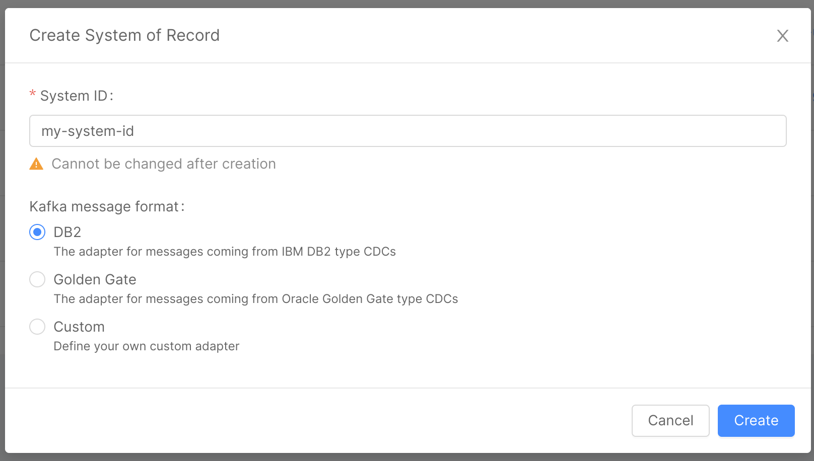
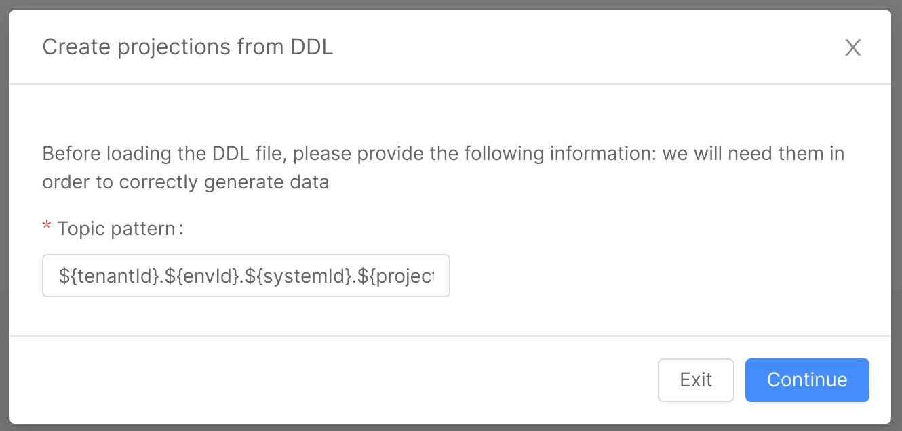
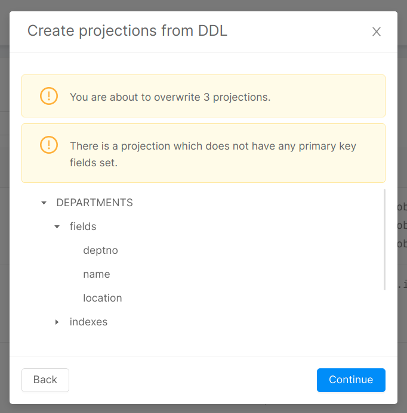

In this document we guide you through the configuration of [Projections](/fast_data/the_basics.md#projection) directly in the Console.

## Create a System of Records

To create a Projection, you should first of all create a System of Records, which is the data source that updates the Projection.

To do so, open the **Projections** section in the Fast Data group of Mia-Platform Console. Then, select the `Create new System of Records` button.

The creation of a System of Records requires you to insert a System ID, which is basically the name to recognize the System, and to choose the [Kafka message adapter](/fast_data/configuration/realtime_updater.md#kafka-adapters-kafka-messages-format). 



The System of Records is then created.

## Delete a System of Records

To delete a System of Records, you have to click the `Delete` button in the bottom-right corner of the System of Records detail page.

:::warning
The deletion is not allowed as long as you have at least one Projection inside the System, hence you need to delete all the Projections in a System before being able to delete it. 
:::

## Create a Projection

To create a new Projection, open the **Projections** section in the Fast Data group of Mia-Platform Console, then select an existing System of Records or [create a new one](#create-a-system-of-records).

Inside the System of Records page click the `Create new Projection` button on the top-right corner of the page and insert a Projection Name for the new Projection inside the pop-up displayed. After that, the new Projection details page will be displayed.

In order to finally create the new Projection, you will need to save the configuration.

:::tip
To see more details about your projection you can click on the arrow on the right inside the same section
:::

### Projection fields

In the card `Fields` in projection, you can add new fields.

Once you click the `Create field` button, a form is prompted where you should insert the following fields (all fields are required):

| Name          | Type          | Required | Description                                                                                                                                                  |
|---------------|---------------|----------|--------------------------------------------------------------------------------------------------------------------------------------------------------------|
| Name          | String        | &check;     | Name of the Projection Field. No spaces or special characters                                                                                                |
| Description   | String        | -    | Description of the Field                                                                                                                                     |
| Type          | Select        | &check;     | Type of the Field. one of `String`, `Number`, `Boolean`, `Date`, `Object`, `Array of object`, `Array of number`, `Array of string`, `ObjectId` or `GeoPoint` |
| Cast Function | Cast Function | &check;     | the possible Cast Function to select for the specified data type                                                                                             |
| Required      | Checkbox      | &check;     | Set the field as required, default to false                                                                                                                  |
| Nullable      | Checkbox      | &check;     | Declare field as nullable, default to false                                                                                                                  |
| Primary Key   | Checkbox      | &check;     | Set the field as part of the primary key, default to false                                                                                                   |

It's **mandatory** to set at least one Primary Key for each Projection. Otherwise, you will not be able to save your configuration.

:::info
When the `Real-Time Updater` deletes a projection document, it actually makes a **virtual delete** instead of real document deletion. This means that the document is actually kept in the database, but the `__STATE__` field (one of the default fields of the CRUD Service is set to `DELETED`.
:::

#### Generate projection fields from data sample

In the card `Fields` in Projection, you can upload a data sample to generate fields by clicking on the appropriate button. Doing this will replace the current fields with those contained within the file.
The supported file extension are: `.csv` and `.json`.

Example json

```json
[
  {
    "field1": "anyString",
    "field2": "true",
    "field3": "123"
  }
]
```

Example CSV

```csv
field1,field2,field3
false,anyString,123
```

At the end of the upload an internal function will try to cast the types correctly, otherwise it will treat them as strings by default.

:::note
Import of fields is supported only for the following data types: `String`, `Number`, `Boolean` or `Date`. For example, you cannot import fields of type object.
In Case some fields are not in the correct format, they will be ignored.
:::

:::caution
You cannot import fields with the same name as one of the metadata fields. If this happens, a warning will be displayed and the import won't be successful
:::

### Kafka topics

Inside each Projection detail page, a section named `Kafka topics` contains information about the following topics:

* Ingestion topic
* PR update topic

#### Ingestion topic

This section contains the name of the ingestion topics for each environment.
The topic names are editable and pre-compiled with our suggested format:

```txt
tenantId.environmentId.systemId.projectionName.ingestion
```

where `tenantId`, `environmentId`, `systemId` and `projectionName` are filled with, respectively, the id of the tenant of the project, the id of the associated environment, the id of the System which owns the Projection and the name of the Projection.

#### PR update topic

This section contains the name of the PR update topics for each environment.
The topic names are editable and pre-compiled with our default format:

```txt
tenantId.environmentId.systemId.projectionName.pr-update
```

where `tenantId`, `environmentId`, `systemId` and `projectionName` are filled with the same values specified in the previous paragraph about ingestion topics.

When a new Projection is created, the PR update topics values (for each Projection and for each environment) are added to the `FAST_DATA_PR_UPDATES_MAP_{SYSTEM_OF_RECORDS_NAME}` public variable, where `{SYSTEM_OF_RECORDS_NAME}` is filled with the capitalized name of the new Projection System of Records. For existing System of Records, if the public variable is not present it will be created when saving the configuration.

The content of the `FAST_DATA_PR_UPDATES_MAP_{SYSTEM_OF_RECORDS_NAME}` public variable is then added to the `kafkaProjectionUpdates.json` config map, used by the Real-Time Updater service inside the `KAFKA_PROJECTION_CHANGES_FOLDER` environment variable, which contains its folder path.

:::info
If you prefer to use custom topics for PR updates, it will be necessary to create a new config map containing the PR update topics values (for each Projection and for each environment) inside a JSON file. The new config map folder path should be then inserted inside the `KAFKA_PROJECTION_CHANGES_FOLDER` environment variable of the Real-Time Updater.
:::

### Projection metadata

A projection has the [predefined collection properties](/runtime_suite/crud-service/10_overview_and_usage.md#predefined-collection-properties) which are required for the `CRUD Service`, which is the service responsible for creating the collection on MongoDB.

These fields cannot be deleted and only the `_id` field is editable. You cannot add custom fields to the metadata.  

These fields have no `Cast function` assigned because they are not used for mapping of fields from the received Kafka message. This means that if the Kafka message contains a field with the same name as one of the metadata fields, it is not copied on the Projection.

There are also some of these fields that are used to track the time of creation and update of the projection document. Those are:

* `createdAt`: meaning the timestamp of the creation of the document on the database
* `updatedAt`: meaning the timestamp of the latest update that the document received
* `timestamp`: reporting the timestamp of the Kafka message that generated the document.

:::info
Every one of these timestamp fields has the format `yyyy-MM-ddTHH:mm:ss.SSS+ZZ:ZZ`
:::

## Import multiple projections from a DDL file

Most DBMSes have some way of exporting the database schema, producing a DDL file that contains a sequence of statements like `CREATE_TABLE`, `ALTER_TABLE`, and `CREATE_INDEX`. With this kind of file, the Console can create multiple projections for a given System of Records, which creates a set of projections with the following information:

* All the fields (both custom and default); the custom fields can only have type `number` or `string`. All the numeric types will be converted to `number`, every other SQL type will be converted to `string`.
* All the indexes specified in the DDL, plus a primary key index that will be automatically generated if not already present.

:::caution
The maximum size of the DDL file is 20MB
:::

To import projections from a DDL you need to go through three main steps, explained in the below sections.

### First Step

In the first step, you need to go to the Design Area, Projections Section, and create or edit a System of Records. Once there, in the top right corner you will find an import button, which will open a Modal that will guide you through the import process. On the first page, you will need to specify a topic pattern.

The topic pattern is a template string that will be interpolated for each combination of environment and projection to generate the topic prefixes. The syntax used is the same of the intuitive [javascript template strings](https://developer.mozilla.org/en-US/docs/Web/JavaScript/Reference/Template_literals), with the following variables:

* tenantId
* projectId
* systemId
* projectionId
* envId

The default value for this input is the same as the default used by the Console, which is `${tenantId}.${envId}.${systemId}.${projectionId}.ingestion`.



### Second Step

The second page lets you upload the DDL file, and provides information about the supported SQL dialects, which are:

* MySQL / MariaDB
* MSSQL
* Oracle
* PostgreSQL
* SQLite

:::caution
Keep in mind that `supported` means you will be able to generate projections correctly, but the fields types will only be either `number` or `string`.
:::


### Third Step

In the last step you will be presented with a recap of what you are about to import. A tree view of projections will be displayed, each projection having fields and indexes as children. For fields, only the names of the custom fields will be displayed, and for the indexes only the name of the indexes.
This page will also warn you about possible problems in the configuration, so read the warnings carefully and remember to take action when needed (e.g. missing primary key).

When you click continue, the console will generate the new configuration for the System, which you can explore the result of the import directly from the console. If you are happy with the result as it is, you can directly commit, and it will be saved in the configuration, otherwise you can freely edit the generated projections as you normally do, and then commit. Any previous Projections with different name will remain untouched, while projections with the same name will be overwritten.



## Attach services

A System of Record can be attached to one of more supported services (either a [Real-Time Updater](/fast_data/realtime_updater.md) or a [Projection Storer](/fast_data/projection_storer.md)) to allow Projections to be updated with the data received from Change Data Capture systems. However, to work as intended, the projections must be attached to a service.

In order to do so, when accessing to the System of Record page, the tab _Services_ will allow to include the service (or the services) and attach the Projections of the System of Record to them.
		

		
From the table inside the _Projections attached to services_ card you can review all the projections included in the System of Record, and identify the service that will evaluate the ingestion topics.
		
You can modify the service attached by clicking on the button to the right side of the projection name: this will open a dialog that allow you to pick a service among those already attached to the System of Record.

Otherwise, you can open the configuration page of the service, accessible by clicking of the edit button in the table the _System of Record services_ card. This will redirect the user to a new page where can review all the information regarding the Real-Time Updater or the Projection Storer, including the possibility to select all the projections (still available) to be managed by the selected service.

## Expose projections through API

You can expose a projection through API, only with `GET` method (the data in the projection are modifiable only by the Real-Time Updater service).

To expose the Fast Data projection, [create an Endpoint](/development_suite/api-console/api-design/endpoints.md) with type `Fast Data Projection` linked to the desired projection.

You can expose a projection on a CMS page to help you review the data inside the collection, follow [Configure CMS extensions](/microfrontend-composer/previous-tools/cms/conf_cms.md#configure-pages).

:::info
The exposed API is not required for Fast Data to work. It is an optional behavior in case you need access to the data without directly accessing it from the database.
:::

## Technical limitation

In your custom files (e.g. `kafka-adapters`) you can import only the node modules present in the following list:

* [lodash.get](https://github.com/lodash/lodash/tree/4.4.2-npm-packages/lodash.get)
* [mongodb](https://github.com/mongodb/mongo/tree/r3.6.0)
* [ramda](https://github.com/ramda/ramda/tree/v0.27.1)
