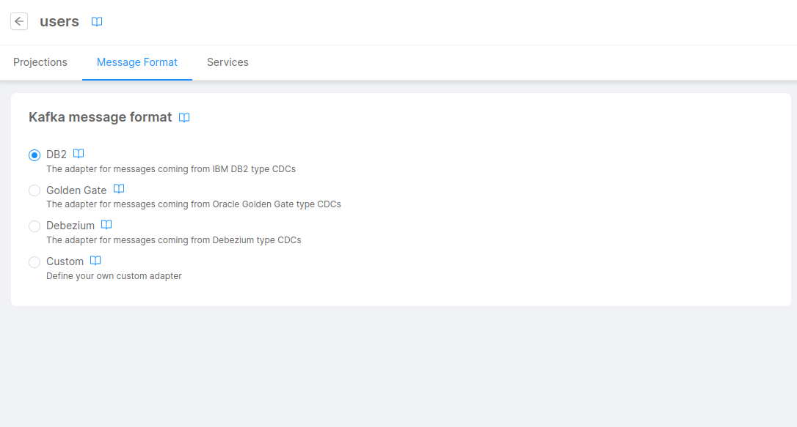

Real-Time Updater is the service in charge of keeping up-to-date the projections with the data sent by the connected system.   
Optionally, the service can generate several events so that your services can consume these events and react when projections are updated. 

For having an overview of the features of the Real-Time Updater, you can go [here](/fast_data/realtime_updater.md).   
Here below, instead, all the configurations the service accepts are explained. 

:::info
The documentation regarding the Projection Storer can be found [here](/fast_data/configuration/projection_storer.md).
:::

## Environment variables

| Name                                        | Required | Description                                                                                                                                                                                                                                                                                                                                                                                                                                             | Default  |
|---------------------------------------------|----------|---------------------------------------------------------------------------------------------------------------------------------------------------------------------------------------------------------------------------------------------------------------------------------------------------------------------------------------------------------------------------------------------------------------------------------------------------------|----------|
| LOG_LEVEL                                   | &check;  | defines the logger level                                                                                                                                                                                                                                                                                                                                                                                                                                | -        |
| HTTP_PORT                                   | &check;  | defines the HTTP port where status and metrics routes are exposed                                                                                                                                                                                                                                                                                                                                                                                       | -        |
| SYSTEM_OF_RECORDS                           | &check;  | the name of the system of records associated to the Real Time Updater                                                                                                                                                                                                                                                                                                                                                                                   | -        |
| MONGODB_URL                                 | &check;  | defines the mongodb URL to contact                                                                                                                                                                                                                                                                                                                                                                                                                      | -        |
| PROJECTIONS_DATABASE_NAME                   | &check;  | defines the name of the projections database                                                                                                                                                                                                                                                                                                                                                                                                            | -        |
| PROJECTIONS_CHANGES_COLLECTION_NAME         | &check;  | defines the name of the projections changes collection                                                                                                                                                                                                                                                                                                                                                                                                  | -        |
| PROJECTIONS_CHANGES_ENABLED                 | -        | defines whether you want to generate projections changes                                                                                                                                                                                                                                                                                                                                                                                                | true     |
| GENERATE_KAFKA_PROJECTION_CHANGES           | -        | defines whether the projection changes have to be sent to Kafka too or not. (v3.4.0 or above).                                                                                                                                                                                                                                                                                                                                                          | false    |
| GENERATE_KAFKA_PROJECTION_UPDATES           | -        | defines whether the realtime updater should send a message of update every time it writes the projection to Mongo.                                                                                                                                                                                                                                                                                                                                      | false    |
| KAFKA_BROKERS                               | &check;  | defines the Kafka brokers                                                                                                                                                                                                                                                                                                                                                                                                                               | -        |
| KAFKA_GROUP_ID                              | &check;  | defines the Kafka group id (it is suggested to use a syntax like ```{'{tenant}.{environment}.{projectName}.{system}.real-time-updater'}```)                                                                                                                                                                                                                                                                                                             | -        | KAFKA_SASL_USERNAME | &check;| defines the Kafka SASL username | - |
| KAFKA_SASL_USERNAME                         | &check;  | defines the Kafka SASL username                                                                                                                                                                                                                                                                                                                                                                                                                         | -        |
| KAFKA_SASL_PASSWORD                         | &check;  | defines the Kafka SASL password                                                                                                                                                                                                                                                                                                                                                                                                                         | -        |
| KAFKA_SASL_MECHANISM                        | -        | defines the authentication mechanism. It can be one of: ```plain```, ```scram-sha-256```, ```scram-sha-512```, ```oauthbearer```.                                                                                                                                                                                                                                                                                                                       | plain    |
| KAFKA_SASL_OAUTH_BASE_URL                   | -        | In case of ```oauthbearer``` mechanism, it defines the base URL of the endpoint for fetching the OAuth2 token.                                                                                                                                                                                                                                                                                                                                          | -        |
| KAFKA_SASL_OAUTH_PATH                       | -        | In case of ```oauthbearer``` mechanism, it defines the path of the endpoint for fetching the OAuth2 token.                                                                                                                                                                                                                                                                                                                                              | -        |
| KAFKA_SASL_OAUTH_GRANT_TYPE                 | -        | In case of ```oauthbearer``` mechanism, it defines the grant type for fetching the OAuth2 token. Only grant type ```password``` is supported                                                                                                                                                                                                                                                                                                            | password |
| KAFKA_SASL_OAUTH_CLIENT_ID                  | -        | In case of ```oauthbearer``` mechanism, it defines the client id for fetching the OAuth2 token.                                                                                                                                                                                                                                                                                                                                                         | -        |
| KAFKA_SASL_OAUTH_CLIENT_SECRET              | -        | In case of ```oauthbearer``` mechanism, it defines the client secret for fetching the OAuth2 token.                                                                                                                                                                                                                                                                                                                                                     | -        |
| KAFKA_SASL_OAUTH_TOKEN_EXPIRATION_MARGIN_MS | -        | In case of ```oauthbearer``` mechanism, it defines time window before the actual expiration of the token during which the token will be considered expired (it is recommended to set this value not less than 1 minute)                                                                                                                                                                                                                                 | 60000    |
| KAFKA_USE_LATEST_DEQUEUE_STRATEGY           | -        | defines whether to use `latest` strategy as auto offset reset when consumer group did not previously exists                                                                                                                                                                                                                                                                                                                                             | -        |
| KAFKA_MESSAGE_ADAPTER                       | -        | defines which Kafka message adapter to use. Its value can be either```basic``` or `db2` (DB2 adapter), ```golden-gate```, ```debezium``` or ```custom```. This value can be changed only in the related System of Records, on the _Projections_ page. Any manual update from the Environment Variables table will be loss when saving. Further details on the [Kafka Adapters: Kafka messages format](#kafka-adapters-kafka-messages-format) paragraph. | basic    |
| KAFKA_CONSUMER_MAX_WAIT_TIME                | -        | defines the maximum waiting time of Kafka Consumer for new data in batch.                                                                                                                                                                                                                                                                                                                                                                               | 500      |
| KAFKA_CONNECTION_TIMEOUT_MS                 | -        | Time in milliseconds to wait for a successful connection.                                                                                                                                                                                                                                                                                                                                                                                               | 10000    |
| KAFKA_SESSION_TIMEOUT_MS                    | -        | Timeout in milliseconds used to detect failures.                                                                                                                                                                                                                                                                                                                                                                                                        | 30000    |
| KAFKA_HEARTBEAT_INTERVAL_MS                 | -        | The expected time in milliseconds between heartbeats to the consumer coordinator.                                                                                                                                                                                                                                                                                                                                                                       | 3000     |
| KAFKA_ADAPTER_FOLDER                        | -        | defines the path to the Kafka adapter folder                                                                                                                                                                                                                                                                                                                                                                                                            | -        |
| KAFKA_PROJECTION_CHANGES_FOLDER             | -        | path where has been mounted the ```kafkaProjectionChanges.json``` configuration (v3.4.0 or above).                                                                                                                                                                                                                                                                                                                                                      | -        |
| KAFKA_PROJECTION_UPDATES_FOLDER             | -        | path to the folder that contains the file ```kafkaProjectionUpdates.json```, containing configurations of the topic where to send the updates to, mapped to each projection. (v5.3.0 or above).                                                                                                                                                                                                                                                         | -        |
| CAST_FUNCTIONS_FOLDER                       | -        | defines the path to the cast-functions folder                                                                                                                                                                                                                                                                                                                                                                                                           | -        |
| MAP_TABLE_FOLDER                            | -        | defines the path to the map table folder                                                                                                                                                                                                                                                                                                                                                                                                                | -        |
| STRATEGIES_FOLDER                           | -        | defines the path to the strategies' folder                                                                                                                                                                                                                                                                                                                                                                                                              | -        |
| INVARIANT_TOPIC_MAP                         | &check;  | defines an object that maps the topic to the projection                                                                                                                                                                                                                                                                                                                                                                                                 | -        |
| USE_UPSERT                                  | -        | defines whether to use [upsert](#upsert) or not when performing insert and update operations.                                                                                                                                                                                                                                                                                                                                                           | true     |
| USE_AUTOMATIC_STRATEGIES                    | &check;  | When `true` the Real Time Updater will work in Low Code mode, supporting the Config Maps of ER Schema and Projection Changes Schema, and allowing configuration of the associated System of Records to automatically update in the service                                                                                                                                                                                                              | false    | 
| STRATEGIES_MAX_EXEC_TIME_MS                 | &check;  | defines the maximum time for which a strategy is executed                                                                                                                                                                                                                                                                                                                                                                                               | -        |
| COMMIT_MESSAGE_LOGGING_INTERVAL             | -        | specify the interval in ms of logging the info that messages have been committed.                                                                                                                                                                                                                                                                                                                                                                       | 3000     |
| FORCE_CHECK_ON_OFFSET                       | -        | Force check that incoming message has offset greater or equal than the one of the projection to update.                                                                                                                                                                                                                                                                                                                                                 | true     |
| CA_CERT_PATH                                | -        | the path to the CA certificate, which should include the file name as well, e.g. ```/home/my-ca.pem```                                                                                                                                                                                                                                                                                                                                                  | -        |
| PAUSE_TOPIC_CONSUMPTION_ON_ERROR            | -        | If set to true, in case of an error while consuming an ingestion message, the service will pause the topic's consumption while keep consuming the other ones. More info on the feature [here](#pause-single-topics-consumption-on-error)                                                                                                                                                                                                                | false    |
| USE_POS_AS_COUNTER                          | -        | If ```KAFKA_MESSAGE_ADAPTER``` is set to ```golden-gate``` it will use the ```pos``` field as timestamp for ingestion kafka messages. When set to ```false``` it will use the default ```timestamp``` property in the message provided by kafka like the other adapters do. Setting this property to ```true``` with a ```KAFKA_MESSAGE_ADAPTER``` **different** from ```golden-gate``` will have no effect.                                            | true     |

## Attach to System of Records

In order to evaluate data from external CDC, the Projections included in the System of Record must be attached to one or more [Projection Storer](/fast_data/projection_storer.md) or Real-Time Updater. Services must be created in advance and they can be attached moving to the _Services_ tab of the selected System of Record.


Please remember that, after attaching a Real-Time Updater to the Systems of Record, you must select the projections that the service should evaluate to ensure the service updates those projections. To do that, you can use to the table in the _Projections attached to services_ section to search the projection and attach to a specific service. Otherwise, you can access to the service configuration page by clicking to the button next to the service name and configure the list of projections from there.

:::info
Additionally, note that each projection can be evaluated by only one service.
:::

When a service is attached to a Real-Time Updater, some of its config maps are automatically updated and set as read-only. These configurations are managed by the console. Any updates made to the _System of Records_ (e.g., adding, removing, or updating a projection, or modifying the Message Adapter) will trigger the update of these configuration maps upon saving the configuration.

Furthermore, the environment variables `SYSTEM_OF_RECORDS`, `INVARIANT_TOPIC_MAP` and `KAFKA_MESSAGE_ADAPTER` (and, if applicable, `KAFKA_ADAPTER_FOLDER`) will be automatically updated upon saving the configuration. These variables are not manually editable because they are managed exclusively from the System of Records configuration module.

### Usage of the Low Code

The Low Code features of the Real-Time Updater is available since version `4.2.0`. This means that any configuration update on the related System of Records (selection of the Message Adapter, any update of projections, their fields or the topic definitions) will be automatically reflected in the service config maps.

Also, it allows the possibility to fully configure the service with the usage of JSON files, as example for the [ER Schema](#er-schema-configuration) and the [Projection Changes Schema](#projection-changes-schema) 

:::info
You can quickly convert a System of Records from Manual to Low code by changing the `USE_AUTOMATIC_STRATEGIES` to _true_. Then, you should follow the next steps to set up your Fast Data Low Code project properly.
:::

## How data is managed on MongoDB

### Projection Deletion

When the Real-Time Updater deletes a document, it actually makes a **virtual delete** instead of a real document deletion. (the `__STATE__` field is set to `DELETED`)

### Upsert

When performing Insert and Update operations, Real-Time Updater will perform an upsert operation as default. This means that if the document matching the key of the message does not exist, it will be created; otherwise, if it already exists, it will just be updated. 

If you want to change this behavior, you can set the environment variable `USE_UPSERT` of the Real-Time Updater to _false_. Doing so, for the Insert operation the service will fail to insert documents that already exist, causing the service to stop. For the Update operation it will fail when trying to update non-existing documents, causing the service to stop.

## Configuration files

The Real-Time Updater accepts the following configurations:

### Message Adapters

In the Fast Data architecture CDC, iPaaS, APIs and sFTP publish messages on Kafka topic to capture change events. However, these messages could be written in different formats.
The purpose of the Kafka adapter is allowing the correct reading of these messages in order to be properly consumed by the Real-Time Updater.

Since one or multiple Real-Time Updater services could be connected to a System of Records, when creating a new System you will be asked to select the type of message adapter you want to use, 
between one of the following options (further details in the paragraphs below):
- `DB2`, based on the [IBM InfoSphere Data Replication for DB2](https://www.ibm.com/docs/en/db2-for-zos/13?topic=getting-started-db2-zos) type CDC;
- `Golden Gate`, based on the [Oracle GoldenGate](https://docs.oracle.com/goldengate/c1230/gg-winux/GGCON/introduction-oracle-goldengate.htm#GGCON-GUID-EF513E68-4237-4CB3-98B3-2E203A68CBD4) type CDC;
- `Debezium`, based on the [Debezium](https://debezium.io/documentation/reference/2.1/tutorial.html) type CDC;
- `Custom`, in case you need a completely customized message adapter (you'll be requested to write the implementation code); 

The selection will be applied to every Real-Time Updater service attached (or to any service that will be attached in the future) to ensure that those service will be expecting messages in the correct type.

In case you need to change the type of adapter to use in the Real-Time Updater, you can easily do that from the System of Records page in the _Projection_ section of the console: after selecting your System, click on the _Message Format_ tab, then select the adapter type you want to use.



#### IBM InfoSphere Data Replication for DB2

It's the default one, it is based on the [IBM InfoSphere Data Replication engine](https://www.ibm.com/docs/en/idr/11.4.0?topic=console-overview-cdc-replication).

The message should include the following properties:
- `timestamp`: a stringified integer greater than zero. This integer has to be a valid timestamp.
- `key`: it has to be a stringified object containing the primary key of the projection, if `value` also contains the primary key of the projection this field can be an empty string.
- `value`: it is **null** if it's a *delete* operation, otherwise it contains the data of the projection.
- `offset`: it is the offset of the Kafka message.

:::info
It is important to note that whenever the ingestion message is not a *delete* operation the `value` of the message must contain all the fields of the projection, including the primary keys also present in the `key`, so the Real-Time Updater can process the message properly.
:::

These are the only fields needed to configure correctly the message adapter. For more details and further explanations, you can read the [documentation page about the supported JSON format](https://www.ibm.com/docs/en/idr/11.4.0?topic=kcop-write-json-format-records).

To see the message's structure specification and some examples go to the [Inputs and Outputs page](/fast_data/inputs_and_outputs.md#ibm-infosphere-data-replication-for-db2) .

:::caution
This Kafka message format does not support a Primary Key update. For additional information, please check the [Primary Key update](#primary-key-update) section.
:::

#### Oracle GoldenGate

This Kafka Message Adapter has been created to have a format supported by [Oracle Golden Gate](https://docs.oracle.com/en/middleware/goldengate/big-data/21.1/gadbd/using-kafka-connect-handler.html#GUID-81730248-AC12-438E-AF82-48C7002178EC). 

In this Golden Gate adapter, we expect that the message includes data as explained in the [JSON Formatter page of the official documentation](https://docs.oracle.com/goldengate/bd1221/gg-bd/GADBD/GUID-F0FA2781-0802-4530-B1F0-5E102B982EC0.htm#GADBD501).

To see the message's structure specification and some examples go to the [Inputs and Outputs page](/fast_data/inputs_and_outputs.md#oracle-goldengate) .

#### Debezium

The Debezium kafka message adapter is meant to accept Debezium generated kafka messages with the following properties:

- **before**: optional value that indicates the data values before the operation execution
- **after**: optional value that indicates the data values after the operation execution
- **op**: optional value that indicates the type of operation, `c` for create/insert, `u` for update and `d` for delete

These are the main properties used by the adapter and the Real-Time Updater but you can have other properties like `ts_ms` or `source` depending on which DB is Debezium working with.

Debezium has also some "special" events which are handled in their own way:
- **Snapshot**: Snapshot events are messages that indicate the state of the DB up until that point in time. This messages are sent when the connector does not find any offsets from where to start processing, therefore they are handled as normal insert messages.
- **Tombstone**: Tombstone events are messages sent after a normal delete message and are only useful for kafka itself and its topic compression policies. For this reason the adapter will ignore and skip them.
- **Truncate**: Truncate events are messages sent when an entire table is emptied. Unfortunately we **do not support** this kind of messages at the moment and they will be skipped.

To see the message's structure specification and some examples go to the [Inputs and Outputs page](/fast_data/inputs_and_outputs.md#debezium) .

#### Custom

If you have Kafka Messages that do not match one of the formats above, you can create your own custom adapter for the messages. 

To make this work, you need to create a `Custom Kafka Message Adapter` inside _Real-Time Updater_ section of the related System of Records. The adapter must be a javascript function that converts Kafka messages as received from the Real-Time Updater to an object with a specific structure. This function must receives as arguments the Kafka message and the list of primary keys of the projection, and must return an object with the following properties:

- **offset**: the offset of the Kafka message
- **timestampDate**: an instance of `Date` of the timestamp of the Kafka message.
- **keyObject**: an object containing the primary keys of the projection. It is used to know which projection document needs to be updated with the changes set in the value.
- **value**: the data values of the projection, or null
- **operation**: optional value that indicates the type of operation (either `I` for insert, `U` for update, or `D` for delete). It is not needed if you are using an upsert on insert logic (the default one), while it is required if you want to differentiate between insert and update messages.
- **before**: optional value that indicates the data values before the operation execution
- **after**: optional value that indicates the data values after the operation execution
- **operationPosition**: optional value that indicates a positive integer, usually a timestamp, which ensures messages are processed in the correct order

If the `value` is null, it is a delete operation.
The `keyObject` **cannot** be null.

To see the message's structure specification and some examples go to the [Inputs and Outputs page](/fast_data/inputs_and_outputs.md#custom) .

:::note
To support a Primary Key update, the `before`, `after` and `operationPosition` fields should be included in the adapter. (Hint: if not present, a simple `operationPosition` value might be the Kafka message timestamp).
:::

Inside configmap folder create your javascript file named `kafkaMessageAdapter.js`.

The file should export a simple function with the following signature:

```js
module.exports = function messageAdapter(message, primaryKeys, logger) {
  const {
    value: valueAsBuffer, // type Buffer
    key: keyAsBuffer, // type Buffer
    timestamp: timestampAsString, // type string
    offset: offsetAsString, // type string
  } = message

  // your adapting logic

  return {
    keyObject: keyToReturn, // type object (NOT nullable)
    value: valueToReturn, // type object (null or object)
    timestampDate: new Date(parseInt(timestampAsString)), // type Date
    offset: parseInt(offsetAsString), // type number
    operation: operationToReturn, // type string (either I, U, or D)
  }
}
```

The `message` argument is the Kafka message as received from the `real-time-updater`.  
The fields `value` and `key` are of type *Buffer*, `offset` and `timestamp` are of type *string*.

The `primaryKeys` is an array of strings which are the primary keys of the projection whose topic is linked.

### ER schema configuration

The ER Schema, defined with a `erSchema.json` file, defines the relationship between tables and projections. [On the dedicated page in the Config Map section](/fast_data/configuration/config_maps/erSchema.md), you can find a deep explanation of how ER Schema configuration works.

You can update the ER Schema in the page of the Real-Time Updater, in the _ConfigMaps & Secrets_ page. 

:::info
The ER Schema ConfigMap is created after the service is attached to a System of Records for the first time. It will include base `erSchema.json` file is generated with the following content:
```json
{ 
  "version": "1.0.0", 
  "config": { } 
}
```

This is an empty configuration: the Real-Time Updater Microservice could be deployed without pod restart, but this file must be modified according to the projections associated with this microservice to work properly.
:::  

### Projection Changes Schema

The `projectionChangesSchema.json` config map defines the paths for the strategy to generate the projection changes identifier. Differently from the Manual Configuration, the projection changes configurations are described with a JSON file aimed to reduce the developing effort.

:::caution
The Projection Changes Schema ConfigMap is created after the service is attached to a System of Records for the first time. 
It will include base `projectionChangesSchema.json` file is generated with the following content:
```json
{ 
  "version": "1.0.0", 
  "config": { } 
}
```

This is an empty configuration: the Real-Time Updater Microservice could be deployed without pod restart, but this file must be modified according to the projections associated with this microservice to work properly.
:::

For more information please refer to the [Projection Changes Schema](/fast_data/configuration/config_maps/projection_changes_schema.md) dedicated page.

### CAST_FUNCTION configurations

The mount path used for these configurations is: `/home/node/app/configurations/castFunctionsFolder`.  
In this folder you have all the generated [Cast Functions](/fast_data/configuration/cast_functions.md) definitions. This configuration is read-only since you can configure it from its dedicated section of the Console.

### MAP_TABLE configurations

The mount path used for these configurations is: `/home/node/app/configurations/mapTableFolder`.  
Two mappings will be placed in this folder: one between cast functions and fields and another one between strategies and projections.
This configuration is read-only since it's configured automatically based on the projections of the System of Records included in the attached service 
and the strategies you configure from the Fast Data section of the Console.

### Kafka Projection Changes configuration

:::caution
This feature is *deprecated* and will be removed in future versions of the Real-Time Updater service. In case you need the service to send events to Kafka, 
follow the configuration of [Kafka Projection Updates](#kafka-projection-updates-configuration).
:::

Projection changes are saved on Mongo, but from version v3.4.0 and above, you can send them to Kafka as well.

This feature enables you to send the projection changes to a topic Kafka you want to. This is useful if you want to have a history of the projection changes thanks to the Kafka retention of messages.
You can also make your own custom logic when a projection change occurs by setting a Kafka consumer attached to the topic Kafka you set.

To do that, you need to set two environment variables:

- `GENERATE_KAFKA_PROJECTION_CHANGES`: defines whether the projection changes have to be sent to Kafka too or not. Default is `false`(v3.4.0 or above).
- `KAFKA_PROJECTION_CHANGES_FOLDER`: path where has been mounted the `kafkaProjectionChanges.json` configuration (v3.4.0 or above).

You have to create a *configuration* with the same path as the one defined by the environment variable `KAFKA_PROJECTION_CHANGES_FOLDER`.
Then, you have to create a configuration file `kafkaProjectionChanges.json` inside that configuration. The configuration is a json file like the following one:

```json
{
    "MY_PROJECTION": {
        "projectionChanges": {
            "MY_SINGLE_VIEW": {
                "strategy": "MY_STRATEGY", 
                "topic": "MY_TOPIC",
            }
        }
    }
}
```

where:

- `MY_PROJECTION` is the name of the collection whose topic has received the message from the CDC.
- `MY_SINGLE_VIEW` is the single view that have to be updated
- `MY_STRATEGY` is the strategy to be used to get the identifier of the Single View to update. It could be the name of a file or, in case an automatic strategy, the string `__automatic__`.
- `MY_TOPIC` is the topic where the projection change need to be sent (for further information about the naming convention adopted for this topic, [click here](/fast_data/inputs_and_outputs.md#topic-for-svc-trigger))

Example:

```json
{
    "registry-json": {
        "projectionChanges": {
            "sv_pointofsale": {
                "strategy": "__automatic__",
                "topic": "my-tenant.development.my-database.sv-pointofsale.projection-change",
            }
        }
    },
    "another-projection": {
        "projectionChanges": {
            "sv_customer": {
                "strategy": "__fromFile__[myStrategy]",
                "topic": "my-tenant.development.my-database.sv-customer.projection-change"
            }
        }
    }
}
```

When a message about `registry-json` happens, the projection changes will be saved on MongoDB, and it will be sent to the Kafka topic `my-tenant.development.my-database.sv-pointofsale.projection-change` as well.

## Projection Changes Collection

[Projection Changes](/fast_data/inputs_and_outputs.md#projection-changes) are collections generated from each Real-Time Updater service attached to a [System of Records](/fast_data/the_basics.md#system-of-records-sor).

If the environment variable `PROJECTIONS_CHANGES_ENABLED`, you will be required to include also the Projection Changes collection name (as a value of the environment variable `PROJECTIONS_CHANGES_COLLECTION_NAME`).

If the name of the collection name will follow the convention for collection names defined in the Mia-Platform Console (a text of maximum 80 characters, only lowercase letters, number, underscores and hyphens, starting with a lowercase letter), then saving the configuration will automatically generate the collection for you if it doesn't exist yet. This collection can be customized by you in any moment after.

If you're using a different pattern or you're using a public or secret environment variable, you will have to manually create a collection to configure its properties (indexes, schemas, etc.) and to potentially use it in with the CRUD Service

:::info
If you wish to delete a Real-Time Updater or change the desired name of the Projection Changes collection, please remember that the existing CRUD collection will not be automatically removed. You have to do it manually from the _MongoDB CRUD_ section.
:::

In any case, your collection is supposed to have the following fields (apart from the default ones):

```json
[
  {
    "name": "type",
    "type": "string",
    "required": false,
    "nullable": false
  },
  {
    "name": "changes",
    "type": "Array_RawObject",
    "required": false,
    "nullable": false
  },
  {
    "name": "identifier",
    "type": "RawObject",
    "required": true,
    "nullable": false
  },
  {
    "name": "doneAt",
    "type": "Date",
    "required": false,
    "nullable": false
  }
]
```

You also need to have the following additional indexes:

Add an index with *name* `type_change_state`, *type* `normal`, *unique* `false`.  
You need to add the following index fields:

- *name* `changes.state`, *order* `ASCENDENT`
- *name* `type`, *order* `ASCENDENT`

Add another index with *name* `type_identifier`, *type* `normal`, *unique* `true`.  
You need to add the following index fields:

- *name* `identifier`, *order* `ASCENDENT`
- *name* `type`, *order* `ASCENDENT`

:::note
To allow the Single View Creator to read from the Projection Changes, the collection name should also be set in the `PROJECTIONS_CHANGES_COLLECTION` environment variable of your Single View Creator service. 
:::

### Kafka Projection Updates configuration

Whenever the Real-Time Updater performs a change on Mongo on a projection, you can choose to send a message to a Kafka topic as well, containing information about the performed change and, if possible, the state of the projection *before* and *after* the change and the document ID of the document involved in the change.

:::info
This feature has been introduced since version v3.5.0 of the Real-Time updater
:::

To activate this feature you need to set the following environment variables:
- `KAFKA_PROJECTION_UPDATES_FOLDER`: path to the folder that contains the file `kafkaProjectionUpdates.json`, containing configurations of the topic where to send the updates to, mapped to each projection.
- `GENERATE_KAFKA_PROJECTION_UPDATES`: defines whether the Real-Time Updater should send a message of update every time it writes the projection to Mongo. Default is `false`

:::info
From `v10.2.0` of Mia-Platform Console, a configuration for Kafka Projection Updates is automatically generated when creating a new Real-Time Updater and saving the configuration. Further information about the automatic generation can be found inside the [Projection page](/fast_data/configuration/projections.md#pr-update-topic). If you prefer to create a custom configuration, please use the following guide.
:::

You need to create a configuration with the same path as the one you set in `KAFKA_PROJECTION_UPDATES_FOLDER`. Then, you have to create a configuration file `kafkaProjectionUpdates.json` inside that configuration.

:::caution
To prevent possible conflicts with the automatically created configuration, please set the `KAFKA_PROJECTION_UPDATES_FOLDER` to a value different from the default `/home/node/app/kafkaProjectionUpdates` path.
:::

To know more on how to configure the `kafkaProjectionUpdates.json` please refer to its [Configuration](/fast_data/configuration/config_maps/kafka_projection_updates.md) page.

:::info
Notice that you can either set the topics for all the projections, or for a subset of them.
So, for example, if you need to setup a [Single View Patch](#single-view-patch) operation, you may want to configure only the projections needed in such Single View.
:::

## Advanced topics

### Primary Key update

Starting from `v7.1.0`, the Real-Time Updater supports the update of a Primary Key. In particular, it detects if received ingestion messages contain an updated Primary Key. In that case, the Real-Time Updater automatically handles updating events on the existing records without requiring additional messages.

When the Real-Time Updater receives a Primary Key update, it triggers two different actions:
1. the deletion of the old record with the old Primary Key
2. the creation of a new record with the updated content and the updated Primary Key

:::caution
Mind that these two actions create two `pr-update` messages when the emission of Projection Update is enabled
:::

In order to handle a Primary Key update, the Real-Time Updater needs to receive the following data:
- a positional information about the current operation
- the data values before the update
- the data values after the update

More details about the configuration of these fields can be found inside each Kafka message format paragraph in this page.

:::danger
The Kafka message format based on the _IBM InfoSphere Data Replication for DB2_ CDC does not support the Primary Key update.
:::

### Snappy compression

Snappy is a compression and decompression library whose aim is to offer high speed data flow while still maintaining a reasonable compression ratio. Among the various types of compression supported by Kafka for its messages, there is also Snappy.

The main advantages of Snappy are:

* Fast compression speed (around 250 MB/sec)
* Moderate CPU usage
* Stability and robustness to prevent crashing while still maintaining the same bitstream format among different versions
* Free and open source

:::note
For further information about Snappy, check the official [GitHub page](https://github.com/google/snappy) of the library.
:::

Provided that the client's **CDC** (Change Data Capture) supports Snappy compression, the console is already predisposed for it.

:::caution
Snappy, like every other compression and decompression algorithm, will always increase the delay between production and consumption of the message, hence it is not advised for strong real-time relying applications; on the other hand it is well recommended for initial loads which tend to be a lot heavier.
:::

#### Create ACL rules

It is possible to create ACL rules, you can set from user interface:

* *type*: set **topic** type.
* *topic name*: new or existent one.
* *pattern type*: literal or prefixed. If you want to declare an ACL for each topic you should use **literal**.
* *operation*: for each topic, you should set **READ** and **WRITE** operation.
* *permission*: could be `ALLOW` or `DENY`. You should set **ALLOW**. Once created, by default permission are to deny all others operations.

### Tracking the changes

From the **v3.2.0** of the Real-Time Updater, inside the Projections and Projection Changes additional information about the Kafka message that triggered the Real-Time Updater are saved. This allows you to track the changes made as consequence of a Kafka message.

In particular, the following information are saved:

#### Projection changes

Into each element of the `changes` array of the projection change document are inserted the information about the message that triggered the projection change

- topic: is the topic from which the Kafka message has been consumed
- partition: is partition from which the Kafka message has been consumed
- offset: is the offset of the message
- key: is the key of the Kafka message
- timestamp: is the timestamp of the message

Example:

```json
{
    "type": "sv_pointofsale",
    "identifier": {
        "ID_USER": "123",
    },
    "changes": [{
        "state": "NEW",
        "topic": "my-topic.development.my-system.my-projection.ingestion",
        "partition": 0,
        "timestamp": "2021-11-19T16:22:07.031Z",
        "offset": "14",
        "key": {
            "ID_USER": "123",
        },
    }],
}
```

#### Projection

Into the projection is saved information about the last Kafka message that updated the projection.
This information is saved inside a field named `__internal__kafkaInfo` in order to prevent collision with others projection fields.

The information saved are:

- topic: is the topic from which the Kafka message has been consumed
- partition: is partition from which the Kafka message has been consumed
- offset: is the offset of the message
- key: is the key of the Kafka message
- timestamp: is the timestamp of the message

Example:

```json
{
    "ID_USER": "123",
    "ADDRESS": "address_1",
    "SURNAME": "ROSSI",
    "TAX_CODE": "tax_code",
    "__STATE__": "PUBLIC",
    "createdAt":  "2021-10-19T13:39:47.589Z",
    "timestamp": "2021-11-19T16:22:07.031Z",
    "updatedAt": "2021-11-19T16:22:07.052Z",
    "__internal__kafkaInfo": {
        "topic": "my-topic.development.my-system.my-projection.ingestion",
        "partition": 0,
        "timestamp": "2021-11-19T16:22:07.031Z",
        "offset": "14",
        "key": {
            "ID_USER": "123",
        },
    }
}
```

### Prevent projection to be overwritten

During a rebalancing or a massive initial load with multiple replicas of the Real-Time updater, a batch of old messages that have not been committed yet could be read by the Real-Time updater. In fact, Kafka ensures that messages are received, in order, at least once.

To prevent that old messages that have already updated the projection, overwrite the projection again, the environment variable `FORCE_CHECK_ON_OFFSET` is set by default to `true`.

This setting is **strongly** recommended when you have both insert/update and delete operations.

:::caution
At the moment this variable is set to `true` by default, but you can turn it off in order to adapt your services in case they need some fix.
:::

### Kafka group rebalancing behavior

If a Kafka group rebalancing happens after a projection has already been updated, projection changes will be generated anyway and the Real-Time updater will still try to commit though.

:::note
This behavior has been introduced from v4.0.0 and above. In previous versions instead, a rebalancing check was made after each operation, and when it happened, the service would stop without generating any projection change.
:::

### CA certs

Since service version `5.4.0`, you can set your CA certs by providing a path to the certification file in the environment variable `CA_CERT_PATH`.

### Single View Patch

:::info
This feature is supported from version `7.1.2` of the Real-Time Updater
:::

As explained [here](/fast_data/configuration/single_views.md#single-view-patch), in order to arrange the Real-Time Updater for this specific operation, it's important to understand which are the projections impacted. Then, the following steps have to be followed:

* Activate Projection Updates with the env `GENERATE_KAFKA_PROJECTION_UPDATES`
* Configure the [Projection Updates](#kafka-projection-updates-configuration) only for the specific Projection

### Pause single topic's consumption on error

:::info
This feature is supported from version `7.1.4` of the Real-Time Updater
:::

When the Real-Time Updater encounters an error while consuming an ingestion message it will just pause the topic's consumption of that message, instead of crashing. This feature is disabled by default, to enable it use the <code>PAUSE_TOPIC_CONSUMPTION_ON_ERROR</code> environment variable.

To use this feature make sure you have properly configured your alerts in your grafana dashboards so you can quickly detect pauses on topics' consumption and act on the problematic message to resume the consumption.
The ideal for that would be to set up some alerts based on the <code>kafka_consumergroup_lag</code> metric exposed by the <code>kafka-exporter</code> service configured in your project.
More on configuring alarms on grafana [here](https://grafana.com/docs/grafana/latest/alerting/alerting-rules/create-grafana-managed-rule/)
