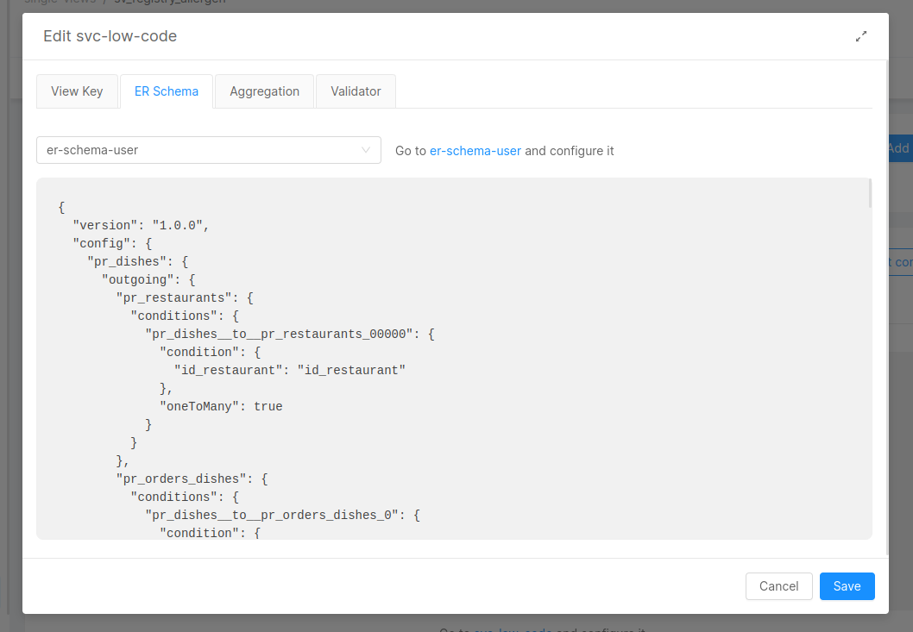

# Single View Creator concepts

The Single View Creator is the service that keeps the Single View updated with data retrieved from Projections. 
This service is available as a plugin or as a template:
- plugin: it allows you to use the Single View Creator as a black-box. You just need to configure it through the Config Maps and environment variables
- [template](#template): it gives you access to the source code of the Single View Creator, which will be hosted on a Git repository. You will need to update its dependencies and maintain the code. 

We strongly recommend using the plugin. The template is supposed to be used only for advanced use cases where the plugin cannot be used. 

Single View Creator plugin can be used in two modes:
- **Low Code**: it allows you to perform aggregation through JSON files without writing any Javascript code. If you need a custom behavior on a piece of aggregation you can still write your own code.
- **Manual**: it allows you to perform aggregation by writing your own Javascript code.

We recommend using the Low Code mode since it allows you to be faster and safer when aggregating your data. You will just need to think about the data and not the code for doing so.    
The Manual mode is supposed to be used only for cases where Low Code cannot be used, but this should rarely happen, since it is possible to write custom Javascript functions for specific pieces of aggregation also when using Low Code.

## Getting started

### Plugin

Go to the [Marketplace](/marketplace/overview_marketplace.md) and create a `Single View Creator` or `Single View Creator - Low Code` plugin. 
Go to the microservice page of the newly created Single View Creator and set the correct values to the environment variables containing a placeholder. 

## Template

Search in the [Marketplace](/marketplace/overview_marketplace.md) for a `Single View Creator - Template` and create it.
Then go to the microservice page of the newly created Single View Creator and set the correct values to the environment variables containing a placeholder. 
Click on the repository link in the microservice page and clone on your computer the repository.

:::info
You can use the template and all of Mia-Platform libraries **only under license**.
For further information contact your Mia Platform representative.
:::

### Code overview

The service starts in `index.js` file.
First, the template uses the [Custom Plugin Lib](/development_suite/api-console/api-design/plugin_baas_4.md) to instantiate a service.
Inside its callback, the `single-view-creator-lib` is initialized to deal with the complexity of the Fast Data components.

```js
const singleViewCreator = getSingleViewCreator(log, config, customMetrics)

await singleViewCreator
  .initEnvironment() // connect Mongo, Kafka and create the patient instance
service.decorate('patient', singleViewCreator.k8sPatient)
```

`config` is an object whose fields represent the [Microservice environment variables](/development_suite/api-console/api-design/services.md#environment-variable-configuration).

Some environment variables will be pre-compiled when you create the service from template, others won't, but they will still have a placeholder as value. Replace it with the correct value.

Now, we start the Single View Creator:

```js
const resolvedOnStop = singleViewCreator.startCustom({
  strategy: aggregatorBuilder(projectionsDB),
  mapper,
  validator,
  singleViewKeyGetter: singleViewKey,
  upsertSingleView: upsertFnSv(),
  deleteSingleView: deleteSV(),
})
```

- `strategy` is the function that performs the aggregation over the Projections
- `mapper` is the function that takes as input the raw aggregation result and maps the data to the final Single View
- `validator` is the validation function which determines if the Single View is valid (and thus inserted or updated in Mongo) or not (and thus deleted)
- `singleViewKeyGetter` is the function that, given the Projections changes identifier, returns the data used as selector to find the Single View document on Mongo to update or delete
- `upsertFnSv` is the function that updates or inserts the Single View to the Single Views collection on Mongo
- `deleteSingleView` is the function that deletes the Single View from the Single Views collection on Mongo. It uses the `deleteSV` function exported by the library.

:::note
The `deleteSV` function makes a *real delete* of the document on MongoDB. So, unlike the **Projections** deletion, it does *not* make a virtual delete.
:::

The value of `upsertFnSv` is based on the `UPSERT_STRATEGIES` environment variable. If its value is *update*, then the *updateOrInsertSV* function exported by the library is used, otherwise the function *replaceOrInsertSV* is used instead. The default upsert strategy is *replace*.

:::note
In the versions of the template prior to the `v3.1.0`, the UPSERT_STRATEGIES was missing, and it was used an alias function (*upsertSV*) of the *replaceOrInsertSV*.
:::

The Single View Creator needs to be stopped when the process is stopping. To do that, we use the `onClose` hook:

```js
service.addHook('onClose', async() => {
  log.fatal({ type: 'END' }, 'Single View Creator is stopping...')
  await singleViewCreator.stop()

  // this is a promise resolved when the infinite loop which processes the single views ends.
  // Here we wait for the resolving of the promise. You don't need to call it.
  await resolvedOnStop
  log.fatal({ type: 'END' }, 'Single View Creator stopped')
  await mongoClient.close()
})
```

## Environment Variables

| Name                                | Required | Description                                                                                                                                                                                                                                                                                                                                                                                                                                                                                                                 | Default value       |
| ----------------------------------- | -------- | --------------------------------------------------------------------------------------------------------------------------------------------------------------------------------------------------------------------------------------------------------------------------------------------------------------------------------------------------------------------------------------------------------------------------------------------------------------------------------------------------------------------------- | ------------------- |
| CONFIGURATION_FOLDER                | -        | Folder where configuration files are mounted                                                                                                                                                                                                                                                                                                                                                                                                                                                                                | /home/node/app/src/ |
| LOG_LEVEL                           | &check;  | Level to use for logging                                                                                                                                                                                                                                                                                                                                                                                                                                                                                                    | -                   |
| HTTP_PORT                           | -        | Port exposed by the service                                                                                                                                                                                                                                                                                                                                                                                                                                                                                                 | 3000                |
| TYPE                                | &check;  | Identifies the type of projection changes that need to be read. It should be the same as the Single View name you want to update.                                                                                                                                                                                                                                                                                                                                                                                           | -                   |
| SCHEDULING_TIME                     | -        | a quantity of time in milliseconds, every X milliseconds the service wake up and check if there are some projections changes in `NEW` state to work on. The service continue working until no more new projections changes are found, if so he goes to sleep for X milliseconds.                                                                                                                                                                                                                                            | 60000               |
| PROJECTIONS_MONGODB_URL             | &check;  | MongoDB connection string where projections are stored. Must be a valid uri                                                                                                                                                                                                                                                                                                                                                                                                                                                 | -                   |
| SINGLE_VIEWS_MONGODB_URL            | &check;  | MongoDB connection string where single view must be stored. Must be a valid uri                                                                                                                                                                                                                                                                                                                                                                                                                                             | -                   |
| PROJECTIONS_CHANGES_MONGODB_URL     | -        | The db from where projections changes are read. If not set, `PROJECTIONS_MONGODB_URL` is used.                                                                                                                                                                                                                                                                                                                                                                                                                              | -                   |
| PROJECTIONS_CHANGES_DATABASE        | &check;  | The db from where projections changes are read.                                                                                                                                                                                                                                                                                                                                                                                                                                                                             | -                   |
| PROJECTIONS_DATABASE                | &check;  | The db from where projections are read. If not set, `PROJECTIONS_CHANGES_DATABASE` is used.                                                                                                                                                                                                                                                                                                                                                                                                                                 | -                   |
| PROJECTIONS_CHANGES_COLLECTION      | -        | if you have set a custom projection change collection name from advanced, then set its name. Otherwise, it is `fd-pc-SYSTEM_ID` where `SYSTEM_ID` is the id of the System of Records this single view creator is responsible for.                                                                                                                                                                                                                                                                                           | -                   |
| SINGLE_VIEWS_DATABASE               | &check;  | The db from where single views are written.                                                                                                                                                                                                                                                                                                                                                                                                                                                                                 | -                   |
| SINGLE_VIEWS_COLLECTION             | &check;  | It must be equals to the Single View name the service is in charge of keeping updated.                                                                                                                                                                                                                                                                                                                                                                                                                                      | -                   |
| SINGLE_VIEWS_PORTFOLIO_ORIGIN       | &check;  | should be equals to the `SYSTEM_ID` you have set in `PROJECTIONS_CHANGES_COLLECTION`                                                                                                                                                                                                                                                                                                                                                                                                                                        | -                   |
| SINGLE_VIEWS_ERRORS_COLLECTION      | &check;  | Name of a MongoDB CRUD you want to use as collection for single view errors.                                                                                                                                                                                                                                                                                                                                                                                                                                                | -                   |
| KAFKA_CONSUMER_GROUP_ID             | -        | **@deprecated** - in favor of KAFKA_GROUP_ID. The Kafka consumer group identifier                                                                                                                                                                                                                                                                                                                                                                                                                                           | -                   |
| KAFKA_GROUP_ID                      | -        | defines the Kafka group id (it is suggested to use a syntax like ```{'{tenant}.{environment}.{projectName}.{system}.{singleViewName}.single-view-creator'}```)                                                                                                                                                                                                                                                                                                                                                              | -                   |
| KAFKA_CLIENT_ID                     | -        | The Kafka client identifier                                                                                                                                                                                                                                                                                                                                                                                                                                                                                                 | -                   |
| KAFKA_BROKERS_LIST                  | -        | **@deprecated** - in favor of KAFKA_BROKERS. list of brokers the service needs to connect to                                                                                                                                                                                                                                                                                                                                                                                                                                | -                   |
| KAFKA_BROKERS                       | -        | list of brokers the service needs to connect to                                                                                                                                                                                                                                                                                                                                                                                                                                                                             | -                   |
| KAFKA_SASL_MECHANISM                | -        | The Kafka SASL mechanism to be used. Can be one of the following: "plain", "PLAIN", "scram-sha-256", "SCRAM-SHA-256", "scram-sha-512", "SCRAM-SHA-512"                                                                                                                                                                                                                                                                                                                                                                      | plain               |
| KAFKA_SASL_USERNAME                 | -        | username to use for logging into Kafka                                                                                                                                                                                                                                                                                                                                                                                                                                                                                      | -                   |
| KAFKA_SASL_PASSWORD                 | -        | password to use for logging into Kafka                                                                                                                                                                                                                                                                                                                                                                                                                                                                                      | -                   |
| KAFKA_SVC_EVENTS_TOPIC              | -        | topic used to queue Single View Creator state changes (e.g. single view creation). This feature is deprecated in favor of KAFKA_SV_UPDATE_TOPIC and it will be removed soon                                                                                                                                                                                                                                                                                                                                                 | -                   |
| SEND_BA_TO_KAFKA                    | -        | true if you want to send to Kafka the `before-after` information about the update changes of the single view. This feature is deprecated in favor of ADD_BEFORE_AFTER_CONTENT using the 'sv-update' event and it will be removed soon                                                                                                                                                                                                                                                                                       | false               |
| KAFKA_BA_TOPIC                      | -        | topic where to send the `before-after` messages which represent the single view document before and after a change. This feature is deprecated in favor of ADD_BEFORE_AFTER_CONTENT using the 'sv-update' event and it will be removed soon                                                                                                                                                                                                                                                                                 | -                   |
| SEND_SV_UPDATE_TO_KAFKA             | -        | true if you want to send to Kafka the `sv-update` message about the update changes of the single view                                                                                                                                                                                                                                                                                                                                                                                                                       | false               |
| ADD_BEFORE_AFTER_CONTENT            | -        | true if you want to add the _before_ and _after_ content to the `sv-update` message, works only if `SEND_SV_UPDATE_TO_KAFKA` is set to true                                                                                                                                                                                                                                                                                                                                                                                 | false               |
| KAFKA_SV_UPDATE_TOPIC               | -        | topic where to send the `sv-update` message                                                                                                                                                                                                                                                                                                                                                                                                                                                                                 | -                   |
| UPSERT_STRATEGY                     | -        | (v3.1.0 or higher) Strategy name or file path to update/insert Single View records, for more info checkout [Upsert and Delete strategies](#upsert-delete-strategies).                                                                                                                                                                                                                                                                                                                                                       | replace             |
| DELETE_STRATEGY                     | -        | (v3.1.0 or higher) Strategy name or file path to delete Single View records, for more info checkout [Upsert and Delete strategies](#upsert-delete-strategies).                                                                                                                                                                                                                                                                                                                                                              | delete              |
| SINGLE_VIEWS_MAX_PROCESSING_MINUTES | -        | (v3.4.2 or higher) time to wait before processing again a Projection with state IN_PROGRESS                                                                                                                                                                                                                                                                                                                                                                                                                                 | 30                  |
| CA_CERT_PATH                        | -        | The path to the CA certificate, which should include the file name as well, e.g. `/home/my-ca.pem`                                                                                                                                                                                                                                                                                                                                                                                                                          | -                   |
| ER_SCHEMA_FOLDER                    | -        | The path to the ER Schema folder, e.g. `/home/node/app/erSchema`                                                                                                                                                                                                                                                                                                                                                                                                                                                            | -                   |
| AGGREGATION_FOLDER                  | -        | The path to the Aggregation folder, e.g. `/home/node/app/aggregation`                                                                                                                                                                                                                                                                                                                                                                                                                                                       | -                   |
| USE_AUTOMATIC                       | -        | Whether to use the low code architecture for the Single View Creator service or not                                                                                                                                                                                                                                                                                                                                                                                                                                         | -                   |
| PROJECTIONS_CHANGES_SOURCE          | -        | System to use to handle the Projection Changes, supported methods are KAFKA or MONGO                                                                                                                                                                                                                                                                                                                                                                                                                                        | MONGO               |
| KAFKA_PROJECTION_CHANGES_TOPICS     | -        | Comma separated list of projection changes topics                                                                                                                                                                                                                                                                                                                                                                                                                                                                           | -                   |
| KAFKA_PROJECTION_UPDATE_TOPICS      | -        | Comma separated list of projection update topics                                                                                                                                                                                                                                                                                                                                                                                                                                                                            | -                   |
| SV_TRIGGER_HANDLER_CUSTOM_CONFIG    | -        | Path to the config defining SV-Patch actions                                                                                                                                                                                                                                                                                                                                                                                                                                                                                | -                   |
| READ_TOPIC_FROM_BEGINNING           | -        | Available from v.5.5.0 of the Single View Creator Plugin. If set to true, the Single View Creator will start reading from messages in the Projection Changes topic from the beginning, instead of the message with the latest commmitted offset. This will happen only the first time connecting to the topic, and it has effect only if ```PROJECTIONS_CHANGES_SOURCE``` is set to <i>KAFKA</i>.                                                                                                                           | false               |
| USE_UPDATE_MANY_SV_PATCH            | -        | Use the MongoDB ```updateMany``` operation instead of the ```findOneAndUpdate``` with cursors in the sv patch operation. This will speed up the Single View creation/update process but it will not fire the kafka events of Single View Creation/Update. As a natural consequence, if enabled, the following environment vairables will be ignored: ```SEND_BA_TO_KAFKA```, ```KAFKA_BA_TOPIC```, ```SEND_SV_UPDATE_TO_KAFKA```, ```KAFKA_SV_UPDATE_TOPIC```, ```ADD_BEFORE_AFTER_CONTENT```, ```KAFKA_SVC_EVENTS_TOPIC``` | false               |
| KAFKA_CONSUMER_MAX_WAIT_TIME_MS     | -        | (v6.2.1 or higher) The maximum amount of time in milliseconds the server will block before answering the fetch request if there isn't sufficient data to immediately satisfy the requirement given by minBytes [1 byte]                                                                                                                                                                                                                                                                                                     | 500                 |
| SV_UPDATE_VERSION                   | -        | (v6.2.1 or higher) Define which version of the `sv-update` event should be emitted by the service. Accepted values are `v1.0.0` and `v2.0.0`. By default, for retro-compatibility, version `v1.0.0` is employed                                                                                                                                                                                                                                                                                                             | v1.0.0              |

If you do not want to use Kafka in the Single View Creator, you can just not set the environment variable *KAFKA_CLIENT_ID* or *KAFKA_BROKERS*. If one of them is missing, Kafka will not be configured by the service (requires *single-view-creator-lib* `v9.1.0` or higher)

## Attach to Single View

To simplify the configuration of the Single View Creator service, you can attach a service previously created from the marketplace to a Single View.

To do so, you must first create your Single View, update it with all the required configuration and then attach a _Single View Creator Service_ to it from the dedicated configuration page, that can be found inside the _Single View Creators_ tab.

:::info
You can even decide to attach more than one _Single View Creator_ service to a Single View. Every service will have its own configuration and will work separately.

You can attach as many services as you want, but you can attach one service only to one Single View.
:::

After the selection of a _Single View Creator_ service you can access to the configuration page, and configure the _ER Schema_, the _Aggregation_, add a _Validator_ file and the _Single View Key_.

Every update of these configuration will be reflected to the service config maps after saving the configuration.

:::warning
When a Single View Trigger Generator is attached to a Single View, the _ER Schema_, the _Aggregation_, the _Single View Key_ and the _Validator_ (if one) will be set in a _read-only_ mode.

If you prefer to manually configure these services, you can always detach the service in the _Single View Creator_ tab, by clicking the detach icon in the table of Single View Creators.
:::

## Upsert and Delete Strategies

The Single View Creator provides different ways to handle the upsert and delete of Single View records through the `UPSERT_STRATEGY` and `DELETE_STRATEGY` environment variables.
Most of the times one of the pre-configured strategies will be enough, but if it isn't you can also [customize them](#custom-functions) to your specific needs.

### Upsert

The available strategies for the upsert are the following:

- **replace**: Replaces the whole Single View record that matches the Single View Key with the new record from the aggregation. This is the default method.
- **update**: Updates or inserts the Single View record but does not replace it, meaning that any other properties that are not present in the `aggregation.json` will not be removed.

#### Replace vs Update

While the replace strategy covers every basic case, the update strategy provides a way to divide the aggregation effort between more than one Single View Creator.
For example, we have a Single View called posts with a relationship to comments:

```typescript [title="posts"]
{
  title: string,
  comments: {text: string}[]
}
```

And then we have two Single View Creators, each one configured with the `update` strategy to update only one of the fields.
The `aggregation.json` files would look like that:

```json [title="svc-1-aggregation.json"]
{
  "version": "1.3.0",
   "config": {
      "SV_CONFIG": {
         "dependencies": {
            "posts": {
               "type": "projection",
               "on": "_identifier",
            },
         },
         "mapping": {
            "title":"posts.title"
         }
      }
   }
}
```

```json [title="svc-2-aggregation.json"]
{
   "version": "1.3.0",
   "config": {
      "SV_CONFIG": {
         "dependencies": {
            "posts": {
               "type": "projection",
               "on": "_identifier"
            },
            "COMMENTS": {
               "type": "config"
            }
         },
         "mapping": {
            "comments": "COMMENTS"
         }
      },
      "COMMENTS": {
         "dependencies": {
            "comments": {
               "on": "posts_to_comments",
               "type": "projection"
            }
         },
         "joinDependency": "comments",
         "mapping": {
            "text": "comments.text"
         }
      }
   }
}
```

Now we only need to configure one of the Single View Creators to react to changes on the `posts` projection and the other one to the `comments` projection. This is specially useful when one of the computation efforts is much bigger than the other so it makes sense to dedicate a Single View Creator with more resources to deal with the workload and not block the queue for what could be faster aggregations.

So, at the end we will have the first Single View Creator with the first `aggregation.json` ( `svc-1-aggregation.json` ) above and the `UPSERT_STRATEGY` set to `update`. And the second Single View Creator with the second `aggregation.json` ( `svc-2-aggregation.json` ) and the `UPSERT_STRATEGY` also set to `update`.

### Delete

For the delete we offer the `delete` pre-configured strategy which [Hard deletes](https://www.becomebetterprogrammer.com/soft-delete-vs-hard-delete/#Hard_Delete) the Projection record when the Base Projection gets deleted. If you need a more complex deleting strategy we encourage you to take a look to the [Custom functions](#custom-functions) section.

### Custom functions

If you want, you can replace both upsert and delete functions with your own custom functions.

These functions represent the last step of the creation (or deletion) of a Single View, in which the Single View collection is actually modified.

In case the validation succeeds, the upsert function will be called with the following arguments:

- `logger` is the logger
- `singleViewCollection` is the Mongo collection object
- `singleView` is the result of the mapping operation
- `singleViewKey` is the Single View key

On the other hand, if the validation has a negative outcome, the delete function will be called with the same arguments, except for the `singleView`, which will not be handled by the delete function.

In both cases, some operation should be done on `singleViewCollection` in order to modify the Single View with the current `singleViewKey`, with the idea of "merging" the current result with the one already present in the database.

For example, we have a "Customer" Single View with a list of products the customer bought from different e-commerce websites, and we receive an update for a new object on a specific shop. In that case we don't want to replace the list of bought products with the last one arrived, but we want to push the product in the list in order to have the complete history of purchases.

For both functions, the output is composed of an object containing two fields:

- `old` which contains the old Single View
- `new` which contains the new Single View

These values will respectively be the `before` and the `after` of the message sent to the `KAFKA_BA_TOPIC` topic, which is the topic responsible for tracking any result of the Single View Creator. The naming convention for this topic can be found [here](/fast_data/inputs_and_outputs.md#single-view-before-after).

```js
async function upsertSingleViewFunction(
  logger,
  singleViewCollection,
  singleView,
  singleViewKey)
{
  logger.trace('Upserting Single View...')
  const oldSingleView = await singleViewCollection.findOne(singleViewKey)

  await singleViewCollection.replaceOne(
    singleViewKey,
    singleView,
    { upsert: true }
  )

  logger.trace({ isNew: Boolean(oldSingleView) }, 'Updated Single View')
  return {
    old: oldSingleView,
    new: singleView,
  }
}

async function deleteSingleViewFunction(
  logger,
  singleViewCollection,
  singleViewKey)
{
  logger.trace('Deleting Single View...')
  const oldSingleView = await singleViewCollection.findOne(singleViewKey)

  if (oldSingleView !== null) {
    try {
      await singleViewCollection.deleteOne(singleViewKey)
    } catch (ex) {
      logger.error(`Error during Single View delete: ${ex}`)
    }
  }

  logger.trace('Single view deletion procedure terminated')
  return {
    old: oldSingleView,
    new: null,
  }
}
```

#### Plugin

Add a config map to your service and put the Javascript files into it. These files should contain the custom function you want to use as upsert or delete function. 

For instance:

```js title="myDeleteFunction.js"
module.exports = async function myDeleteFunction(
  logger,
  singleViewCollection,
  singleViewKey)
{
  logger.trace('Checking if it can be deleted...')
  const oldSingleView = await singleViewCollection.findOne(singleViewKey)

  // my custom logic
  // do something...

  if (oldSingleView !== null) {
    
    try {
      await singleViewCollection.deleteOne(singleViewKey)
    } catch (ex) {
      logger.error(`Error during Single View delete: ${ex}`)
    }
  }

  logger.trace('Single view deletion procedure terminated')
  return {
    old: oldSingleView,
    new: null,
  }
}
```

Let's suppose that I put this file in a config map mounted on path `/home/node/app/my-functions`. Then, in order to use that, I need to set the `DELETE_STRATEGY` environment variable to `/home/node/app/my-functions/myDeleteFunction.js`. 

The same logic can be applied to upsert function, but setting the file path to the environment variable `UPSERT_STRATEGY`.

#### Template

You can choose to apply the same pattern used in plugin (by setting the environment variables) or to pass your custom functions directly to the `startCustom` method.

```js title="index.js" {6-7} showLineNumbers
const resolvedOnStop = singleViewCreator.startCustom({
  strategy: aggregatorBuilder(projectionsDB),
  mapper,
  validator,
  singleViewKeyGetter: singleViewKey,
  upsertSingleView: upsertFnSV,
  deleteSingleView: deleteSV,
})
```
## Consuming from Kafka

As you can see, the Single View Creator lets you configure what channel is used as input through the `PROJECTIONS_CHANGES_SOURCE` environment variable. The default channel is MongoDB for the [Projection Changes](/fast_data/inputs_and_outputs.md#projection-changes) but this might not always be what you need. The service gives you the alternative to listen from Apache Kafka instead, this can be useful in two different cases:

- You want to use the [Single View Trigger Generator](/fast_data/single_view_trigger_generator.md) to produce [`sv-trigger`](/fast_data/inputs_and_outputs.md#single-view-trigger-message) messages.
- You want to configure the [Single View Patch](#single-view-patch) cycle which reads [`pr-update`](/fast_data/inputs_and_outputs.md#projection-update-message) messsages from the Real-Time Updater.

In both of the cases you have to configure all the required environment variables related to kafka. First you need to configure the `KAFKA_BROKERS` and `KAFKA_GROUP_ID`, then you probably need to configure your authentication credentials with `KAFKA_SASL_MECHANISM`, `KAFKA_SASL_USERNAME` and `KAFKA_SASL_PASSWORD`.

Once this is done remember to set the `PROJECTIONS_CHANGES_SOURCE` environment variable to `KAFKA` and to check out the configuration page of the system you need to complete the necessary steps.

## Single View Key

The Single View Key is the Single View Creator part which identifies the Single View document that needs to be updated as consequence of the event that the service has consumed. 

To have more information on how to configure the Single View Key, please visit the [related section](/fast_data/configuration/config_maps/singleViewKey.md).

## ER Schema

The ER Schema defines the relationship between projections. [On the dedicated page in the Config Map section](/fast_data/configuration/config_maps/erSchema.md), you can find a deep explanation of how ER Schema configuration works and how to configure it.

### Selecting an ER Schema with the No Code

Your project might have enabled the possibility to configure ER Schemas with a No Code feature. In that case, the configuration section (where you usually would write the ER Schema) will show a drop-down menu where you can select one of the ER Schemas already configured on the [_ER Schemas page_](/fast_data/configuration/config_maps/erSchema.md#use-the-no-code). 



After selecting an ER Schema, the next configuration save will generate the Config Map of the ER Schema JSON taken from the one configured in the canvas. From now on, whenever the ER Schema is updated, the Config Map in the Single View Creator will be updated as well.

:::info
Starting from version `11.3.0`, it is also possible to select the ER Schema from the _Settings_ tab, inside the _General_ card.

Please remember that changing the ER Schema will cause the reset of the [Aggregation configuration](/fast_data/configuration/config_maps/aggregation.md).
:::

## Aggregation

The Aggregation is the Single View Creator part which aggregates Projections data and generates the Single View that is going to be updated. 

To have more information on how to configure the Aggregation, please visit the [related section](/fast_data/configuration/config_maps/aggregation.md).

:::note
Since version `v5.0.0` of the Single View Creator service and `v12.0.0` of the `@mia-platform-internal/single-view-creator-lib`, returning a Single View with the `__STATE__` field set from the aggregation will update the Single View to that state (among the other changes).   
This means, for instance, that if you set the `__STATE__` value to `DRAFT` in the `aggregation.json` in Low Code mode (or in the `pipeline.js` in Manual mode), the Single View updated will have the `__STATE__` field set to `DRAFT`.
Previously, the `__STATE__` field you returned was ignored, and the Single View would always have the `__STATE__` value set to `PUBLIC`.
:::

 ### Automatic generation of the Aggregation

 The Aggregation Configuration can be automatically generated started from an already existing ER Schema. This feature is accessible inside the page of the Single View Creator attached to your Single View (from the _Single View_ section select the Single View and, from the _Single View Creators_ tab select the service attached with the Aggregation to edit), by clicking on the dedicated button as you can see in the picture below. 


It is necessary to specify the base Projection from which the aggregation shall be generated. The base Projection is a projection that contains the fields that are going to be used as the identifiers for the Single View.

:::info
From version `11.3.0` of the console, your project might have enabled the No Code Aggregation: in this case the Automatic generation feature is included in the _Settings_ tab of the Single View Creator page.
:::

:::warning
The generated file will have a basic structure but it may not contain all the relationships needed or the desired structure, so please modify it to match the desired needs before using it.
:::

## Validator

The validation of a Single View determines what to do with the current update. If the Single View is determined as "non-valid", the delete function will be called. Otherwise, if the result of the validation is positive, it will be updated or inserted in the Single Views collection, through the upsert function. Delete function and upsert function will be explained in the next paragraph.

For this reason, the validation procedure should not be too strict, since a Single View declared as "invalid" would not be updated or inserted to the database. Rather, the validation is a check operation to determine if the current Single View should be handled with the upsert or delete functions.


By default, the validator always returns true. So we accept all kinds of Single Views, but, if you need it, you can set your own custom validator.

```js
// (logger: BasicLogger, singleView: Document) => Boolean
function singleViewValidator(logger, singleView) {
  ... checks on singleView

  // returns a boolean
  return validationResult
}
```

:::warning
When the update of an existing Single View is triggered and the validation has a negative outcome, the Single View won't be updated, and instead it will be deleted.
:::

### Plugin

Since version `v3.5.0`, it is possible to specify a custom validator function inside the configuration folder (`CONFIGURATION_FOLDER`).

The file must be named `validator.js` and must export a function that will take as arguments the same as the default validator explained above.

```js title="validator.js"
module.exports = function validator(logger, singleView) {
  ... custom validation logic on singleView

  // returns a boolean
  return customValidationResult
}
```

### Template

The `startCustom` function accepts a function in the configuration object called `validator`, which is the validation function.

The input fields of the validation function are the logger and the Single View, while the output is a boolean containing the result of the validation.

## Error handling

When generating a Single View, every error that occurs is saved in MongoDB, with a format that satisfies the schema requirements of the CRUD service, so that you can handle those errors using the Console. The fields of the error messages when they are first created are:

- `_id`: a unique identifier of the record, automatically generated
- `portfolioOrigin`: a value concerning the origin of the error, defaults to `UNKNOWN_PORTFOLIO_ORIGIN`
- `type`: the Single View type
- `identifier`: the id of the projection changes
- `errorType`: the error details
- `createdAt`: the time of creation
- `creatorId`: set to `single-view-creator`
- `__STATE__`: set to `PUBLIC`
- `updaterId`: set to `single-view-creator`
- `updatedAt`: the time of creation

It is highly recommended to use a TTL index to enable the automatic deletion of older messages, which can be done directly using the Console, as explained [here](/development_suite/api-console/api-design/crud_advanced.md#indexes).

## CA certs

Since service version `3.9.0`, you can set your CA certs by providing a path to the certification file in the environment variable `CA_CERT_PATH`.

## Single View Patch

:::info
This feature is supported from version `5.6.1` of the Single View Creator
:::

To configure a Single View Creator dedicated to [Single View Patch](/fast_data/configuration/single_views.md#single-view-patch) operations, some steps have to be followed:

* Set the env var `KAFKA_PROJECTION_UPDATE_TOPICS` with the comma separated list of the `pr-update` topics corresponding to the SV-Patch Projection.
* Configure the service to consume from Kafka (see the [Consuming from Kafka](#consuming-from-kafka) section)
* Set the env var `SV_TRIGGER_HANDLER_CUSTOM_CONFIG` with the path to the main file defining SV-Patches actions, for example `/home/node/app/svTriggerHandlerCustomConfig/svTriggerHandlerCustomConfig.json`
* Create a new ConfigMap with this Runtime Mount Path: `/home/node/app/svTriggerHandlerCustomConfig`

This last config map is composed by a main file, `svTriggerHandlerCustomConfig.json`, which defines where to read the Patch Action for each Projection.

It is structured as following: 

```json
{
  "patchRules": [
    {
      "projection": "projection_A",
      "patchAction": "__fromFile__[customPatchForA.js]"
    },
    {
      "projection": "projection_B",
      "patchAction": "__fromFile__[customPatchForB.js]"
    }
    // You can define more than one patch action for each projection too!
  ]
}
```

In the same config map, we have to insert the other files that are defined in the `patchRules` of the `svTriggerHandlerCustomConfig.json` (in the above example `customPatchForA.js` and `customPatchForB.js`).

They are structured as following:

```javascript
'use strict'

module.exports = (logger, projection) => {
  logger.info('Function custom patch for projection A')
  return {
    filter: { 'sv-field': projection['projection-field'] },
    update: { $set: { 'field-0': projection['changed-field'] } },
  }
}
```

Basically we can define any update operation we want. This operation will be performed on all the Single Views matching the filter.

### Filtering which elements to update inside arrays

If the update must happen inside an array, you'll probably need to filter which elements need to be updated. To do that you can use the `arrayFilters` option inside the `patchAction` Javascript file, which behaves exactly like the [`arrayFilters`](https://www.mongodb.com/docs/manual/reference/operator/update/positional-filtered/#---identifier--) option in a MongoDB operation.

Example of its usage:

```javascript
'use strict'

module.exports = (logger, projection) => {
  logger.info('Function custom patch for projection A')
  return {
    filter: { 'sv-field': 'someValue' }, // This can be an empty object if needed
    update: {
      $set: {
        "array-field.$[item-name].array-item-field": projection['changed-field']
      }
    },
    arrayFilters: [{
      "item-name.array-item-field-id": projection['projection-A-field-id']
    }]
  }
}
```

## Read from multiple databases

To read data from multiple databases you need to leverage on custom function from the mapping configuration.  
First of all, you need to create a config map and we suggest creating at least two files: one for the database connection and the other for custom functions.

The connection file could be like the following:

```javascript
// secondDB.js
const { MongoClient } = require('mongodb');

const url = '{{MONGODB_URL_2}}';
const client = new MongoClient(url);

let connected = false

module.exports = async function (){
    if (!connected) {
        await client.connect();
        connected = true
    }
    return client
}
```

The above code uses the database driver and exports a function to retrieve the connected client.  
This module works like a singleton, indeed the client is created once and the state, e.g. the `connected` variable, lives for the entire duration of the Node.js process (remember that `require` a module is always evaluated once by Node.js).  
Because this is a config map, the `{{MONGODB_URL_2}}` will be interpolated at deploy time. Remember to set it up in the environment variables section.


Then in a custom function file, you can retrieve the connected client and use it for reading data:

```javascript
// fieldFromSecondDB.js
const getClient = require('./secondDB.js')

module.exports = async function (logger, db, dependenciesMap){
    const client = await getClient()
    return client.db().collection('collection').findOne();
}
```

Finally, you can use the custom function in the mapping configuration:

```json
{
   "version":"1.1.0",
   "config":{
      "SV_CONFIG":{
         "dependencies":{
            "PEOPLE":{
               "type":"projection",
               "on":"_identifier"
            },
            "MARRIAGE":{
               "type":"projection",
               "on":"PEOPLE_TO_MARRIAGE"
            },
            "PEOPLE":{
               "type":"projection",
               "on":"MARRIAGE_b_TO_PEOPLE"
            }
         },
         "mapping":{
            "name":"PEOPLE.name",
            "marriedWith":"PEOPLE.name",
            "fieldFromSecondDB":"__fromFile__[fieldFromSecondDB]"
         }
      }
   }
}
```
