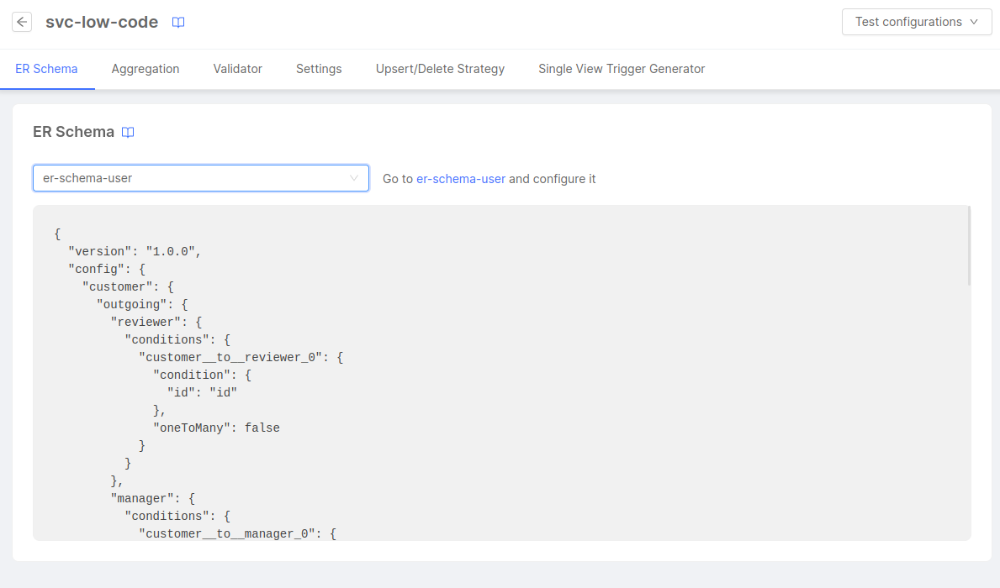

Single View Creator plugin can be used in two modes:
- **Low Code**: it allows you to perform aggregation through JSON files without writing any Javascript code. If you need a custom behavior on a piece of aggregation you can still write your own code.
- **Manual**: it allows you to perform aggregation by writing your own Javascript code.

:::info
We recommend using the Low Code mode since it allows you to be faster and safer when aggregating your data. You will just need to think about the data and not the code for doing so. 

The Manual mode is supposed to be used only for cases where Low Code cannot be used, but this should rarely happen, since it is possible to write custom Javascript functions for specific pieces of aggregation also when using Low Code.
:::

## Getting started

Go to the [Marketplace](/marketplace/overview_marketplace.md) and create a `Single View Creator` or `Single View Creator - Low Code` plugin. 
Go to the microservice page of the newly created Single View Creator and set the correct values to the environment variables containing a placeholder. 

## Attaching a Service to a Single View

To simplify the configuration of the Single View Creator service, you can attach a service previously created from the marketplace to a Single View.

Here's how you can do it:

1. In the _Microservices_ section, create your _Single View Creator Low Code_ service.
2. Create your Single View and update it with all the required configurations.
3. Attach the _Single View Creator Service_ to the Single View from the dedicated configuration page located within the _Single View Creators_ tab.

:::info
You can attach more than one _Single View Creator Service_ to a Single View, and each service will have its own configuration and operate independently.

You can attach as many services as you need, but remember that you can attach one service to only one Single View.
:::

After selecting a _Single View Creator Service_, you can access the configuration page and set up the following:

- The _ER Schema_
- The _Aggregation_
- Add a _Validator_ file
- The _Upsert/Delete Strategy_;
- The _Single View Key_ (from the _Settings_ tab)
- The _Single View Trigger Generator_ (more information in the [related page](/fast_data/configuration/single_view_trigger_generator.md#attach-a-service-to-a-single-view))

Any updates to these configurations will be reflected in the service's configuration maps once you save the changes.

:::warning
When a Single View Trigger Generator is attached to a Single View, the _ER Schema_, _Aggregation_, _Single View Key_, and the _Validator_ (if present) will become "read-only."

If you prefer to manually configure these services, you can detach the service in the _Single View Creator_ tab by clicking the detach icon in the Single View Creators table.
:::


## Single View Key

The Single View Key is the Single View Creator part which identifies the Single View document that needs to be updated as consequence of the event that the service has consumed. 

To have more information on how to configure the Single View Key, please visit the [related section](/fast_data/configuration/config_maps/singleViewKey.md).

## ER Schema

The ER Schema defines the relationship between projections. [On the dedicated page in the Config Map section](/fast_data/configuration/config_maps/erSchema.md), you can find a deep explanation of how ER Schema configuration works and how to configure it.

### Selecting an ER Schema with the No Code

Your project might have enabled the possibility to configure ER Schemas with a No Code feature. In that case, the configuration section (where you usually would write the ER Schema) will show a drop-down menu where you can select one of the ER Schemas already configured on the [_ER Schemas page_](/fast_data/configuration/config_maps/erSchema.md#use-the-no-code). 



After selecting an ER Schema, the next configuration save will generate the Config Map of the ER Schema JSON taken from the one configured in the canvas. From now on, whenever the ER Schema is updated, the Config Map in the Single View Creator will be updated as well.

:::info
It is also possible to select the ER Schema from the _Settings_ tab, inside the _General_ card.

Please remember that changing the ER Schema will cause the reset of the [Aggregation configuration](/fast_data/configuration/config_maps/aggregation.md).
:::

## Aggregation

The Aggregation is the Single View Creator part which aggregates Projections data and generates the Single View that is going to be updated. 

To have more information on how to configure the Aggregation, please visit the [related section](/fast_data/configuration/config_maps/aggregation.md).

:::note
Since version `v5.0.0` of the Single View Creator service and `v12.0.0` of the `@mia-platform-internal/single-view-creator-lib`, returning a Single View with the `__STATE__` field set from the aggregation will update the Single View to that state (among the other changes).   
This means, for instance, that if you set the `__STATE__` value to `DRAFT` in the `aggregation.json` in Low Code mode (or in the `pipeline.js` in Manual mode), the Single View updated will have the `__STATE__` field set to `DRAFT`.
Previously, the `__STATE__` field you returned was ignored, and the Single View would always have the `__STATE__` value set to `PUBLIC`.
:::

 ### Automatic generation of the Aggregation

 The Aggregation Configuration can be automatically generated started from an already existing ER Schema. This feature is accessible inside the page of the Single View Creator attached to your Single View (from the _Single View_ section select the Single View and, from the _Single View Creators_ tab select the service attached with the Aggregation to edit), by clicking on the dedicated button as you can see in the picture below. 


It is necessary to specify the base Projection from which the aggregation shall be generated. The base Projection is a projection that contains the fields that are going to be used as the identifiers for the Single View.

:::info
In case your project might have enabled the No Code Aggregation: in this case the Automatic generation feature is included in the _Settings_ tab of the Single View Creator page.
:::

:::warning
The generated file will have a basic structure but it may not contain all the relationships needed or the desired structure, so please modify it to match the desired needs before using it.
:::

## Validator

:::info
If no validation function has been defined, all aggregation outcomes will be stored to the output collection.
:::

The validation is an additional check operation that can be added to determine if the current Single View should be handled with [either upsert or delete functions](/fast_data/configuration/single_view_creator/upsert_delete_strategies.md). 

:::warning Default Behavior
When the update of an existing Single View is triggered and the validation has a negative outcome, the Single View won't be updated, and instead it will be deleted.
:::

It is possible to enable and modify the validation in your Single View Creator configuration accessing to the _Validator_ tab of the Single View Creator attached to a Single View: it will show an editor where it will be possible to modify the validator. 

If the function does not exist yet, a placeholder will allow you to create a new validator function that will include a function that will always return _true_, ready to be modified according to your needs.

In any case, the function should follow this structure:

```js title="validator.js"
module.exports = function validator(logger, singleView) {
  // ... custom validation logic on singleView
  // returns a boolean
  return customValidationResult
}
```

## Upsert and Delete Strategies

It is possible to configure the [upsert strategy and the delete strategy](/fast_data/configuration/single_view_creator/upsert_delete_strategies.md) on the related tab inside the configuration page of the Single View Creator attached to the Single View.


You can select between the three available options for the upsert strategy (_Update_, _Replace_ or _Custom_) and for the delete strategy (_Delete_, _Virtual Delete_ or _Custom_).

In case the _Custom_ options is selected for the upsert and/or the delete strategy, an editor will appear just below with the existing configuration (if there's one) or a template code.

After saving the configuration, the selected strategies will be applied to the related environment variables `UPSERT_STRATEGY` and `DELETE_STRATEGY`. The eventually needed custom functions will be automatically included in a config map.


