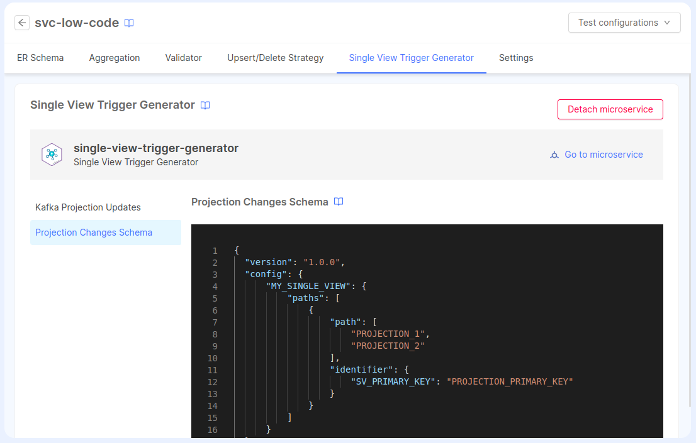

The Single View Trigger Generator has 3 fundamental parts:

- The consumption of pr-update messages
- The strategy execution
- The production of `sv-trigger` messages or `pc` records

For each part we will need to configure a set of [environment variables](#environment-variables) and [config maps](#config-maps).

## Environment variables

The following table indicates all the available environment variables for you to customize the service to your needs.

:::note
When creating the service from the marketplace the following environment variables will be added for you with some default values but you still need to properly update them to make the service work
:::

| Name                             | Required | Description                                                                                                                                                                                             | Default value |
|----------------------------------|----------|---------------------------------------------------------------------------------------------- |---------------|
| LOG_LEVEL                        | &check;  | Level to use for logging; to choose from: error, fatal, warn, info, debug, trace, silent                                                                                                                | silent        |
| MONGODB_URL                      | &check;  | MongoDB URL where the projections are stored                                                                                                                                                            | -             |
| MONGODB_NAME                     | &check;  | MongoDB Database name where the projections are stored                                                                                                                                                  | -             |
| EVENT_STORE_CONFIG_PATH          | &check;  | Path to the [Event Store Config](#event-store-config) file                                                                                                                                              | -             |
| EVENT_STORE_TARGET               | &check;  | Kafka topic to send the `sv-trigger` messages or MongoDB collection to save the `pc` records                                                                                                            | -             |
| SINGLE_VIEW_NAME                 | &check;  | The name of the Single View                                                                                                                                                                             | -             |
| KAFKA_PROJECTION_UPDATES_FOLDER  | &check;  | Path to the [Kafka Projection Updates](#kafka-projection-updates) folder                                                                                                                                | -             |
| ER_SCHEMA_FOLDER                 | &check;  | Path to the [ER Schema](#er-schema) folder                                                                                                                                                              | -             |
| PROJECTION_CHANGES_SCHEMA_FOLDER | &check;  | Path to the [Projection Changes Schema](#projection-changes-schema) folder                                                                                                                              | -             |
| MANUAL_STRATEGIES_FOLDER         | -        | Path to the custom strategies folder where the custom strategies scripts are stored                                                                                                                     | -             |
| TRIGGER_CUSTOM_FUNCTIONS_FOLDER  | -        | Path to the custom functions folder used in `__fromFile__` values                                                                                                                                       | ''            |

## Attaching a Service to a Single View

:::info
This feature is available from version `v.11.8.0` of Mia-Platform Console.
:::

To simplify the configuration of the Single View Trigger Generator service, you can attach a previously created Single View Trigger Generator service from the marketplace to a Single View.

Here's how to do it:

First, create your Single View and attach a _Single View Creator Service_ to it [from the dedicated configuration page](/fast_data/configuration/single_view_creator.md#attach_to_single_view). This is necessary because the Single View Trigger Generator can work with only one Single View Creator Service.

Within the _Single View Creator_ tab of the _Single View_ modal, enter the configuration page of the Single View Creator that you've configured. Next, select the _Single View Trigger Generator_ tab. Here, you can choose a Single View Trigger Generator from the available configurations. After selecting it, you can modify the configuration of two configMaps: the _Projection Changes Schema_ and the _Kafka Projection Updates_.



Any updates to these configurations will be reflected in the service config maps after saving the configuration.

Additionally, when a service is attached to a Single View, the _ER Schema_ config map will be automatically updated to match the _ER Schema_ applied to the associated Single View Creator. Also, the environment variable `SINGLE_VIEW_NAME` will be set automatically to the name of the Single View.

:::warning
When a Single View Trigger Generator is attached to a Single View, the environment variable `SINGLE_VIEW_NAME` will be set to "read-only" mode, as well as the config maps for the _ER Schema_, _Projection Changes Schema_, and _Kafka Projection Updates_.

If you prefer to manually configure these services, you can always detach the service in the _Single View Trigger Generator_ tab by clicking the small "x" icon next to the service name inside the dropdown menu.
:::

## config maps

The service can use the following 3 config maps:

:::note
When creating the service from the marketplace the following config maps will be created for you with some default values. The _Event Store Config_ must be manually modified from the _Microservice_ page to include all the missing configuration, but the _ER Schema_, the _Projection Changes Schema_ and the _Kafka Projection Updates_ configuration can be simplified by attaching the service to a Single View: in this case, the environment variables and config maps for these three config maps will be automatically managed by the application.
:::

### ER Schema

The ER Schema config map contains the `erSchema.json` file which describes the relationships between each projection of the [System of Records](/fast_data/the_basics.md#system-of-records-sor).

Remember to copy/paste the mount path into the `ER_SCHEMA_FOLDER` environment variable so the service can read the file.
To know more on how to configure the file please go to the [ER Schema](/fast_data/configuration/config_maps/erSchema.md) page.

### Projection Changes Schema

The Projection Changes Schema config map contains the `projectionChangesSchema.json` file which defines how to get to the base projection of the single view starting from the projection in which we received the ingestion message. 

Remember to copy/paste the mount path into the `PROJECTION_CHANGES_SCHEMA_FOLDER` environment variable so the service can read the file.
If you need more info on how to configure the `projectionChangesSchema.json` file, please refer to the [Projection Changes Schema](/fast_data/configuration/config_maps/projection_changes_schema.md) page.

### Kafka Projection Updates

The Kafka Projection Updates config map contains the `kafkaProjectionUpdates.json` file which defines the topics from where to consume the [Projection Updates](/fast_data/inputs_and_outputs.md#projection-update) and the strategy to apply to each message.

Remember to copy/paste the mount path into the `KAFKA_PROJECTION_UPDATES_FOLDER` environment variable so the service can read the file.
If you need more info on how to configure the `kafkaProjectionUpdates.json` file, please refer to the [Kafka Projection Updates](/fast_data/configuration/config_maps/kafka_projection_updates.md) page.

:::warning
If you attach the service to a Single View, the _Kafka Projection Updates_ config map can be modified to support *only* automatic strategies.

If you need to use manual strategies for one or more projections, please detach the service and configure the config maps from the _Microservices_ page.
:::

### Event Store Config

The `Event Store Config` is a JSON file containing the configuration of the consumer and producer of the service itself and it has the following format:

```json
{
  "consumer": {
    "kafka": {
      // Kafka consumer configuration (see below)
    }
  },
  "producer": {
    "<kafka | mongo>": {
      // Kafka or mongo producer configuration (see below)
    }
  }
}
```

:::caution
Mind that only one producer and consumer must be configured at a time so the service knows which kind to use. Providing more than one consumer or producer will fail the configmap validation and shut down the service at start up.
:::

**Consumers**

At the moment you can only configure your consumer with kafka which will read `pr-update` messages from the Real-Time Updater. To configure it you must follow the JsonSchema specification below.

<details><summary>Kafka consumer config JsonSchema</summary>
<p>

```json
{
  "type": "object",
  "required": [
    "brokers",
    "consumerGroupId"
  ],
  "properties": {
    "brokers": {
      "type": "string"
    },
    "consumerGroupId": {
      "type": "string"
    },
    "consumeFromBeginning": {
      "type": "boolean",
      "description": "specify whether the consumer group should start to consume from the beginning of the topic whenever the group id is created for the first time",
      "default": false
    },
    "ssl": {
      "description": "https://kafka.js.org/docs/configuration#ssl",
      "oneOf": [
        {
          "type": "boolean"
        },
        {
          "type": "object",
          "additionalProperties": true,
          "properties": {
            "ca": {
              "type": "string",
              "description": "path to the file containing the CA certificate in PEM format"
            },
            "key": {
                "type": "string",
              "description": "path to the file containing the client private key in PEM format"
            },
            "passphrase": {
              "type": "string",
              "description": "password necessary to unlock the private key"
            },
            "cert": {
              "type": "string",
              "description": "path to the file containing the client certificate in PEM format"
            }
          }
        }
      ]
    },
    "sasl": {
      "type": "object",
      "properties": {
        "mechanism": {
          "type": "string",
          "enum": [
            "plain",
            "scram-sha-256",
            "scram-sha-512"
          ]
        },
        "username": {
          "type": "string"
        },
        "password": {
          "type": "string"
        }
      }
    },
    "clientId": {
      "type": "string"
    },
    "connectionTimeout": {
      "type": "number"
    },
    "authenticationTimeout": {
      "type": "number"
    },
    "reauthenticationThreshold": {
      "type": "number"
    },
    "requestTimeout": {
      "type": "number"
    },
    "enforceRequestTimeout": {
      "type": "boolean"
    },
    "retry": {
      "type": "object",
      "properties": {
        "maxRetryTime": {
          "type": "number"
        },
        "initialRetryTime": {
          "type": "number"
        },
        "factor": {
          "type": "number"
        },
        "multiplier": {
          "type": "number"
        },
        "retries": {
          "type": "number"
        }
      }
    },
    "logLevel": {
      "type": "string",
      "enum": [
        "NOTHING",
        "ERROR",
        "WARN",
        "INFO",
        "DEBUG"
      ]
    }
  }
}
```

</p>
</details>

**Producers**

For the producers you can choose between two options: Kafka or MongoDB ([`sv-trigger` vs. `pc`](/fast_data/single_view_trigger_generator.md#sv-trigger-vs-pc)).
With MongoDB you will save Projection Changes on the DB just like the Real-Time Updater does. With Kafka instead it will send `sv-trigger` messages which will also be read by the Single View Creator by changing its configuration to do so. Here's the configuration specification for both:

<details><summary>MongoDB producer config JsonSchema</summary>
<p>

```json
{
  "type": "object",
  "required": ["url", "dbName"],
  "properties": {
    "url": {
      "type": "string"
    },
    "dbName": {
      "type": "string"
    }
  }
}
```
</p>
</details>

<details><summary>Kafka producer config JsonSchema</summary>
<p>

```json
{
  "type": "object",
  "required": ["brokers"],
  "properties": {
    "brokers": {
      "type": "string"
    },
    "ssl": {
      "description": "https://kafka.js.org/docs/configuration#ssl",
      "oneOf": [
        {
          "type": "boolean"
        },
        {
          "type": "object",
          "additionalProperties": true,
          "properties": {
            "ca": {
              "type": "string",
              "description": "path to the file containing the CA certificate in PEM format"
            },
            "key": {
              "type": "string",
              "description": "path to the file containing the client private key in PEM format"
            },
            "passphrase": {
              "type": "string",
              "description": "password necessary to unlock the private key"
            },
            "cert": {
              "type": "string",
              "description": "path to the file containing the client certificate in PEM format"
            }
          }
        }
      ]
    },
    "sasl": {
      "type": "object",
      "properties": {
        "mechanism": {
          "type": "string",
          "enum": ["plain", "scram-sha-256", "scram-sha-512"]
        },
        "username": {
          "type": "string"
        },
        "password": {
          "type": "string"
        }
      }
    },
    "clientId": {
      "type": "string"
    },
    "connectionTimeout": {
      "type": "number"
    },
    "authenticationTimeout": {
      "type": "number"
    },
    "reauthenticationThreshold": {
      "type": "number"
    },
    "requestTimeout": {
      "type": "number"
    },
    "enforceRequestTimeout": {
      "type": "boolean"
    },
    "retry": {
      "type": "object",
      "properties": {
        "maxRetryTime": {
          "type": "number"
        },
        "initialRetryTime": {
          "type": "number"
        },
        "factor": {
          "type": "number"
        },
        "multiplier": {
          "type": "number"
        },
        "retries": {
          "type": "number"
        }
      }
    },
    "logLevel": {
      "type": "string",
      "enum": ["NOTHING", "ERROR", "WARN", "INFO", "DEBUG"]
    }
  }
}
```
</p>
</details>

An example of a complete configuration would be:

```json
{
  "consumer": {
    "kafka": {
      "brokers": "localhost:9092,localhost:9093",
      "clientId": "client-id",
      "consumerGroupId": "group-id",
      "consumeFromBeginning": true,
      "logLevel": "NOTHING"
    }
  },
  "producer": {
    "mongo": {
      "url": "mongodb://localhost:27017",
      "dbName": "pc-sv-books-test"
    }
  }
}
```
