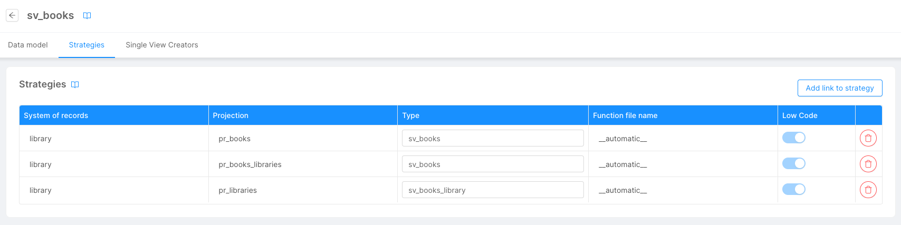

In this document we guide you through the configuration of [Strategies](/fast_data/concepts/the_basics.md#strategies) directly in the Console.

## Write your strategy

The strategy functions can be executed either by:

- the _Real-Time Updater_, by the usage of the [Projection Changes Schema configuration](/fast_data/configuration/realtime-updater/configuration-files.md#projection-changes-schema);
- the _Single View Trigger Generator_, by the usage of either the [Projection Changes Schema configuration](/fast_data/configuration/single_view_trigger_generator.mdx#projection-changes-schema) or the [Kafka Projection Updates Configuration](/fast_data/configuration/single_view_trigger_generator.mdx#kafka-projection-updates).

### Technical limitation

In your custom files you can import only the node modules present in the following list:

- [lodash.get](https://github.com/lodash/lodash/tree/4.4.2-npm-packages/lodash.get)
- [mongodb](https://mongodb.github.io/node-mongodb-native/4.15/)
- [ramda](https://ramdajs.com/docs/)

## Strategies type

:::warning
This information are valid only when using a [Real-Time Updater](/fast_data/configuration/realtime-updater/realtime-updater.md) with **Projection Changes**.
:::

Each strategy is associated with a **type**, which usually (and by default) corresponds to the name of the Single View for which it is configured. When using a Real-Time Updater with Projection Changes, this type should match the one declared in the `TYPE` environment variable of the Single View Creator(s) associated with the Single View. The reason is that, behind the hood, the strategy type is written in the Projection Changes record by the Real-Time Updater and the Single View Creators will discern which records to process based on it.

There may be scenarios in which you want more than one Single View Creator associated with the same Single View, to process Projection Changes records with different types (as explained [here](/fast_data/faq/parallel_svc.md)): this may happen, for example, to isolate a critical flow in which one projection concurring in a Single View is updated much more often than the others, needing a dedicated set of services to ensure maximum efficiency.

To achieve this separation, one can use the **Type field** of the strategies table in the Single View details page to associate a specific type to a subset of strategies.

:::caution
For the flow to work correctly, the types declared in the strategies table should match the type of at least one of the Single View Creators associated with the Single View, and viceversa.
:::