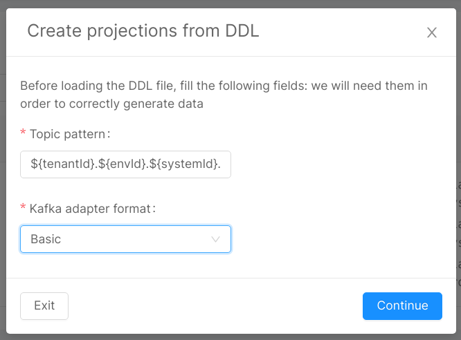

## Create a System of Records

To create a projection, you should create a System of Records. This is the data source which updates the projections.

To do so, open the **Projections** section in the fast data group of Mia-Platform Console. Then, select the create button.

The creation of a System of Records requires you to insert a system ID which is useful to recognize the system, and to choose if you want to set the Real Time Updater [manually](./real_time_updater/manual-configuration) or with [Low Code](./real_time_updater/low-code-configuration) configuration.

## Delete a System of Records

To delete a System of Records, you have to click the Delete button in the bottom-right corner of the System of Records detail page.  
The deletion is not allowed until you have at least one Projection inside the System, hence you need to delete all the projections in a System before being able to delete it.  

## Projections Changes

When a projection is updated, the Real-Time Updater changes a collection called, by default, `fd-pc-SYSTEM_ID` where `SYSTEM_ID` is the name of the System of Records which the Real-Time Updater belongs to. It inserts into it the information about the updated document.

:::caution
The default Projection Changes collection is automatically managed by the Console, and it does not support the utilization of custom indexes. If you need to take advantage of them to speed up your queries, you need to use a [custom projection changes collection](./real_time_updater/manual-configuration#custom-projection-changes-collection).
:::

One Projections Changes collection is created for each System of Records as default.

This collection will be used by the Single View Creator to know which single view needs an update. It is the connection between projections and single view.

:::note
When you delete a System of Records, the *Projections Changes* collection linked to it will be deleted as well, because it is no more useful.
:::

## Create a Projection

To create a projection using the Console, select the System of Records from which the projection is taken.
In the System of Records detail, search for the `Projections` card and click on the create button.
Here, you can insert the name of your projection.

:::info
The projection name is used as MongoDB collection name.
:::

To view the details of a projection, click on the arrow button at the end of the table row.

### Kafka topics

Once in the projection detail page, there is a card with detail of `Kafka topics`.
Here, you can modify the default name of the topics per environment.
The topics names are pre-compiled with our suggested name:

```txt
projectId.environmentId.projectionName-json
```

Where `projectId`, `environmentId` and `projectionName` are filled with, respectively, the id of the console project, the id of the associated environment and the name of the projection.

### Projection metadata

A projection has the [predefined collection properties](../runtime_suite/crud-service/overview_and_usage#predefined-collection-properties) which are required for the `Crud Service`, which is the service responsible for creating the collection on MongoDB.

These fields cannot be deleted and only the `_id` field is editable. You cannot add custom fields to the metadata.  

These fields have no `Cast function` assigned because they are not used for mapping of fields from the Kafka Message received. This means that if the Kafka Message contains a field with the same name as one of the metadata fields, it is not copied on the projection.

### Projection fields

In the card `Fields` in projection, you can add new fields.

Once you click the `Create field` button, a form is prompted where you should insert the following fields (all fields are required):

* `Name`: name of the projection field;
* `Type`: one of `String`, `Number`, `Boolean`, `Date`, `Object`, `Array of object`, `Array of number`, `Array of string`, `ObjectId` or `GeoPoint`
* `Cast function`: it shows the possible [Cast Function](cast_functions) to select for the specified data type;
* `Required`: set the field as required, default to false;
* `Nullable`: declare field as nullable, default to false.
* `Primary Key`: set the field as part of the primary key, default to false.

It's **mandatory** to set at least one Primary Key for each Projection. Otherwise, you will not be able to save your configuration.

:::caution
Setting the Primary Keys does **not** create automatically the unique indexes. You need to create them by yourself.
:::

:::caution
When the `real-time updater` deletes a projection document, it actually makes a **virtual delete** instead of real document deletion. This means that the document is actually kept in the database, but the `__STATE__` field (one of the default fields of the `Crud Service`) is set to `DELETED`.
:::

#### Generate projection fields from data sample

In the card `Fields` in projection, you can upload a data sample to generate fields by clicking on the appropriate button. Doing this will replace the current fields with those contained within the file.
The supported file extension are: `.csv` and `.json`.

Example json

```json
[
  {
    "field1": "anyString",
    "field2": "true",
    "field3": "123"
  }
]
```

Example CSV

```csv
field1,field2,field3
false,anyString,123
```

At the end of the upload an internal function will try to cast the types correctly, otherwise it will treat them as strings by default.

:::note
Import of fields is supported only for the following data types: `String`, `Number`, `Boolean` or `Date`. For example, you cannot import fields of type object.
:::

:::caution
You cannot import fields with the same name as one of the metadata fields.
:::

### Indexes

In the card `Indexes`, you can add indexes to the collection. To learn more about crud indexes, [click here](../runtime_suite/crud-service/overview_and_usage#indexes).
However, differently from Indexes that can be created on a normal CRUD, in this section the `Geo` index type is not available.

An `_id` index is created by default, and it is not deletable.

Both custom fields and metadata can be used as fields for indexes.

#### Primary Key Index Automation

An automation on the primary key index is available in the console. If enabled, the automation will update a primary key index, starting either from an index of your choice, or a newly generated one named `primary_key_index`.

:::info
A primary key index is an index made up of all the projection fields that are marked as primary keys, and no other field.
:::

From the Console, you can change your preferences about primary key index automation by selecting a different index to be marked as primary key index, and by turning the functionality on or off.
When the automation is on, the index will be updated only after you change the fields of the projection.

:::caution
In order for the Real Time Updater to correctly update its projections two actions are necessary:

* You should define at least one custom field with flags **Primary Key** and **Required** set to true in the `Fields` card.
* Then, you should create an index using the previously defined custom field and set to true the index **unique** flag.

In this way, the Real Time Updater updates the projection document with the correct primary key value instead of creating a new document.
:::

### Import multiple projections from a DDL file

Most DBMSes have some way of exporting the database schema, producing a DDL file that contains a sequence of statements like `CREATE_TABLE`, `ALTER_TABLE`, and `CREATE_INDEX`. With this kind of file, the Console can create multiple projections for a given System of Records, which creates a set of projections with the following information:

* All the fields (both custom and default); the custom fields can only have type `number` or `string`. All the numeric types will be converted to `number`, every other SQL type will be converted to `string`.
* All the indexes specified in the DDL, plus a primary key index that will be automatically generated if not already present.

#### Importing - step 1

To start importing projections from a DDL, you need to go to the Design Area, Projections Section, and create or edit a System of Records. Once there, in the top right corner you will find an import button, which will open a Modal that will guide you through the import process.

On the first page, you will need to provide two information:

##### Topic pattern

The topic pattern is a template string that will be interpolated for each combination of environment and projection to generate the topic prefixes. The syntax used is the same of the intuitive [javascript template strings](https://developer.mozilla.org/en-US/docs/Web/JavaScript/Reference/Template_literals), with the following variables:

* projectId
* projectionId
* envId

The default value for this input is the same as the default used by the Console, which is `${projectId}.${envId}.${projectionId}-json`.

##### Kafka adapter format

Either `Basic`, `Golden Gate`, or `Custom`. [Click here](real_time_updater/manual-configuration#kafka-messages-format) for more detail about the Kafka adapter formats.



#### Importing - step 2

The second page lets you upload the DDL file, and provides information about the supported SQL dialects, which are:

* MySQL / MariaDB
* MSSQL
* Oracle
* PostgreSQL
* SQLite

:::caution
Keep in mind that `supported` means you will be able to generate projections correctly, but the fields types will only be either `number` or `string`.
:::


#### Importing - step 3

In the last step you will be presented with a recap of what you are about to import. A tree view of projections will be displayed, each projection having fields and indexes as children. For fields, only the names of the custom fields will be displayed, and for the indexes only the name of the indexes.
This page will also warn you about possible problems in the configuration, so read the warnings carefully and remember to take action when needed (e.g. missing primary key).

When you click continue, the console will generate the new configuration for the System, which you can explore the result of the import directly from the console. If you are happy with the result as it is, you can directly commit, and it will be saved in the configuration, otherwise you can freely edit the generated projections as you normally do, and then commit. Any previous Projections with different name will remain untouched, while projections with the same name will be overwritten.


### Expose projections through API

You can expose a projection through API, only with `GET` method (the data in the projection are modifiable only by the Real Time Updater service).

To expose the Fast Data projection, [create an Endpoint](../development_suite/api-console/api-design/endpoints) with type `Fast Data Projection` linked to the desired projection.

You can expose a projection on a CMS page to help you review the data inside the collection, follow [Configure CMS extensions](../business_suite/cms_configuration/conf_cms#configure-pages).

:::info
The exposed API is not required for Fast Data to work. It is an optional behavior in case you need access to the data without directly accessing it from the database.
:::

## Technical limitation

In your custom files (e.g. `kafka-adapters`) you can import only the node modules present in the following list:

* [lodash.get](https://github.com/lodash/lodash/tree/4.4.2-npm-packages/lodash.get)
* [mongodb](https://github.com/mongodb/mongo/tree/r3.6.0)
* [ramda](https://github.com/ramda/ramda/tree/v0.27.1)

:::caution
It is used the node version 12.
:::
