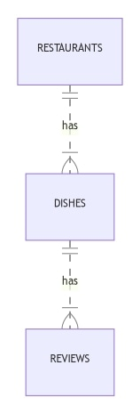
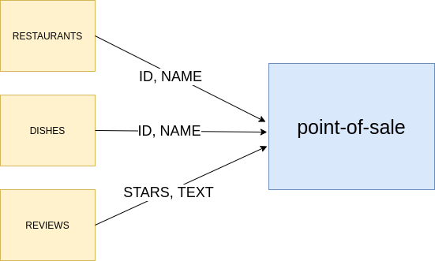

## How Single View works

A Single View is a collection formed by an aggregation of data from different collections (e.g. restaurants, dishes, reviews, etc.). If you want to know more about what Single Views are and how they are used, visit the [Single View Concepts](../fast_data/overview#why-single-view) section.

For example, suppose to have the following projections:

- RESTAURANTS: `ID`, `NAME`
- DISHES: `ID`, `NAME`, `INGREDIENTS`, `RESTAURANT_ID`
- REVIEWS: `ID`, `TEXT`, `STARS`, `DISH_ID`

And these projections are connected among them with this logic:

- a restaurant can have multiple dishes
- a single dish can be owned by a single restaurant
- a dish can have multiple reviews, but each review is about a single dish

As shown in the following diagram:



These relations allow us to know how to pass from one projection to another one.

For example, if we have the following review:

```yaml
ID: 'review-123'
TEXT: 'lorem ipsum'
STARS: 2
DISH_ID: 'dish-2'
```

and we want to know what is the name of the restaurant that has received this review, we just have to:

- look up in the projection DISHES the dish whose `ID` equals `dish-2`
- get the `RESTAURANT_ID` of the restaurant which owns `dish-2`
- look up in the projection `RESTAURANTS` and get the `NAME` of the restaurant whose `ID` equals to the `RESTAURANT_ID` associated to `dish-2`.

Now we want to create the Single View `point-of-sale` that has the following information: a point of sale has a `restaurantId` as unique identifier of the point of sale, and a `name` that is the name of the restaurant. It also contains the list of dishes with their `id`, `name` and reviews with their `stars` and `text`.

```yaml
restaurantId: RESTAURANT.ID
name: RESTAURANT.NAME
dishes:
      - id: DISHES.ID
        name: DISHES.NAME
        reviews:
                - stars: REVIEWS.STARS
                  text: REVIEWS.TEXT
```

> *Note*: in the single view the names of the fields can be different from the names of the fields of the projections they aggregate.



As shown in the image above, the single view gets his information from the projections, so that when some changes in the projection occur (e.g.: the name of a dish changes, or a new review is written, or some dishes are removed) the single view interested in these changes has to be regenerated.

In our case, let's assume that a new review is added to the projection REVIEWS with the following data:

```yaml
ID: 'review-123'
TEXT: 'lorem ipsum'
STARS: 2
DISH_ID: 'dish-2'
```

We need to update the single view with `restaurantId` equals to the restaurant that owns the dishes with `ID` equals to `dish-2`.

In order to maintain the consistency between Single View data and the content of the projections, the Single Views need to be linked to the projections they aggregate, so that when some documents of the projections are updated, the single view containing that information can be updated accordingly.  

So, it must be defined a function for each projection associated with the single view. These functions are called `strategies` and are used to know which specific single view document must be updated as a consequence of the update of a projection document. To know how to create a strategy [read here](./single_view#strategies)

## Create the Single View

Click on the Single Views voice of the left menu, which opens the Single View page, and click the button to create a new Single View.  

Fill the modal with the name of the Single View, that is going to be the name of the collection.

Once created, you will be redirected to the Single View detail page.  

## Single View Data Model

Single views collections are created on the _CRUD Service_, so we add all the [default fields](../runtime_suite/crud-service/overview_and_usage#predefined-collection-properties) and indexes required for the CRUD collections in creation.

To define the custom fields, indexes and internal endpoints of your single view collection, add them in the respective card.


The type fields supported are the same of the collection you can create in the [MongoDB CRUD section](../development_suite/api-console/api-design/crud_advanced#create-a-new-crud). To know more about indexes [click here](../runtime_suite/crud-service/overview_and_usage#indexes).

## Create the Single View Creator service

You need to create a **Single View Creator** to update or delete a Single View when a Projection Changes is created. This happens every time a Projection has been modified.

A Single View can be updated by many Single View Creator. Each Single View Creator should be linked to one System of Records through Projection Changes.

```shell
system_1
 _______________     __________________________
| projection_1 |---> |projection_change type A |  ----> single_view_creator_1  
| projection_2 |---> |_________________________|                      \ 
|______________|                                                       \update
                                                                         ________________
                                                                        | single_view_A |
                                                                        |_______________|
system_2                                                                /
 _______________     __________________________                        / update
| projection_3 |---> |projection_change type B |  ----> single_view_creator_2  
| projection_4 |---> |_________________________|
|______________|

```

To associate the single view with the service, add a service in the `Single view creator services` card in the Single View detail page. You can attach more than one service to the Single View.

After you have attached the microservice to the single view, a link to the microservice will appear. Click on the link to navigate to the detail page of the microservice.


:::note
These links are for documentation purposes only. You can use them to track which services are responsible for keeping the Single View updated.  
:::

:::info
In the [Marketplace](../marketplace/overview_marketplace), you can find a template and two plugins that can help you in configuring all the **Single View Creator** services that you need. You can find more information [here](./single_view_creator/overview.md).
:::

## Strategies

When the `Single View Creator` will be configured, it will look at the changes stored in the **projections changes collection**. In order to know which specific Single View needs to be updated, based on the projections records just modified by the importer, the Single View Creator will look at the projection change `identifier` field.

In order to do so, **strategies** need to be implemented. These strategies are basically the way to retrieve the unique identifiers of the single view that needs to be updated or created as consequence of the changes on the projection. The output of the strategies will be used by the `Real-Time Updater` to record a change in the proper `projection-changes` collection for each identifier. Later on, the `Single View Creator` will receive the `identifier` object to find the correct single view to update.

### Write your Strategies

The strategy functions can be created in the repository of the project configuration.

In order to write a strategy function, first clone the repository, in order to do so click on the git provider icon on the right side of the header (near to the documentation icon and user image) to access the repository and then clone it.

Strategies files need to be created below a folder named `fast-data-files`, if your project does not have it, create it.
In this folder, create a folder named `strategies/SYSTEM ID` (replacing *SYSTEM ID* with the system id set in Console) and inside this folder you can add all the files you need to create the strategies for the specified System of Record.

For instance if you want to create a strategy function for the system `my-system` you need to create the following directory tree:

```txt
/configurations
    |-- fast-data-files
        |-- strategies/
              |-- my-system/
```

The file should export a simple function with the following signature:

```js
module.exports = (logger, databaseName) => async(document, mongoClient) => {
  // Write here your business logic
}
```

The function must return an array of objects containing the keys of the Single View that needs to be updated.

In the simplest case the document already contains the Single View key fields, so we can extract it from the input document.
For instance if the Single View key is composed by two fields:

```js
{
  field_a,
  field_b
}
```

and the input document is:

```js
{
  field_a: 'value_a',
  field_b: 'value_b',
  field_c: 'value_c',
  field_d: 'value_d'
}
```

we can extract the identifier from the document itself and return it as an array

```js
module.exports = (logger, databaseName) => async (aDocument) => {

  const {
    field_a,
    field_b
  } = aDocument

  const singleViewIdentifier = {
    field_a,
    field_b
  }

  return [singleViewIdentifier]
}

```

:::caution
If your CDC sends just the changes of the record instead of the whole record, the document you receive as argument in the strategy function is the same as the one sent by the CDC, indeed they are just the changes.
:::

In a more complex situation we could not have all the information in the incoming document, so we would need to fetch more documents to get all fields.

In this second scenario the input document could be:

```js
const {
  field_a: 'value_a',
  field_c: 'value_c',
}
```

We don't have `field_b`, so we need to fetch the table that contains `field_b`, and we will do it using `field_c` as the conjunction element for the first look up and finally `field_d` to get the correct element that contains the desired `field_b`

```js
module.exports = (logger, databaseName) => async(aDocument, mongoClient) =>  => {
    const {
      field_a,
      field_c
    } = aDocument
    const projectionsDb = mongoClient.db(databaseName)

    // retrieve first document using projectionsDb and input field_c
    const firstRetrieve = await projectionsDb.collection(startingProjection).findOne({
      field_c,
    })

    const {
      field_d
    } = firstRetrieve
    // retrieve all documents that match field_d from the first retrieved document
    const results = await projectionsDb.collection(projectionWithKey).find({
      field_d,
    })

    // returns an array of identifier, one for each results
    const identifiers = results.map(({ field_b }) => {
      return {
        field_a,
        field_b,
      }
    })

    return identifiers
  }
}
```

:::caution
When the `real-time updater` deletes a projection document, it actually makes a **virtual delete** instead of real document deletion. This means that the document is actually kept in the database, but the `__STATE__` field (one of the default fields of the `Crud Service`) is set to `DELETED`.
:::

#### How can I write tests?

We believe that all the files of a program must be tested. To allow you to do it, you can add the `package.json` in the `fast-data-files` folder with the test scripts with your preferred test runner.

Remember that all the files in `tests` or `test` folder and files with filename ending with `.test.js` or files with suffix not `.js` will not bring to create the strategies files.

For example, in this folder:

```txt
|-- fast-data-files
    |-- package.json
    |-- strategies/
          |-- my-system/
                |-- myFn1.js
                |-- myFn2.js
                |-- myFn1.test.js
                |-- tests/
                      |-- myFn2.js
```

the file included in Real Time Updater service will be `myFn1.js` and `myFn2.js`.

The folder `fast-data-files` must be created at the root level of the configuration repository of your project.

To enable the continuous integration, you could start a pipeline checking for changes inside the `fast-data-files` folder and triggers test, lint and others useful scripts.

To know the technical limitation you have in these files, [read here](./single_view#technical-limitation)

### Link projections to the Single View

In the detail page of the Single View, click on the `Strategies` tab.


Here it's shown a table in which you have to specify the all projections that will be read to get the data that the single view needs (remember that a Single View is an aggregation of data from different projections).

To link a strategy to your single view, once you entered the `Strategies` tab, you can click on the `Add link to strategy` button, which will let you select:

1. A system and a projection from said system
2. Whether the strategy type is `low code` or `manual`
3. The main strategy function file name

You can link a strategy as low code only if the system it belongs to is low code as well. If you choose to link the strategy as low code, instead of its main function file name, the `__automatic__` marker will be used.

:::warning
Once you have linked some strategies to a Single View Creator in low code mode, if you try to change the Real Time Updater making it manual, you will not be allowed to save.
:::

If you choose to use manual strategies, each listed manual projection must be linked to a file without the extension `.js` which is the entry point of your **strategy function**.

Example:

```txt
configurations/
    |-- fast-data-files
        |-- strategies/
              |-- my-system/
                    |-- myStrategyForProjection1.js
                    |-- someFunctions.js
```

Where `myStrategyForProjection1.js` is the file that exports the strategy function, and internally it uses some functions imported from the `someFunctions.js` file.

So, you have to set `myStrategyForProjection1` as **main function file** for the projection associated.

In the table, you have the option to turn a manual strategy into a low code strategy. Note that this is only possible if the system the projection belongs to is low code too.

## How to consume the Single View

You can expose the Single View through the crud-service without writing any code, or you can always create a custom service to access to MongoDB if you have special needs.

You could [check here](../development_suite/api-console/api-design/endpoints) how to expose an endpoint of the CRUD service outside your project through the Console.

[Click here](../runtime_suite/crud-service/overview_and_usage) if you want the usage documentation for the CRUD.

## How to delete a Single View

To delete a Single View just click on the `Delete` button in the Single View detail page.

:::warning
Deleting a Single View does **not** delete the microservice associated.
:::

## Technical limitation

In your custom files (e.g. `fast-data-files`) you can import only the node modules present in the following list:

- [lodash.get](https://github.com/lodash/lodash/tree/4.4.2-npm-packages/lodash.get)
- [mongodb](https://github.com/mongodb/mongo/tree/r3.6.0)
- [ramda](https://github.com/ramda/ramda/tree/v0.27.1)

:::caution
It is used the node version 12.
:::
