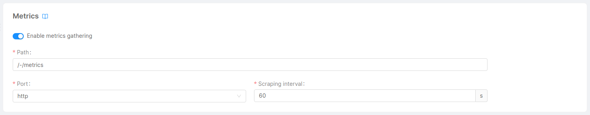

A great way of monitoring Fast Data is using Dashboards, which can give you immediate feedback on various aspects of system health. We provide some already configured [Grafana Dashboards](https://grafana.com/grafana/dashboards) to quickly set up a monitoring stack that grants both Dashboards and Alerts.

## Console Setup

The Grafana Dashboards make use of [Prometheus](https://prometheus.io/) metrics, which means that you should enable the monitoring of your project (for example, using [Prometheus Operator](https://github.com/prometheus-operator/prometheus-operator)) and export the metrics of interest.

If you are planning to use Prometheus Operator as a monitoring system for your project, you can automatically generate and configure the `servicemonitor.yml` files for all the monitoring services using their [Metrics card](/development_suite/api-console/api-design/microservice-monitoring.md).

## Metrics

Metrics are a set of categorized data generally exposed through a `/-/metrics` http GET route which reveals all the Prometheus metrics exposed by each service.

### Fast Data services metrics

Each Fast Data service comes with its set of metrics exposed through an http route. To expose them you only need to enable the `Enable metrics gathering` switch that you can find in each microservice's page in the console.

### MongoDB and Apache Kafka metrics

For the dashboards related to MongoDB and Apache Kafka metrics you will need to setup the [Kafka Exporter](https://github.com/danielqsj/kafka_exporter) and [MongoDB Query Exporter](https://github.com/raffis/mongodb-query-exporter) services. Conveniently, you can create them all at once by going to the Applications section of your console and creating a new `Fast Data Monitoring` Application.

<!-- TODO: explain how to configure the kafka exporter (just fill the public vars) -->
<!-- TODO: explain how to configure the mongo exporter (add metrics on the config.yml) -->

## Dashboards

You can create any custom dashboards using the metrics provided by the Fast Data services as well as the MongoDB Query Exporter and Kafka Exporter services. But if you're looking for a quicker start, we have a set of pre-configured dashboards designed to make the monitoring setup easier for you.

- [Bucket Storage Support Dashboard](/fast_data/monitoring/dashboards/bucket_storage_support.md)
- [Debezium CDC Dashboard](/fast_data/monitoring/dashboards/debezium_cdc.md)
- [Kafka Messages Dashboard](/fast_data/monitoring/dashboards/kafka_messages.md)
- [Projection Changes Dashboard](/fast_data/monitoring/dashboards/projection_changes.md)
- [Real Time Updater Dashboard](/fast_data/monitoring/dashboards/real_time_updater.md)
- [Single Views Dashboard](/fast_data/monitoring/dashboards/single_views.md)
