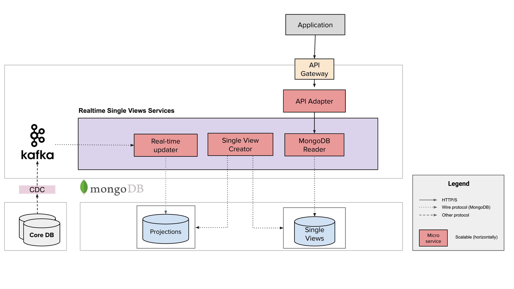
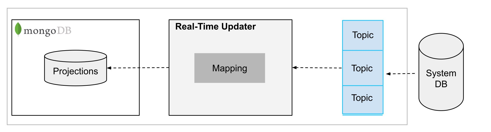

Keep all your **Data organized and available in real time, 24/7**.

Collect data from any existing system and organize it according to your business needs. Build a single point of truth to keep your data flow consistent and updated in real-time 24/7.

Fast Data main goal is to **aggregate business data from different sources into a single MongoDB collection** called [single view](sv_concepts.md). These collections can be easily **queried by your APIs**. The aggregation is performed only when needed, that is **when changes occur to the source data**.

Focus only on your data and how you need to aggregate them, your [single views](sv_concepts.md) will be **automatically updated**.

## Fast Data Architecture and Flow

In this section, you can have an overview of the components and the processes of Fast Data. You can easily configure Fast Data directly from the Console.

### Change Data Capture

The first component is the **Change Data Capture (CDC)** in charge of notifying to Kafka any change in your original sources of data happens. From now on, we will call the sources **Systems of Records**.  
You can implement it however you want.

### Real-Time Updater

The Real-Time Updater component listens to Kafka messages and is in charge of keeping the **projections collections** up to date with the systems. Each source system table that contains data linked to a single view will have a projection collection. This collection contains the [standardized](sv_concepts.md#define-canonical-formats) values of the fields of the related system table. This set of collections will be used from the Single View Creator to update the single views.

### Single View Creator

The Single View Creator component creates and updates a specific single view.

First, the Single View Creator **aggregate** data of projections, then **maps** these values to an object with the correct single view fields. Finally, updates the single view collection.
