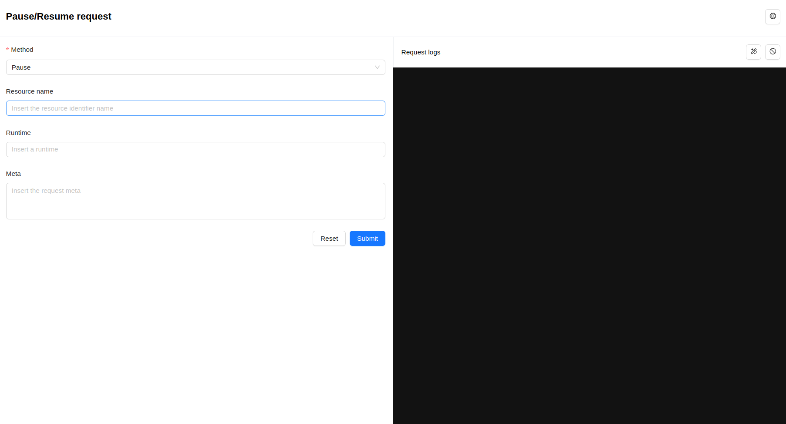
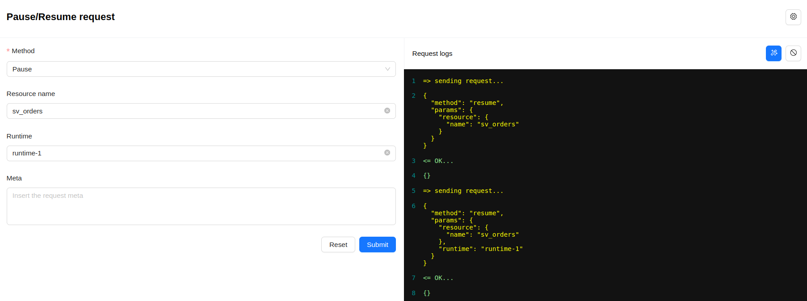
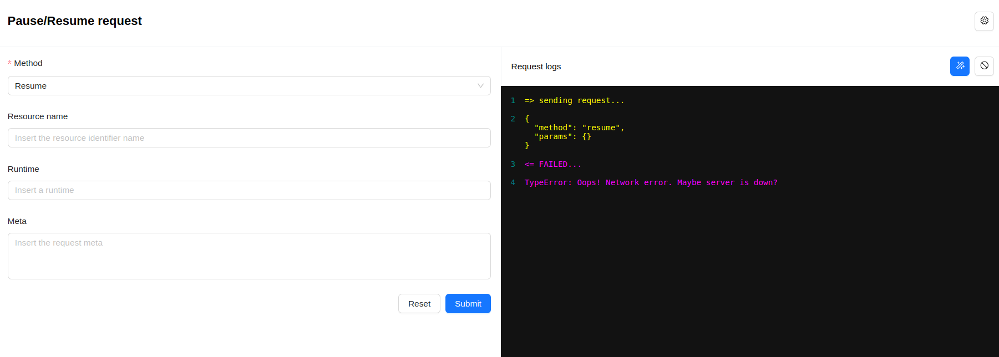

import Tabs from '@theme/Tabs';
import TabItem from '@theme/TabItem';

# Runtime Management

Welcome to Runtime Management - your tool for achieving better control over the Fast Data environment during runtime.
This platform empowers you to dynamically manage the execution of Fast Data, offering functionalities to pause and resume microservices effortlessly.
Dive into the world of streamlined runtime control and take charge of your Fast Data deployment with ease.

## Overview

Runtime Management is specifically designed to facilitate the runtime deployment of Fast Data.
It provides a user-friendly web interface and robust backend functionalities to enhance your control over the Fast Data microservices environment.

With Runtime Management, users gain the ability to govern potentially every aspect of the Fast Data runtime.
Currently, this powerful mechanism is supported in the Single View Creator, offering more than just the suspension of Single View generation on MongoDB.

### Key Features and Benefits

- **Flexible Control:** govern the execution of Fast Data microservices with fine-grained control, allowing for strategic management of the runtime environment.

- **Enhanced Performance and Consistency:** utilize Runtime Management to optimize performance and ensure data consistency. 
      For example, start the ingestion of a massive data system into the Fast Data environment. Only after the ingestion process is complete, 
      initiate the processing of updates from the Real Time Updater (and the Single View Trigger Generator if active) to generate Single Views. 
      This sequential approach enhances performance and data consistency.

- **Strategic Ingestion:** achieve better performance and consistency of data by strategically managing the ingestion process, aligning it with the broader data processing pipeline.

### Useful Scenarios

Explore the diverse scenarios where Runtime Management can bring significant benefits to your Fast Data deployment:

- **Optimizing Data Processing Pipelines:** Pause the Single View Creator during high-load data ingestion to ensure optimal system performance. 
      Resume processing once the ingestion is complete to generate views efficiently.
- **Sequencing Real-Time and Batch Processing:** Use Runtime Management to sequence the execution of real-time and batch processing components.
      Pause real-time processing during large batch ingestion, then resume for a balanced data processing approach.
- **Performance Testing and Simulation:** Simulate different scenarios for performance testing by pausing and resuming microservices.
      Observe system behavior under various conditions to identify bottlenecks and optimize resource allocation.
- **Data Consistency Assurance:** Maintain data consistency by pausing the Single View Creator during critical updates to underlying databases.
      Resume processing after updates to ensure Single Views reflect the most recent and accurate data.
- **Strategic Resource Allocation:** Dynamically allocate resources by pausing and resuming microservices based on workload and resource availability.
      Efficiently utilize computing resources and prioritize critical processes during peak demand.
- **Enhanced System Reliability:** Gracefully handle unexpected situations or system maintenance by pausing specific microservices.
      Resume operations post-maintenance to minimize downtime and enhance overall system reliability.

## What You Can Do

Explore the capabilities of Runtime Management by executing specific commands tailored to your Fast Data environment.

- ***Pause***. Temporarily halt the consumption of messages on the Single View Creator microservice, be it from *Projection Changes* or *Single View Trigger* messages,
    so that no aggregation is executed.
    This command is useful when you want to pause the generation of Single Views, for example, during high-load data ingestion.

- ***Resume***. Restart the consumption of *PC* or *sv-trigger* messages by the Single View Creator, bringing Single Views aggregation process back to active operation.

## Up and Running

To ensure a smooth setup and operation of Runtime Management, make sure you've completed the following tasks:

1. **Set Up the persistence environment:** ensure that you have configured a persistence environment (e.g., MongoDB) for Runtime Management to store its state.
  Make sure that the persistence environment is accessible from the Control Plane application and insert its connection configuration in the Config Map of the Control Plane.

This step alone grants the proper functioning of the frontend and backend of Runtime Management. However, if you want to enable the communication with one or more runtimes of Fast Data, follow the next steps.

2. **Set Up Fast Data Environment in Console:** naturally, you need to have a Fast Data environment in the Console,
  defining all the possible microservices you may need and their runtime configurations. In particular, be sure to set the three environment variables `CONTROL_PLANE_ACTIONS_TOPIC`, `CONTROL_PLANE_KAFKA_GROUP_ID`, and `READ_TOPIC_FROM_BEGINNING` for the Single View Creator, to enable the communication with the Runtime Management. Check the Single View Creator [Environment Variables section](/fast_data/configuration/single_view_creator.md#environment_variables) for further details.

3. **Create a Kafka topic:** create a Kafka topic dedicated to receiving action commands.
  This ensures seamless communication between Runtime Management and the Fast Data microservices. We suggest using a single partitioned topic.

4. **Configure Control Plane Application:** populate the Config Map of the Control Plane application with details regarding your runtime environment.

:::note

For a detailed explanation on how to configure the Control Plane application and its ConfigMap, check the [Control Plane application documentation](/runtime_suite_applications/control-plane/10_overview.md).

:::

## Interacting with the Frontend

To interact with Runtime Management, access the web user interface provided by the Control Plane application.
Once configured in Console, you can navigate to the frontend using the link generated in the Endpoints section and start managing your Fast Data runtime.
To see how to send a command, check the [Sending a command](#sending-a-command) section below.

### Frontend Overview

The frontend is divided into two sections: a form on the left and a log panel on the right.
The form allows you to specify the details of the command you want to send, while the log panel displays the log of the command sent.

<Tabs>

<TabItem value="control-plane-ui-left" label="Left Side" default>

#### Form Section
  - ***Method*:** Choose between `Pause` and `Resume` commands.
  - ***Resource name*:** Enter the name of a specific resource to pause or resume (for example, the name of a Single View).
  - ***Runtime*:** Select a target runtime environment name on which to execute the command.

</TabItem>

<TabItem value="control-plane-ui-right" label="Right Side">

#### Log Panel
  After submitting the form, a Kafka message representing the command is sent to the topic.
  The Monaco editor panel on the right displays the log of the sent command, providing visibility into the executed actions.
  It also shows any possible errors that could arise during the process.

  At the top, two buttons allow you to prettify the text being logged and to clear it.

</TabItem>

</Tabs>

### Sending a command

Before you initiate a command using Runtime Management, take a moment to understand the process.
Sending a command involves a few key steps to ensure precision and effectiveness in controlling your Fast Data runtime.

1. **Method Selection:** Choose an action to send from the *Method* dropdown.
2. **Resource name (optional):** Enter the name of a specific resource.
3. **Runtime Selection (optional):** Select the target runtime environment for executing the selected action.
4. **Submit:** Press the submit button to send a Kafka message representing the action command to the dedicated topic.

This straightforward process allows you to seamlessly communicate your command to the Fast Data microservices.

### Error Logs

Any errors that occur during the execution of a command are displayed in the log panel.
The Monaco editor panel on the right displays the log of the sent command, providing visibility into the executed actions.
It also shows any possible errors that could arise during the process.

---

Now, you're equipped with the knowledge to efficiently manage Fast Data during its runtime using the Runtime Management system.
