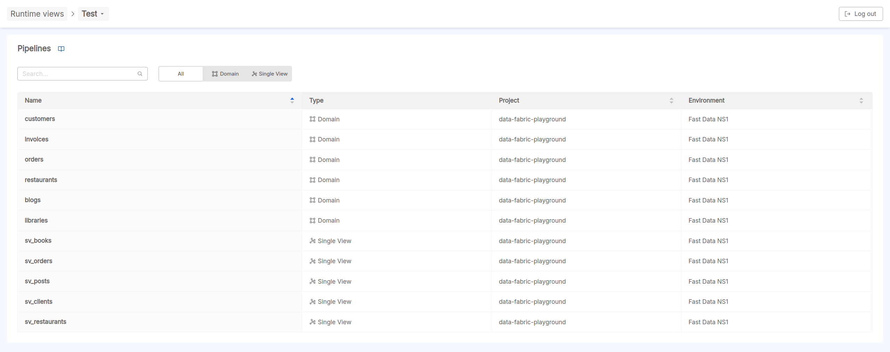
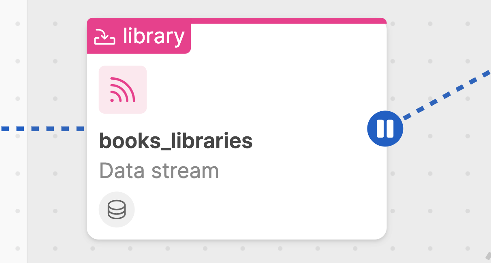
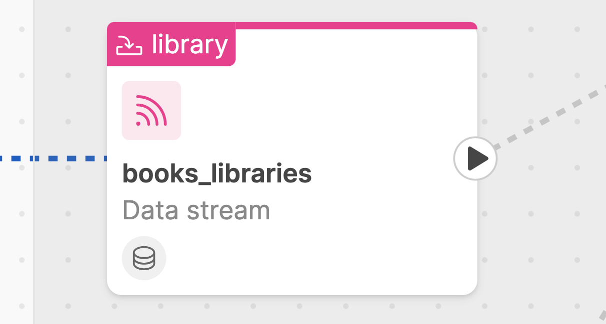
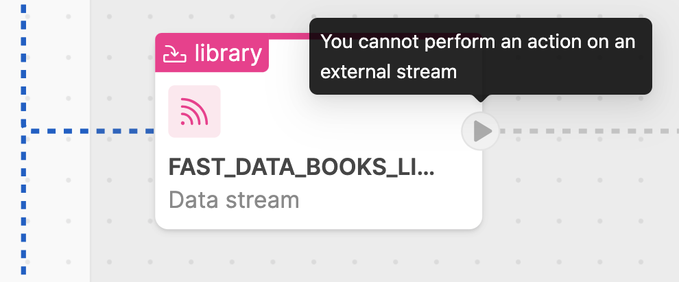
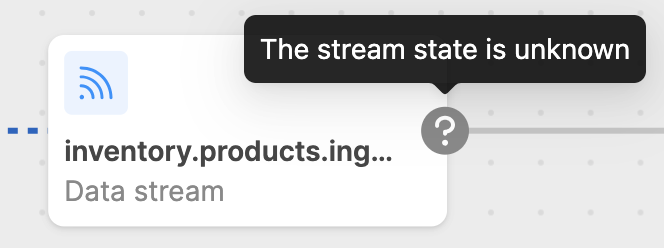
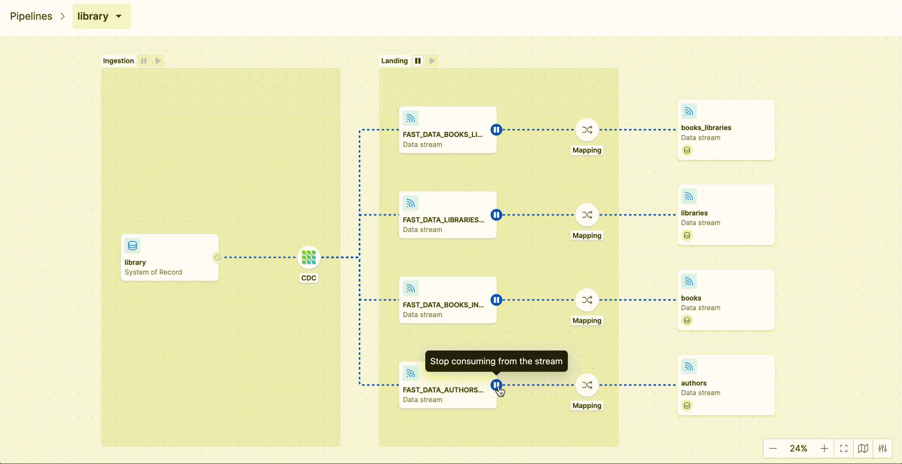

import Tabs from '@theme/Tabs';
import TabItem from '@theme/TabItem';

Runtime Management has a dedicated frontend that interacts with [Control Plane](/fast_data/runtime_management/control_plane.mdx).

This frontend:

- retrieves pipelines information, to show them in dedicated canvas;
- opens web socket connections to the Control Plane, to receive updates about the state of a given pipeline;
- sends JSON-RPC commands to the Control Plane, after the user interacts with a pipeline to pause or resume one or more data streams.  

## Configuration

By default, the Control Plane application exposes its frontend over the `/` base path. 

This value can be overridden by using the environment `BASE_PATH` with `/<your path>/` as value.

On the Endpoint section, remember to use `/<your path>` as [rewrite base path](/development_suite/api-console/api-design/endpoints.md#about-rewrite-base-path).

:::tip
Control Plane frontend can also be embedded as an iFrame, to be used as an extension of Mia Platform Console.
For more details on how to setup it in the Runtime area of the console, please read the dedicated [Console Extension Documentation](/console/console-extensibility/overview.md).

Here is provided an example of payload specific for the Fast Data Runtime Management, which can be employed in [extension registration API](/console/console-extensibility/registration.md#how-to-register-your-extension):

```json
{
    "name": "Fast Data Control Plane",
    "contexts": [
        "project"
    ],
    "description": "This extension enables teams to monitor and interact with Fast Data Runtime deployed in a Console project",
    "entry": "https://<address-of-your-project-exposing-control-plane>",
    "extensionType": "iframe",
    "routes": [
        {
            "id": "fast-data-runtime",
            "locationId": "runtime",
            "renderType": "category",
            "labelIntl": {
                "en": "Fast Data Runtime",
                "it": "Fast Data Runtime"
            }
        },
        {
            "id": "fast-data-control-plane",
            "locationId": "runtime",
            "parentId": "fast-data-runtime",
            "destinationPath": "/<your path>",
            "icon": {
                "name": "PiAirTrafficControl"
            },
            "labelIntl": {
                "en": "Control Plane",
                "it": "Control Plane"
            }
        }
    ]
}
```

Finally, remember also to properly setup Control Plane endpoints as [described here](/fast_data/runtime_management/control_plane.mdx#endpoints).
:::

## Pipelines Overview

When user accesses Control Plane frontend, an overview section shows the list of Fast Data pipelines released on that runtime environment.  

In particular, two types of pipelines are shown: [Domain pipelines](/fast_data/runtime_management/overview.mdx#domain-pipeline) and [Single View pipelines](/fast_data/runtime_management/overview.mdx#single-view-pipeline).



The user can search a pipeline of interest, or filter on the type of pipeline (either _Domain_ or _Single View_).

Once clicked on a pipeline, the user will be redirected to the pipeline detail page. It is a canvas where all the stages of a pipeline are rendered.

## States of Data Streams

In this section we are going to describe in detail how the different states of the Fast data system at runtime are represented in the pipeline, and what actions the user can take to interact on the pipeline.  

Along a pipeline, it is possible to identify different graphical elements useful for representing the various states of your data streams 
in real-time and for highlighting architectural aspects of your Fast Data configuration.

For each data streams, an action button is provided in an initial state, which may change based on:
- the feedback provided by the workloads managing the data streams;
- the configuration of the workloads

:::tip
From Control Plane settings located at the bottom-right of the canvas, user can decide to switch-off / switch-on the animation of the running streams.
:::

### Running

When messages consumption is active along a data stream, the __running__ state is rendered. 

<div style={{display: 'flex', justifyContent: 'center'}}>
  <div style={{display: 'flex', width: '500px'}}> 



  </div>
</div>

This means that the Fast Data workloads involved in consuming events on that data stream are in `running` state.  

### Paused

When messages consuption is paused along a data stream, the __paused__ state is rendered. 

<div style={{display: 'flex', justifyContent: 'center'}}>
  <div style={{display: 'flex', width: '500px'}}> 



  </div>
</div>

This means that the Fast Data workloads involved on that data stream are in `paused` state and 
their are not consuming messages along that data stream.

### Loading

When user interacts with the frontend in order to perform play/pause actions along data streams, a loading state is rendered, meaning 
that an action is going to be performed on that data stream and control plane has sent the command to the involved microservice and 
is waiting for a feedback from that specific microservice.  

<div style={{display: 'flex', justifyContent: 'center'}}>
  <div style={{display: 'flex', width: '500px'}}> 


  </div>
</div>

Typically, after a loading state, if action succeeds, the data stream will change its state from paused to running or viceversa; if action does not succeed, an error will be displayed to user and the data stream will not change its status.

### Unsupported

Depending on the configured Fast Data architecture, sometimes the unsupported status can appear along a data pipeline. 

<div style={{display: 'flex', justifyContent: 'center'}}>
  <div style={{display: 'flex', width: '500px'}}> 


  </div>
</div>

For example, this status appears in the ingestion phase, where is not possible to alter the behavior of a CDC acquiring events from external sources.

### Disabled

There could be the case in which a play/pause action cannot be performed by user. 

<div style={{display: 'flex', justifyContent: 'center'}}>
  <div style={{display: 'flex', width: '500px'}}> 



  </div>
</div>

This status can appear in the Single View pipeline's artifacts belonging to the Landing stage, 
since their actions are managed by a domain pipeline.

### Unknown

The unknown status appears when Control Plane system is not able to identify the state of a certain data stream.

<div style={{display: 'flex', justifyContent: 'center'}}>
  <div style={{display: 'flex', width: '500px'}}> 



  </div>
</div>

This status can appear when: 

- there may be some misconfigurations on the Fast Data pipeline;
- workloads are not sending their feedback to the Control Plane.

## Monitoring and Interacting with pipelines

From Control Plane frontend, user can monitor the status of each Fast Data pipeline in real-time and interact with 
it by pausing/resuming messages consumption on the available data streams. 

### Pause and Resume

It's possible to click on the play/pause buttons distributed along the various data streams of the pipeline.  



Once clicked on the button, a [Loading state](#loading) appears and a message on the top of the frontend shows a countdown of 5s within 
which the user can decide to revoke the triggered action:

- if revoked, the previous state will be restored without any impact on Fast Data runtime; 

or

- if not, Control Plane will receive the command and send the corresponding state to the target microservice involved on that data stream. 

After the loading state, if the action is successful, the data stream will accordingly change its status in either [running](#running) or [paused](#paused).

### Bulk actions

_Bulk actions_ can enhance user experience in interacting with pipelines. 

With a simple click on a play/pause button located at the top of each main Fast Data architectural step 
(Ingestion, Landing, Collected, Curated phases), user can pause all the active data streams, or can resume all the paused ones.


:::tip 
Bulk actions are useful in case of large data pipelines and to speed-up the runtime management: 
one example is in case of an [Initial Load management process](/fast_data/data_loading.mdx#initial-load). 

In fact, with the first deploy of Fast Data pipelines on a runtime environment, the overall pipelines are set in `paused` state as default. 

Consequently, in order to efficiently manage the Initial load of the Fast Data system, user can leverage bulk actions on a step-by-step process 
along the different pipeline phases.

In this way, ingestion of huge datasets can be performed without saturating the underlying infrastructure, without damaging other data streams running at the same runtime. 
:::