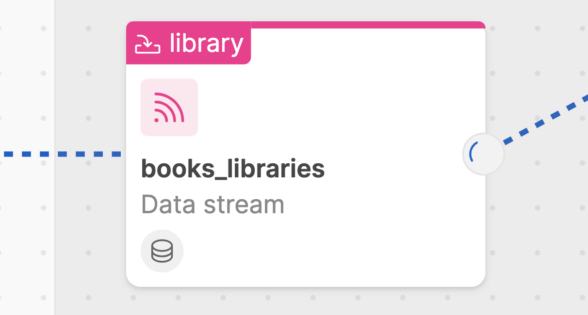
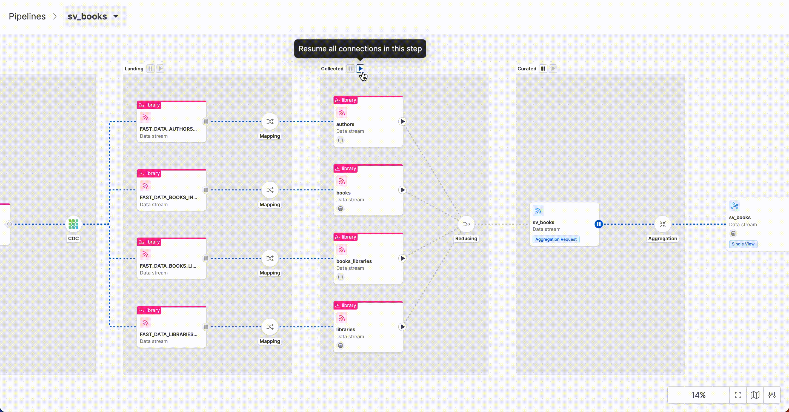

import Tabs from '@theme/Tabs';
import TabItem from '@theme/TabItem';

## Pipelines Overview

When user accesses Control Plane frontend, an overview section shows the list of Fast Data pipelines released on that runtime environment.  

In particular, two types of pipelines are shown: [Domain pipelines](/fast_data/runtime_management/overview.mdx#domain-pipeline) and [Single View pipelines](/fast_data/runtime_management/overview.mdx#single-view-pipeline).

The user can search a pipeline of interest, or filter on the type of pipeline. (either _Domain_ or _Single View_)

Once clicked on a pipeline, the user will be redirected to the pipeline detail page. It's a canvas where all the stage of a pipeline are rendered.

## States of Data Streams

In this section we are going to describe in detail how the different states of the Fast data system at runtime are represented in the pipeline, and what actions the user can take to interact on the pipeline.  

Along a pipeline, it is possible to identify different graphical elements useful for representing the various states of your data streams 
in real-time and for highlighting architectural aspects of your Fast Data configuration.

For each data streams, an action button is provided in an initial states, which may change based on:
- the feedback provided by the workloads managing the data streams;
- the configuration of the workloads

:::tip
From Control Plane settings located at the bottom-right of the canvas, user can decide to switch-off / switch-on the animation of the running streams.
:::

### Running

When messages consumption is active along a data stream, the __running__ state is rendered. 

This means that the Fast Data microservice involved in consuming events on that data stream is in active state.  

### Paused

When messages consuption is paused along a data stream, the __paused__ state is rendered. 

This means that the Fast Data microservice involved on that data stream is not consuming messages that flow through that data stream.

### Loading

When user interacts with the frontend in order to perform play/pause actions along data streams, a loading state is rendered, meaning 
that an action is going to be performed on that data stream and control plane has sent the command to the involved microservice and 
is waiting for a feedback from that specific microservice.  

Typically, after a loading state, if action succeeds, the data stream will change its state from paused to running or viceversa; if action does not succeed, an error will be displayed to user and the data stream will not change its status.

### Unsupported

>>> IMG TO BE INSERTED <<<

Depending on the configured Fast Data architecture, sometimes the unsupported status can appear along a data pipeline. This is the case of what happens in a classical ingestion phase, wherein is not possible to alter the behavior of a CDC that is acquiring events from external sources.

### Disabled

>>> IMG TO BE INSERTED <<<

There could be the case in which a play/pause action cannot be performed by user. Even this state can be influenced by architectural issues.

### Unknown

>>> IMG TO BE INSERTED <<<

If there are some misconfiguration on Fast Data pipeline, the Control Plane system is not able to identify the real-time state of a certain data stream. This is why sometimes there could be present the Unknown state along a pipeline visualization. In this case, user can verify for example if Fast Data workloads are correctly running from Monitoring Area of Console, or if there are some misconfiguration on the Design Area of Console.

## Monitoring and Interacting with pipelines

From Control Plane frontend, user can monitor the status of each Fast Data pipeline in real-time and interact with 
it by pausing/resuming messages consumption on the available data streams. 

To do this, it is possible to click on the play/pause buttons distributed along the various data streams of the pipeline.  

Once clicked on the button, a Loading state appears and a message on the top of the frontend shows a countdown of 5s within 
which the user can decide to revoke the triggered action:
- if revoked, the previous state will be restored without any impact on Fast Data runtime; 

or

- if not, Control Plane will receive the command and send the corresponding state to the target microservice involved on that data stream. 

After the loading state, if the action is successful, the data stream will accordingly change its status.

### Bulk actions

_Bulk actions_ can enhance user experience in interacting with pipelines, by grouping together data streams in stage areas. 

With a simple click on a play/pause button located at the top of each main Fast Data architectural step 
(Ingestion, Laning, Curated, Collected phases), user can pause all the active data streams, or can resume all the paused ones.

:::tip 
Bulk actions are useful in case of large data pipelines and to speed-up the runtime management: 
one example is _Initial Load management process_. 

In fact, with the first deploy of Fast Data pipelines on a runtime environment, the overall pipelines are set in `paused` state as default. 

Consequently, in order to efficiently manage the Initial load of the Fast Data system, user can leverage bulk actions on a step-by-step process 
along the different pipeline phases.

This way, ingestion of huge datasets is performed without saturating the underlying infrastructure, without damaging other data flows 
running in the same runtime. 
:::