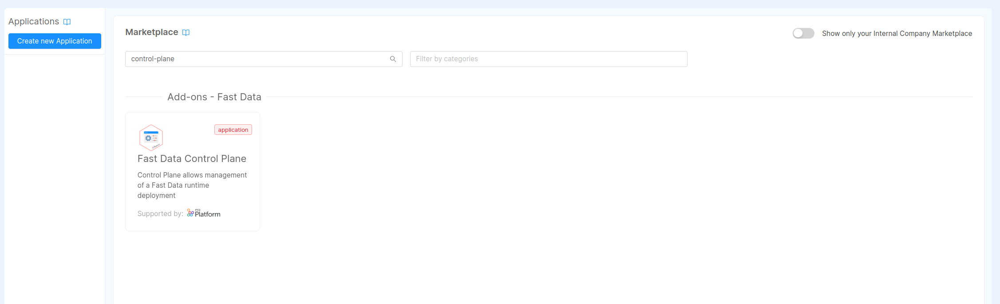

In order to ensure that only authorized people can access Fast Data Runtime Management system and consequently
visualize or change its state, it is important to properly set up a security layer.

In the following page are described the requirements and the process that has to be carried out to achieve your goal. It
is inspired from this [guide](/console/tutorials/configure-marketplace-components/auth-architecture/external-idp-internal-session.md).

## Requirements

- access to [Control Plane With Access Control](/fast_data/runtime_management/overview.mdx) application, which automatically
  scaffold the configurations regarding microservices, collections, endpoints and variables needed for controlling Fast Data
  runtime and protecting its access. Generated resources need to be further customized depending on your needs and credentials.
- an introduction to [Envoy](https://envoyproxy.io/), which is employed as API Gateway by the application. It is also
  possible to employ nginx as API Gateway, though the focus of this guide is on the former.
- an introduction to [Rönd](https://rond-authz.io/), which is the underlying system this guide will rely on for protecting
  the access to Fast Data Runtime Management application.
- an Identity Provider, which manages users' identities. The one employed throughout this guide is [Okta](https://www.okta.com/),
  although any other Identity Provider supported by the Mia-Platform [Authentication Service](/runtime_suite/authentication-service/10_overview.md)
  can be adopted in place of Okta within this guide.

## Control Plane Configuration

Let's start by selecting the `Fast Data Control Plane` application from the Marketplace, under the applications tab:



Then proceed step by step with the creation of the needed services, endpoints and collections. Once finalized, all those resources
should appear in the different Console section.


Among them, there are the two services in charge of deploying the  Fast Data Runtime Management, which are:

- `control-plane`, which is responsible to dispatch actions to the deployed Fast Data runtime and provide the current runtime configuration to the frontend
- `control-plane-fe`, which is the tool for visualizing Fast Data runtime state and interact with it

In order to properly access Fast Data runtime, it is necessary to fill in all the necessary configuration in the service
config map, which they may vary depending on your Fast Data configuration.

For more details on the Control Plane service configuration, please head over the dedicated [documentation section](/runtime_suite_applications/control-plane/20_configuration.mdx).

## Authentication Flow

In this section are described which resources should be configured in order to properly protect the access to the Fast Data
Runtime Management solution.

### Services

Upon application instantiation, the following services should have been generated for handling the authentication flow:

- [`api-gateway`](/runtime_suite/envoy-api-gateway/overview.md), which is the entrypoint of your project requests
- [`authentication-service`](/runtime_suite/authentication-service/10_overview.md), which is the service that interact with your Identity Provider to request a user identity verification
- `control-plane-login-site`, a frontend employed for handling the authentication flow in the browser
- `redis-auth`, a small instance of Redis OSS (< v7.4) with no disk persistence, which is employed to support the authentication flow

#### Api Gateway

No further configuration is needed for this service in Console _Design_ section.

#### Authentication Service

The service configuration is created with a set of preconfigured variables, such as the connection to Redis, and a config map
that lists the supported applications. Within the latter config map it is possible to find the definition of an application
that uses Okta as Identity Provider.

:::info
In case you would prefer using another Identity Provider, please read the [authentication-service documentation](/runtime_suite/authentication-service/20_configuration.mdx) to learn
how to configure the desired one in place of Okta.
:::

The configuration of included application only requires to set up few public and secret environment variables to be operational.
These variables are summarized in the tables below, divided for location where they should be stored. In fact, the former ones
should be added under the _Variables_ tab of _Project Overview_ section, while the latter can be configured in the _Public Variables_ of the _Design_ section.

| Secret Variable       | Explanation                                                               |
|-----------------------|---------------------------------------------------------------------------|
| CP_OKTA_CLIENT_ID     | client id obtained when registering this specific application on Okta     |
| CP_OKTA_CLIENT_SECRET | client secret obtained when registering this specific application on Okta |

| Public Variable | Explanation                                                                                                         |
|-----------------|---------------------------------------------------------------------------------------------------------------------|
| OKTA_BASE_URL   | base url where your Identity Provider is exposed                                                                    |
| CP_APP_ID       | application identifier employed when registering this specific application on Okta (e.g. `fast-data-control-plane`) |
| CP_PROVIDER_ID  | provider identifier employed when registering this specific application on Okta (e.g. `okta-development`)           |
| CP_BASE_URL     | base url where the project is exposed                                                                               |

:::note
After the creation of the Control Plane application, the public variables specified above should already appear in the
corresponding section, each of them with an empty value.
:::

Filling the variables listed above allows to generate a complete configuration at deploy time. An example of such configuration for Okta
can be fond in the panel below.

<details><summary>Authentication Service | Configuration Example (with variables to be interpolated)</summary>

```json title=config.json
{
  "apps": {
    "{{CP_APP_ID}}": {
      "providers": {
        "{{CP_PROVIDER_ID}}": {
          "order": 10,
          "type": "okta",
          "label": "Login with Okta",
          "clientId": "{{CP_OKTA_CLIENT_ID}}",
          "clientSecret": "{{CP_OKTA_CLIENT_SECRET}}",
          "baseUrl": "{{OKTA_BASE_URL}}",
          "authUrl": "{{OKTA_BASE_URL}}/oauth2/v1/authorize",
          "tokenUrl": "{{OKTA_BASE_URL}}/oauth2/v1/token",
          "userInfoUrl": "{{OKTA_BASE_URL}}/oauth2/v1/userinfo",
          "userSettingsURL": "{{OKTA_BASE_URL}}/enduser/settings",
          "logoutUrl": "{{OKTA_BASE_URL}}/oauth2/v1/logout",
          "scope": [
            "openid",
            "profile",
            "email",
            "offline_access"
          ]
        }
      },
      "redirectUrl": "{{CP_BASE_URL}}/web-login/oauth/callback",
      "defaultRedirectUrlOnSuccessfulLogin": "/",
      "authorizeStateRequired": true,
      "realm": "console",
      "isWebsiteApp": true,
      "issuer": "{{CP_APP_ID}}",
      "defaultGroups": []
    }
  }
}
```

</details>

#### Control Plane Login Site

No further configuration is needed for this service.

#### Redis Auth

This service is preconfigured with a config map containing the initial Redis configuration, such as the disk persistence
management and a dedicated user with their ACLs. To complete the configuration it is necessary to create the following
secret environment variables in the _Project Overview_ section:

| Secret Variable          | Explanation                                                                                                                                            |
|--------------------------|--------------------------------------------------------------------------------------------------------------------------------------------------------|
| CP_REDIS_MASTER_PASSWORD | root password to allow Redis start (not used by any service - it can be loaded from a secret when configured within the service environment variables) |
| CP_REDIS_USERNAME        | username of the Redis account to be employed by the authentication-service for accessing Redis                                                         |
| CP_REDIS_PASSWORD        | password of the Redis account to be employed by the authentication-service for accessing Redis                                                         |

<details><summary>Redis Auth Service | Configuration Example (with variables to be interpolated)</summary>

```text title=redis.conf
## GENERIC ##
port 6379
# listen on all the interfaces for incoming connections
bind 0.0.0.0

## NO DISK PERSISTENCE ##
save ""
appendonly no

## SECURITY ##
protected-mode yes

# NOTE: +@connection is necessary to be placed after -@dangerous, otherwise the user won't have the permissions to connect to Redis
user {{CP_REDIS_USERNAME}} on +@all -@dangerous +@connection allkeys allchannels >{{CP_REDIS_PASSWORD}}

# disable default user
user default off
```

</details>

### Endpoints

Below is reported the list of endpoints that have already been created for you by the application instantiation. Please
ensure that they are exposed with the proper security options.

| Endpoint        | Service                  | Authentication Required | User Group Permission |
|-----------------|--------------------------|:-----------------------:|-----------------------|
| `/web-login`    | control-plane-login-site |            -            | true                  |
| `/authorize`    | authentication-service   |            -            | true                  |
| `/oauth/token`  | authentication-service   |            -            | true                  |
| `/logout`       | authentication-service   |            -            | true                  |
| `/refreshtoken` | authentication-service   |            ✅            | true                  |
| `/userinfo`     | authentication-service   |            ✅            | true                  |
| `/apps`         | authentication-service   |            -            | true                  |

Knowing these endpoints are exposed, it is now possible to configure the redirect urls that some Identity Providers, such as Okta or Auth0, require to complete
the application registration. These endpoints will be then employed during the authentication flow to constrain the redirects
the Identity Provider can perform. In this case the endpoint that should be configured are the following ones:

- Sign-in redirect URIs → `<project-base-url>/web-login/oauth/callback`
- Sign-out redirect URIs → `<project-base-url>/logout`

where `<project-base-url>` is the base url where the project of interest is exposed to.

### Collections

The authentication flow via the `authentication-service` requires also the introduction of a CRUD Collection, where
users details are saved upon successful login. These information can then be employed in the authorization flow, which is
described later, in conjunction with the roles and policies to ensure that only authorized users can visualize or interact with Fast Data
runtime.  
By default the `Fast Data Control Plane` application creates the collection for you and instantiate the CRUD Service,
which is employed by the authentication service to access the collection. Additionally, below it is also provided the
collection definition ready for being imported, in case it may be necessary to move or replicate the collection in another Console project. 

<details><summary>Control Plane Users Collection Definition (import ready)</summary>

```json
{
  "data": {
    "collections": {
      "cp-users": {
        "id": "cp-users",
        "description": "Collection of cp-users",
        "name": "cp-users",
        "tags": [
          "collection"
        ],
        "fields": [
          {
            "name": "_id",
            "description": "_id",
            "type": "ObjectId",
            "required": true,
            "nullable": false
          },
          {
            "name": "creatorId",
            "description": "creatorId",
            "type": "string",
            "required": true,
            "nullable": false
          },
          {
            "name": "createdAt",
            "description": "createdAt",
            "type": "Date",
            "required": true,
            "nullable": false
          },
          {
            "name": "updaterId",
            "description": "updaterId",
            "type": "string",
            "required": true,
            "nullable": false
          },
          {
            "name": "updatedAt",
            "description": "updatedAt",
            "type": "Date",
            "required": true,
            "nullable": false
          },
          {
            "name": "__STATE__",
            "description": "__STATE__",
            "type": "string",
            "required": true,
            "nullable": false
          },
          {
            "name": "name",
            "type": "string",
            "required": false,
            "nullable": false,
            "sensitivityValue": 0,
            "encryptionEnabled": false,
            "encryptionSearchable": false
          },
          {
            "name": "groups",
            "type": "Array_string",
            "required": false,
            "nullable": false,
            "sensitivityValue": 0,
            "encryptionEnabled": false,
            "encryptionSearchable": false
          },
          {
            "name": "username",
            "type": "string",
            "required": false,
            "nullable": false,
            "sensitivityValue": 0,
            "encryptionEnabled": false,
            "encryptionSearchable": false
          },
          {
            "name": "email",
            "type": "string",
            "required": false,
            "nullable": false,
            "sensitivityValue": 0,
            "encryptionEnabled": false,
            "encryptionSearchable": false
          },
          {
            "name": "providerId",
            "type": "string",
            "required": true,
            "nullable": false,
            "sensitivityValue": 0,
            "encryptionEnabled": false,
            "encryptionSearchable": false
          },
          {
            "name": "providerUserId",
            "type": "string",
            "required": true,
            "nullable": false,
            "sensitivityValue": 0,
            "encryptionEnabled": false,
            "encryptionSearchable": false
          },
          {
            "name": "realm",
            "type": "string",
            "required": false,
            "nullable": false,
            "sensitivityValue": 0,
            "encryptionEnabled": false,
            "encryptionSearchable": false
          },
          {
            "name": "metadata",
            "type": "RawObject",
            "required": false,
            "nullable": false,
            "sensitivityValue": 0,
            "encryptionEnabled": false,
            "encryptionSearchable": false
          }
        ],
        "internalEndpoints": [
          {
            "basePath": "/cp-users",
            "defaultState": "PUBLIC"
          }
        ],
        "type": "collection",
        "indexes": [
          {
            "name": "_id",
            "type": "normal",
            "unique": true,
            "fields": [
              {
                "name": "_id",
                "order": 1
              }
            ]
          },
          {
            "name": "createdAt",
            "type": "normal",
            "unique": false,
            "fields": [
              {
                "name": "createdAt",
                "order": -1
              }
            ]
          },
          {
            "name": "stateIndex",
            "type": "normal",
            "unique": false,
            "fields": [
              {
                "name": "__STATE__",
                "order": 1
              }
            ]
          },
          {
            "name": "nameSearch",
            "type": "normal",
            "unique": false,
            "fields": [
              {
                "name": "email",
                "order": 1
              },
              {
                "name": "name",
                "order": 1
              },
              {
                "name": "__STATE__",
                "order": 1
              }
            ]
          },
          {
            "name": "upsertSupport",
            "type": "normal",
            "unique": false,
            "fields": [
              {
                "name": "providerId",
                "order": 1
              },
              {
                "name": "providerUserId",
                "order": 1
              },
              {
                "name": "realm",
                "order": 1
              }
            ]
          }
        ]
      }
    }
  },
  "metadata": {
    "branchName": "",
    "exportTimestamp": "2024-04-05T08:26:54.472Z",
    "isImported": false,
    "pathRefType": "revisions",
    "projectId": "",
    "projectName": ""
  }
}
```

</details>

### Advanced

In this section are described the tweaks to be carried out on the API Gateway (Envoy) that enhance the interaction with
the runtime system and allows the solution to properly work in your project.
These modifications should be inserted in the proper file in the **advanced** tab of the Console _Design_ section, under
the key `api-gateway-envoy`.


:::caution
Please notice that the following configuration are specific for the `frontend` listener of Envoy. In case it has been
decided to expose the Fast Data Runtime Management system under a [different listener](/development_suite/api-console/api-design/listeners.md),
please update the configuration accordingly.
:::

#### Automatic redirect upon receiving 401 HTTP error

This configuration edit should be inserted in the file `local-replies.yml` and it enforces a redirect to the login
page every time a 401 HTTP error is encountered by the system. This ensure that the user authenticates before returning
to the page they were trying to browse.

```yml title=local-replies.yml
- listener_name: frontend
  filter:
    status_code_filter:
      comparison:
        op: EQ
        value:
          default_value: 401
          runtime_key: key_b
  status_code: 302
  body:
    inline_string: |-
      <html>
        <head>
          <meta http-equiv="content-type" content="text/html;charset=utf-8">
            <title>302 Found</title>
        </head>
      </html>
  headers_to_add:
    - header:
        key: "Location"
        value: "/web-login?appId={{CP_APP_ID}}&providerId={{CP_PROVIDER_ID}}&redirect=%REQ(:PATH)%"
      append: false
    - header:
        key: "Set-Cookie"
        value: "sid=; Max-Age=0"
      append: false
```

#### Extend functionalities of gateway listener

This configuration edit should be inserted in the file `patches.yml` and it performs the following changes:

- introduce the support to [_Websocket connection upgrade_](https://developer.mozilla.org/en-US/docs/Web/HTTP/Protocol_upgrade_mechanism#upgrading_to_a_websocket_connection),
  which is achieved by specifying the [`upgrade_type`](https://www.envoyproxy.io/docs/envoy/v1.29.3/api-v3/extensions/filters/network/http_connection_manager/v3/http_connection_manager.proto#envoy-v3-api-msg-extensions-filters-network-http-connection-manager-v3-httpconnectionmanager-upgradeconfig) under the `filter_chains.0.filters.0.typed_config.upgrade_configs` key
- override the default headers that are added to the HTTP response, so that `X-Frame-Options` is removed and the frontend
  can be embedded as iframe

It is important to observer that both modifications affect the first [filter chain](https://www.envoyproxy.io/docs/envoy/v1.29.3/api-v3/config/listener/v3/listener_components.proto#config-listener-v3-filterchain) and subsequently the first [filter](https://www.envoyproxy.io/docs/envoy/v1.29.3/api-v3/config/listener/v3/listener_components.proto#envoy-v3-api-msg-config-listener-v3-filter) definition.

```yaml title=patches.yml
- listener_name: frontend
  'filter_chains.0.filters.0.typed_config.upgrade_configs':
    upgrade_type: "websocket"
  'filter_chains.0.filters.0.typed_config.route_config.response_headers_to_add': [
    {
      "header": {
        "key": "X-Content-Type-Options",
        "value": "nosniff"
      },
      "append": false
    },
    {
      "header": {
        "key": "X-Download-Options",
        "value": "noopen"
      },
      "append": false
    },
    {
      "header": {
        "key": "Referrer-Policy",
        "value": "strict-origin-when-cross-origin"
      },
      "append": false
    }
  ]
```

---

:::note
In case your project does not employ Envoy as API Gateway, please remember to adapt your API Gateway configuration
accordingly to support the runtime management system features, such as [_Websocket connection upgrade_](https://developer.mozilla.org/en-US/docs/Web/HTTP/Protocol_upgrade_mechanism#upgrading_to_a_websocket_connection).
:::

## Authorization

In this section are described which resources should be configured in order to properly grant the access
to the Fast Data Runtime Management solution only to authorized users.

### Services

#### Authorization Service

This service is introduced with the application creation and it is already preconfigured with all the necessary configs.
In case the service already existed in your project, please ensure the following environment variable on the service contains
the following values

| Environment Variable | Value                                                                                                                                          |
|----------------------|------------------------------------------------------------------------------------------------------------------------------------------------|
| HEADERS_TO_PROXY     | connection,upgrade,sec-websocket-protocol,sec-websocket-version,x-request-id,request-id,cookie,authorization,client-type,host,x-forwarded-host |
| USERINFO_URL         | http://authentication-service/userinfo                                                                                                         |

In order to support real-time updates in the Fast Data Runtime Management system, it is important to allow forwarding the following
headers:
- [`connection`](https://developer.mozilla.org/en-US/docs/Web/HTTP/Headers/Connection)
- [`upgrade`](https://developer.mozilla.org/en-US/docs/Web/HTTP/Headers/Upgrade)
- [`sec-websocket-protocol`](https://developer.mozilla.org/en-US/docs/Web/HTTP/Protocol_upgrade_mechanism#websocket-specific_headers)
- [`sec-websocket-version`](https://developer.mozilla.org/en-US/docs/Web/HTTP/Protocol_upgrade_mechanism#websocket-specific_headers)

#### Rönd

Once all the services are ready, it is necessary to protect them. To achieve so, in this guide we are going to rely on [Rönd](https://rond-authz.io/),
which allows to define for each service's endpoints the proper access policy. Hence, let's enable Rönd sidecar for the following
two services:

- `control-plane` → to regulate who can retrieve Fast Data runtime configuration and change its runtime status
- `crud-service` → to regulate who can access roles and bindings (discussed later)

An example of Rönd enable for these services can be observed in the image:


#### Control Plane

Control Plane service is able to automatically instruct Rönd sidecar on which policies it should employ. This is obtained
by augmenting the OpenAPI Specification generated by the service with the `x-rond` property in each defined path,
as explained in the [documentation](https://rond-authz.io/docs/configuration#openapi-specification-file).

In particular, Control Plane service expects the name of two types of policies, one that allows viewing Fast Data runtime
configuration and status (e.g. `fd_control_plane_allow_view`) and one for interacting with it (e.g. `fd_control_plane_allow_edit`),
that is changing its component's state. These two policies can be configured within the `settings` object that is found
within the service configuration config map, as follows:

```json
{
  ...
  "settings": {
    "server": {
      "apis": {
        "controllers": {
          "settings": {
            // this key define which policies should be adopted
            "policies": {
              "edit": "fd_control_plane_allow_edit",
              "view": "fd_control_plane_allow_view"
            }
          }
        }
      }
    }
  },
  ...
}
```

### Policies

After enabling Rönd for the pod of interest, it is now possible to define the policies that verify who can access the different routes.
This action can be carried out in the _Authentication Management_ panel of Console _Design_ section, as depicted in the figure below:


To control which users access the different feature we need to create four different policies, each of them with its own purpose:

| Policy Name                   | Explanation                                                        |
|-------------------------------|--------------------------------------------------------------------|
| `allow_all`                   | no permission is required to access the resource                   |
| `allow_manage_cp_users`       | users need the permission to manage Control Plane users            |
| `fd_control_plane_allow_view` | users need the permission to view runtime configuration and status |
| `fd_control_plane_allow_edit` | users need the permission to edit runtime status                   |

:::info
When Rönd is enabled for a pod, then the default policy is deny-all the incoming connections. For this reason it is also
useful to introduce the `allow_all` policy,
:::

```rego title="Authorization Management Policies"
package policies

allow_all {
  true
}

default allow_manage_cp_users = false
allow_manage_cp_users {
  userRoles := input.user.roles[_]
  userRoles.permissions[_] == "console.data-fabric.control-plane.manage"
}

default fd_control_plane_allow_view = false
fd_control_plane_allow_view {
  userRoles := input.user.roles[_]
  userRoles.permissions[_] == "console.data-fabric.control-plane.view"
}
fd_control_plane_allow_view {
  userRoles := input.user.roles[_]
  userRoles.permissions[_] == "console.data-fabric.control-plane.edit"
}

default fd_control_plane_allow_edit = false
fd_control_plane_allow_edit {
  userRoles := input.user.roles[_]
  userRoles.permissions[_] == "console.data-fabric.control-plane.edit"
}
```

<details><summary>Authorization Management Policies Tests</summary>

```rego
package policies

test_allow_all {
  allow_all
}

test_allow_all_anonymous_user {
  allow_all with input as {
    "user": {
      "roles": []
    }
  }
}

test_allow_all_authenticated_user {
  allow_all with input as {
    "user": {
      "roles": [
        {
          "roleId": "control-plane-editor",
          "name": "editor",
          "description": "editor",
          "permissions": [
            "console.data-fabric.control-plane.editor"
          ]
        }
      ]
    }
  }
}

# ======================================= #

test_allow_manage_cp_users_default {
  not allow_manage_cp_users
}

test_allow_manage_cp_users_not_manager {
  not allow_manage_cp_users with input as {
    "user": {
      "roles": [
        {
          "roleId": "control-plane-editor",
          "name": "editor",
          "description": "editor",
          "permissions": [
            "console.data-fabric.control-plane.editor"
          ]
        }
      ]
    }
  }
}

test_allow_manage_cp_users_manager {
  allow_manage_cp_users with input as {
    "user": {
      "roles": [
        {
          "roleId": "control-plane-super-user",
          "name": "manager",
          "description": "manager",
          "permissions": [
            "console.data-fabric.control-plane.manage"
          ]
        }
      ]
    }
  }
}

# ======================================= #

test_fd_control_plane_allow_view_default {
  not fd_control_plane_allow_view
}

test_fd_control_plane_allow_view_no_permissions {
  not fd_control_plane_allow_view with input as {
    "user": {
      "roles": [
        {
          "roleId": "other",
          "name": "other",
          "description": "unauthorized",
          "permissions": [
          ]
        }
      ]
    }
  }
}

test_fd_control_plane_allow_view_developer {
  fd_control_plane_allow_view with input as {
    "user": {
      "roles": [
        {
          "roleId": "developer",
          "name": "Developer",
          "description": "can edit projects and view runtimes",
          "permissions": [
            "console.data-fabric.control-plane.view",
          ]
        }
      ]
    }
  }
}

test_fd_control_plane_allow_view_maintainer {
  fd_control_plane_allow_view with input as {
    "user": {
      "roles": [
        {
          "roleId": "project-admin",
          "name": "Project Administrator",
          "description": "can edit projects and runtimes",
          "permissions": [
            "console.data-fabric.control-plane.edit",
          ]
        }
      ]
    }
  }
}

test_fd_control_plane_allow_view_admin {
  fd_control_plane_allow_view with input as {
    "user": {
      "roles": [
        {
          "roleId": "project-admin",
          "name": "Project Administrator",
          "description": "can edit projects and runtimes",
          "permissions": [
            "console.data-fabric.control-plane.view",
            "console.data-fabric.control-plane.edit",
          ]
        }
      ]
    }
  }
}

test_fd_control_plane_allow_view_owner {
  not fd_control_plane_allow_view with input as {
    "user": {
      "roles": [
        {
          "roleId": "company-owner",
          "name": "Company Owner",
          "description": "can edit projects and runtimes",
          "permissions": [
            "console.fast-data.control-plane.manager"
          ]
        }
      ]
    }
  }
}

# ======================================= #

test_fd_control_plane_allow_edit_default {
  not fd_control_plane_allow_edit
}


test_fd_control_plane_allow_edit_no_permissions {
  not fd_control_plane_allow_edit with input as {
    "user": {
      "roles": [
        {
          "roleId": "other",
          "name": "other",
          "description": "unauthorized",
          "permissions": [
          ]
        }
      ]
    }
  }
}

test_fd_control_plane_allow_edit_developer {
  not fd_control_plane_allow_edit with input as {
    "user": {
      "roles": [
        {
          "roleId": "developer",
          "name": "Developer",
          "description": "can edit projects and view runtimes",
          "permissions": [
            "console.data-fabric.control-plane.view",
          ]
        }
      ]
    }
  }
}

test_fd_control_plane_allow_edit_maintainer {
  fd_control_plane_allow_edit with input as {
    "user": {
      "roles": [
        {
          "roleId": "maintainer",
          "name": "Maintainer",
          "description": "can edit projects and runtimes",
          "permissions": [
            "console.data-fabric.control-plane.view",
            "console.data-fabric.control-plane.edit",
          ]
        }
      ]
    }
  }
}

test_fd_control_plane_allow_edit_owner {
  not fd_control_plane_allow_edit with input as {
    "user": {
      "roles": [
        {
          "roleId": "company-owner",
          "name": "Company Owner",
          "description": "can edit projects and runtimes",
          "permissions": [
            "console.data-fabric.control-plane.manage",
          ]
        }
      ]
    }
  }
}
```

</details>

### Roles

```json
[
    {
        "_id" : ObjectId("6606e9c332152e6f63fbd0cd"),
        "roleId" : "control-plane-viewer",
        "name" : "Viewer",
        "description" : "A user who can visualize Fast Data configuration and its runtime status",
        "permissions" : [
            "console.data-fabric.control-plane.view"
        ],
        "__STATE__" : "PUBLIC",
        "updatedAt" : ISODate("2024-04-02T07:37:12.641+0000"),
        "updaterId" : "6606e94a0e85630ccda72486"
    },
    {
        "_id" : ObjectId("6606e9f232152e6f63fbd0ce"),
        "roleId" : "control-plane-editor",
        "name" : "Editor",
        "description" : "A user who can visualize Fast Data configuration and modify its runtime status",
        "permissions" : [
            "console.data-fabric.control-plane.view",
            "console.data-fabric.control-plane.edit"
        ],
        "__STATE__" : "PUBLIC",
        "updatedAt" : ISODate("2024-04-02T07:37:37.442+0000"),
        "updaterId" : "6606e94a0e85630ccda72486"
    },
    {
        "_id" : ObjectId("6606ead632152e6f63fbd0d0"),
        "roleId" : "control-plane-super-user",
        "name" : "Manager",
        "description" : "A user who can control Fast Data runtime and who can manage it",
        "permissions" : [
            "console.fast-data.control-plane.manage",
            "console.data-fabric.control-plane.manage"
        ],
        "__STATE__" : "PUBLIC",
        "updatedAt" : ISODate("2024-04-02T07:37:48.235+0000"),
        "updaterId" : "6606e94a0e85630ccda72486"
    }
]
```

### Bindings

```json
[
    {
        "bindingId" : "cp-managers",
        "groups" : [
            "cp-managers"
        ],
        "subjects" : [],
        "roles" : [
            "control-plane-super-user"
        ],
        "__STATE__" : "PUBLIC"
    },
    {
        "bindingId" : "cp-editors",
        "subjects" : [],
        "roles" : [
            "control-plane-viewer",
            "control-plane-editor"
        ],
        "__STATE__" : "PUBLIC"
    },
    {
        "bindingId" : "cp-viewers",
        "subjects" : [],
        "roles" : [
            "control-plane-viewer"
        ],
        "__STATE__" : "PUBLIC"
    }
]
```

### Endpoints

In addition to the endpoints described in the previous section, the following ones expose all the functionalities of Fast Data
Runtime Management system, both the frontend and backend components. The backend endpoints must be protected by Rönd with the
appropriate policies, which are described in the table. Please notice that in case the policies were configured in Control Plane
settings, then no manual route needs to be added in the Authorization Management section, since they are inferred from the OpenAPI
Specification exposed by the service itself.

| Endpoint                                  | Service          | Authentication Required | User Group Permission | Policy                      |
|-------------------------------------------|------------------|:-----------------------:|-----------------------|-----------------------------|
| `/control-plane`                          | control-plane-fe |            ✅            | true                  |                             |
| `/control-plane/fast-data`                | control-plane    |            ✅            | true                  | fd_control_plane_allow_edit |
| `/control-plane/fast-data/configurations` | control-plane    |            ✅            | true                  | fd_control_plane_allow_view |
| `/control-plane/fast-data/:id/feedback`   | control-plane    |            ✅            | true                  | fd_control_plane_allow_view |

:::caution
Please ensure that all these endpoint are set with _Authentication Required_ in their security details tab.
:::

## Users Management

### Microfrontend Composer

### Endpoints

| Endpoint                                         | Service          | Authentication Required | User Group Permission | Policy                        |
|--------------------------------------------------|------------------|:-----------------------:|-----------------------|-------------------------------|
| `/micro-lc-configurations`                       | micro-lc         |            ✅            | true                  |                               |
| `/<control-plane-base>/user-manager`             | micro-lc         |            ✅            | true                  | fd_control_plane_allow_manage |
| `/rond/rbac-bindings`                            | crud             |            ✅            | groups.admin          | allow_manage_cp_users         |
| `/rond/rbac-roles`                               | crud             |            ✅            | groups.admin          | allow_manage_cp_users         |
| `/rond/cp-users`                                 | crud             |            ✅            | groups.admin          | allow_all                     |
