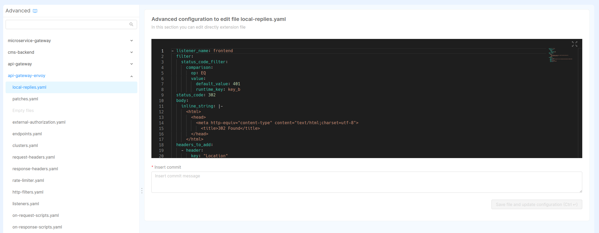

<!-- TODO update "img/marketplace_runtime_mngm_app_selection.png" image once application cards are available with updated description  -->

In order to ensure that only authorized people can access Fast Data Runtime Management system and consequently
visualize or change its state, it is important to properly set up a security layer.

In the following page are described the requirements and the process that has to be carried out to achieve your goal. It
is inspired from this [guide](/console/tutorials/configure-marketplace-components/auth-architecture/external-idp-internal-session.md).

## Requirements

- access to [Fast Data Control Plane With Access Control](/fast_data/runtime_management/overview.mdx) application, which automatically
  scaffold the configurations regarding microservices, collections, endpoints and variables needed for controlling Fast Data
  runtime and protecting its access. Generated resources need to be further customized depending on your needs and credentials.
- an introduction to [Envoy](https://envoyproxy.io/), which is employed as API Gateway by the application. It is also
  possible to employ [Nginx](https://www.nginx.com/) as API Gateway, though the focus of this guide is on the former.
- an introduction to [Rönd](https://rond-authz.io/), which is the underlying system this guide will rely on for protecting
  the access to Fast Data Runtime Management application.
- an Identity Provider, which manages users' identities. The one employed throughout this guide is [Okta](https://www.okta.com/),
  although any other Identity Provider supported by the Mia-Platform [Authentication Service](/runtime_suite/authentication-service/10_overview.md)
  can be adopted in place of Okta within this guide.

## Control Plane Configuration

Let's start by selecting the `Fast Data Control Plane With Access Control` application from the Marketplace, under the applications tab.

Then proceed step by step with the creation of the needed services, endpoints and collections. Once finalized, all those resources
should appear in the different Console section.


For more details on the Control Plane service configuration, please head over the dedicated [documentation section](/fast_data/runtime_management/control_plane.mdx).

### Enabling gRPC communication

The default configuration for the Control Plane specifies the use of [gRPC](https://grpc.io/) for communication. To enable gRPC communication,
a Kubernetes [Custom Resource](https://kubernetes.io/docs/tasks/extend-kubernetes/custom-resources/custom-resource-definitions/) should be associated with
the Control Plane instance and other Fast Data services intending to communicate with it via gRPC.

To create a new entry "from Scratch" from the _Custom Resources_ section in the _Design_ area, initialize the resource following the below table:

| Attribute  | Expanation                                                      |
| ---------- | --------------------------------------------------------------- |
| name       | The name of the Custom Resource (e.g. `crd-control-plane-grpc`) |
| kind       | `Service`                                                       |
| apiVersion | `v1`                                                            |

At the end, the Custom Resource should look like:

```yaml title=crd-control-plane-grpc.yaml
apiVersion: v1
kind: Service
metadata:
  name: crd-control-plane-grpc
  labels:
    app: control-plane
spec:
  type: ClusterIP
  ports:
    - name: grpc
      protocol: TCP
      port: 50051
      targetPort: 50051
      nodePort: null
  selector:
    app: control-plane
```

It is important to note that `metadata.labels.app` and `spec.selector.app` should match the name of the target Control Plane service.

## Authentication Flow

In this section are described which resources should be configured in order to properly protect the access to the Fast Data
Runtime Management solution.

### Services

Upon application instantiation, the following services should have been generated for handling the authentication flow:

- [`api-gateway`](/runtime_suite/envoy-api-gateway/overview.md), which is the entrypoint of your project requests
- [`authentication-service`](/runtime_suite/authentication-service/10_overview.md), which is the service that interacts with your Identity Provider to request the user identity verification
- `control-plane-login-site`, a frontend employed for handling the authentication flow in the browser
- `redis-auth`, a small instance of Redis OSS (< v7.4) with no disk persistence, which is employed to support the authentication flow

#### Api Gateway

For the current use case no further configuration is needed for this service in Console _Design_ area. However, if there
is a need for updating any specific detail, please look for more information at the dedicated [documentation page](/runtime_suite/envoy-api-gateway/overview.md).

#### Authentication Service

The service configuration is created with a set of preconfigured variables, such as the connection to Redis, and a config map
that lists the supported applications. Within the config map that contains the known applications it is already possible
to find the definition of an application that uses Okta as Identity Provider.

:::info
In case you would prefer using another Identity Provider, please read the [authentication-service documentation](/runtime_suite/authentication-service/20_configuration.mdx) to learn
how to configure the desired one in place of Okta.
:::

The configuration of included application only requires to set up few public and secret environment variables to be operational.
These variables are summarized in the tables below, divided for location where they should be stored. In fact, the former ones
should be added under the _Variables_ tab of _Project Overview_ section, while the latter can be configured in the _Public Variables_ of the _Design_ section.

| Secret Variable       | Explanation                                                               |
|-----------------------|---------------------------------------------------------------------------|
| CP_OKTA_CLIENT_ID     | client id obtained when registering this specific application on Okta     |
| CP_OKTA_CLIENT_SECRET | client secret obtained when registering this specific application on Okta |

| Public Variable | Explanation                                                                                                         |
| --------------- | ------------------------------------------------------------------------------------------------------------------- |
| OKTA_BASE_URL   | base url where your Identity Provider is exposed                                                                    |
| CP_APP_ID       | application identifier employed when registering this specific application on Okta (e.g. `fast-data-control-plane`) |
| CP_PROVIDER_ID  | provider identifier employed when registering this specific application on Okta (e.g. `okta-development`)           |
| CP_REDIS_SCOPE  | redis scope in case of a multi-tenant architecture                                                                  |
| CP_BASE_URL     | base url where the project is exposed                                                                               |

:::note
After the creation of the Control Plane application, the public variables specified above should already appear in the
corresponding section, each of them with an empty value.
:::

Filling the variables listed above allows to generate a complete configuration at deploy time. An example of such configuration for Okta
can be fond in the panel below.

<details><summary>Authentication Service | Configuration Example (with variables to be interpolated)</summary>

```json title=config.json
{
  "apps": {
    "{{CP_APP_ID}}": {
      "providers": {
        "{{CP_PROVIDER_ID}}": {
          "order": 10,
          "type": "okta",
          "label": "Login with Okta",
          "clientId": "{{CP_OKTA_CLIENT_ID}}",
          "clientSecret": "{{CP_OKTA_CLIENT_SECRET}}",
          "baseUrl": "{{OKTA_BASE_URL}}",
          "authUrl": "{{OKTA_BASE_URL}}/oauth2/v1/authorize",
          "tokenUrl": "{{OKTA_BASE_URL}}/oauth2/v1/token",
          "userInfoUrl": "{{OKTA_BASE_URL}}/oauth2/v1/userinfo",
          "userSettingsURL": "{{OKTA_BASE_URL}}/enduser/settings",
          "logoutUrl": "{{OKTA_BASE_URL}}/oauth2/v1/logout",
          "scope": [
            "openid",
            "profile",
            "email",
            "offline_access"
          ]
        }
      },
      "redirectUrl": "{{CP_BASE_URL}}/web-login/oauth/callback",
      "defaultRedirectUrlOnSuccessfulLogin": "/",
      "authorizeStateRequired": true,
      "realm": "console",
      "isWebsiteApp": true,
      "issuer": "{{CP_APP_ID}}",
      "defaultGroups": []
    }
  }
}
```

</details>

In addition to previous configurations, the service needs to mount a private key as a secret. This key is employed to
sign JWTs that are set as _session id_ for authenticated users. In case the service has been instantiated through the
`Fast Data Control Plane With Access Control` application, a secret has already been associated to it, which is named `authentication-service-secrets`.

:::caution
These instructions below assume that the tool employed to deploy Console projects is [`mlp`](/runtime_suite_tools/mlp/10_overview.md).
Please, remember to adapt them according to your adopted deploy tool and/or secret management configuration.
:::

In order for the Console to automatically create the secret at deploy time it is then necessary to edit the file `mlp.yaml`,
that can be found within your project repository root folder, and extend it with the following entry under the `secrets` key:

```yaml title=mlp.yaml
secrets:
  ...
  - name: "authentication-service-secrets"
    when: "always"
    data:
      - from: "literal"
        key: "private-key.pem"
        value: "{{CP_JWT_CLIENT_PRIVATE_KEY}}"
  ...
```

This will create a K8s secret named `authentication-service-secrets` which contains a property `private-key.pem` mapped
to the value of the interpolated variable `CP_JWT_CLIENT_PRIVATE_KEY`.  
To provide the proper value, please generate a private key, for example as follows,

```shell
ssh-keygen -t rsa -b 4096 -m PEM -f private.key
```

and then create the corresponding environment variable `CP_JWT_CLIENT_PRIVATE_KEY` in the _Variables_ tab of _Console Project Overview_ section.  
Finally, please ensure that on the `authentication-service`, located under the _Microservices_ section in the Console _Design_ area,
the environment `MIA_JWT_TOKEN_PRIVATE_KEY_FILE_PATH` is set to `/secrets/private-key.pem` (where the folder is driven
by the secret mount path and the file name corresponds to the `key` property set in the `mlp.yaml` configuration entry).

In case more details are needed on this latter part, please head over to the `authentication-service` [documentation page](/runtime_suite/authentication-service/30_usage.md#asymmetric-signing-algorithm-rsa256).

#### Control Plane Login Site

No further configuration is needed for this service.

#### Redis Auth

This service is preconfigured with a config map containing the initial Redis configuration, such as the disk persistence
management and a dedicated user with their ACLs. To complete the configuration it is necessary to create the following
secret environment variables in the _Project Overview_ section:

| Secret Variable          | Explanation                                                                                                                                            |
|--------------------------|--------------------------------------------------------------------------------------------------------------------------------------------------------|
| CP_REDIS_MASTER_PASSWORD | root password to allow Redis start (not used by any service - it can be loaded from a secret when configured within the service environment variables) |
| CP_REDIS_USERNAME        | username of the Redis account to be employed by the authentication-service for accessing Redis                                                         |
| CP_REDIS_PASSWORD        | password of the Redis account to be employed by the authentication-service for accessing Redis                                                         |

<details><summary>Redis Auth Service | Configuration Example (with variables to be interpolated)</summary>

```text title=redis.conf
## GENERIC ##
port 6379
# listen on all the interfaces for incoming connections
bind 0.0.0.0

## NO DISK PERSISTENCE ##
save ""
appendonly no

## SECURITY ##
protected-mode yes

# NOTE: +@connection is necessary to be placed after -@dangerous, otherwise the user won't have the permissions to connect to Redis
user {{CP_REDIS_USERNAME}} on +@all -@dangerous +@connection allkeys allchannels >{{CP_REDIS_PASSWORD}}

# disable default user
user default off
```

</details>

### Endpoints

Below is reported the list of endpoints created with the Control Plane application instantiation. Please
ensure that they are exposed with the proper security options.

| Endpoint        | Service                  | Authentication Required | User Group Permission |
| --------------- | ------------------------ | :---------------------: | --------------------- |
| `/web-login`    | control-plane-login-site |            -            | true                  |
| `/authorize`    | authentication-service   |            -            | true                  |
| `/oauth/token`  | authentication-service   |            -            | true                  |
| `/logout`       | authentication-service   |            -            | true                  |
| `/refreshtoken` | authentication-service   |           ✅            | true                  |
| `/userinfo`     | authentication-service   |           ✅            | true                  |
| `/apps`         | authentication-service   |            -            | true                  |

Knowing these endpoints are exposed, it is now possible to configure the redirect urls that some Identity Providers, such as Okta or Auth0, require to complete
the application registration. These endpoints will be then employed during the authentication flow to constrain the redirects
the Identity Provider can perform. In this case the endpoint that should be configured are the following ones:

- Sign-in redirect URIs → `<project-base-url>/web-login/oauth/callback`
- Sign-out redirect URIs → `<project-base-url>/logout`

where `<project-base-url>` is the base url where the project of interest is exposed to.

### Collections

The authentication flow via the `authentication-service` requires also the introduction of a CRUD Collection, where
users details are saved upon successful login. These user (_subject_) information can then be employed in the authorization flow, which is
described later, in conjunction with [policies](#policies) and [roles](#roles) to ensure that only authorized users can
visualize or even interact with Fast Data runtime.  
By default the `Fast Data Control Plane With Access Control` application creates the collection for you and instantiates the CRUD Service,
which is employed by the authentication service to access the collection. Additionally, below it is also provided the
collection definition ready for being imported, in case it may be necessary to move or replicate the collection in another Console project. 

<details><summary>Control Plane Users Collection Definition (import ready)</summary>

```json
{
  "data": {
    "collections": {
      "cp-users": {
        "id": "cp-users",
        "description": "Collection of cp-users",
        "name": "cp-users",
        "tags": [
          "collection"
        ],
        "fields": [
          {
            "name": "_id",
            "description": "_id",
            "type": "ObjectId",
            "required": true,
            "nullable": false
          },
          {
            "name": "creatorId",
            "description": "creatorId",
            "type": "string",
            "required": true,
            "nullable": false
          },
          {
            "name": "createdAt",
            "description": "createdAt",
            "type": "Date",
            "required": true,
            "nullable": false
          },
          {
            "name": "updaterId",
            "description": "updaterId",
            "type": "string",
            "required": true,
            "nullable": false
          },
          {
            "name": "updatedAt",
            "description": "updatedAt",
            "type": "Date",
            "required": true,
            "nullable": false
          },
          {
            "name": "__STATE__",
            "description": "__STATE__",
            "type": "string",
            "required": true,
            "nullable": false
          },
          {
            "name": "name",
            "type": "string",
            "required": false,
            "nullable": false,
            "sensitivityValue": 0,
            "encryptionEnabled": false,
            "encryptionSearchable": false
          },
          {
            "name": "groups",
            "type": "Array_string",
            "required": false,
            "nullable": false,
            "sensitivityValue": 0,
            "encryptionEnabled": false,
            "encryptionSearchable": false
          },
          {
            "name": "username",
            "type": "string",
            "required": false,
            "nullable": false,
            "sensitivityValue": 0,
            "encryptionEnabled": false,
            "encryptionSearchable": false
          },
          {
            "name": "email",
            "type": "string",
            "required": false,
            "nullable": false,
            "sensitivityValue": 0,
            "encryptionEnabled": false,
            "encryptionSearchable": false
          },
          {
            "name": "providerId",
            "type": "string",
            "required": true,
            "nullable": false,
            "sensitivityValue": 0,
            "encryptionEnabled": false,
            "encryptionSearchable": false
          },
          {
            "name": "providerUserId",
            "type": "string",
            "required": true,
            "nullable": false,
            "sensitivityValue": 0,
            "encryptionEnabled": false,
            "encryptionSearchable": false
          },
          {
            "name": "realm",
            "type": "string",
            "required": false,
            "nullable": false,
            "sensitivityValue": 0,
            "encryptionEnabled": false,
            "encryptionSearchable": false
          },
          {
            "name": "metadata",
            "type": "RawObject",
            "required": false,
            "nullable": false,
            "sensitivityValue": 0,
            "encryptionEnabled": false,
            "encryptionSearchable": false
          }
        ],
        "internalEndpoints": [
          {
            "basePath": "/cp-users",
            "defaultState": "PUBLIC"
          }
        ],
        "type": "collection",
        "indexes": [
          {
            "name": "_id",
            "type": "normal",
            "unique": true,
            "fields": [
              {
                "name": "_id",
                "order": 1
              }
            ]
          },
          {
            "name": "createdAt",
            "type": "normal",
            "unique": false,
            "fields": [
              {
                "name": "createdAt",
                "order": -1
              }
            ]
          },
          {
            "name": "stateIndex",
            "type": "normal",
            "unique": false,
            "fields": [
              {
                "name": "__STATE__",
                "order": 1
              }
            ]
          },
          {
            "name": "nameSearch",
            "type": "normal",
            "unique": false,
            "fields": [
              {
                "name": "email",
                "order": 1
              },
              {
                "name": "name",
                "order": 1
              },
              {
                "name": "__STATE__",
                "order": 1
              }
            ]
          },
          {
            "name": "upsertSupport",
            "type": "normal",
            "unique": false,
            "fields": [
              {
                "name": "providerId",
                "order": 1
              },
              {
                "name": "providerUserId",
                "order": 1
              },
              {
                "name": "realm",
                "order": 1
              }
            ]
          }
        ]
      }
    }
  },
  "metadata": {
    "branchName": "",
    "exportTimestamp": "2024-04-05T08:26:54.472Z",
    "isImported": false,
    "pathRefType": "revisions",
    "projectId": "",
    "projectName": ""
  }
}
```

</details>

### Advanced

In this section are described additional tweaks to be carried out on the API Gateway (Envoy), that enhance the interaction with
the runtime system and allow the solution to support authentication.

These modifications should be inserted in the proper file in the **Advanced** section of the Console _Design_ area, under
the key `api-gateway-envoy`.



:::note
Before proceeding, be sure to have configured Control Plane endpoints accordingly to their [specific documentation](/fast_data/runtime_management/control_plane.mdx#endpoints).
:::

#### Automatic redirect upon receiving 401 HTTP error

This configuration edit should be inserted in the file `local-replies.yml` and it enforces a redirect to the login
page every time a 401 HTTP error is encountered by the system. This ensures that the users authenticate before returning
to the page they were trying to browse.

```yml title=local-replies.yml
- listener_name: frontend
  filter:
    status_code_filter:
      comparison:
        op: EQ
        value:
          default_value: 401
          runtime_key: key_b
  status_code: 302
  body:
    inline_string: |-
      <html>
        <head>
          <meta http-equiv="content-type" content="text/html;charset=utf-8">
            <title>302 Found</title>
        </head>
      </html>
  headers_to_add:
    - header:
        key: "Location"
        value: "/web-login?appId={{CP_APP_ID}}&providerId={{CP_PROVIDER_ID}}&redirect=%REQ(:PATH)%"
      append: false
    - header:
        key: "Set-Cookie"
        value: "sid=; Max-Age=0"
      append: false
```

:::note
If you're using API Gateway with Nginx, consider using [this approach for automatic redirects](/runtime_suite_applications/secure-api-gateway/20_configuration.md#nginx).
:::

## Authorization

In this section are described which resources should be configured in order to properly grant the access
to the Fast Data Runtime Management solution only to authorized users.

### Services

#### Authorization Service

This service is introduced with the application creation and it is already preconfigured with all the necessary configurations.
In case the service already exists in your project, please ensure the following environment variables on the service contain
the following values

| Environment Variable | Value                                                                                                                                          |
|----------------------|------------------------------------------------------------------------------------------------------------------------------------------------|
| HEADERS_TO_PROXY     | connection,upgrade,sec-websocket-protocol,sec-websocket-version,x-request-id,request-id,cookie,authorization,client-type,host,x-forwarded-host |
| USERINFO_URL         | http://authentication-service/userinfo                                                                                                         |

In order to support real-time updates in the Fast Data Runtime Management system, it is important to allow proxying the following
headers:
- [`connection`](https://developer.mozilla.org/en-US/docs/Web/HTTP/Headers/Connection)
- [`upgrade`](https://developer.mozilla.org/en-US/docs/Web/HTTP/Headers/Upgrade)
- [`sec-websocket-protocol`](https://developer.mozilla.org/en-US/docs/Web/HTTP/Protocol_upgrade_mechanism#websocket-specific_headers)
- [`sec-websocket-version`](https://developer.mozilla.org/en-US/docs/Web/HTTP/Protocol_upgrade_mechanism#websocket-specific_headers)

#### Rönd

Once all the services are properly configured, it is necessary to protect them. To achieve so, in this guide we are going to rely on [Rönd](https://rond-authz.io/),
which allows to define for each service's endpoint the proper access policies. Hence, let's enable Rönd sidecar for the following
two services:

- `control-plane` → to regulate who can retrieve Fast Data runtime configuration and change its runtime state,
that is whether the underlying application is processing Fast Data events or it is instead paused 
- `crud-service` → to regulate who can access roles and bindings (discussed in the following paragraphs)

An example of Rönd enabled for these services can be observed in the image, which represents the _Authorization Management_ section
that can be found within Console _Design_ area:


For further instructions on how Rönd can be enabled, please read this [documentation](/development_suite/api-console/api-design/authorization.md) and this [tutorial](/console/tutorials/protect-your-endpoints-with-policies.mdx), which explains all the steps in details. 

#### Control Plane

Control Plane service is able to automatically instruct Rönd sidecar on which policies it should employ. This is obtained
by augmenting the OpenAPI Specification generated by the service with the `x-rond` property in each defined path,
as explained in the [documentation](https://rond-authz.io/docs/configuration#openapi-specification-file).

In particular, Control Plane service expects the name of two types of policies, one that allows viewing Fast Data runtime
configuration and status (e.g. `fd_control_plane_allow_view`) and one for interacting with it (e.g. `fd_control_plane_allow_edit`),
that is changing its components' state. These two policies name can be configured within the `settings` object that is found
within the service configuration config map, as follows:

```json
{
  ...
  "settings": {
    "server": {
      "apis": {
        "controllers": {
          "settings": {
            // this key defines which policies should be adopted
            "policies": {
              "edit": "fd_control_plane_allow_edit",
              "view": "fd_control_plane_allow_view"
            }
          }
        }
      }
    }
  },
  ...
}
```

### Policies

:::info
For more in-depth explanation on how to configure Rönd policies please head to the dedicated [documentation page](/console/tutorials/protect-your-endpoints-with-policies.mdx).
:::

Rönd Policies are set of rules that specify which constraints must be satisfied in order to grant the access to the protected
resources, such as endpoints. For example, an authenticated user might need to own a specific _permission_, have a particular _role_ or
belong to a _group_ with the proper grants. Furthermore, the request might require headers with proper values or even ad-hoc headers from
which request and user metadata are extracted.

In the previous paragraph it is described how to enable Rönd for the pods of interest, which occurs within the _Authorization Management_ panel
of Console _Design_ area. In the same panel, under the _policies_ tab of the Authorization section, it is possible to define the policies and their rules.
The specific panel tab is depicted in the image below:


Upon clicking the <kbd>Edit policies</kbd> button, a modal opens with two code blocks. On the left it is possible to write
the policies and their rules to be satisfied by requests, while on the right the code block allow to implement multiple
tests to verify that written rules adhere to expected behavior, granting the access only to correct users.

In the context of Fast Data Runtime Management application, it is recommended to set up the following four different policies,
each of them with its own purpose for controlling which user can access the different features:

| Policy Name                   | Explanation                                                        |
|-------------------------------|--------------------------------------------------------------------|
| `allow_all`                   | no permission is required to access the resource                   |
| `allow_manage_cp_users`       | users need the permission to manage Control Plane users            |
| `fd_control_plane_allow_view` | users need the permission to view runtime configuration and status |
| `fd_control_plane_allow_edit` | users need the permission to edit runtime status                   |

:::info
When Rönd is enabled for a pod, then the _deny-all_ policy is applied by default to the incoming connections. For this reason it is also
useful to introduce the `allow_all` policy.
:::

In the code block shown below are reported the policies definitions above described. These can be copied directly within your project
_Authentication Management_ section alongside their tests. 

```rego title="Authorization Management Policies"
package policies

allow_all {
  true
}

default allow_manage_cp_users = false
allow_manage_cp_users {
  # extract the roles associated to the user who performed the request
  userRoles := input.user.roles[_]
  
  # for each role, verify whether it has the permission to manage users 
  userRoles.permissions[_] == "console.data-fabric.control-plane.manage"
}

default fd_control_plane_allow_view = false
fd_control_plane_allow_view {
  userRoles := input.user.roles[_]
  userRoles.permissions[_] == "console.data-fabric.control-plane.view"
}
# defining multiple times the same policy is equivalent to setting their rules in an "or" statement
fd_control_plane_allow_view {
  userRoles := input.user.roles[_]
  userRoles.permissions[_] == "console.data-fabric.control-plane.edit"
}

default fd_control_plane_allow_edit = false
fd_control_plane_allow_edit {
  userRoles := input.user.roles[_]
  userRoles.permissions[_] == "console.data-fabric.control-plane.edit"
}
```

<details><summary>Authorization Management Policies Tests</summary>

```rego
package policies

test_allow_all {
  allow_all
}

test_allow_all_anonymous_user {
  allow_all with input as {
    "user": {
      "roles": []
    }
  }
}

test_allow_all_authenticated_user {
  allow_all with input as {
    "user": {
      "roles": [
        {
          "roleId": "control-plane-editor",
          "name": "editor",
          "description": "editor",
          "permissions": [
            "console.data-fabric.control-plane.editor"
          ]
        }
      ]
    }
  }
}

# ======================================= #

test_allow_manage_cp_users_default {
  not allow_manage_cp_users
}

test_allow_manage_cp_users_not_manager {
  not allow_manage_cp_users with input as {
    "user": {
      "roles": [
        {
          "roleId": "control-plane-editor",
          "name": "editor",
          "description": "editor",
          "permissions": [
            "console.data-fabric.control-plane.editor"
          ]
        }
      ]
    }
  }
}

test_allow_manage_cp_users_manager {
  allow_manage_cp_users with input as {
    "user": {
      "roles": [
        {
          "roleId": "control-plane-super-user",
          "name": "manager",
          "description": "manager",
          "permissions": [
            "console.data-fabric.control-plane.manage"
          ]
        }
      ]
    }
  }
}

# ======================================= #

test_fd_control_plane_allow_view_default {
  not fd_control_plane_allow_view
}

test_fd_control_plane_allow_view_no_permissions {
  not fd_control_plane_allow_view with input as {
    "user": {
      "roles": [
        {
          "roleId": "other",
          "name": "other",
          "description": "unauthorized",
          "permissions": [
          ]
        }
      ]
    }
  }
}

test_fd_control_plane_allow_view_developer {
  fd_control_plane_allow_view with input as {
    "user": {
      "roles": [
        {
          "roleId": "developer",
          "name": "Developer",
          "description": "can edit projects and view runtimes",
          "permissions": [
            "console.data-fabric.control-plane.view",
          ]
        }
      ]
    }
  }
}

test_fd_control_plane_allow_view_maintainer {
  fd_control_plane_allow_view with input as {
    "user": {
      "roles": [
        {
          "roleId": "project-admin",
          "name": "Project Administrator",
          "description": "can edit projects and runtimes",
          "permissions": [
            "console.data-fabric.control-plane.edit",
          ]
        }
      ]
    }
  }
}

test_fd_control_plane_allow_view_admin {
  fd_control_plane_allow_view with input as {
    "user": {
      "roles": [
        {
          "roleId": "project-admin",
          "name": "Project Administrator",
          "description": "can edit projects and runtimes",
          "permissions": [
            "console.data-fabric.control-plane.view",
            "console.data-fabric.control-plane.edit",
          ]
        }
      ]
    }
  }
}

test_fd_control_plane_allow_view_owner {
  not fd_control_plane_allow_view with input as {
    "user": {
      "roles": [
        {
          "roleId": "company-owner",
          "name": "Company Owner",
          "description": "can edit projects and runtimes",
          "permissions": [
            "console.fast-data.control-plane.manager"
          ]
        }
      ]
    }
  }
}

# ======================================= #

test_fd_control_plane_allow_edit_default {
  not fd_control_plane_allow_edit
}


test_fd_control_plane_allow_edit_no_permissions {
  not fd_control_plane_allow_edit with input as {
    "user": {
      "roles": [
        {
          "roleId": "other",
          "name": "other",
          "description": "unauthorized",
          "permissions": [
          ]
        }
      ]
    }
  }
}

test_fd_control_plane_allow_edit_developer {
  not fd_control_plane_allow_edit with input as {
    "user": {
      "roles": [
        {
          "roleId": "developer",
          "name": "Developer",
          "description": "can edit projects and view runtimes",
          "permissions": [
            "console.data-fabric.control-plane.view",
          ]
        }
      ]
    }
  }
}

test_fd_control_plane_allow_edit_maintainer {
  fd_control_plane_allow_edit with input as {
    "user": {
      "roles": [
        {
          "roleId": "maintainer",
          "name": "Maintainer",
          "description": "can edit projects and runtimes",
          "permissions": [
            "console.data-fabric.control-plane.view",
            "console.data-fabric.control-plane.edit",
          ]
        }
      ]
    }
  }
}

test_fd_control_plane_allow_edit_owner {
  not fd_control_plane_allow_edit with input as {
    "user": {
      "roles": [
        {
          "roleId": "company-owner",
          "name": "Company Owner",
          "description": "can edit projects and runtimes",
          "permissions": [
            "console.data-fabric.control-plane.manage",
          ]
        }
      ]
    }
  }
}
```

</details>

### [Roles](https://rond-authz.io/docs/policy-integration#roles)

Roles in Rönd characterize the set of capabilities a subject can assume within the application. This can be achieved by applying
specific permissions to each role, granting them different level of access and actions on the resource. For example, there can be the role of _viewer_,
which represents users that can view the Fast Data runtime configuration and state, but that cannot change it.
Similarly, the _editor_ role can represent users with the same access of the viewer, augmented with the capability
to also change the Fast Data runtime state.

In the previous paragraph we defined the policies that governs the access to Fast Data Runtime Management system. Those policies
verify the permissions associated to the roles assigned to the user requesting the resource.
For example, in the context of Fast Data Runtime Management, let's suppose user _Alice_ is assigned the runtime _viewer_ role, which
has the permission `console.data-fabric.control-plane.view`. Considering the policies definitions and the permission
the _viewer_ role has, the defined policies would act differently as follows:

| Policy Name                   |  Role  |                Is Allowed                 |
|-------------------------------|:------:|:-----------------------------------------:|
| `allow_all`                   | viewer | <span style={{color: "green"}}>Yes</span> |
| `allow_manage_cp_users`       | viewer |  <span style={{color: "red"}}>No</span>   |
| `fd_control_plane_allow_view` | viewer | <span style={{color: "green"}}>Yes</span> |
| `fd_control_plane_allow_edit` | viewer |  <span style={{color: "red"}}>No</span>   |

To allow a greater flexibility in roles management, roles details are stored within an external MongoDB collection, for example named as `rbac-roles`.
This collection is then employed by Rönd to learn which roles exists and can actually be assigned to a user, together with their associated permissions.

When used within the Console, Rönd automatically tries to create this collection definition, using as name the one defined
in the _Authentication Management_ section. The collection definition is important since it instructs the CRUD Service to create
the needed indexes, which speeds up reading roles from the database.  
In case you would like to import the _roles_ collection in another project where Rönd is not active (for example a project [dedicated to users management](#tips)),
here is provided the definition, which can be imported using the dedicated button in the _MongoDB CRUDs_ section in the _Design_ area.

<details><summary>Control Plane Roles Collection Definition (import ready)</summary>

```json
{
  "data": {
    "collections": {
      "rbac-roles": {
        "id": "rbac-roles",
        "description": "Collection rbac-roles created by RBAC Manager plugin for bindings management",
        "name": "rbac-roles",
        "tags": [
          "rbac-manager-plugin"
        ],
        "fields": [
          {
            "name": "_id",
            "description": "_id",
            "type": "ObjectId",
            "required": true,
            "nullable": false
          },
          {
            "name": "creatorId",
            "description": "creatorId",
            "type": "string",
            "required": true,
            "nullable": false
          },
          {
            "name": "createdAt",
            "description": "createdAt",
            "type": "Date",
            "required": true,
            "nullable": false
          },
          {
            "name": "updaterId",
            "description": "updaterId",
            "type": "string",
            "required": true,
            "nullable": false
          },
          {
            "name": "updatedAt",
            "description": "updatedAt",
            "type": "Date",
            "required": true,
            "nullable": false
          },
          {
            "name": "__STATE__",
            "description": "__STATE__",
            "type": "string",
            "required": true,
            "nullable": false
          },
          {
            "name": "roleId",
            "description": "unique role identifier",
            "type": "string",
            "required": true,
            "nullable": false
          },
          {
            "name": "name",
            "description": "human readable role name",
            "type": "string",
            "required": true,
            "nullable": false
          },
          {
            "name": "description",
            "type": "string",
            "required": false,
            "nullable": false
          },
          {
            "name": "permissions",
            "description": "list of permissions composing the role",
            "type": "Array_string",
            "required": true,
            "nullable": false
          }
        ],
        "internalEndpoints": [
          {
            "basePath": "/rbac-roles",
            "defaultState": "PUBLIC"
          }
        ],
        "owners": [
          {
            "owner": "rbac-manager-plugin"
          }
        ],
        "type": "collection",
        "indexes": [
          {
            "name": "_id",
            "type": "normal",
            "unique": true,
            "fields": [
              {
                "name": "_id",
                "order": 1
              }
            ]
          },
          {
            "name": "createdAt",
            "type": "normal",
            "unique": false,
            "fields": [
              {
                "name": "createdAt",
                "order": -1
              }
            ]
          },
          {
            "name": "uniqueRoleId",
            "type": "normal",
            "unique": true,
            "fields": [
              {
                "name": "roleId",
                "order": 1
              }
            ]
          }
        ]
      }
    }
  },
  "metadata": {
    "branchName": "",
    "exportTimestamp": "2024-04-09T12:34:10.483Z",
    "isImported": true,
    "pathRefType": "revisions",
    "projectId": "",
    "projectName": ""
  }
}
```

</details>

To cover all the main use cases of accessing the Fast Data Runtime Management system we devised three roles, which can
be loaded in the _roles_ collection. These roles are shown in this code block:

```json
[
  {
    "roleId" : "control-plane-viewer",
    "name" : "Viewer",
    "description" : "A user who can visualize Fast Data configuration and its runtime state",
    "permissions" : [
        "console.data-fabric.control-plane.view"
    ],
    "__STATE__" : "PUBLIC"
  },
  {
    "roleId" : "control-plane-editor",
    "name" : "Editor",
    "description" : "A user who can visualize Fast Data configuration and modify its runtime state",
    "permissions" : [
        "console.data-fabric.control-plane.view",
        "console.data-fabric.control-plane.edit"
    ],
    "__STATE__" : "PUBLIC"
  },
  {
    "roleId" : "control-plane-users-manager",
    "name" : "Manager",
    "description" : "A user who manages the users that can access Fast Data runtime",
    "permissions" : [
        "console.data-fabric.control-plane.manage"
    ],
    "__STATE__" : "PUBLIC"
  }
]
```

:::note
For more details on _roles_ meaning in the context of security model, please search up [Role-based Access Control (RBAC)](https://en.wikipedia.org/wiki/Role-based_access_control) model. 
:::

### [Bindings](https://rond-authz.io/docs/policy-integration#bindings)

> A Binding in Rönd represents an association between a set of Subjects (or groups), a set of Roles and (optionally) a Resource.

Eventually, once users (subjects) and roles are defined on the database, it is then possible to match them together within
the _bindings_ collection. Similarly to _roles_ collection, the collection is managed in Console by Rönd and it adopts the
definition provided below:

<details><summary>Control Plane Bindings Collection Definition (import ready)</summary>

```json
{
  "data": {
    "collections": {
      "rbac-bindings": {
        "id": "rbac-bindings",
        "description": "Collection rbac-bindings created by RBAC Manager plugin for bindings management",
        "name": "rbac-bindings",
        "tags": [
          "rbac-manager-plugin"
        ],
        "fields": [
          {
            "name": "_id",
            "description": "_id",
            "type": "ObjectId",
            "required": true,
            "nullable": false
          },
          {
            "name": "creatorId",
            "description": "creatorId",
            "type": "string",
            "required": true,
            "nullable": false
          },
          {
            "name": "createdAt",
            "description": "createdAt",
            "type": "Date",
            "required": true,
            "nullable": false
          },
          {
            "name": "updaterId",
            "description": "updaterId",
            "type": "string",
            "required": true,
            "nullable": false
          },
          {
            "name": "updatedAt",
            "description": "updatedAt",
            "type": "Date",
            "required": true,
            "nullable": false
          },
          {
            "name": "__STATE__",
            "description": "__STATE__",
            "type": "string",
            "required": true,
            "nullable": false
          },
          {
            "name": "bindingId",
            "description": "binding unique identifier",
            "type": "string",
            "required": true,
            "nullable": false
          },
          {
            "name": "groups",
            "description": "list of user groups subject to this binding",
            "type": "Array_string",
            "required": false,
            "nullable": false
          },
          {
            "name": "subjects",
            "description": "list of subjects of the binding",
            "type": "Array_string",
            "required": false,
            "nullable": false
          },
          {
            "name": "roles",
            "description": "list of roles identifiers that subjects will inherit from the binding",
            "type": "Array_string",
            "required": false,
            "nullable": false
          },
          {
            "name": "permissions",
            "description": "list of specific permissions that will be inherited by the subjects of the bindings",
            "type": "Array_string",
            "required": false,
            "nullable": false
          },
          {
            "name": "resource",
            "description": "resource on which the role permissions are evaluated from the binding",
            "type": "RawObject",
            "required": false,
            "nullable": false
          }
        ],
        "internalEndpoints": [
          {
            "basePath": "/rbac-bindings",
            "defaultState": "PUBLIC"
          }
        ],
        "owners": [
          {
            "owner": "rbac-manager-plugin"
          }
        ],
        "type": "collection",
        "indexes": [
          {
            "name": "_id",
            "type": "normal",
            "unique": true,
            "fields": [
              {
                "name": "_id",
                "order": 1
              }
            ]
          },
          {
            "name": "createdAt",
            "type": "normal",
            "unique": false,
            "fields": [
              {
                "name": "createdAt",
                "order": -1
              }
            ]
          },
          {
            "name": "uniqueBindingId",
            "type": "normal",
            "unique": true,
            "fields": [
              {
                "name": "bindingId",
                "order": 1
              }
            ]
          }
        ]
      }
    }
  },
  "metadata": {
    "branchName": "",
    "exportTimestamp": "2024-04-09T12:34:10.483Z",
    "isImported": true,
    "pathRefType": "revisions",
    "projectId": "",
    "projectName": ""
  }
}
```

</details>

To link users with their respective roles it is first necessary to create three bindings, one for each existing role as defined
in the code block reported beneath. These bindings can be imported directly in the _bindings_ collection to kickstart further operations.

```json
[
  {
    "bindingId" : "control-plane-users-managers",
    "subjects" : [],
    "roles" : [
      "control-plane-users-manager"
    ],
    "__STATE__" : "PUBLIC"
  },
  {
    "bindingId" : "control-plane-editors",
    "subjects" : [],
    "roles" : [
        "control-plane-viewer",
        "control-plane-editor"
    ],
    "__STATE__" : "PUBLIC"
  },
  {
    "bindingId" : "control-plane-viewers",
    "subjects" : [],
    "roles" : [
        "control-plane-viewer"
    ],
    "__STATE__" : "PUBLIC"
  }
]
```

Afterward, the link process executes in these steps:

- from the users collection `cp-users` is selected the user that needs to be associated
- from the found user the `_id` field is extracted as string value
- the `_id` string value is inserted as value in the `subjects` array of the binding representing the role of interest
to be associated with the selected user

For example, let's suppose that the details of _Alice_ user are the ones below:

```json
{
    "_id" : ObjectId("6606e94a0e85630ccda72486"),
    "__STATE__" : "PUBLIC",
    "providerId" : "okta",
    "providerUserId" : "user-id",
    "realm" : "my-kingdom",
    "createdAt" : ISODate("2024-03-29T16:16:10.037+0000"),
    "creatorId" : "public",
    "email" : "alice@platform.world",
    "groups" : [],
    "name" : "Alice",
    "updatedAt" : ISODate("2024-04-08T16:23:12.364+0000"),
    "updaterId" : "public",
    "username" : ""
}
```
and the goal is to allow Alice to both view and modify Fast Data runtime state. Then, the `control-plane-editors` binding
should become as follows:

```json
{
  "bindingId" : "control-plane-editors",
  "subjects" : [
    // _id of Alice user
    "6606e94a0e85630ccda72486"
  ],
  "roles" : [
      "control-plane-viewer",
      "control-plane-editor"
  ],
  "__STATE__" : "PUBLIC"
}
```

Following this change, _Alice_ user would be able to visualize Fast Data Runtime Management application and pause/resume
the state of the different components.

:::note
Changes to the roles and binding collections are independent of project deploys. For this reason, managing the runtime and
who can access it does not require further deploys.
:::

### Endpoints

In addition to the endpoints described in the [Authentication Flow](#endpoints) section, here are described the ones that expose
all the functionalities of Fast Data Runtime Management system, both the frontend and backend components.
The backend endpoints must be protected by Rönd with the appropriate [policies](#policies), as described in the table below.

Please notice that in case the policies were configured in [Control Plane settings](#control-plane), then no manual route needs to be added
in the _Authorization Management_ section, since they are inferred from the OpenAPI Specification exposed by the service itself.  
For further details on manual routes definition, please visit the specific [documentation](/development_suite/api-console/api-design/authorization.md#manual-routes-tab). 

| Endpoint                                  | Service          | Authentication Required | User Group Permission |           Policy            |
| ----------------------------------------- | ---------------- | :---------------------: | --------------------- | :-------------------------: |
| `/control-plane`                          | control-plane-fe |           ✅            | true                  |              -              |
| `/control-plane/fast-data`                | control-plane    |           ✅            | true                  | fd_control_plane_allow_edit |
| `/control-plane/fast-data/configurations` | control-plane    |           ✅            | true                  | fd_control_plane_allow_view |
| `/control-plane/fast-data/:id/feedback`   | control-plane    |           ✅            | true                  | fd_control_plane_allow_view |

:::caution
Please ensure that all these endpoints are set with _Authentication Required_ in their security details tab.
:::

## Users Management

Controlling which users can access the Fast Data Runtime Management system, their roles and bindings can be done either
via directly editing database records or calling CRUD Service APIs. However, having a front-end to execute these actions
would be a nice add-on to simplify these actions and to reduce errors related to possible mis-configurations.

This can be achieved thanks to the [Microfrontend Composer](/microfrontend-composer/what-is.md) tool, which allows crafting
and configuring web pages and applications. In particular, it is possible to build the pages for listing the users,
the existing roles and the bindings that link subjects with their roles.

An example of application that can be created is show in the picture below:


### Microfrontend Composer

Upon application instantiation, a predefined set of web pages are created and ready to be used once the project is deployed.
In case you would like to customize those pages here are provided their configuration, one for control plane users, one for
the roles and one for their bindings. These configuration can be loaded either as config map of [micro-lc](https://micro-lc.io/docs/) service
or within the advanced tab of the corresponding page in the Composer.

<details><summary>Control Plane Users Page</summary>

```json title=users-config.json
{
  "definitions": {
    "dataSchema": {
      "type": "object",
      "required": [
        "providerId",
        "providerUserId"
      ],
      "properties": {
        "_id": {
          "formOptions": {
            "hiddenOnInsert": true,
            "readOnlyOnUpdate": true
          },
          "visualizationOptions": {
            "hidden": true
          },
          "type": "string"
        },
        "creatorId": {
          "formOptions": {
            "hiddenOnInsert": true,
            "readOnlyOnUpdate": true
          },
          "visualizationOptions": {
            "hidden": true
          },
          "type": "string"
        },
        "createdAt": {
          "formOptions": {
            "hiddenOnInsert": true,
            "readOnlyOnUpdate": true
          },
          "visualizationOptions": {
            "hidden": true
          },
          "dateOptions": {
            "displayFormat": "YYYY-MM-DD hh:mm"
          },
          "format": "date-time",
          "type": "string"
        },
        "updaterId": {
          "formOptions": {
            "hiddenOnInsert": true,
            "readOnlyOnUpdate": true
          },
          "visualizationOptions": {
            "hidden": true
          },
          "type": "string"
        },
        "updatedAt": {
          "formOptions": {
            "hiddenOnInsert": true,
            "readOnlyOnUpdate": true
          },
          "visualizationOptions": {
            "hidden": true
          },
          "dateOptions": {
            "displayFormat": "YYYY-MM-DD hh:mm"
          },
          "format": "date-time",
          "type": "string"
        },
        "__STATE__": {
          "enum": [
            "PUBLIC",
            "DRAFT",
            "TRASH",
            "DELETED"
          ],
          "label": "STATE",
          "formOptions": {
            "readOnlyOnUpdate": true
          },
          "visualizationOptions": {
            "hidden": true,
            "iconMap": {
              "PUBLIC": {
                "shape": "roundedSquare",
                "color": "#52C41A"
              },
              "DRAFT": {
                "shape": "roundedSquare",
                "color": "#CDCDCE"
              },
              "TRASH": {
                "shape": "roundedSquare",
                "color": "#FF9933"
              }
            }
          },
          "type": "string"
        },
        "name": {
          "type": "string",
          "label": "Name"
        },
        "groups": {
          "type": "array",
          "visualizationOptions": {
            "hidden": true
          },
          "label": "Groups"
        },
        "username": {
          "type": "string",
          "label": "Username"
        },
        "email": {
          "type": "string",
          "visualizationOptions": {
            "hidden": true
          },
          "formOptions": {
            "readOnly": true,
            "hidden": true
          },
          "label": "Email"
        },
        "providerId": {
          "type": "string",
          "visualizationOptions": {
            "hidden": true
          },
          "formOptions": {
            "readOnly": true
          },
          "label": "Provider ID"
        },
        "providerUserId": {
          "type": "string",
          "visualizationOptions": {
            "hidden": true
          },
          "formOptions": {
            "readOnly": true
          },
          "label": "Provider User ID"
        },
        "realm": {
          "type": "string",
          "formOptions": {
            "readOnly": true
          },
          "label": "Realm"
        },
        "metadata": {
          "type": "object",
          "required": [],
          "additionalProperties": true,
          "label": "Metadata"
        }
      }
    }
  },
  "content": {
    "content": [
      {
        "content": [
          {
            "tag": "div",
            "content": [
              {
                "properties": {
                  "content": "Users"
                },
                "tag": "bk-title"
              },
              {
                "tag": "bk-refresh-button",
                "attributes": {
                  "style": "margin-left: 14px; align-self: end;"
                }
              },
              {
                "tag": "div",
                "attributes": {
                  "style": "flex-grow: 1;"
                }
              },
              {
                "properties": {
                  "placeholder": "Search..."
                },
                "tag": "bk-search-bar"
              },
              {
                "properties": {
                  "content": "",
                  "clickConfig": {
                    "type": "event",
                    "actionConfig": {
                      "label": "filter",
                      "payload": {}
                    }
                  },
                  "type": "outlined",
                  "iconId": "FunnelPlotOutlined"
                },
                "tag": "bk-button"
              }
            ],
            "attributes": {
              "style": "display: flex; flex-direction: row; gap: 10px; padding: 0 20px;"
            }
          },
          {
            "tag": "div",
            "attributes": {
              "style": "width: 100%; display: flex; justify-content: space-between;"
            },
            "content": [
              {
                "attributes": {
                  "style": "flex-grow: 1;"
                },
                "properties": {
                  "tabs": [
                    {
                      "key": "public",
                      "title": "Public",
                      "filters": [
                        {
                          "property": "__STATE__",
                          "operator": "equal",
                          "value": "PUBLIC"
                        }
                      ],
                      "order": 0
                    },
                    {
                      "title": "Draft",
                      "key": "draft",
                      "order": 2,
                      "filters": [
                        {
                          "property": "__STATE__",
                          "operator": "equal",
                          "value": "DRAFT"
                        }
                      ]
                    },
                    {
                      "title": "Trash",
                      "filters": [
                        {
                          "property": "__STATE__",
                          "operator": "equal",
                          "value": "TRASH"
                        }
                      ],
                      "order": 3,
                      "key": "trash"
                    }
                  ]
                },
                "tag": "bk-tabs"
              },
              {
                "attributes": {
                  "style": "margin-right: 4px"
                },
                "properties": {
                  "dataSchema": {
                    "$ref": "#/definitions/dataSchema"
                  },
                  "filters": []
                },
                "tag": "bk-filters-manager"
              }
            ]
          },
          {
            "tag": "div",
            "attributes": {
              "style": "padding: 0 20px;"
            },
            "content": {
              "tag": "bk-breadcrumbs",
              "properties": {
                "dataSchema": {
                  "$ref": "#/definitions/dataSchema"
                }
              }
            }
          }
        ],
        "tag": "header",
        "attributes": {
          "style": "display: flex; flex-direction: column; padding-top: 10px; background-color: white;"
        }
      },
      {
        "content": [
          {
            "properties": {
              "dataSchema": {
                "$ref": "#/definitions/dataSchema"
              },
              "maxLines": 10,
              "rowActions": {
                "kind": "icons",
                "actions": [
                  {
                    "label": "Delete",
                    "icon": "fas fa-trash",
                    "kind": "event",
                    "content": "delete-data",
                    "meta": {
                      "actionId": "delete-data"
                    },
                    "requireConfirm": true
                  }
                ]
              }
            },
            "tag": "bk-table"
          },
          {
            "properties": {
              "requireConfirm": {
                "onClose": true,
                "onSave": true
              },
              "dataSchema": {
                "$ref": "#/definitions/dataSchema"
              },
              "width": "70vw",
              "allowObjectAsTable": false,
              "editorHeight": "30vh"
            },
            "tag": "bk-form-modal"
          },
          {
            "tag": "bk-confirmation-modal"
          },
          {
            "properties": {
              "rootElementSelectors": "main.micro-lc-layout-content",
              "successEventMap": {
                "create-data": {
                  "title": "Success",
                  "content": "Data successfully created",
                  "type": "success"
                },
                "update-data": {
                  "title": "Success",
                  "content": "Data successfully updated",
                  "type": "success"
                },
                "delete-data": {
                  "title": "Success",
                  "content": "Data successfully deleted",
                  "type": "success"
                }
              },
              "errorEventMap": {
                "create-data": {
                  "title": "Error",
                  "content": "An error occurred during order creation",
                  "type": "error"
                },
                "update-data": {
                  "title": "Error",
                  "content": "An error occurred during order updated",
                  "type": "error"
                },
                "delete-data": {
                  "title": "Error",
                  "content": "An error occurred during order deletion",
                  "type": "error"
                }
              }
            },
            "tag": "bk-notifications",
            "attributes": {}
          }
        ],
        "tag": "main",
        "attributes": {
          "style": "flex-grow: 1; background-color: #f0f2f5; padding: 20px; overflow-y: auto;"
        }
      },
      {
        "content": [
          {
            "properties": {
              "dataSchema": {
                "$ref": "#/definitions/dataSchema"
              },
              "width": "40vw"
            },
            "tag": "bk-filter-drawer"
          }
        ],
        "tag": "aside"
      },
      {
        "content": [
          {
            "tag": "bk-bulk-delete"
          },
          {
            "tag": "bk-bulk-actions",
            "properties": {
              "dataSchema": {
                "$ref": "#/definitions/dataSchema"
              }
            }
          },
          {
            "tag": "div",
            "attributes": {
              "style": "flex-grow: 1;"
            }
          },
          {
            "tag": "bk-footer",
            "attributes": {
              "style": "display: flex; justify-content: end; align-items: center;"
            }
          },
          {
            "tag": "bk-pagination",
            "properties": {
              "pageSize": 10
            }
          }
        ],
        "tag": "footer",
        "attributes": {
          "style": "display: flex; flex-direction: row; flex-wrap: wrap; padding: 10px 20px; background-color: white; gap: 10px; position: sticky; bottom: 0; z-index: 10"
        }
      },
      {
        "properties": {
          "basePath": "/v2/rond/cp-users",
          "dataSchema": {
            "$ref": "#/definitions/dataSchema"
          }
        },
        "tag": "bk-crud-client"
      }
    ],
    "tag": "div",
    "attributes": {
      "style": "width: 100%; height: 100%; display: flex; flex-direction: column; position: relative;"
    }
  },
  "sources": [
    "https://cdn.mia-platform.eu/backoffice/bk-web-components/{{BACK_KIT_VERSION}}/dist/bk-web-components.esm.js"
  ]
}
```

</details>
<details><summary>Roles Page</summary>

```json title=roles-config.json
{
  "definitions": {
    "dataSchema": {
      "type": "object",
      "required": [
        "roleId",
        "name",
        "permissions"
      ],
      "properties": {
        "_id": {
          "formOptions": {
            "hiddenOnInsert": true,
            "readOnlyOnUpdate": true
          },
          "type": "string",
          "visualizationOptions": {
            "hidden": true
          }
        },
        "creatorId": {
          "formOptions": {
            "hiddenOnInsert": true,
            "readOnlyOnUpdate": true
          },
          "type": "string",
          "visualizationOptions": {
            "hidden": true
          }
        },
        "createdAt": {
          "formOptions": {
            "hiddenOnInsert": true,
            "readOnlyOnUpdate": true
          },
          "dateOptions": {
            "displayFormat": "YYYY-MM-DD hh:mm"
          },
          "format": "date-time",
          "type": "string",
          "visualizationOptions": {
            "hidden": true
          }
        },
        "updaterId": {
          "formOptions": {
            "hiddenOnInsert": true,
            "readOnlyOnUpdate": true
          },
          "type": "string",
          "visualizationOptions": {
            "hidden": true
          }
        },
        "updatedAt": {
          "formOptions": {
            "hiddenOnInsert": true,
            "readOnlyOnUpdate": true
          },
          "dateOptions": {
            "displayFormat": "YYYY-MM-DD hh:mm"
          },
          "format": "date-time",
          "type": "string",
          "visualizationOptions": {
            "hidden": true
          }
        },
        "__STATE__": {
          "enum": [
            "PUBLIC",
            "DRAFT",
            "TRASH",
            "DELETED"
          ],
          "formOptions": {
            "readOnlyOnUpdate": true
          },
          "type": "string",
          "visualizationOptions": {
            "iconMap": {
              "PUBLIC": {
                "shape": "roundedSquare",
                "color": "#52C41A"
              },
              "DRAFT": {
                "shape": "roundedSquare",
                "color": "#CDCDCE"
              },
              "TRASH": {
                "shape": "roundedSquare",
                "color": "#FF9933"
              }
            },
            "hidden": true
          }
        },
        "roleId": {
          "type": "string",
          "description": "unique role identifier",
          "formOptions": {
            "readOnlyOnUpdate": true
          },
          "label": "Role ID"
        },
        "name": {
          "type": "string",
          "description": "human readable role name",
          "label": "Name"
        },
        "description": {
          "type": "string",
          "label": "Description"
        },
        "permissions": {
          "type": "array",
          "description": "list of permissions composing the role",
          "label": "Permissions"
        }
      }
    }
  },
  "content": {
    "content": [
      {
        "content": [
          {
            "tag": "div",
            "content": [
              {
                "properties": {
                  "content": "Roles"
                },
                "tag": "bk-title"
              },
              {
                "tag": "bk-refresh-button",
                "attributes": {
                  "style": "margin-left: 14px; align-self: end;"
                }
              },
              {
                "tag": "div",
                "attributes": {
                  "style": "flex-grow: 1;"
                }
              },
              {
                "properties": {
                  "placeholder": "Search..."
                },
                "tag": "bk-search-bar"
              },
              {
                "tag": "bk-add-new-button"
              },
              {
                "properties": {
                  "content": "",
                  "clickConfig": {
                    "type": "event",
                    "actionConfig": {
                      "label": "filter",
                      "payload": {}
                    }
                  },
                  "type": "outlined",
                  "iconId": "FunnelPlotOutlined"
                },
                "tag": "bk-button"
              }
            ],
            "attributes": {
              "style": "display: flex; flex-direction: row; gap: 10px; padding: 0 20px;"
            }
          },
          {
            "tag": "div",
            "attributes": {
              "style": "width: 100%; display: flex; justify-content: space-between;"
            },
            "content": [
              {
                "attributes": {
                  "style": "flex-grow: 1;"
                },
                "properties": {
                  "tabs": [
                    {
                      "key": "public",
                      "title": "Public",
                      "filters": [
                        {
                          "property": "__STATE__",
                          "operator": "equal",
                          "value": "PUBLIC"
                        }
                      ],
                      "order": 0
                    },
                    {
                      "title": "Draft",
                      "order": 2,
                      "key": "draft",
                      "filters": [
                        {
                          "property": "__STATE__",
                          "operator": "equal",
                          "value": "DRAFT"
                        }
                      ]
                    },
                    {
                      "title": "Trash",
                      "order": 3,
                      "key": "trash",
                      "filters": [
                        {
                          "property": "__STATE__",
                          "operator": "equal",
                          "value": "TRASH"
                        }
                      ]
                    }
                  ]
                },
                "tag": "bk-tabs"
              },
              {
                "attributes": {
                  "style": "margin-right: 4px"
                },
                "properties": {
                  "dataSchema": {
                    "$ref": "#/definitions/dataSchema"
                  },
                  "filters": []
                },
                "tag": "bk-filters-manager"
              }
            ]
          },
          {
            "tag": "div",
            "attributes": {
              "style": "padding: 0 20px;"
            },
            "content": {
              "tag": "bk-breadcrumbs",
              "properties": {
                "dataSchema": {
                  "$ref": "#/definitions/dataSchema"
                }
              }
            }
          }
        ],
        "tag": "header",
        "attributes": {
          "style": "display: flex; flex-direction: column; padding-top: 10px; background-color: white;"
        }
      },
      {
        "content": [
          {
            "properties": {
              "dataSchema": {
                "$ref": "#/definitions/dataSchema"
              },
              "maxLines": 10,
              "rowActions": {
                "kind": "icons",
                "actions": [
                  {
                    "label": "Delete",
                    "icon": "fas fa-trash",
                    "kind": "event",
                    "content": "delete-data",
                    "meta": {
                      "actionId": "delete-data"
                    },
                    "requireConfirm": true
                  }
                ]
              }
            },
            "tag": "bk-table"
          },
          {
            "properties": {
              "requireConfirm": {
                "onClose": true,
                "onSave": true
              },
              "dataSchema": {
                "$ref": "#/definitions/dataSchema"
              },
              "width": "70vw"
            },
            "tag": "bk-form-modal"
          },
          {
            "tag": "bk-confirmation-modal"
          },
          {
            "properties": {
              "rootElementSelectors": "main.micro-lc-layout-content",
              "successEventMap": {
                "create-data": {
                  "title": "Success",
                  "content": "Data successfully created",
                  "type": "success"
                },
                "update-data": {
                  "title": "Success",
                  "content": "Data successfully updated",
                  "type": "success"
                },
                "delete-data": {
                  "title": "Success",
                  "content": "Data successfully deleted",
                  "type": "success"
                }
              },
              "errorEventMap": {
                "create-data": {
                  "title": "Error",
                  "content": "An error occurred during order creation",
                  "type": "error"
                },
                "update-data": {
                  "title": "Error",
                  "content": "An error occurred during order updated",
                  "type": "error"
                },
                "delete-data": {
                  "title": "Error",
                  "content": "An error occurred during order deletion",
                  "type": "error"
                }
              }
            },
            "tag": "bk-notifications",
            "attributes": {}
          }
        ],
        "tag": "main",
        "attributes": {
          "style": "flex-grow: 1; background-color: #f0f2f5; padding: 20px; overflow-y: auto;"
        }
      },
      {
        "content": [
          {
            "properties": {
              "dataSchema": {
                "$ref": "#/definitions/dataSchema"
              },
              "width": "40vw"
            },
            "tag": "bk-filter-drawer"
          }
        ],
        "tag": "aside"
      },
      {
        "content": [
          {
            "tag": "bk-bulk-delete"
          },
          {
            "tag": "bk-bulk-actions",
            "properties": {
              "dataSchema": {
                "$ref": "#/definitions/dataSchema"
              }
            }
          },
          {
            "tag": "div",
            "attributes": {
              "style": "flex-grow: 1;"
            }
          },
          {
            "tag": "bk-footer",
            "attributes": {
              "style": "display: flex; justify-content: end; align-items: center;"
            }
          },
          {
            "tag": "bk-pagination",
            "properties": {
              "pageSize": 10
            }
          }
        ],
        "tag": "footer",
        "attributes": {
          "style": "display: flex; flex-direction: row; flex-wrap: wrap; padding: 10px 20px; background-color: white; gap: 10px; position: sticky; bottom: 0; z-index: 10"
        }
      },
      {
        "properties": {
          "basePath": "/v2/rond/rbac-roles",
          "dataSchema": {
            "$ref": "#/definitions/dataSchema"
          }
        },
        "tag": "bk-crud-client"
      }
    ],
    "tag": "div",
    "attributes": {
      "style": "width: 100%; height: 100%; display: flex; flex-direction: column; position: relative;"
    }
  },
  "sources": [
    "https://cdn.mia-platform.eu/backoffice/bk-web-components/{{BACK_KIT_VERSION}}/dist/bk-web-components.esm.js"
  ]
}
```

</details>
<details><summary>Bindings Page</summary>

```json title=bindings-config.json
{
  "definitions": {
    "dataSchema": {
      "type": "object",
      "required": [
        "bindingId"
      ],
      "properties": {
        "_id": {
          "formOptions": {
            "hiddenOnInsert": true,
            "readOnlyOnUpdate": true
          },
          "type": "string",
          "visualizationOptions": {
            "hidden": true
          }
        },
        "creatorId": {
          "formOptions": {
            "hiddenOnInsert": true,
            "readOnlyOnUpdate": true
          },
          "type": "string",
          "visualizationOptions": {
            "hidden": true
          }
        },
        "createdAt": {
          "formOptions": {
            "hiddenOnInsert": true,
            "readOnlyOnUpdate": true
          },
          "dateOptions": {
            "displayFormat": "YYYY-MM-DD hh:mm"
          },
          "format": "date-time",
          "type": "string",
          "visualizationOptions": {
            "hidden": true
          }
        },
        "updaterId": {
          "formOptions": {
            "hiddenOnInsert": true,
            "readOnlyOnUpdate": true
          },
          "type": "string",
          "visualizationOptions": {
            "hidden": true
          }
        },
        "updatedAt": {
          "formOptions": {
            "hiddenOnInsert": true,
            "readOnlyOnUpdate": true
          },
          "dateOptions": {
            "displayFormat": "YYYY-MM-DD hh:mm"
          },
          "format": "date-time",
          "type": "string",
          "visualizationOptions": {
            "hidden": true
          }
        },
        "__STATE__": {
          "enum": [
            "PUBLIC",
            "DRAFT",
            "TRASH",
            "DELETED"
          ],
          "formOptions": {
            "readOnlyOnUpdate": true
          },
          "type": "string",
          "label": "STATE",
          "visualizationOptions": {
            "iconMap": {
              "PUBLIC": {
                "shape": "roundedSquare",
                "color": "#52C41A"
              },
              "DRAFT": {
                "shape": "roundedSquare",
                "color": "#CDCDCE"
              },
              "TRASH": {
                "shape": "roundedSquare",
                "color": "#FF9933"
              }
            },
            "hidden": true
          }
        },
        "bindingId": {
          "type": "string",
          "description": "binding unique identifier ",
          "formOptions": {
            "readOnlyOnUpdate": true
          },
          "label": "Binding ID"
        },
        "groups": {
          "type": "array",
          "description": "list of user groups subject to this binding",
          "label": "Groups"
        },
        "subjects": {
          "type": "array",
          "description": "list of subjects of the binding",
          "excludeFromSearch": false,
          "format": "multilookup",
          "lookupOptions": {
            "lookupValue": "_id",
            "lookupFields": [
              "name"
            ],
            "lookupDataSource": "rond/cp-users"
          },
          "label": "Subjects"
        },
        "roles": {
          "type": "array",
          "description": "list of roles identifiers that subjects will inherit from the binding",
          "visualizationOptions": {
            "hidden": false
          },
          "excludeFromSearch": false,
          "format": "multilookup",
          "lookupOptions": {
            "lookupValue": "roleId",
            "lookupFields": [
              "name"
            ],
            "lookupDataSource": "rond/rbac-roles"
          },
          "label": "Roles"
        },
        "permissions": {
          "type": "array",
          "description": "list of specific permissions that will be inherited by the subjects of the bindings",
          "visualizationOptions": {
            "hidden": true
          },
          "label": "Permissions"
        },
        "resource": {
          "type": "object",
          "description": "resource on which the role permissions are evaluated from the binding",
          "required": [],
          "additionalProperties": true,
          "visualizationOptions": {
            "hidden": true
          },
          "label": "Resource"
        }
      }
    }
  },
  "content": {
    "content": [
      {
        "content": [
          {
            "tag": "div",
            "content": [
              {
                "properties": {
                  "content": "Bindings"
                },
                "tag": "bk-title"
              },
              {
                "tag": "bk-refresh-button",
                "attributes": {
                  "style": "margin-left: 14px; align-self: end;"
                }
              },
              {
                "tag": "div",
                "attributes": {
                  "style": "flex-grow: 1;"
                }
              },
              {
                "properties": {
                  "placeholder": "Search..."
                },
                "tag": "bk-search-bar"
              },
              {
                "tag": "bk-add-new-button"
              },
              {
                "properties": {
                  "content": "",
                  "clickConfig": {
                    "type": "event",
                    "actionConfig": {
                      "label": "filter",
                      "payload": {}
                    }
                  },
                  "type": "outlined",
                  "iconId": "FunnelPlotOutlined"
                },
                "tag": "bk-button"
              }
            ],
            "attributes": {
              "style": "display: flex; flex-direction: row; gap: 10px; padding: 0 20px;"
            }
          },
          {
            "tag": "div",
            "attributes": {
              "style": "width: 100%; display: flex; justify-content: space-between;"
            },
            "content": [
              {
                "attributes": {
                  "style": "flex-grow: 1;"
                },
                "properties": {
                  "tabs": [
                    {
                      "key": "public",
                      "title": "Public",
                      "filters": [
                        {
                          "property": "__STATE__",
                          "operator": "equal",
                          "value": "PUBLIC"
                        }
                      ],
                      "order": 0
                    },
                    {
                      "title": "Draft",
                      "order": 2,
                      "key": "draft",
                      "filters": [
                        {
                          "property": "__STATE__",
                          "operator": "equal",
                          "value": "DRAFT"
                        }
                      ]
                    },
                    {
                      "title": "Trash",
                      "order": 3,
                      "key": "trash",
                      "filters": [
                        {
                          "property": "__STATE__",
                          "operator": "equal",
                          "value": "TRASH"
                        }
                      ]
                    }
                  ]
                },
                "tag": "bk-tabs"
              },
              {
                "attributes": {
                  "style": "margin-right: 4px"
                },
                "properties": {
                  "dataSchema": {
                    "$ref": "#/definitions/dataSchema"
                  },
                  "filters": []
                },
                "tag": "bk-filters-manager"
              }
            ]
          },
          {
            "tag": "div",
            "attributes": {
              "style": "padding: 0 20px;"
            },
            "content": {
              "tag": "bk-breadcrumbs",
              "properties": {
                "dataSchema": {
                  "$ref": "#/definitions/dataSchema"
                }
              }
            }
          }
        ],
        "tag": "header",
        "attributes": {
          "style": "display: flex; flex-direction: column; padding-top: 10px; background-color: white;"
        }
      },
      {
        "content": [
          {
            "properties": {
              "dataSchema": {
                "$ref": "#/definitions/dataSchema"
              },
              "maxLines": 10,
              "rowActions": {
                "kind": "icons",
                "actions": [
                  {
                    "label": "Delete",
                    "icon": "fas fa-trash",
                    "kind": "event",
                    "content": "delete-data",
                    "meta": {
                      "actionId": "delete-data"
                    },
                    "requireConfirm": true
                  }
                ]
              },
              "showArrayPopover": false
            },
            "tag": "bk-table"
          },
          {
            "properties": {
              "requireConfirm": {
                "onClose": true,
                "onSave": true
              },
              "width": "70vw",
              "dataSchema": {
                "$ref": "#/definitions/dataSchema"
              },
              "editorHeight": "30vh"
            },
            "tag": "bk-form-modal"
          },
          {
            "tag": "bk-confirmation-modal"
          },
          {
            "properties": {
              "rootElementSelectors": "main.micro-lc-layout-content",
              "successEventMap": {
                "create-data": {
                  "title": "Success",
                  "content": "Data successfully created",
                  "type": "success"
                },
                "update-data": {
                  "title": "Success",
                  "content": "Data successfully updated",
                  "type": "success"
                },
                "delete-data": {
                  "title": "Success",
                  "content": "Data successfully deleted",
                  "type": "success"
                }
              },
              "errorEventMap": {
                "create-data": {
                  "title": "Error",
                  "content": "An error occurred during order creation",
                  "type": "error"
                },
                "update-data": {
                  "title": "Error",
                  "content": "An error occurred during order updated",
                  "type": "error"
                },
                "delete-data": {
                  "title": "Error",
                  "content": "An error occurred during order deletion",
                  "type": "error"
                }
              }
            },
            "tag": "bk-notifications",
            "attributes": {}
          }
        ],
        "tag": "main",
        "attributes": {
          "style": "flex-grow: 1; background-color: #f0f2f5; padding: 20px; overflow-y: auto;"
        }
      },
      {
        "content": [
          {
            "properties": {
              "dataSchema": {
                "$ref": "#/definitions/dataSchema"
              },
              "width": "40vw"
            },
            "tag": "bk-filter-drawer"
          }
        ],
        "tag": "aside"
      },
      {
        "content": [
          {
            "tag": "bk-bulk-delete"
          },
          {
            "tag": "bk-bulk-actions",
            "properties": {
              "dataSchema": {
                "$ref": "#/definitions/dataSchema"
              }
            }
          },
          {
            "tag": "div",
            "attributes": {
              "style": "flex-grow: 1;"
            }
          },
          {
            "tag": "bk-footer",
            "attributes": {
              "style": "display: flex; justify-content: end; align-items: center;"
            }
          },
          {
            "tag": "bk-pagination",
            "properties": {
              "pageSize": 10
            }
          }
        ],
        "tag": "footer",
        "attributes": {
          "style": "display: flex; flex-direction: row; flex-wrap: wrap; padding: 10px 20px; background-color: white; gap: 10px; position: sticky; bottom: 0; z-index: 10"
        }
      },
      {
        "properties": {
          "basePath": "/v2/rond/rbac-bindings",
          "dataSchema": {
            "$ref": "#/definitions/dataSchema"
          }
        },
        "tag": "bk-crud-client"
      },
      {
        "properties": {
          "basePath": "/v2",
          "dataSchema": {
            "$ref": "#/definitions/dataSchema"
          }
        },
        "tag": "bk-crud-lookup-client"
      }
    ],
    "tag": "div",
    "attributes": {
      "style": "width: 100%; height: 100%; display: flex; flex-direction: column; position: relative;"
    }
  },
  "sources": [
    "https://cdn.mia-platform.eu/backoffice/bk-web-components/{{BACK_KIT_VERSION}}/dist/bk-web-components.esm.js"
  ]
}
```

</details>


The screenshot above shows what the Composer tool should look like based on the application configuration.
Before deploying, please verify that micro-lc public variables have been created, that are:

| Public Variable          | Current Version Value | Minimum Version Value |
|--------------------------|-----------------------|-----------------------|
| MICRO_LC_VERSION         | 2.4.0                 | 2.2.3                 |
| MICRO_LC_MANAGER_VERSION | 3.1.1                 | 3.0.6                 |
| BACK_KIT_VERSION         | 1.5.0                 | 1.4.17                |

These variables are employed by the Console to define the version of the service and libraries used by micro-lc at deploy time.
They can be upgraded whenever an update is available.

### Endpoints

Here are described the endpoints that should be exposed from the project for the users management application. It is
important to notice that the Rönd policies on CRUD Service endpoints must be created manually. 

| Endpoint                   | Service  | Authentication Required | User Group Permission |        Policy         |
| -------------------------- | -------- | :---------------------: | --------------------- | :-------------------: |
| `/micro-lc-configurations` | micro-lc |           ✅            | true                  |           -           |
| `/control-plane-manager`   | micro-lc |           ✅            | groups.admin          |           -           |
| `/rond/rbac-bindings`      | crud     |           ✅            | groups.admin          | allow_manage_cp_users |
| `/rond/rbac-roles`         | crud     |           ✅            | groups.admin          | allow_manage_cp_users |
| `/rond/cp-users`           | crud     |           ✅            | groups.admin          |       allow_all       |

:::caution
Please ensure that all these endpoints are set with _Authentication Required_ in their security details tab.
:::

:::info
Adding the `admin` group to User Group Permission of the endpoints configuration requires users to belong to the group `admin`,
that is, their record on the database should contain the value `admin` under the property `groups`.

This is an example of user record which belongs to the `admins` group:

```json
{
  "_id" : ObjectId("6606e94a0e85630ccda72486"),
  "__STATE__" : "PUBLIC",
  "providerId" : "okta",
  "providerUserId" : "user-id",
  "realm" : "my-kingdom",
  "createdAt" : ISODate("2024-03-29T16:16:10.037+0000"),
  "creatorId" : "public",
  "email" : "alice@platform.world",
  "groups" : [
    // here the admin group has been added to the user
    "admin"
  ],
  "name" : "Alice",
  "updatedAt" : ISODate("2024-04-08T16:23:12.364+0000"),
  "updaterId" : "public",
  "username" : ""
}
```

🚨🚨🚨  
Please notice that <u>until no user is assigned to the `admin` group, then no user would be able to manage the users, roles and bindings</u>.
Therefore, either the group is added to the user via editing database record or the `admin` group is set in User Group Permission only after the first
subject is assigned to the `admin` group via the application UI.  
🚨🚨🚨
:::

## Tips

Currently, the configurations described in the previous sections regard a single project deployed in a single namespace.
Since in general a different database is employed for each runtime environment of a project, this means that records in users, roles and permissions
collections should be replicated on each database of deployed runtimes. For example, let's suppose a Console project has
associated two environment, _development_ and _production_. Consequently, the records defined in the collections of _development_ environment
should be copied/imported over the collection of the _production_ environment in order to replicate the same authorization behavior in both environments.  
Similarly, when working on different Console projects that probably have their own database, one for each of their environment, it is necessary
to redeclare the users, roles and bindings across all the databases involved.

:::note
The _users_ collection is filled in every time a new user first login in the application, so that on that collection it may only be needed to add the `admin` group
to the relevant users.
:::

One possible manner to solve this issue and simplify users management across multiple project is sharing the database containing
the users, roles and bindings collections across them. This could be reached by creating a MongoDB database dedicated to users management,
which can be accessed using its own connection string. The connection string should then be included in each project of interest,
either as a K8s secret or as a secret environment variable in Console Overview area.

As a result, when it is necessary to configure Rönd in the _Authorization Management_ section of Console _Design_ area, it is possible
to use the dedicated database as MongoDB connection. The image below shows that Rönd uses a MongoDB connection defined in the secret,
which we configured to point to the dedicated Fast Data runtime users management database.


While the Rönd configuration shown above must be carried out in all the projects that should access the users, deploying
the web application that manages users can be done in a single _"master"_ project that governs all the other.

:::caution
When setting up the _users_, _roles_ and _bindings_ collections in the dedicated database, please ensure that indexes are created appropriately 
:::