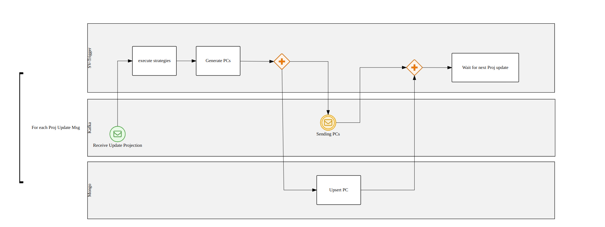

The Single View Trigger is a Micro service available on the marketplace, whose purpose is to link the Real-Time Updater and the Single View Creator.

The service will consume [Kafka messages](https://kafka.apache.org/intro#intro_concepts_and_terms) produced by the RTU on a specific topic that will follow the following [naming convention](./inputs_and_outputs.md#topic-naming-convention-1), it will execute the appropriate strategies and generate projection changes either on Mongo or Kafka.

:::info
This service is not necessary at the moment, but it is well recommended for use cases where there is large traffic of projection updates, which could cause malfunctions to the Real-Time Updater.
:::
