:::caution
This Plugin is a BETA Plugin and, as such, is currently under active development. Pay attention using it.
:::

The Single View Trigger Generator is a new component of the Fast Data architecture. Its introduction enables a full-event driver architecture and allows splitting the import phase
from [strategies](/fast_data/the_basics.md#strategies) execution, which are currently handled both by the [Real Time Updater](/fast_data/realtime_updater.md).

Here below a diagram showing how the Single View Trigger Generator service integrates with Fast Data flow is provided:

In this particular Fast Data configuration, Real-Time Updater is set to not execute projection changes strategies, but to rather emit a [Projection Update event](/fast_data/inputs_and_outputs.md#projection-update) (also known as `pr-update`) for each modified projection.  
The Single View Trigger Generator reacts to these events executing the corresponding projection change strategy. The strategy produces one or more identifiers of the Single View that needs to be updated.
This information is then passed over to the downstream component through [Single View Trigger events](/fast_data/inputs_and_outputs.md#single-view-trigger) (also known as `sv-trigger`), one for each produced Single View identifier.  
Eventually, the [Single View Creator](/fast_data/single_view_creator.md) consumes these events triggering the corresponding logic for aggregating the interested Single View.

### Advantages of adopting the Single View Trigger Generator

The main change occurring due to the introduction of the Single View Trigger Generator is the decoupling of projections import logic from the one in charge identifying which Single View should be updated.
This effect leads to the following advantages:

- full event-driven architecture to boost services reactivity
- operations occurring during initial load phase are easier to handle and carry out
- processing load can be better spread across the two services depending on the requirements, so that it is possible to optimize the different number of services' replicas depending on the ongoing situation
- the projection changes identifier are handled only within the event streaming platform (via `sv-trigger` events), so that they don't require additional space on the database

### Migration Guide for adopting Single View Trigger Generator

In order to introduce the Single View Trigger Generator in the Fast Data flow it is necessary to update the configuration of the Real-Time Updater and the Single View Creator. Below are reported the steps for each service.

#### Real-Time Updater

- set environment variable `GENERATE_KAFKA_PROJECTION_UPDATES` to `true` to enable the production of `pr-update` events
- set environment variable `KAFKA_PROJECTION_UPDATES_FOLDER` to `/home/node/app/kafkaProjectionUpdates`. This allows the Real-Time Updater to load a configuration file automatically generated that instructs the service how to map each projection to the corresponding projection-update topic of the event streaming platform. This mapping can be changed in Console in each projection detail section, besides the configuration of the ingestion topic. In case this config map is not already available, please commit your work. It should appear afterward.
- disable the computation of projections changes by setting environment variable `PROJECTIONS_CHANGES_ENABLED` to `false`

Additional details on how to configure the Real-Time Updater to produce Projection Update events can be found in the [service configuration page](/fast_data/configuration/realtime_updater.md#kafka-projection-updates-configuration).

#### Single View Creator

- configure the Single View Creator service to get triggered from `sv-trigger` events setting the environment variable `PROJECTIONS_CHANGES_SOURCE` to `KAFKA`
- set environment variable `KAFKA_PROJECTION_CHANGES_TOPICS` to the topic of the event streaming platform on which the Single View Trigger Generator service will publish the `sv-trigger` events.
In case the topic does not already exist, it is necessary to create it. We recommend adopting our [naming convention](/fast_data/inputs_and_outputs.md#topic-naming-convention-2) for defining the topic name.  
An example of trigger topic could be:

    my-company.DEV.cool-system-of-record.single-view-01.sv-trigger

#### Single View Trigger Generator

It is now possible to configure the Single View Trigger Generator to process `pr-update` events and to produce `sv-trigger` events.
An in-depth explanation on how to configure the service is provided in the [dedicated page](/fast_data/configuration/single_view_trigger_generator.md).

:::note
Currently it is necessary to manually manage the Single View Trigger Generator config maps from the microservices section of Console, since it does not cover its configuration yet.
:::

:::caution

It is important to notice that the Single View Trigger Generator couples up with a specific Single View and not with the System of Records. Consequently, for each configured Single View Creator it is necessary to introduce a Single View Trigger Generator.

:::
