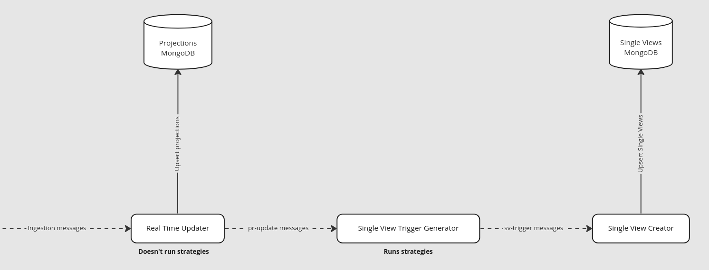

The Single View Trigger Generator is a new service of the Fast Data architecture.
Its main job is to execute the strategies which are currently handled by the [Real Time Updater](/fast_data/realtime_updater.md).

Here's how the basic Fast Data lifecycle looks like with the Single View Trigger Generator:

Specifically, the service takes a [Projection Update message](/fast_data/inputs_and_outputs.md#projection-update) sent by the Real Time Updater and executes the strategy generating an identifier. From that identifier the service sends a [Projection Change message](/fast_data/inputs_and_outputs.md#single-view-trigger) which will be read by the [Single View Creator](/fast_data/single_view_creator.md) triggering the aggregation of the Single View related to the identifier.

### Main differences with the current architecture

As mentioned before, the Single View Trigger Generator handles the execution of the strategies instead of the Real Time Updater doing it, this means a general speed up of the Single View aggregation process since the upsert of projections and execution of the strategies is now parallelized.

Another big change the service introduces is the usage of Kafka throughout the whole Fast Data lifecycle, so the strategy won't result anymore in having a Projection Change on MongoDB, instead the generated identifiers will be sent in a Kafka __Projection Change message__.

Last thing worth mentioning is the Single View Trigger Generator couples up with the Single View and not with the System of Records, therefore for each Single View Creator you have in your project you will need a Single View Trigger Generator.

### What do I need to change in my current setup?

In order to make the Single View Trigger Generator work you will first need to [enable the emission of Projection Update messages](/fast_data/configuration/realtime_updater/common.md#kafka-projection-updates-configuration) from the Real Time Updater, as it is disabled by default. After that you might as well disable the Projection Changes generation since it will now be the Single View Trigger Generator's job to do it. To do so you simply need to set the `PROJECTIONS_CHANGES_ENABLED` environment variable to `false` in your Real Time Updater.

Last step is to make the Single View Creator read the Projection Changes from a Kafka topic. In order to do that you need to set/update the `PROJECTIONS_CHANGES_SOURCE` environment variable to `KAFKA` and the `KAFKA_PROJECTION_CHANGES_TOPICS` environment variable to the topic where the `sv-trigger` message will be sent. If you don't know what topic name you should use, check out the [naming convention](/fast_data/inputs_and_outputs.md#topic-naming-convention-2).

### Configuration

The Single View Trigger Generator is fully low code so no manual choice is provided. To configure it please go to the [Configuration](/fast_data/configuration/single_view_trigger_generator.md) page.
