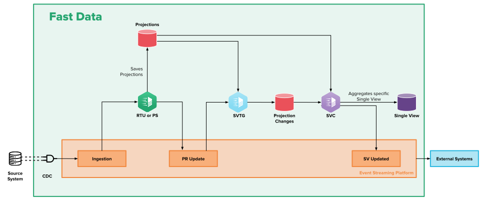

The Single View Trigger Generator (SVTG) is another component of the Fast Data architecture that can be employed in the [Event-Driven](/fast_data/architecture.md#event-driven-architecture) architectures.
Its introduction allows splitting the data import phase (ingesting data from topics) from [strategies](/fast_data/the_basics.md#strategies) execution,
which in the [Standard](/fast_data/architecture.md#standard-architecture) architecture are both handled by the [Real-Time Updater](/fast_data/realtime_updater.md).

Here below a diagram showing how the Single View Trigger Generator service integrates with Fast Data flow is provided:

In this particular Fast Data configuration, Real-Time Updater is set to not execute strategies, but to rather emit a [Projection Update event](/fast_data/inputs_and_outputs.md#projection-update-message) (`pr-update`) for each modified projection.
Similarly, a [Projection Storer](/fast_data/projection_storer.md) service can be configured instead of a Real-Time Updater one to ingest change events and emit Projection Update events.

The Single View Trigger Generator reacts to these events executing the corresponding strategy. The strategy produces one or more identifiers of the Single View that needs to be updated.
This information is then passed over to the downstream component through [Single View Trigger events](/fast_data/inputs_and_outputs.md#single-view-trigger-message) (`sv-trigger`) or [Projection changes](/fast_data/inputs_and_outputs.md#projection-changes) (`pc`).  
Eventually, the [Single View Creator](/fast_data/single_view_creator.md) consumes these events triggering the corresponding logic for aggregating the interested Single View.

### Advantages of adopting the Single View Trigger Generator

The main change occurring due to the introduction of the Single View Trigger Generator is the decoupling of projections import logic from the one in charge identifying which Single View should be updated.
This effect leads to the following advantages:

- operations occurring during initial load phase are easier to handle and carry out
- processing load can be better spread across the two services depending on the requirements, so that it is possible to optimize the different number of services' replicas depending on the ongoing situation

### Migration Guide for adopting Single View Trigger Generator

In order to introduce the Single View Trigger Generator in the Fast Data flow it is necessary to update the configuration of the Real-Time Updater and the Single View Creator. Below are reported the steps for each service.

#### Real-Time Updater

:::tip
You can now replace your Real-Time Updater with the new Projection Storer following [this guide](/fast_data/configuration/projection_storer.md#migration-guide)
:::

- set environment variable `GENERATE_KAFKA_PROJECTION_UPDATES` to `true` to enable the production of `pr-update` events
- set environment variable `KAFKA_PROJECTION_UPDATES_FOLDER` to `/home/node/app/kafkaProjectionUpdates`. This allows the Real-Time Updater to load a configuration file automatically generated that instructs the service how to map each projection to the corresponding projection-update topic of the event streaming platform. This mapping can be changed in Console in each projection detail section, besides the configuration of the ingestion topic. In case this config map is not already available, please commit your work. It should appear afterward.
- disable the computation of projections changes by setting environment variable `PROJECTIONS_CHANGES_ENABLED` to `false`

Additional details on how to configure the Real-Time Updater to produce Projection Update events can be found in the [service configuration page](/fast_data/configuration/realtime_updater.md#kafka-projection-updates-configuration).

#### Single View Creator

:::note
The following steps are only required if you choose to [generate `sv-trigger` messages](/fast_data/configuration/single_view_trigger_generator.md#event-store-config) over Projection changes
:::

- Configure the service to consume from Kafka (see the [Consuming from Kafka](/fast_data/configuration/single_view_creator.md#consuming-from-kafka) section)
- Set environment variable `KAFKA_PROJECTION_CHANGES_TOPICS` to the topic of the event streaming platform on which the Single View Trigger Generator service will publish the `sv-trigger` events.
In case the topic does not already exist, we recommend adopting our [naming convention](/fast_data/inputs_and_outputs.md#single-view-trigger-message) for defining the topic name.

### Single View Trigger vs Projection Changes

From version `3.0.0` the Single View Trigger Generator can also produce Projection Changes (`pc`) on MongoDB, just like the [Real-Time Updater](/fast_data/configuration/realtime_updater.md#projection-changes).

`sv-trigger` messages are sent and consumed on Event Streaming Platforms making the full cycle of Fast Data completely event driven. This offers a greater separation of concers since it means that business data like Projections and Single Views will be on your DB, while all the events that make Fast Data work will be on your Event Streaming Platform.

While `sv-trigger` messages sound like the better option so far, `pc` records usually offer a better performance of the aggregation process. This is because `pc` records are unique by their Single View Identifier, so if a Projection record gets updated twice in a very short period of time the Single View Creator will most likely process the aggregation of the Single Views related to that Projection record only once. This is a broad generalization and it depends also on the size and frequency of the incoming flow of data you may have, if you choose to generate `pc` records make sure you have the [recommended indexes](/fast_data/configuration/realtime_updater.md#custom-projection-changes-collection) set up.

### Configuration

The Single View Trigger Generator can be configured to to process `pr-update` events and to produce `sv-trigger` events or Projection changes.
An in-depth explanation on how to configure the service is provided in the [dedicated page](/fast_data/configuration/single_view_trigger_generator.md).

Currently it is necessary to manually manage the Single View Trigger Generator config maps from the microservices section of Console, since it does not cover its configuration yet.

It is also important to notice that the Single View Trigger Generator couples up with a specific Single View and not with the System of Records. Consequently, for each configured Single View Creator it is necessary to introduce a Single View Trigger Generator.

