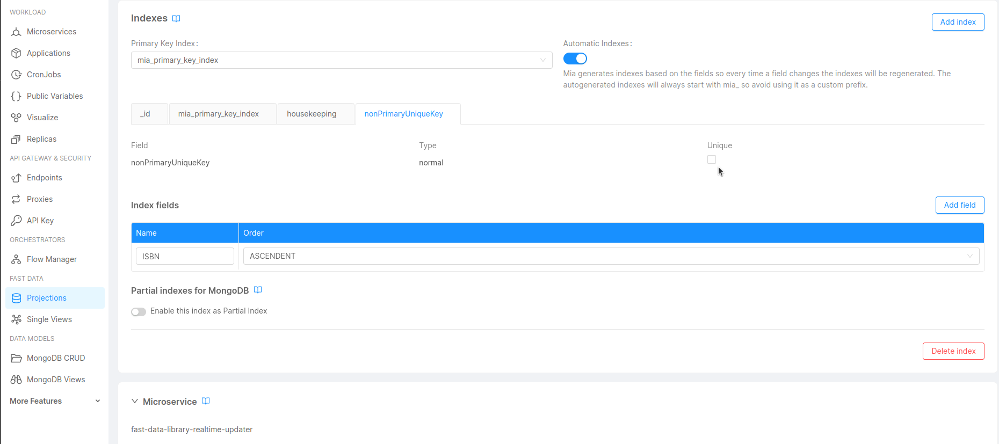

## Problem

The Real-Time Updater violates unique keys on MongoDB. This usually happens when a combination of a delete and an insert ingestion message for the same record comes from the CDC, and the collection involved has a secondary unique index that differs from the primary key one.

## Cause

The RTU was executing a compaction of the messages having the same id, resulting in keeping only the insert messages, hence violating the unique key when trying to apply the update on the projections.

## Solution

Deactivate unique indexes on non-primary key fields for the projections. This will prevent the RTU from violating the unique key constraint.

:::note
If you are using the Projection Storer you should not encounter this issue.
:::

### How to deactivate unique indexes on non-primary key fields

1. Go to the *Projections* page of the *Fast Data* section in the Console and select your System of Record.

2. In the *Projections* list, select the projection you want to edit.

3. In the ***Indexes*** section, click on the index tab that presents the unique constraint and deactivate the Unique checkbox.

