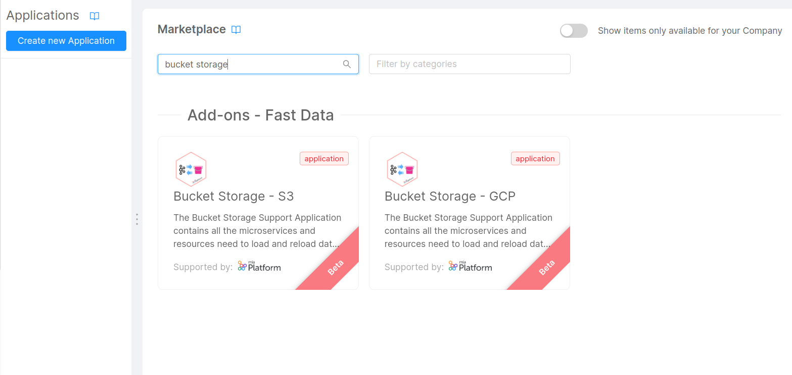
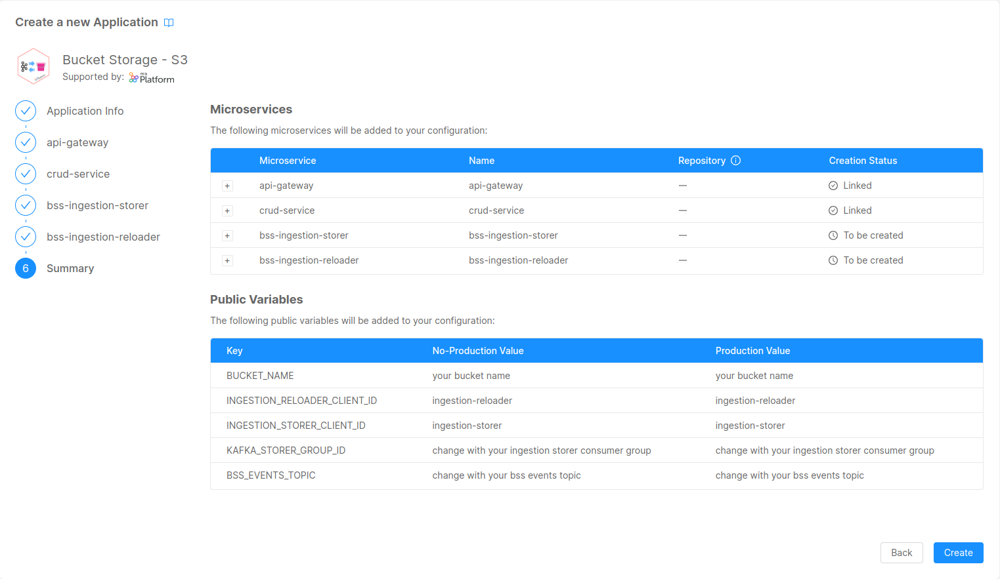

import Tabs from "@theme/Tabs";
import TabItem from "@theme/TabItem";
import SourceCodeBlock from "./../../../src/components/SourceCodeBlock";

The Bucket Storage Support enables storing messages flowing through a channel into an external storage system,
such as a [Google Cloud Storage bucket](https://cloud.google.com/storage) or any bucket compatible with [Amazon AWS S3](https://aws.amazon.com/s3/) interface.

## What We Will Build

In this tutorial, you will configure a Console Project containing the Bucket Storage application, that will store data coming from Kafka ingestion topics.
In particular, you will:
  - Create the microservices of the Bucket Storage Support solution;
  - Configure ingestion-topics and store the incoming message in a sequence of batch text files in a dedicated bucket folder;
  - Expose an endpoint to reload the data from the bucket files into a dedicated re-ingestion topic.

## Prerequisites
- Knowledge of [Fast Data architecture](/fast_data/architecture.md) and [Bucket Storage Support](/fast_data/bucket_storage_support/overview.md).
- An up-and-running Kafka cluster.
- Either GCP or S3-like bucket connection.

## Setup the Microservices

The Bucket Storage Support can be either configured for GCP Bucket or S3 Bucket, and it provides two microservice:

* _Ingestion Storer_, to configure with ingestion-topics that will be stored in the corresponding bucket folder
* _Ingestion Reloader_, a REST microservice that will use bucket's SDK to produce message into a topic, usually referred to as **re-ingestion topic**, specified by the incoming request.

You can create this microservices as plugins starting directly from the Console Marketplace, or either create an [Application](/marketplace/applications/mia_applications.md), choosing between S3-like bucket or GCP bucket.



The configuration steps will let you create, besides the two microservices with their respective configurations, the following resources:

* `status-service`: a CRUD collection used by the _Ingestion Reloader_ to keep track of the requests to perform re-ingestion of the data
* _API Gateway_ endpoints to:
  * expose with the _CRUD Service_ the aforementioned collection;
  * expose the endpoints of the _Ingestion Reloader_.
* public variables such as:
  * **BUCKET_NAME**: the name of the bucket that will be used by Bucket Storage Support applications;
  * **INGESTION_RELOADER_CLIENT_ID**: the Kafka client id used by the _Ingestion Reloader_;
  * **INGESTION_STORER_CLIENT_ID**: the Kafka client id used by the _Ingestion Storer_;
  * **KAFKA_STORER_GROUP_ID**: the kafka consumer group id used by the _Ingestion Storer_ to read messages from ingestion topics;
  * **BSS_EVENTS_TOPIC**: name of the topic that will be used by the _Ingestion Storer_ to publish events related to files written into the bucket.



:::info
Public variables must be changed according to the environment you're releasing the Bucket Storage Support. In particular, during this tutorial, you'll have to check the messages that will be produced to the **BSS_EVENTS_TOPIC** during the section [Testing Ingestion](#testing-ingestion).
:::

### Setup the Bucket connection

If you choose the Application, you will still have to do some manual operations to setup the connection to the bucket. For more details about the bucket connections, visit the [related section](/fast_data/bucket_storage_support/configuration/bucket_connection.md) in the Bucket Storage Support page.

### Setup the Kafka Connection

You need also to setup the parameters to let the new microservices connect to your Kafka Cluster. For more details about kafka connections, visit [the related section](/fast_data/bucket_storage_support/configuration/kafka_connection.md) in the Bucket Storage Support page. For basic connections, you'll just need to define the following variables:

- **KAFKA_BROKERS**: the list of the kafka brokers that will host both ingestion and re-ingestion topics;
- **KAFKA_SASL_USERNAME**: the username that will be used to login to the kafka brokers;
- **KAFKA_SASL_PASSWORD**: the password that will be used to login to the kafka brokers;
- **KAFKA_SASL_MECHANISM**: the mechanism that will be used to login to the kafka brokers. (default is `SCRAM-SHA-256`)

## Data Ingestion

An _ingestion topic_ is a queue from your Kafka broker that represents the data source that we want to store in the bucket.

The messages sent to this queue are not bound to a specific format: the _Ingestion Storer_ will create text files containing line-separated json messages stringified.

Once the microservices are configured, we can start to overwrite the `application.yaml` configuration of the _Ingestion Storer_ to define the _ingestion topics_. Lets the consider the Registry Projection [from the Fast Data tutorial](/fast_data/tutorials/low-code.mdx#registry-projection). Here's the basic configuration that you will have to provide:


```yaml
bss:
  topics-config:
    data-topics-mapping:
      - ingestion: demo.<environment>.delivery.registry.ingestion
        post-ingestion: []
```

In this way, you are telling the _Ingestion Storer_ to register its consumer group to the topic `demo.<environment>.delivery.registry.ingestion`, where `<environment>` should be replaced with the environment you need to deploy the Bucket Storage Support solution.

:::info
Please note that the post-ingestion array is set to empty: this is to make the bucket storage support independent from other possible data flows that are using ingestion topics, such as the Fast Data.

If you set a list of _post ingestion topics_, then the _Ingestion Storer_ will also replicate the messages to the topics defined in the `post-ingestion` field.
:::

### Testing Ingestion

Now it's time to [save](/console/handbooks/project-usage.md#save-changes) and [deploy](/console/handbooks/project-usage.md#deploy-changes) the new configuration.

After that, we can try to send messages to the Registry Kafka Topic from in the previous step and see if messages are correctly stored by the _Ingestion Storer_ into the bucket.

Let's consider a basic case where the following registries are published to the ingestion topic.

<details>
    <summary>Click to see the ingestion messages:</summary>
    <p>
      <SourceCodeBlock filePath="/docs_files_to_download/tutorial/bucket-storage-support/ingestion-messages.json" />
    </p>
</details>

:::caution
Ingestion messages generally has a specific format, as defined in the [Inputs and Outputs section of the Fast Data](/fast_data/inputs_and_outputs.md#ingestion-message).

For the sake of simplicity, in this tutorial the ingestion messages contains only the payload of a projection. It's worth noting that the _Ingestion Storer_ does not perform any validation on the input message, which can be of any JSON format.
:::

If you check the incoming messages from the topic defined inside the variable **BSS_EVENTS_TOPIC**, you should see a kafka message sent by the _ingestion storer_ with the following key-value format:

* the key of the message is a JSON object formatted as follows:
  ```json
  { "partition": 1, "topic":"demo.<environment>.delivery.registry.ingestion" }
  ```
* value:
  ```json
  {
    "batchOffsetEnd": 7,
    "batchOffsetStart": 5,
    "batchSize": 3,
    "batchTimeEnd": "2023-06-23T09:13:00.000Z",
    "batchTimeStart": "2023-06-23T09:10:00.702Z",
    "filePath": "demo.<environment>.delivery.registry.ingestion/2023-06-23T09:10:00.702Z_demo.<environment>.delivery.registry.ingestion_0_5_<timestamp>.txt"
  }
  ```
  Let's see in details the different information of the JSON message:

  * `batchSize` tells the number of messages that have been stored into the file
  * `batchOffsetStart` and `batchOffsetEnd`are respectively the beginning and the end of offsets representing the offset's boundaries of message in the partition written to the file;
  * `batchTimeStart` and `batchTimeEnd`are respectively the beginning and the end of iso-formatted timestamp representing the time boundaries of messages in the partition written to the file;
  * `filePath` denotes the result written in the bucket and has the following format: `"<topic_name>/<topic_name>_<partition>_<batchOffsetStart>_<timestamp>.txt"`
Before starting to create projections, we need to create the System of Record (SoR) representing the source system we want to connect to.

## Data Re-Ingestion

Once the data is stored in the bucket, it can be processed later again to manage different use cases, as explained [in this section](/fast_data/bucket_storage_support/use_cases.md). This process is referred to as **re-ingestion**.

Based on the different needs where Bucket Storage is deployed, two types of re-ingestions procedures can be applied using the _Ingestion Reloader_. You can see its APIs available in the [API Documentations](/console/project-configuration/documentation-portal.md)

:::tip
Messages loaded in the bucket are sent to a topic specified in the client's request, and is referred to as `reIngestionTopic`. If we consider the Registry Projection, you can use the following topic suggestion **demo.`<environment>`.delivery.registry.reingestion**, where `<environment>` is the name of the environment where you are gonna to deploy the bucket storage support.
:::tip

You can re-ingest the messages contained in the file that was written in the bucket after the ingestion of the message from the [previous section](#testing-ingestion).

<Tabs
  defaultValue="file"
  groupId="re-ingestion"
  values={[
      { label: 'File Re-Ingestion', value: 'file', },
      { label: 'Topic Re-Ingestion', value: 'topic', },
  ]}
>
<TabItem value="file">

You can perform the following POST request to the `/reingestion/file` endpoint:

```bash
curl -X POST 'https://<your-project-domain>/reingestion/file' \
  -H 'Content-Type: application/json'  \
  -d '{
    "fileName": "demo.<environment>.delivery.registry.ingestion/2023-06-23T09:10:00.702Z_demo.<environment>.delivery.registry.ingestion_0_5_<timestamp>.txt",
	"reIngestionTopic": "demo.<environment>.delivery.registry.reingestion"
  }'
```
For more information on the usage of the file re-ingestion endpoint, please refer [to this section](/fast_data/bucket_storage_support/configuration/ingestion_reloader.md#reingestion-of-a-file).
</TabItem>
<TabItem value="topic">
You can re-ingest all the messages from all files contained inside a whole folder related to an ingestion topic.

To achieve this, you can perform the following POST request to the `/reingestion/topic` endpoint:

```bash
curl -X POST 'https://<your-project-domain>/reingestion/topic' \
  -H 'Content-Type: application/json'  \
  -d '{
    "topic": "demo.<environment>.delivery.registry.ingestion/2023-06-23T09:10:00.702Z_demo.<environment>.delivery.registry.ingestion_0_5_<timestamp>.txt",
	"reIngestionTopic": "demo.<environment>.delivery.registry.reingestion"
  }'
'
```

The response is the same as the [re-ingest file request](#perform-the-re-ingestion-of-a-specific-file). For more information on the usage of the folder re-ingestion endpoint, please refer [to this section](/fast_data/bucket_storage_support/configuration/ingestion_reloader.md#reingestion-of-a-topic).
</TabItem>
</Tabs>

### Testing Re-Ingestion

The _Ingestion Reloader_ will answer with a status code 202 response containing the following JSON body:

```json
{
  "requestId": "638f4fd76a90e7a1510adb09",
  "message": "Reingestion started"
}
```

You can later use the content of the field `requestId` to retrieve from the _Status Service CRUD collection_ created before the status of the request. This means performing the following GET request:

```bash
curl -X GET 'https://<your-project-domain>/status-service/638f4fd76a90e7a1510adb09'
```

The CRUD Service will return the following object:

```json
{
  /** CRUD service required fields */
  "request": {
    "fileName": "demo.<environment>.delivery.registry.ingestion/2023-06-23T09:10:00.702Z_demo.<environment>.delivery.registry.ingestion_0_5_<timestamp>.txt",
	  "reIngestionTopic": "demo.<environment>.delivery.registry.reingestion"
  },
  "lineIndex": 3,
  "status": "COMPLETE",
}
```

where:
* `lineIndex` represents the number of message published to the re-ingestion topic;
* `status` can be either `START`, `COMPLETE`, `STOPPED`, `ERROR`

You can check also on the re-ingestion topic that the published messages reflects the ingestion messages created before.


