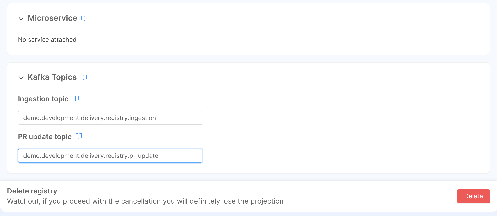
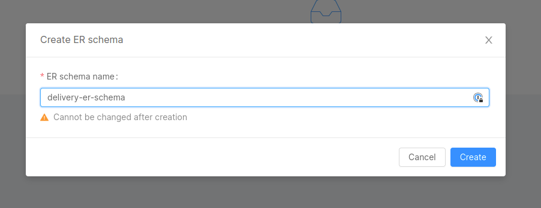

import Tabs from "@theme/Tabs";
import TabItem from "@theme/TabItem";

**Fast Data** is an event-driven architecture that allows you to collect data, manipulate and aggregate it from your systems in near real-time using a data stream approach.

## What We Will Build

In this tutorial, we will create a simple example of a Single View dedicated to a history of orders made by a customer. To do that we will expect to receive data from two
different tables: a table that includes a registry of customer data (like the name, address and so on) and a table for a single order (with date, price and the identifier of
the customer included in the registry).

We are going also to create the microservices that will store the data received in separate collections (we will call them _Projections_) and aggregate the Single View.

To do that, in the console, you will:
  - Generate two Projections where we will store the data;
  - Connect two endpoints to the Projections;
  - Create a Single View Low Code that will aggregate the data from the two projections;
  - Create an endpoint that will consume the data from the Single View;
  - Test the Single View.

## Prerequisites

Before starting this tutorial, you need to be familiar with the concepts of:
* basic knowledge about [Fast Data architecture](/fast_data/architecture.md), in particular:
  * [Standard Architecture](/fast_data/architecture.md#standard-architecture)
  * [Event-Driven Architecture](/fast_data/architecture.md#event-driven-architecture)
* familiarity with the concepts of: 
  * [Projections](/fast_data/configuration/projections.md)
  * [Single View](/fast_data/configuration/single_views.md)
  * [Strategies](/fast_data/configuration/strategies.md)
  
* Kafka (including producers and consumers).
* MongoDB

For the technical part of this tutorial, you will need both Kafka and MongoDB instances available.

## Systems of Record

A _System of Record_ (__SoR__) is a container of _Projections_, which is are architectural objects responsible for storing the data in a persistent storage, to have a fast and scalable way to decouple the data from the source system.
We will use these projections to have a copy of the data from the source systems, and later they will be used to aggregate the data from the source systems, using the Single View Creator.

The architectural component responsible for creating and updating the projection is either the _Real-Time Updater_ or, starting from `Console v12.0.0`, the _Projection Storer_: we will refer to it as `SoR Microservice` throughout this tutorial.

This microservice manages a Kafka consumer that will consume the data from the source systems and will update the corresponding projections on MongoDB.

In this tutorial, we can imagine a simple delivery platform where the data are the registry and the order of the customers.
So, we will create a single System of Record with two projections (one for the registry and one for the order) attached to a single Real-Time Updater.

### Create the System of Record

:::caution
Until `Console v11.7.0`, the _Real-Time Updater_ service was automatically created when a System of Record was created <ins>only after saving the configuration</ins>. 

If you're using a Console version lower than `v11.7.0`, you can skip the [System of Record Microservices section](#system-of-records-microservices) and just configure the [required environments variables](/fast_data/configuration/realtime_updater.md) of the micro-service.
:::

Before starting to create projections, we need to create the System of Record representing the source system we want to connect to.

<details>
  <summary>SoR Creation Steps</summary>
<p>

1. Open the page Projection in the Fast Data section of our left menu;
2. Click on the button `Create new Systems of Record`:


3. In the dialog, choose the name (which will act as an identifier of the System of Record, we will call it `delivery`) and the Kafka message format (in this case, we will use `Debezium`) and then click on `Create`:

  

4. Now we can either start the projections or attach _SoR microservices_ inside this System of Record:


</p>
</details>

### System of Record Microservice

Once a system of record has been created, you'll need at least one _SoR microservice_ where projections will be assigned.

You can choose between two microservices: the [Real-Time Updater](/fast_data/realtime_updater.md) or the [Projection Storer](/fast_data/projection_storer.md).  

Although the two services have several differences, that we will see later during strategy handling, they have one shared feature: they read ingestion messages from Kafka topics to store them into the projections on MongoDB. 

<details>
<summary>Projection Storer Setup</summary>
<p>

The first step is to create the microservice _Projection Storer_, that will be attached to the System of Record we will create. To do so, we move to the _Microservices_ section of the Console. From here we can click on the
"Create a Microservice" button on the top-left corner to open the Marketplace and select our microservice.

We can find it under the name of *Projection Storer*.


After selecting the _Projection Storer_ service, the only thing you need to choose is a unique name (we suggest `delivery-projection-storer`) and, eventually the description. Once clicked on the `Create` button, the service
will be created and we will be redirected to the service page.

Then, move to the `delivery` SoR and, in the `Services` section, attach the newly created service.


Once the service has been attached, you can click on the right arrow of the micro-service and edit its configuration.


In this section, you can setup the following configurations:

* [Kafka Consumer](/fast_data/configuration/projection_storer.md#consumer), which will be used to read [ingestion-messages](/fast_data/inputs_and_outputs.md#ingestion-message),
* [Kafka Producer](/fast_data/configuration/projection_storer.md#producer), which will be used to generate [pr-update messages](/fast_data/inputs_and_outputs.md#projection-update-message),
* [Storage Configuration](/fast_data/configuration/projection_storer.md#storage), which will contain the MongoDB connection where the database is located.

</p>
</details>

<details>
<summary>Real-Time Updater Setup</summary>
<p>

:::caution
From version `11.7.0` of the Console, the _Real-Time Updater_ service must be created manually with the guide explained in this paragraph.

If you're using an older version, you can skip this paragraph since the service is automatically created when saving the configuration after creating the System of Record.
:::

The first step is to create the microservice _Real-Time Updater_, that will be attached to the System of Record we will create. To do so, we move to the _Microservices_ section of the Console. From here we can click on the
`Create a Microservice` button on the top-left corner to open the Marketplace and find the microservice under the name of *Real-Time Updater*.


After selecting the _Real-Time Updater_ service, the only thing you need to choose is a unique name (we suggest `fast-data-delivery-realtime-updater`) and, eventually the description. Once clicked on the "Create" button, the service
will be created and we will be redirected to the service page. Now we need to configure all the parameters of the microservice. Here is an example of the fields that we need to configure:

- `PROJECTIONS_DATABASE_NAME`: the name of the database that will be used to store the data of the Projections
- `PROJECTIONS_CHANGES_COLLECTION_NAME`: the name of the collection that will be used to store the changes of the Projections (we suggest `fd-pc-delivery`)
- `KAFKA_BROKERS`: the list of the kafka brokers that will be used to send the data to the Projections
- `KAFKA_GROUP_ID`: the group id that will be used to consume the data from the source systems
- `KAFKA_SASL_USERNAME`: the username that will be used to login to the kafka brokers
- `KAFKA_SASL_PASSWORD`: the password that will be used to login to the kafka brokers
- `KAFKA_SASL_MECHANISM`: the mechanism that will be used to login to the kafka brokers

:::info
The Real-Time Updater includes more optional parameters that might be included via Environment Variables. If you need to know more about them, you can [read the documentation of the Real-Time Updater](/fast_data/configuration/realtime_updater.md).
:::

The last step to finish the configuration of the System of Record is to attach the Real-Time Updater we originally created. To do so, move to the _Services_ tab where a placeholder will inform you that no services
have been attached yet and suggest you to select one from the list of compatible services.


Then, we are ready to save the configuration.

</p>
</details>

## Projections

Inside a System of Record page, we need to click on the `Create new Projection` button. A modal will open, allowing the user to choose the Projection name. Click on `Create` to create the Projection.


Once the projection is created, you will be automatically redirected to its dedicated page, where we can see the default CRUD data schema already configured.


For this tutorial, we will create two projections: 

* `registry`: will store data about the user;
* `orders`: will store the data of the user's orders.

For each of them, we have to consider the following aspects.

### Fields

Now we need to define the fields that we want to store in the Projection. You can do that by clicking the `Add field` button located at the top-right of the `Fields card`.


:::info
It is mandatory to define at least one custom field. Also, you must define at least one field as **Primary Key** (select the related checkbox).
:::

:::info
You can leave `defaultIdentity` as a value for _Cast Function_ when entering the fields for this tutorial.
In this way, every value inside the payload received from the Source Systems will be saved in the database without further customizations.
:::

### Topics

At the bottom of the same page, we can also see the Kafka topics. There are two types of topics:

* [Ingestion topic](/fast_data/inputs_and_outputs.md#ingestion-message):  will be used by the SoR microservice
to receive the data from the Source Systems so that the Projections will be updated on the target Database;
* [PR Update topic](/fast_data/inputs_and_outputs.md#projection-update-message): will be used to notify when a projection has been updated.




:::caution
The application does not create Kafka topics for you. If you decide to use a different Kafka topic name, please be sure the topic already exists and it is fully operational.
The Real-Time Updater, the service that receives the update from the source System, will crash at startup if there is a topic not defined in Kafka.

The Kafka topic names can be changed over time, but please mind that their name must be __unique within your Kafka cluster__.
:::

### Link to Microservice

Before receiving messages from the ingestion topic defined in the projection, you have to link it to a SoR microservice. 

Go back to the `Services` section of the `delivery` SoR, and select the microservice you have attached during the previous paragraph: there, on the `Projections` card, you can pick one or more projections.


In this particular case, both `registry` and `orders` will be linked to the same microservice.

Going back to the projection's page, you can see that the microservice linked to it will appear under the `Microservice` card.

### Specifications

Here you can find the specifications about the projections we are going to use in this tutorial. 

<details>
  <summary> Registry </summary>
  <p>

#### Fields


| Field           | Type   |  Cast Functions      | Required    | Primary Key    | Description                                                       |
|-----------------|--------|----------------------|-------------|----------------|-------------------------------------------------------------------|
| `registry_id`   | String |    defaultIdentity   |   &check;   |     &check;    | The registry ID.                                                  |
| `name`          | String |    defaultIdentity   |      -      |        -       | The name of the customer to whom the registry refers.             |
| `email`         | String |    defaultIdentity   |      -      |        -       | The email of the customer to whom the registry refers.            |
| `phone`         | String |    defaultIdentity   |      -      |        -       | The phone of the customer to whom the registry refers.            |
| `address`       | String |    defaultIdentity   |      -      |        -       | The address of the customer to whom the registry refers.          |
| `city`          | String |    defaultIdentity   |      -      |        -       | The city of the customer to whom the registry refers.             |
| `state`         | String |    defaultIdentity   |      -      |        -       | The State of the customer to whom the registry refers.            |

#### Topics

These are the suggested naming convention of topics defined in Kafka, where we expect to receive messages related to the update of projections:

* __Ingestion__: `demo.development.delivery.registry.ingestion` 
* __Pr-Update__: `demo.development.delivery.registry.pr-update` 

</p>
</details>

<details>
  <summary> Orders </summary>
  <p>

#### Fields

| Field           | Type   |   Cast Function    | Required | Primary Key | Description                                                    |
|-----------------|--------|--------------------|----------|-------------|----------------------------------------------------------------|
| `order_id`      | String |  defaultIdentity   |  &check; |   &check;   | The order ID. Check this field as "Required" and "Primary Key".|
| `name`          | String |  defaultIdentity   |    -     |     -       | The name of the product.                                       |
| `price`         | Number |  defaultIdentity   |    -     |     -       | The price of the product.                                      |
| `date`          | Date   |  defaultCastToDate |    -     |     -       | The date when the order was placed.                            |
| `registry_id`   | String |  defaultIdentity   |    -     |     -       | The registry ID of the customer who placed the order.          |

#### Topics

These are the suggested naming convention of topics defined in Kafka, where we expect to receive messages related to the update of projections:

* __Ingestion__: `demo.development.delivery.order.ingestion` 
* __Pr-Update__: `demo.development.delivery.order.pr-update` 

</p>
</details>

## Release Projections

At this point, we have configured the microservice, we already have one system of record and two projections, but we need to expose the Projection endpoints. 

### Create Endpoints

:::tip
It is not mandatory to expose the Projection endpoints to create, update and work with the Single View, but if you want to expose the raw data stored in the projection you need to create the endpoints.
:::

In the Endpoint section, we can click on the **Create new endpoint** button to create the Projection's endpoints.


Inside the creation page, we can choose the endpoint path. Inside the type we need to select `Fast Data Projection` and, in the Fast Data Projection dropdown menu, we can choose the Projection that we want to expose.
We can create two different endpoints, one for the registry and one for the order.

:::caution
Remember that the endpoint connected to the Fast Data will create just `GET` endpoints: so, we can't perform _update_ and _delete_ operations over the endpoint.
:::

### Test Projections

Now it's time to [save](/console/handbooks/project-usage.md#save-changes) and [deploy](/console/handbooks/project-usage.md#deploy-changes) the new configuration.


After that, we can try to send a message to the _Kafka Ingestion Topics_ created in the previous steps, and we can see the data stored in the Projection using the APIs available in the [API Documentations](/console/project-configuration/documentation-portal.md).

Since we have chosen `Debezium` as the format for our _SoR_, the ingestion message that we will send has to comply to [its specifications](/fast_data/inputs_and_outputs.md#debezium).

<details>
<summary>Ingestion Example</summary>
<p>

We will add one registry and one order to our System of Record, respectively `reg-1` and `ord-1`.

This will mean sending the following ingestion messages to the ingestion topics, using a Kafka Producer:

```json title=demo.development.delivery.registry.ingestion
{
  "key": {
    "registry_id": "reg-1"
  },
  "value": {
    "op": "c",
    "before": null,
    "after": {
      "registry_id": "reg-1",
      "address": "customer address",
      "city": "customer city",
      "email": "customer1@mail.com",
      "name": "customer 1",
      "phone": "customer phone",
      "state": "customer state",
    }
  }
}
```

```json title=demo.development.delivery.orders.ingestion
{
  "key": {
    "order_id": "ord-1"
  },
  "value": {
    "op": "c",
    "before": null,
    "after": {
      "date": "2024-02-16T11:13:48.322Z",
      "name": "order-1",
      "order_id": "ord-1",
      "price": 123,
      "registry_id": "reg-1"
    }
  }
}
```

:::tip
If you don't have a direct access to your Kafka broker to produce messages, you can use a dedicated microservice such as [Rest2Kafka](/runtime_suite/rest2kafka-service/01_overview.md) to produce Kafka messages as REST request directly from MIA Console. 
:::

Once messages have been set, you can check from the API Documentations if both `registry` and `orders` projections have been updated successfully.

``` json title="GET /registry"
[
  {
    "_id": "63ceb97233241d6536c857e759c02",
    "__STATE__": "PUBLIC",
    "address": "customer address",
    "city": "customer city",
    "createdAt": "2023-01-23T16:44:33.006Z",
    "email": "customer1@mail.com",
    "name": "customer 1",
    "phone": "customer phone",
    "registry_id": "reg-1",
    "state": "customer state",
    "updatedAt": "2023-01-23T16:44:33.006Z"
  }
]
```

```json title="GET /orders"
[
  {
    "_id": "63cebcb6d65321231236c857e76b6ab",
    "__STATE__": "PUBLIC",
    "createdAt": "2023-01-23T16:58:30.201Z",
    "date": "2024-02-16T11:13:48.322Z",
    "name": "order-1",
    "order_id": "ord-1",
    "price": 123,
    "registry_id": "reg-1",
    "updatedAt": "2023-01-23T16:58:30.201Z"
  }
]
```

</p>
</details>

## Single View

The Single View is an architectural object that it's used to store the aggregate data from the Projections. The goal of the Single View is to store the data already aggregated and ready to use from the Projection.
A good approach is to store the data in Single Views dedicated to each channel and each use.

In this tutorial, our Single View is called `order-history` and we will create an object schema with the registry information and the orders information linked to the registry: this means that each document is an object that contains the registry information about the user and a list of orders made by the user.

We need to open the `Single Views` page in the Fast Data section of our left menu, then click on the **Create new Single View** button, so that we can create a new Single View called `order-history`.


Here, we can choose the name of the Single View.


Now, we need to create the fields of the Single View, inside this tutorial we will create the following fields:

| Field           | Type             | Description                                                       |
|-----------------|------------------|-------------------------------------------------------------------|
| `registryId`    | String           | The registry ID. This field must be marked as "Required".         |
| `name`          | String           | The name of the customer to whom the registry refers.             |
| `city`          | String           | The city of the customer to whom the registry refers.             |
| `state`         | String           | The State of the customer to whom the registry refers.            |
| `orders`        | Array of objects | The orders associated to the registry.                            |


:::caution
It is important to also define the JSON Schema for the `orders` field of the Single View, to let it visible later in the No Code section.
:::

<details>
<summary>Json Schema for orders array</summary>
<p>

By clicking the **Edit button** of the `orders` field, a right panel will show a JSON Schema editor, where you can place the following object:

``` json
{
  "properties": {
    "id": {
      "title": "Order id",
      "type": "string"
    },
    "price": {
      "title": "Order Price",
      "type": "number"
    },
    "name": {
      "title": "Order name",
      "type": "string"
    },
    "date": {
      "type": "string",
      "format": "date"
    }
  },
  "additionalProperties": false,
  "type": "object"
}
```

Then press on the **Save** button on the bottom right of the page to apply the changes made to the field.

</p>
</details>

### Microservice Configuration

First of all, we need to create a microservice that we will attach to the Single View that we're going to create. This microservice is called "Single View Creator", and it's available in the microservice Marketplace.


Here we have two different plugins: the first one is for the Single View Creator, and the second one is for the Single View Creator Low Code.
We will go for the latter since we want to leverage the usage of ConfigMaps for a quicker configuration of the microservice. We suggest naming it `single-view-creator-delivery`.

Now we need to configure all the parameters of the microservice, here is a set of the fields that we need to configure:

- `SINGLE_VIEWS_COLLECTION`: should be the name of the single view which your single view creator is responsible for (we suggest `order-history`, the same name as the Single View we are going to create);
- `SINGLE_VIEWS_PORTFOLIO_ORIGIN`: a representative name used in debugging and metrics to identify the source of any Single View update request (we suggest to use the name of the System of Record, `delivery`);
- `TYPE`: identifies the type of projection changes that need to be read. It should be the same as the Single View name you want to update (also here we are going to call it `order-history`).

Also, based on the connection channel where the microservice reads the projection changes, additional environment variables needs to be set:

<Tabs
  defaultValue="kafka"
  groupId="svc-connection"
  values={[
      { label: 'Kafka', value: "kafka", },
      { label: 'MongoDB', value: "mongodb", },
  ]}
>

<TabItem value="kafka">

* `PROJECTION_CHANGES_SOURCE`: by using the value `kafka`, it instructs the service to read projection changes from a Kafka connection;
* kafka connection variables such as:
  * `KAFKA_BROKERS`: a comma-separated list of your Kafka brokers;
  * `KAFKA_SASL_USERNAME`, `KAFKA_SASL_PASSWORD` and `KAFKA_SASL_MECHANISM` if authentication needs to be performed
  * `KAFKA_PROJECTION_CHANGES_TOPIC`: name of the topic that will receive projection changes in the shape of [trigger messages](/fast_data/inputs_and_outputs.md#single-view-trigger-message), you can choose `demo.development.delivery.order-history.trigger`;
  * `KAFKA_GROUP_ID`: name of the consumer group that will be used to subscribe to the topic from the `KAFKA_PROJECTION_CHANGES_TOPIC` variable.

</TabItem>
<TabItem value="mongodb">

* `PROJECTIONS_CHANGES_COLLECTION`: it is the name of the collection that includes the Projection Changes generated by the Real-Time Updater, and it must have the same value set in that microservice (we previously suggested `fd-pc-delivery`);
* `SCHEDULING_TIME`: tells how many milliseconds the microservice needs to wait before polling new projection changes from the `PROJECTION_CHANGES_SCHEMA_COLLECTION`. We set it to `5000`, meaning that 5 seconds will pass between each polling.

</TabItem>

</Tabs>

:::info
The Single View Creator includes more optional parameters that might be included via Environment Variables. If you need to know more about them, you can [refer to the related documentation section](/fast_data/configuration/single_view_creator/index.md#environment-variables).
:::

The marketplace will also ask you to define a name for the following configurations:

  * **Single View Key**: this is the key that will be used to store the Single View (you can choose `delivery-configuration` as name);
  * **ER-Schema**: the relationship between projections (you can choose `delivery-erschema` as name);
  * **Aggregation**: the aggregation that will be used to generate the Single View (you can choose `delivery-aggregation` as name).

This configurations will be in read-only mode, since they can be edited inside the _Single View_ section.


### Attach Microservice

The last configuration that you need to do is to attach the newly created `Single View Creator` microservice to our `order-history` Single View.

Inside the **Single View** page, go to the **Single View Creators** tab. A placeholder will inform the user that a Single View Creator must be attached.


From there, select the `single-view-creator-delivery` microservice, then click the **Add single view creator** button.

## Single View Aggregation

After linking a microservice to the Single View page, click the **Edit Configurations** button (the one with `→` arrow) at the right side of the table. It will open a new page, where it's possible to configure all the aspects regarding the Single View aggregation and generation.


### ER Schema

The ER Schema is a configuration used by Fast Data to infer into the microservices the relationships among projections. In the case of `order-history`, we have to define a relationship where one Customer (stored in the `registry` Projection) can have multiple Orders (stored in the `orders` Projection).


:::info
The following explains how to configure an ER Schema using the "Er Schema" section of Fast Data. To do so, please make sure that this feature is enabled in your project. You might need to ask your Project Administrator for it.
:::

You can configure the ER Schema in both **No Code** and **Low Code** mode.

<Tabs
  defaultValue="no-code"
  groupId="fast-data-mode"
  values={[
      { label: 'No Code', value: "no-code", },
      { label: 'Low Code', value: "low-code", },
  ]}
>

<TabItem value="no-code">

To configure the ER Schema with the No Code, you need to return to the **Projections** section, and then select the **ER Schemas** tab.

From there, you can create a new ER Schema, by clicking the **Create new ER Schema** button:
you'll be asked to choose a name for your ER Schema (we suggest: `delivery-er-schema`). After that, you will be redirected to the ER Schema canvas.



The configuration of the ER Schema with the "No Code" is explained in the [dedicated section](/fast_data/configuration/config_maps/erSchema.md#use-the-no-code),
but we include here a quick guide on how to create the ER Schema with the needed relationships:

- In the right side panel you can see the list of Projections inside the System of Record `delivery`: drag the collections `registry` and `order` to the canvas in the middle of the screen.
- Inside the canvas, draw a line from the dot at the right of the `registry` Projection to the `orders` Projection: you'll see that the line remains visible with a small warning icon in the middle,
which means that the relationship has been created without any condition.
- the right side panel should show the details of the relationship. From here you'll need to:
  - change the **Condition Type** value of `A -> B` to `One to many`.
  - click on the **Edit Rules** button to open the Rules Modal: click on **+ Rule** button and then fill the input fields with `registry_id` both for the `registry` and the `orders` Projection. Finally, click the **Save** button.

The final result should resemble the following image:


</TabItem>

<TabItem value="low-code">

This is the ER Schema that can be seen in the **Advanced Section** of the canvas:

```json title=erSchema.json {4,6,10} showLineNumbers
{
  "version": "1.0.0",
  "config": {
    "registry": {
      "outgoing": {
        "order": {
          "conditions": {
            "registry_to_order": {
              "condition": {
                "registry_id": "registry_id"
              },
              "oneToMany": true
            }
          }
        }
      },
      "order": {
        "outgoing": {
          "registry": {
            "conditions": {
              "order_to_registry": {
                "condition": {
                  "registry_id": "registry_id"
                },
                "oneToMany": false
              }
            }
          }
        }
      }
    }
  }
}
```

In this example, we can see that the relationship goes from registry to order (from line 4 to line 16) and vice versa.

The relationship is represented by the following two conditions:

- `registry_id` (from `orders`): `registry_id` (from the updated registry). The condition is `One to One`, meaning that one order can be related to one and only one registry item.
- `registry_id` (from `registry`): `registry_id` (from the updated order). The condition is `One to Many`, meaning that one registry might have a relation with multiple orders.

The conditions will be interpolated into the `find` operation of a MongoDB query. In this case, the condition can be translated as:

- `registry_to_order`: `find({ registry_id: "value of registry_id from registry projection"})`
- `order_to_registry`: `findOne({ registry_id: "value of registry_id from orders projection"})`

</TabItem>


</Tabs>

### Single View Key

The **Single View Key** represents the link between the identifier of the projection change and the Single View fields: this mapping will be executed at the beginning of the aggregation, to retrieve the **base projection** that will be used as a starting point to compute the single view.
to get a query that, executed in the Single View collection, retrieves the Single View document to be updated.

<Tabs
  defaultValue="no-code"
  groupId="fast-data-mode"
  values={[
      { label: 'No Code', value: "no-code", },
      { label: 'Low Code', value: "low-code", },
  ]}
>


<TabItem value="no-code">

:::info
The following explains how to configure a Single View Key using the "No Code" feature, available from version `11.3.0` of the Mia-Platform Console.
Please make sure that your project has activated this feature. You might need to ask your Project Administrator for it.
:::

To configure the _Single View Key_ with the "No Code" feature, you can refer to the [specific documentation page](/fast_data/configuration/config_maps/singleViewKey.md#using-the-no-code).

Here is a quick list of operations to execute to configure correctly the Single View Key:

* move to the **Settings** page and go to the **Single View Key** card.
* click on the **Configure** button to open a modal to start configuring the Single View Key.
* click the **Add Single View Key**: a new line will appear with two input fields.
* as `Single View Primary Field`, which is a field of the Single View, select `registryId`.
* as `Projection Identifier`, which contains the value inside the `identifier` field of [the Projection Changes Schema](#projection-changes-schema),
select `registry_id` (which is, for our example, the same name of the Base Projection `registry`).
* you can review the updates by clicking the toggle **Advanced Mode** and, when you are sure everything is fine, click on **Save**.

</TabItem>

<TabItem value="low-code">

By clicking the **Advanced Mode** toggle, we can edit directly the configuration:

```json title=singleViewKey.json
{
  "version": "1.0.0",
  "config": {
    "registryId": "registry_id"
  }
}
```
The condition inside the `config` object is represented by:

* `registryId` (from the Single View document): `registry_id` (obtained from the `identifier` field of the Projection Change document)

:::tip
To have an exhaustive explanation of how to configure the _Single View Key_ configuration with the **Low Code** feature, you can refer to the [specific documentation page](/fast_data/configuration/config_maps/singleViewKey.md).
:::

</TabItem>

</Tabs>

### Aggregation

The aggregation is the configMap that will be used to define the rules on how the Single View will be calculated.
In this configuration, we will get our dependencies from the projection and the description of how we want to map the dependencies to the Single View Data Model.

In our case, we will map `registryId`, `name`, `city` and `state` from the Projection `registry`, and the order list from the Projection `orders`.

<Tabs
  defaultValue="no-code"
  groupId="fast-data-mode"
  values={[
      { label: 'No Code', value: "no-code", },
      { label: 'Low Code', value: "low-code", },
  ]}
>

<TabItem value="no-code">

:::info
The following explains how to configure an Aggregation using the **No Code** feature, available from version `11.3.0` of the Mia-Platform Console.
Please make sure that your project has activated this feature. You might need to ask your Project Administrator for it.
:::

Assuming that the ER Schema has already been selected (see previous paragraph), here is a list of steps to be executed to configure the Aggregation:

* Selecting the **Aggregation** tab, you'll be required to select a Base Projection which is the Projection from where the mapping will begin:
in our tutorial, we select the Projection `registry` and click on **Set base projection**. After this, the Single View Data Model will show up to the left, ready for the configuration.
* Select the field `registryId`: a panel will open to the right where we can select the dependency `registry` and the field `registry_id`.
* Select the field `name`: a panel will open to the right where we can select the dependency `registry` and the field `name`.
* Select the field `city`: a panel will open to the right where we can select the dependency `registry` and the field `city`.
* Select the field `state`: a panel will open to the right where we can select the dependency `registry` and the field `state`.
* Select the field `orders`: it will open a panel with the list of fields inside the Array of Objects _orders_ defined in the Data Model.
* Click on the **Edit dependencies (0)** button to create the dependency between `registry` and `orders` in the Aggregation: inside the modal click first on the **Add dependency** button to start configuring the dependency.
  * select the Source Projection `registry`: the rest of the form should fill automatically and a click on the **Add dependency** button will generate the dependency.
  * click on **Save** to update the Aggregation with the new dependency. You will see the `orders` field having an additional panel with the mapping of the fields for each element:
    * select the field `id`: a panel will open to the right where we can select the dependency `orders` and the field `order_id`.
    * select the field `price`: a panel will open to the right where we can select the dependency `orders` and the field `price`.
    * select the field `name`: a panel will open to the right where we can select the dependency `orders` and the field `name`.
    * select the field `date`: a panel will open to the right where we can select the dependency `orders` and the field `date`.

:::caution
In case you want to reset the aggregation by changing the Base Projection, you have to go to the _Settings_ tab and click the **Edit** button inside the **General** card.
:::

After the following steps, the Aggregation is completely configured and, on configuration saving, it will be applied to the aggregation ConfigMap of the microservice.
You can click on the toggle **Advanced Mode** at the bottom-left of the page to review your configuration in a JSON format.

:::tip
To have an exhaustive explanation of how to configure an Aggregation with the **No Code** feature, you can refer to the [specific documentation page](/fast_data/configuration/config_maps/aggregation.md#use-the-no-code).
:::

</TabItem>

<TabItem value="low-code">

Here's the Low-Code representation of the aggregation:

```json title=aggregation.json {4,6,10,14,22,23,25} showLineNumbers
{
  "version": "1.0.0",
  "config": {
    "SV_CONFIG": {
      "dependencies": {
        "registry": {
          "type": "projection",
          "on": "_identifier"
        },
        "ORDERS": {
          "type": "config"
        }
      },
      "mapping": {
        "registryId": "registry.registry_id",
        "name": "registry.name",
        "city": "registry.city",
        "state": "registry.state",
        "orders": "ORDERS"
      }
    },
    "ORDERS": {
      "joinDependency": "order",
      "dependencies": {
        "order": {
          "type": "projection",
          "on": "registry_to_order"
        }
      },
      "mapping": {
        "id": "order.order_id",
        "price": "order.price",
        "name": "order.name",
        "date": "order.date"
      }
    }
  }
}
```

- `SV_CONFIG` is the starting point of the configuration of the Single View, made of two fields:
  - `dependencies`: represents the set of collections that will be used to compute the aggregation of the Single View. In this case:
    - `registry` is the dependency that will be used to get the base projection `registry`, referencing the `_identifier` keyword to use the Projection Change record in the query to obtain the record.
    - `ORDERS` is a dependency that has its own configuration, described later.
  - `mapping`: defines the relation between single view fields and projection fields, using the `dependencies` defined before:
    - `registryId` is mapped to the field `registry_id` from the `registry` projection.
    - `name` is mapped to the field `name` from the `Registry` projection.
    - `city` is mapped to the field `city` from the `registry` projection.
    - `state` is mapped to the field `state` from the `registry` projection.
    - `orders` is mapped to referred to the dedicated `ORDERS` configuration, where:
      - `joinDependency` is used to define that this dependency is the result of a 1:N relation (1 registry to N orders), so to define that each element of `orders` will have its own `order` dependency
      - `dependencies` are the dependencies that will be used to calculate the order list:
        - `order`  is the dependency that will be used to get the order information directly from the Projection, where the condition `registry_to_order` is contained in the ER Schema and will be used as a query to the get the `orders` documents.
      - `mapping` defines the relation between single view fields and projection fields, using the `dependency` defined before
        - `id` is mapped to the field `id` from the `orders` projection.
        - `price` is mapped to the field `price` from the `orders` projection.
        - `name` is mapped to the field `name` from the `orders` projection.
        - `date` is mapped to the field `date` from the `orders` projection.

:::tip
To have an exhaustive explanation of how to configure an Aggregation with the **Low Code** feature, you can refer to the [specific documentation page](/fast_data/configuration/config_maps/aggregation.md).
:::

</TabItem>

</Tabs>

After setting the single view, we can save the configuration.

### Strategies

Once we have defined how the projections should be aggregated into a single view, we have to define the logic on how to update single view records after a projection has been created/updated/deleted.

This is possible by defining **strategies** that will:

- receive a projection document as input;
- find the base projection linked to the document, based on the relations made on our _ER Schema_;
- generate a _Projection Change_, that will be used in the aggregation process to define the _Single View Key_ and query the _base projection_.

Strategies can have different definitions, based on the architecture employed during this tutorial:

* if you have defined a _RTU_ having the following environment variables: 

  - `PROJECTION_CHANGES_ENABLED`: `true`

  then you are using a [Standard Architecture](/fast_data/architecture.md#standard-architecture) where strategies are executed within the _Real Time Updater_;

* if you have defined a _RTU_ having the following environment variables:

  - `KAFKA_PROJECTION_UPDATES_ENABLED`: `true`
  - `PROJECTION_CHANGES_ENABLED`: `false`

  or you have configured a _PS_, then you are using a [Event Driven Architecture](/fast_data/architecture.md#event-driven-architecture), where strategies are executed by an additional microservice, the **Single View Trigger Generator** (**SVTG**).

We will see, for each architecture, what are the steps needed to enable strategies.

<Tabs
  defaultValue="standard-architecture"
  groupId="fast-data-mode"
  values={[
      { label: 'Standard Architecture', value: "standard-architecture", },
      { label: 'Event Driven Architecture', value: "event-driven-architecture", },
  ]}
>
<TabItem value="standard-architecture">

Going into the `fast-data-delivery-realtime-updater` microservice page, we have to configure the following resources:

- The **ER Schema**, to understand how the records across several projections are linked with **paths**.
- The **Projection Changes Schema**, which is a configuration that explains how to traverse this _paths_ in order to obtain a **Projection Change identifier**, the one that we have linked to the Single View Key
(in this tutorial it was named `registry_id`).

#### ER Schema

If we consider the ER Schema that we have done during the [Single View ER Schema step](#er-schema), we can notice that is _bi-directional_, i.e. it has a link that can be traversed both from `registry` and `orders`.

This means that it can be useful not only for the aggregation process (retrieve projections from base projection), but also to retrieve the base projection given other projections.
To re-use it in the _RTU_, we have to do the following steps in the `fast-data-delivery-realtime-updater`, more precisely in the **Config Map & Secrets** sections:

* delete the existing, empty config map finishing with the suffix `-er-schema`;
* create a new config map: 
  * when choose the name, pick the name `delivery-erschema` that will be suggested by the autocomplete prompt;
  * choose `/home/node/app/erSchema` as mount path
* once created the config map, you will see that it's shared among the _RTU_ and the _SVC_.


#### Projection Changes Schema

The _Projection Changes Schema_ is a configuration that, for one or more single view, tells the RTU the possible paths that can be traversed in the ERSchema to obtain a base projection and generate a _Projection Change identifier_.

Since there is only one link between `registry` and `orders`, we have to provide only one path using the following JSON object:

```json title=projectionChangesSchema.json {4,7,11} showLineNumbers
{
  "version": "1.0.0",
  "config": {
    "order-history": {
      "paths": [
        {
          "path": [ 
            "order", 
            "registry" 
          ],
          "identifier": {
            "registry_id": "registry_id"
          }
        }
      ]
    }
  }
}
```

With this configuration, the Single View that we are going to create can be updated with both of the following ways:

- if we update the Projection `registry`, then we can read the `registry_id` directly from there.
- if we update the Projection `orders`, we will search the related document inside the Projection `registry`, then we can read the `registry_id`.

Finally, the `identifier` will map object will map a subset of fields into the `identifier` of the Projection Change record: in this case, we will map the field `registry_id` to the `registry_id` value of the base projection.

:::tip
You can find a detailed explanation of the _Projection Changes Schema_ configuration on the [dedicated page](/fast_data/configuration/config_maps/projection_changes_schema.md) of the documentation.
:::

#### Strategies

Once the strategy has been configured, we have to instruct the _RTU_ on what projections strategies needs to be enabled. 

We can do this step by linking the strategies to the Single View. Go to the Single View section, and inside the `order-history`, click on the **Add link to strategy** button in the **Strategies** tab.


Now, we will choose the System of Record `delivery` and the `registry` Projection.


We need to choose the Strategy Source. In this case, we will use the **Low Code** strategy, then we can click on the **Create** button.


We have to link the strategy also for the `orders` Projection, repeating the same process.


</TabItem>

<TabItem value="event-driven-architecture">

With the Event Driven Architecture, strategies are executed after a `pr-update` message by a dedicated microservice, the [Single View Trigger Generator](/fast_data/single_view_trigger_generator.md). (**SVTG**)

Going into the Single View Creator Section of the single view `order-history`, you can go the **Single View Trigger Generator** tab, where you can find a link that will redirect you to the Marketplace to choose the _SVTG_ item. 


There, we can pick a name, in our case will be `single-view-trigger-generator-delivery`, and also choose the name of the **Event Store Config**: is a configuration that will contain the connection options of the microservice, in our case will be named `delivery`.

Once the microservice has been, you can go to **ConfigMaps & Secrets** of the microservice and edit the configuration accordingly to the producer configuration, which can either be Kafka or MongoDB. For that, you can use as references [the examples provided by its dedicated section](/fast_data/configuration/single_view_trigger_generator.md#examples) and fill it with your connection parameters.  

Also, you have to configure the required property `EVENT_STORE_TARGET`, which represents the target where the service will write the result of the strategies, which will be:

* if the **SVC** reads _Projection Changes_ records from MongoDB, the projection changes collection, i.e. `fd-pc-delivery`;
* if the **SVC** reads _Trigger Messages_ from Kafka, the trigger topic that has been already configured, i.e. `demo.development.delivery.order-history.trigger`.

Then, you can go back to the single view section and attach the newly created **SVTG** in the **Single View Trigger Generator** section.


The page will show the two configurations that are needed to setup strategies

#### Kafka Projection Updates 

This configuration instructs the microservice on which projections will be registered to the Kafka Consumer, and the type of strategies will be executed after receiving a `pr-update` message.

```json title=kafkaProjectionUpdates.json 
{
  "registry": {
    "updatesTopic": "demo.development.delivery.registry.pr-update",
    "strategy": "__automatic__"
  },
  "orders": {
    "updatesTopic": "demo.development.delivery.orders.pr-update",
    "strategy": "__automatic__"
  }
}
```

For each projection, `registry` and `orders`, we are defining their `pr-update` topic (`demo.development.delivery.registry.pr-update` and `demo.development.delivery.orders.pr-update`, respectively) using the `updatesTopic`.

Moreover, the `strategy` field is set to `__automatic__`, meaning that strategies defined in the next configuration, **Projection Changes Schema**, will be used.

:::tip
You can find a detailed explanation of the _Kafka Projection Updates_ configuration on the [dedicated page](/fast_data/configuration/config_maps/kafka_projection_updates.mdx) of the documentation.
:::

#### Projection Changes Schema

The _Projection Changes Schema_ is a configuration that, for one or more single view, tells the RTU the possible paths that can be traversed in the ERSchema to obtain a base projection and generate a _Projection Change identifier_.

Since there is only one link between `registry` and `orders`, we have to provide only one path using the following JSON object:

```json title=projectionChangesSchema.json {4,7,11} showLineNumbers
{
  "version": "1.0.0",
  "config": {
    "order-history": {
      "paths": [
        {
          "path": [ 
            "order", 
            "registry" 
          ],
          "identifier": {
            "registry_id": "registry_id"
          }
        }
      ]
    }
  }
}
```

With this configuration, the Single View that we are going to create can be updated with both of the following ways:

- if we update the Projection `registry`, then we can read the `registry_id` directly from there.
- if we update the Projection `orders`, we will search the related document inside the Projection `registry`, then we can read the `registry_id`.

Finally, the `identifier` will map object will map a subset of fields into the `identifier` of the Projection Change record: in this case, we will map the field `registry_id` to the `registry_id` value of the base projection.

:::tip
You can find a detailed explanation of the _Projection Changes Schema_ configuration on the [dedicated page](/fast_data/configuration/config_maps/projection_changes_schema.md) of the documentation.
:::

</TabItem>
</Tabs>

## Expose the Single View

### Create Endpoint

Now we have the Projections, the Single View and each configuration ready to be used, we need to expose the Single View endpoints.

1. Return to the *Endpoints* menu on the left;
2. Select **Create new endpoint**;
3. Choose the Base Path;
4. Choose **Single View** as Type;
5. Select from the list the name of our Single View, in this case: _/order-history_.


Now we can [commit](/console/handbooks/project-usage.md#save-changes) our changes, [deploy](/console/handbooks/project-usage.md#deploy-changes), and try our [Fast Data](/fast_data/architecture.md) sending data from the Kafka Topic, and see the result in the Single View using the endpoints.

### Test your Single View

You can now consume the order-history Single View using the APIs available in the [API Documentations](/console/project-configuration/documentation-portal.md).

Lets try to update the price of the order from `123` to `124`. First of all, you have to send an ingestion message to the `orders` projection.

```json title=demo.development.delivery.orders.ingestion
{
  "key": {
    "order_id": "ord-1"
  },
  "value": {
    "op": "u",
    "before": {
      "date": "2024-02-16T11:13:48.322Z",
      "name": "order-1",
      "order_id": "ord-1",
      "price": 123,
      "registry_id": "reg-1"
    },
    "after": {
      "date": "2024-02-16T11:13:48.322Z",
      "name": "order-1",
      "order_id": "ord-1",
      "price": 124,
      "registry_id": "reg-1"
    }
  }
}
```

By making a GET request to the single view endpoint, we will see that the single view record related to `reg-1` has been generated and updated with the order `ord-1` having `124` as the current price.

``` json {6,12}
[
  {
    "_id": "63ceb97fd6536c857e75a0f2",
    "__STATE__": "PUBLIC",
    "updatedAt": "2023-01-23T16:58:47.805Z",
    "registry_id": "reg-1",
    "name": "customer 1",
    "city": "customer city",
    "state": "customer state",
    "orders": [
      {
        "id": "ord-1",
        "price": 124,
        "name": "order-1",
        "date": "2024-02-16T11:13:48.322Z",
      }
    ]
  }
]
```

And here you can see the response with more customers and orders. The customer `reg-1` has now more orders that are aggregated in the **orders** list.

``` json {6,12,18,29,35}
[
  {
    "_id": "63ceb97f123123d6536c857e75a0f2",
    "__STATE__": "PUBLIC",
    "updatedAt": "2023-01-23T17:06:47.845Z",
    "registry_id": "reg-1",
    "name": "customer 1",
    "city": "customer city",
    "state": "customer state",
    "orders": [
      {
        "id": "ord-1",
        "price": "123",
        "name": "order-1",
        "date": "23/1/2023"
      },
      {
        "id": "ord-2",
        "price": "10",
        "name": "order-2",
        "date": "23/1/2023"
      }
    ]
  },
  {
    "_id": "63c123ebea7d6123123123536c857e775f93",
    "__STATE__": "PUBLIC",
    "updatedAt": "2023-01-23T17:06:47.859Z",
    "registry_id": "reg-2",
    "name": "customer 2",
    "city": null,
    "state": null,
    "orders": [
      {
        "id": "ord-3",
        "price": "25",
        "name": "order-3",
        "date": "23/1/2023"
      }
    ]
  }
]
```
