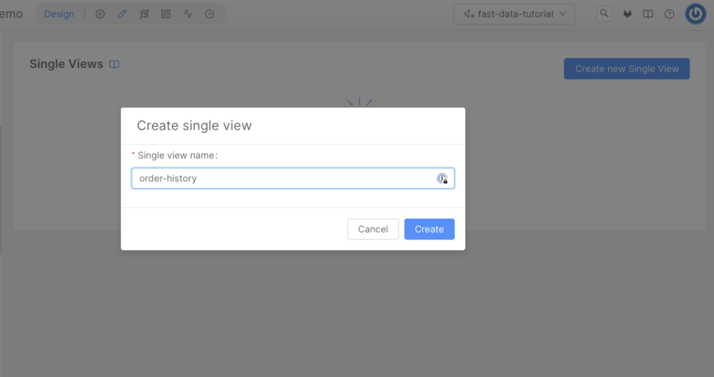
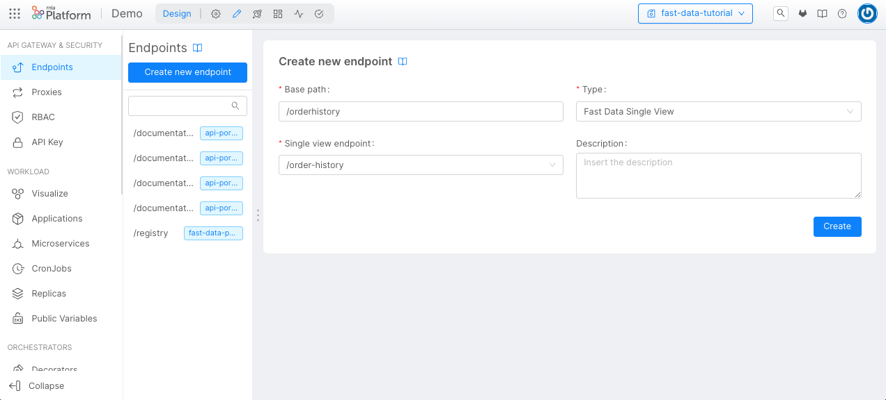

import Tabs from "@theme/Tabs";
import TabItem from "@theme/TabItem";

**Fast Data** is an event-driven architecture that allows you to collect data, manipulate and aggregate it from your systems in near real-time using a data stream approach.

## What We Will Build

In this tutorial, we will create a simple example of a Single View dedicated to a history of orders made by a customer. To do that we will expect to receive data from two
different tables: a table that includes a registry of customer data (like the name, address and so on) and a table for a single order (with date, price and the identifier of
the customer included in the registry).

We are going also to create the microservices that will store the data received in separate collections (we will call them _Projections_) and aggregate the Single View.

To do that, in the console, you will:
  - Generate two Projections where we will store the data;
  - Connect two endpoints to the Projections;
  - Create a Single View Low Code that will aggregate the data from the two projections;
  - Create an endpoint that will consume the data from the Single View;
  - Test the Single View.

## Prerequisites

Before starting this tutorial, you need to be familiar with the concepts of:
* [Fast Data architecture](/fast_data/architecture.md), in particular:
  * [Projections](/fast_data/configuration/projections.md)
  * [Single View](/fast_data/configuration/single_views.md)
  * [Strategies](/fast_data/configuration/strategies.md)
  
* Kafka (including producers and consumers).
* MongoDB

For the technical part of this tutorial, you will need both Kafka and MongoDB instances available.

## Systems of Record

A _System of Record_ (__SoR__) is a container of _Projections_, which is are architectural objects responsible for storing the data in a persistent storage, to have a fast and scalable way to decouple the data from the source system.
We will use these projections to have a copy of the data from the source systems, and later they will be used to aggregate the data from the source systems, using the Single View Creator.

The architectural component responsible for creating and updating the projection is either the _Real-Time Updater_ or, starting from `Console v12.0.0`, the _Projection Storer_: we will refer to it as `SoR Microservice` throughout this tutorial.

This microservice manages a Kafka consumer that will consume the data from the source systems and will update the corresponding projections on MongoDB.

In this tutorial, we can imagine a simple delivery platform where the data are the registry and the order of the customers.
So, we will create a single System of Records with two projections (one for the registry and one for the order) attached to a single Real-Time Updater.

### Create the System of Records

:::caution
Until `Console v11.7.0`, the _Real-Time Updater_ service was automatically created after saving the configuration on System of Records creation. 

If you're using a Console version lower than `v11.7.0`, you can skip the [System of Record Microservices section](#system-of-records-microservices) and just configure the [required environments variables](/fast_data/configuration/realtime_updater.md) of the micro-service.
:::

Before starting to create projections, we need to create the System of Record representing the source system we want to connect to.

<details>
  <summary><strong>SoR Creation Steps</strong></summary>
<p>

1. Open the page Projection in the Fast Data section of our left menu;
2. Click on the button `Create new System of Records`:

3. In the dialog, choose the name (which will act as an identifier of the System of Record, we will call it `delivery`) and the Kafka message format (choose the format you want to use for the messages sent on the Kafka topics) and then click on `Create`:

  
4. Now we can either start the projections or attach _SoR microservices_ inside this System of Records:


</p>
</details>

### System of Records Microservice

Once a system of record has been created, you'll need at least one _SoR microservice_ where projections will be assigned.  

<details>
<summary><strong>SoR Microservice Setup</strong></summary>
<p>

<Tabs
  defaultValue="projection-storer"
  groupId="sor-microservice"
  values={[
      { label: 'Projection Storer', value: "projection-storer", },
      { label: 'Real-Time Updater', value: "rtu", },
  ]}
>

<TabItem value="projection-storer">

The first step is to create the microservice _Projection Storer_, that will be attached to the System of Records we will create. To do so, we move to the _Microservices_ section of the console. From here we can click on the
"Create a Microservice" button on the top-left corner to open the Marketplace and select our microservice.

We can find it under the name of *Projection Storer*.


After selecting the _Projection Storer_ service, the only thing you need to choose is a unique name (we suggest _delivery-projection-storer_) and, eventually the description. Once clicked on the `Create` button, the service
will be created and we will be redirected to the service page.

Then, move to the `delivery` SoR and, in the `Services` section, attach the newly created service.


Once the service has been attached, you can click on the right arrow of the micro-service and edit its configuration.


In this section, you can setup the following configurations:

* [Kafka Consumer](/fast_data/configuration/projection_storer_config#consumer), which will be used to read [ingestion-messages](/fast_data/inputs_and_outputs.md#ingestion-message),
* [Kafka Producer](/fast_data/configuration/projection_storer_config#producer), which will be used to generate [pr-update messages](/fast_data/inputs_and_outputs.md#projection-update-message),
* [Storage Configuration](/fast_data/configuration/projection_storer_config#storage), which will contain the MongoDB connection where the database is located.

</TabItem>
<TabItem value="rtu">

:::caution
From version `11.7.0` of the Console, the _Real-Time Updater_ service must be created manually with the guide explained in this paragraph.

If you're using an older version, you can skip this paragraph since the service is automatically created when saving the configuration after creating the System of Records.
:::

The first step is to create the microservice _Real-Time Updater_, that will be attached to the System of Records we will create. To do so, we move to the _Microservices_ section of the console. From here we can click on the
`Create a Microservice` button on the top-left corner to open the Marketplace and find the microservice under the name of *Real-Time Updater*.


After selecting the _Real-Time Updater_ service, the only thing you need to choose is a unique name (we suggest _fast-data-delivery-realtime-updater_) and, eventually the description. Once clicked on the "Create" button, the service
will be created and we will be redirected to the service page. Now we need to configure all the parameters of the microservice. Here is an example of the fields that we need to configure:

- `PROJECTIONS_DATABASE_NAME`: the name of the database that will be used to store the data of the Projections
- `PROJECTIONS_CHANGES_COLLECTION_NAME`: the name of the collection that will be used to store the changes of the Projections (we suggest _fd-pc-delivery_)
- `KAFKA_BROKERS`: the list of the kafka brokers that will be used to send the data to the Projections
- `KAFKA_GROUP_ID`: the group id that will be used to consume the data from the source systems
- `KAFKA_SASL_USERNAME`: the username that will be used to login to the kafka brokers
- `KAFKA_SASL_PASSWORD`: the password that will be used to login to the kafka brokers
- `KAFKA_SASL_MECHANISM`: the mechanism that will be used to login to the kafka brokers

:::info
The Real-Time Updater includes more optional parameters that might be included via Environment Variables. If you need to know more about them, you can [read the documentation of the Real-Time Updater](/fast_data/configuration/realtime_updater.md).
:::

The last step to finish the configuration of the System of Records is to attach the Real-Time Updater we originally created. To do so, move to the _Services_ tab where a placeholder will inform you that no services
have been attached yet and suggest you to select one from the list of compatible services.


Then, we are ready to save the configuration.

</TabItem>
</Tabs>

</p>
</details>

## Projections

Inside a System of Records page, we need to click on the `Create new Projection` button. A modal will open, allowing the user to choose the Projection name. Click on `Create` to create the Projection.


Once the projection is created, you will be automatically redirected to its dedicated page, where we can see the default CRUD data schema already configured.


For this tutorial, we will create two projections: 

* `registry`: will store data about the user;
* `orders`: will store the data of the user's orders.

For each of them, we have to consider the following aspects.

#### Fields

Now we need to define the fields that we want to store in the Projection. You can do that by clicking the `Add field` button located at the top-right of the `Fields card`.


:::info
It is mandatory to define at least one custom field. Also, you must define at least one field as **Primary Key** (select the related checkbox).
:::

:::info
You can leave `defaultIdentity` as a value for _Cast Function_ when entering the fields for this tutorial.
In this way, every value inside the payload received from the Source Systems will be saved in the database without further customizations.
:::

#### Topics

At the bottom of the same page, we can also see the Kafka topics. There are two types of topics:

* [Ingestion topic](/fast_data/inputs_and_outputs#ingestion-message):  will be used by the SoR microservice
to receive the data from the Source Systems so that the Projections will be updated on the target Database;
* [PR Update topic](/fast_data/inputs_and_outputs#projection-update-message): will be used to notify when a projection has been updated.


:::caution
The application does not create Kafka topics for you. If you decide to use a different Kafka topic name, please be sure the topic already exists and it is fully operational.
The Real-Time Updater, the service that receives the update from the source System, will crash at startup if there is a topic not defined in Kafka.

The Kafka topic names can be changed over time, but please mind that their name must be __unique within your Kafka cluster__.
:::

#### Assign Projection to SoR Microservice

Before receiving messages from the ingestion topic defined in the projection, you have to link it to a SoR microservice. 

Go back to the `Services` section of the `delivery` SoR, and select the microservice you have attached during the previous paragraph: there, on the `Projections` card, you can pick one or more projections.


In this particular case, both `registry` and `orders` will be linked to the same microservice.

Going back to the projection's page, you can see that the microservice linked to it will appear under the `Microservice` card.

#### Projection Specifications

Here you can find the specifications about the projections we are going to use in this tutorial. 

<details>
  <summary> <strong>Registry</strong> </summary>
  <p>

#### Fields


| Field           | Type   | Required    | Primary Key    | Description                                                       |
|-----------------|--------|-------------|----------------|-------------------------------------------------------------------|
| **registry_id** | String |   &check;   |     &check;    | The registry ID.                                                  |
| **name**        | String |      -      |        -       | The name of the customer to whom the registry refers.             |
| **email**       | String |      -      |        -       | The email of the customer to whom the registry refers.            |
| **phone**       | String |      -      |        -       | The phone of the customer to whom the registry refers.            |
| **address**     | String |      -      |        -       | The address of the customer to whom the registry refers.          |
| **city**        | String |      -      |        -       | The city of the customer to whom the registry refers.             |
| **state**       | String |      -      |        -       | The State of the customer to whom the registry refers.            |

#### Topics

These are the suggested naming convention of topics defined in Kafka, where we expect to receive messages related to the update of projections:

* __Ingestion__: `demo.development.delivery.registry.ingestion` 
* __Pr-Update__: `demo.development.delivery.registry.pr-update` 

</p>
</details>

<details>
  <summary> <strong>Orders</strong> </summary>
  <p>

#### Fields

| Field           | Type   | Required | Primary Key | Description                                                    |
|-----------------|--------|----------|-------------|----------------------------------------------------------------|
| **order_id**    | String |  &check; |   &check;   | The order ID. Check this field as "Required" and "Primary Key".|
| **name**        | String |    -     |     -       | The name of the product.                                       |
| **price**       | Number |    -     |     -       | The price of the product.                                      |
| **date**        | String |    -     |     -       | The date when the order was placed.                            |
| **registry_id** | String |    -     |     -       | The registry ID of the customer who placed the order.          |

#### Topics

These are the suggested naming convention of topics defined in Kafka, where we expect to receive messages related to the update of projections:

* __Ingestion__: `demo.development.delivery.order.ingestion` 
* __Pr-Update__: `demo.development.delivery.order.pr-update` 

</p>
</details>

### Expose Projection Endpoints

At this point, we have configured the microservice, we already have one system of record and two projections, but we need to expose the Projection endpoints. 

:::tip
It is not mandatory to expose the Projection endpoints to create, update and work with the Single View, but if you want to expose the raw data stored in the projection you need to create the endpoints.
:::

In the Endpoint section, we can click on the **Create new endpoint** button to create the Projection's endpoints.


Inside the creation page, we can choose the endpoint path. Inside the type we need to select `Fast Data Projection` and, in the Fast Data Projection dropdown menu, we can choose the Projection that we want to expose.
We can create two different endpoints, one for the registry and one for the order.

:::caution
Remember that the endpoint connected to the Fast Data will create just `GET` endpoints: so, we can't perform _update_ and _delete_ operations over the endpoint.
:::

### Testing Projection

Now it's time to [save](/console/handbooks/project-usage.md#save-changes) and [deploy](/console/handbooks/project-usage.md#deploy-changes) the new configuration.


After that, we can try to send a message to the _Kafka Ingestion Topics_ created in the previous steps, and we can see the data stored in the Projection using the APIs available in the [API Documentations](/console/project-configuration/documentation-portal.md).

<details>
<summary><strong>Example Reponses</strong></summary>
<p>

Following are example responses from the API Documentations for Registry and Order Projections after the Kafka messages have been successfully processed.

Here is the response for the Registry Projection after we created a customer with id `reg-1`.
``` json
[
  {
    "_id": "63ceb97233241d6536c857e759c02",
    "__STATE__": "PUBLIC",
    "address": "customer address",
    "city": "customer city",
    "createdAt": "2023-01-23T16:44:33.006Z",
    "email": "customer1@mail.com",
    "name": "customer 1",
    "phone": "customer phone",
    "registry_id": "reg-1",
    "state": "customer state",
    "updatedAt": "2023-01-23T16:44:33.006Z"
  }
]
```

Here is the response for the Order Projection after we created an order with id `ord-1`.
``` json
[
  {
    "_id": "63cebcb6d65321231236c857e76b6ab",
    "__STATE__": "PUBLIC",
    "createdAt": "2023-01-23T16:58:30.201Z",
    "date": "23/1/2023",
    "name": "order-1",
    "order_id": "ord-1",
    "price": "123",
    "registry_id": "reg-1",
    "updatedAt": "2023-01-23T16:58:30.201Z"
  }
]
```

</p>
</details>

### Configure Real-Time Updater ConfigMaps

After saving the configuration, we can return to the _fast-data-delivery-realtime-updater_ microservice to notice several differences:
some environment variables have been modified (such as the INVARIANT_TOPIC_MAP, SYSTEM_OF_RECORDS) and several new ConfigMaps have been created.


Among these, two of them needs to be configured:

- The **ER Schema**, which is a ConfigMap in JSON format that represents a classic entity-relationship model, so it is used to know how the data of different projections are connected.
- The **Projection Changes Schema**, which is a ConfigMap in JSON format that represents the path that goes from one projection to another and will be used to find the Single View key
(in this tutorial it will be _registry_id_) that needs to be updated.

The goal of these configurations is to create a relationship from the _order_ Projection to the _registry_ Projection. So whenever an Order or a Registry is updated, we will store it in a dedicated
collection in MongoDB that a Single View associated with that Registry has to be re-aggregated (so, updated with the latest values of the Projections).

#### Projection Changes Schema

The _Projection Changes Schema_ is a ConfigMap that represents the path that goes from one entity to another, and it is used to find the Single View key.
We will talk about the Single View key in the next section, but remember that the Single View key is the primary key of our Single View, and we need to obtain the Single View key from the updated Projection (or that follows the ER Schema until we reach a projection that contains the Single View key).

The reason why we need to configure this ConfigMap is that, when we will update each Projection, we need to know the Single View keys to update.

Inside our example we can see that the Single View key is the registry_id, so we need to configure the Projection Changes Schema to know each path that goes from the projection to each other projection that contains the Single View key.
In this example, we have the registry_id in both the Registry Projection and in the Order Projection, so we need to configure the Projection Changes Schema to read the registry_id from the updated Projection.

```json {4,7,9,13,15} showLineNumbers
{
  "version": "1.0.0",
  "config": {
    "order-history": {
      "paths": [
        {
          "path": [ "order", "registry" ],
          "identifier": {
            "registry_id": "registry_id"
          }
        }
      ]
    }
  }
}
```

With this configuration, the Single View that we are going to create can be updated with both of the following ways:
- if we update the Projection _registry_, then we can read the registry_id directly from there.
- if we update the Projection _order_, we will search the related document inside the Projection _registry_, then we can read the registry_id.

You can find a more thorough explanation of the _Projection Changes Schema_ on the [dedicated page](/fast_data/configuration/config_maps/projection_changes_schema.md) of the documentation.

## Single View

The Single View is an architectural object that it's used to store the aggregate data from the Projections. The goal of the Single View is to store the data already aggregated and ready to use from the Projection.
A good approach is to store the data in Single Views dedicated to each channel and each use.

In this tutorial, our Single View is called `order-history` and we will create an object schema with the registry information and the orders information linked to the registry: this means that each document is an object that contains the registry information about the user and the information about the orders associated with the user.

We need to open the `Single Views` page in the Fast Data section of our left menu, then click on the **Create new Single View** button, and we can create a new Single View called `order-history`.


Here we can choose the name of the Single View.



Now we need to create the fields of the Single View, inside this tutorial we will create the following fields:

| Field           | Type             | Description                                                       |
|-----------------|------------------|-------------------------------------------------------------------|
| **registry_id** | String           | The registry ID. This field must be marked as "Required".         |
| **name**        | String           | The name of the customer to whom the registry refers.             |
| **city**        | String           | The city of the customer to whom the registry refers.             |
| **state**       | String           | The State of the customer to whom the registry refers.            |
| **orders**      | Array of objects | The orders associated to the registry.                            |


:::caution
It is important to also define the JSON Schema for the _order_ field of the Single View.
:::

<details>
<summary>orders json schema</summary>
<p>

By clicking, the **Edit button** of the `orders` field, a right panel will show a JSON Schema editor, where you can place the following object:

``` json
{
  "properties": {
    "id": {
      "title": "Order id",
      "type": "string"
    },
    "price": {
      "title": "Order Price",
      "type": "number"
    },
    "name": {
      "title": "Order name",
      "type": "string"
    },
    "date": {
      "type": "string",
      "format": "date"
    }
  },
  "additionalProperties": false,
  "type": "object"
}
```

Then press on the **Save** button on the bottom right of the page to apply the changes made to the field.

</p>
</details>

### Microservice Configuration

First of all, we need to create a microservice that we will attach to the Single View that we're going to create. This microservice is called "Single View Creator", and it's available in the microservice Marketplace.


Here we have two different plugins: the first one is for the Single View Creator, and the second one is for the Single View Creator Low Code.
We will go for the latter since we want to leverage the usage of ConfigMaps for a quicker configuration of the microservice. We suggest naming it _single-view-creator-delivery_.

Now we need to configure all the parameters of the microservice, here is a set of the fields that we need to configure:

- `SINGLE_VIEWS_COLLECTION`: should be the name of the single view which your single view creator is responsible for (we suggest `order-history`, the same name as the Single View we are going to create);
- `SINGLE_VIEWS_PORTFOLIO_ORIGIN`: a representative name used in debugging and metrics to identify the source of any Single View update request (we suggest to use the name of the System of Record, `delivery`);
- `TYPE`: identifies the type of projection changes that need to be read. It should be the same as the Single View name you want to update (also here we are going to call it `order-history`).

Also, based on the connection channel where the microservice reads the projection changes, additional environment variables needs to be set:

<Tabs
  defaultValue="kafka"
  groupId="svc-connection"
  values={[
      { label: 'Kafka', value: "kafka", },
      { label: 'MongoDB', value: "mongodb", },
  ]}
>

<TabItem value="kafka">

* `PROJECTION_CHANGES_SOURCE`: by using the value `kafka`, it instructs the service to read projection changes from a Kafka connection;
* kafka connection variables such as:
  * `KAFKA_BROKERS`: a comma-separated list of your Kafka brokers;
  * `KAFKA_SASL_USERNAME`, `KAFKA_SASL_PASSWORD` and `KAFKA_SASL_MECHANISM` if authentication needs to be performed
  * `KAFKA_PROJECTION_CHANGES_TOPIC`: name of the topic that will receive projection changes in the shape of [trigger messages](/fast_data/inputs_and_outputs.md#single-view-trigger-message)
  * `KAFKA_GROUP_ID`: name of the consumer group that will be used to subscribe to the topic from the `KAFKA_PROJECTION_CHANGES_TOPIC` variable

</TabItem>
<TabItem value="mongodb">

* `PROJECTIONS_CHANGES_COLLECTION`: it is the name of the collection that includes the Projection Changes generated by the Real-Time Updater, and it must have the same value set in that microservice (we previously suggested `fd-pc-delivery`);
* `SCHEDULING_TIME`: tells how many milliseconds the microservice needs to wait before polling new projection changes from the `PROJECTION_CHANGES_SCHEMA_COLLECTION`. We set it to `5000`, meaning that 5 seconds will pass between each polling.

</TabItem>

</Tabs>

:::info
The Single View Creator includes more optional parameters that might be included via Environment Variables. If you need to know more about them, you can [refer to the related documentation section](/fast_data/configuration/single_view_creator/index.md#environment-variables).
:::

The microservice also needs the following ConfigMaps to work properly:

  * **Single View Key**: this is the key that will be used to store the Single View
  * **ER-Schema**: the ER Schema
  * **Aggregation**: the aggregation that will be used to calculate the Single View

This configurations will be in read-only mode, since they can be edited inside the _Single View_ section.

#### Strategies

Now we need to create the strategies of the Single View. Strategies are used to define when the data need to be updated in a Single View. For example, when we update the registry we need to update the Single View information.
In this tutorial, we will create two strategies: the first one is for the registry's update and the second one is for the order's update.

Inside our Single View "order-history", click on the **Add link to strategy** button.


Now we will choose the System Of Records and the Projection that we want to link to the Strategy; in our case, "delivery" and "registry".


Last but not least, we need to choose the Strategy Source. In this case, we will use the "Low Code" strategy, then we can click on the **Create** button.


Then we can create the strategy also to the Order Projection, following the same process.


:::info
We need to define one strategy for each Projection because when the projection is affected by a change, we need to calculate which single views are impacted.
This is made possible by the strategies. With the "Low Code Strategy", the system will automatically calculate the impacted single views.
:::

### Attach Microservice to Single View

The last configuration that you need to do is to attach the newly created `Single View Creator` microservice to our `order-history` Single View.

Inside the **Single View** page, go to the **Single View Creators** tab. A placeholder will inform the user that a Single View Creator must be attached.


From there, select the `single-view-creator-delivery` microservice, then click the **Add single view creator** button.

## Single View Aggregation

After linking a microservice to the Single View page, click the `->` button at the right side of the table will open a new page where it will be possible to configure the aggregation.

### ER Schema

The ER Schema is a configuration used by Fast Data to infer into the microservices the relationships among projections. In the case of  `order-history`, we have to define a relationship where one Customer (stored in the `registry` Projection) can have multiple Orders (stored in the `orders` Projection).


:::info
The following explains how to configure an ER Schema using the "Er Schema" section of Fast Data. To do so, please make sure that this feature is enabled in your project. You might need to ask your Project Administrator for it.
:::

You can configure the ER Schema in both **No Code** and **Low Code** mode.

<Tabs
  defaultValue="no-code"
  groupId="fast-data-mode"
  values={[
      { label: 'No Code', value: "no-code", },
      { label: 'Low Code', value: "low-code", },
  ]}
>

<TabItem value="no-code">

To configure the ER Schema with the No Code, you need to return to the **Projection** section, and then select the "ER Schemas" tab. From there, you can create a new ER Schema, by clicking the **Create new ER Schema** button:
a modal will prompt you to choose a name for your ER Schema (we suggest: `delivery-er-schema`). After that, you will be redirected to the ER Schema canvas.


The configuration of the ER Schema with the "No Code" is explained in the [dedicated section](/fast_data/configuration/config_maps/erSchema.md#use-the-no-code),
but we include here a quick guide on how to create the ER Schema with the needed relationships:

- In the right side panel you can see the list of Projections inside the System of Record `delivery`: drag the collections `registry` and `order` to the canvas in the middle of the screen.
- Inside the canvas, draw a line from the dot at the right of the `registry` Projection to the `orders` Projection: you'll see that the line remains visible with a small warning icon in the middle,
which means that the relationship has been created without any condition.
- the right side panel should show the details of the relationship. From here you'll need to:
  - change the **Condition Type** value of `A -> B` to `One to many`.
  - click on the **Edit Rules** button to open the Rules Modal: click on **+ Rule** button and then fill the input fields with `registry_id` both for the `registry` and the `orders` Projection. Finally, click the **Save** button.

The final result should resemble the following image:


</TabItem>

<TabItem value="low-code">

This is the ER Schema that can be seen in the **Advanced Section** of the canvas:

```json title=erSchema.json {4,6,10} showLineNumbers
{
  "version": "1.0.0",
  "config": {
    "registry": {
      "outgoing": {
        "order": {
          "conditions": {
            "registry_to_order": {
              "condition": {
                "registry_id": "registry_id"
              },
              "oneToMany": true
            }
          }
        }
      },
      "order": {
        "outgoing": {
          "registry": {
            "conditions": {
              "order_to_registry": {
                "condition": {
                  "registry_id": "registry_id"
                },
                "oneToMany": false
              }
            }
          }
        }
      }
    }
  }
}
```

In this example, we can see that the relationship goes from registry to order (from line 4 to line 16) and vice versa.

The relationship is represented by the following two conditions:

- `registry_id` (from `orders`): `registry_id` (from the updated registry). The condition is `One to One`, meaning that one order can be related to one and only one registry item.
- `registry_id` (from `registry`): `registry_id` (from the updated order). The condition is `One to Many`, meaning that one registry might have a relation with multiple orders.

The conditions will be interpolated into the `find` operation of a MongoDB query. In this case, the condition can be translated as:

- `registry_to_order`: `find({ registry_id: "value of registry_id from registry projection"})`
- `order_to_registry`: `findOne({ registry_id: "value of registry_id from orders projection"})`

</TabItem>


</Tabs>

### Single View Key

The **Single View Key** represents the link between the identifier of the projection change and the Single View fields: this mapping will be executed at the beginning of the aggregation, to retrieve the **base projection** that will be used as a starting point to compute the single view.
to get a query that, executed in the Single View collection, retrieves the Single View document to be updated.

<Tabs
  defaultValue="no-code"
  groupId="fast-data-mode"
  values={[
      { label: 'No Code', value: "no-code", },
      { label: 'Low Code', value: "low-code", },
  ]}
>


<TabItem value="no-code">

:::info
The following explains how to configure a Single View Key using the "No Code" feature, available from version `11.3.0` of the Mia-Platform Console.
Please make sure that your project has activated this feature. You might need to ask your Project Administrator for it.
:::

To configure the _Single View Key_ with the "No Code" feature, you can refer to the [specific documentation page](/fast_data/configuration/config_maps/singleViewKey.md#using-the-no-code).

Here is a quick list of operations to execute to configure correctly the Single View Key:
* move to the "Settings" page and go to the "Single View Key" card.
* click on the "Configure" button to open a modal to start configuring the Single View Key.
* click the "Add Single View Key": a new line will appear with two input fields.
* as _Single View Primary Field_, which is a field of the Single View, select _registry_id_.
* as _Projection Identifier_, which is the projection identifier defined in the [Projection Changes Schema](#projection-changes-schema),
select _registry_id_ (which is, for our example, the same name of the Base Projection _registry_).
* you can review the updates by clicking the toggle "Advanced Mode" and, when you are sure everything is fine, click on "Save".

Now also the Single View Key ConfigMap is completely configured.

</TabItem>

<TabItem value="low-code">

In the Low Code Single View Creator we need to set the following JSON in the Code Editor inside the "Single View Key" tab:
```json
{
  "version": "1.0.0",
  "config": {
    "registry_id": "registry_id"
  }
}
```
The condition inside the _config` object is represented by:
  * registry_id (from the Single View document): registry_id (obtained from the Projection Change document)

</TabItem>

</Tabs>

### Aggregation

The aggregation is the configMap that will be used to define the rules on how the Single View will be calculated.
In this configuration, we will get our dependencies from the projection and the description of how we want to map the dependencies to the Single View Data Model.

In our case, we will map `registry_id`, `name`, `city` and `state` from the Projection `registry`, and the order list from the Projection `orders`.

<Tabs
  defaultValue="no-code"
  groupId="fast-data-mode"
  values={[
      { label: 'No Code', value: "no-code", },
      { label: 'Low Code', value: "low-code", },
  ]}
>

<TabItem value="no-code">

:::info
The following explains how to configure an Aggregation using the **No Code** feature, available from version `11.3.0` of the Mia-Platform Console.
Please make sure that your project has activated this feature. You might need to ask your Project Administrator for it.
:::

To have an exhaustive explanation of how to configure an Aggregation with the "No Code" feature, you can refer to the [specific documentation page](/fast_data/configuration/config_maps/aggregation.md#use-the-no-code).

Assuming that the ER Schema has already been selected (see previous paragraph), here is a list of steps to be executed to configure the Aggregation:
* Selecting the **Aggregation** tab, you'll be required to select a Base Projection which is the Projection from where the mapping will begin:
in our tutorial, we select the Projection `registry` and click on **Set base projection**. After this, the Single View Data Model will show up to the left, ready for the configuration.
* Select the field `registry_id`: a panel will open to the right where we can select the dependency `registry` and the field `registry_id`.
* Select the field `name`: a panel will open to the right where we can select the dependency `registry` and the field `name`.
* Select the field `city`: a panel will open to the right where we can select the dependency `registry` and the field `city`.
* Select the field `state`: a panel will open to the right where we can select the dependency `registry` and the field `state`.
* Select the field `orders`: it will open a panel with the list of fields inside the Array of Objects _orders_ defined in the Data Model.
* Click on the **Edit dependencies (0)** button to create the dependency between `registry` and `orders` in the Aggregation: inside the modal click first on the **Add dependency** button to start configuring the dependency.
  * select the Source Projection `registry`: the rest of the form should fill automatically and a click on the **Add dependency** button will generate the dependency.
  * click on **Save** to update the Aggregation with the new dependency. You will see the `orders` field having an additional panel with the mapping of the fields for each element:
    * select the field `id`: a panel will open to the right where we can select the dependency `orders` and the field `order_id`.
    * select the field `price`: a panel will open to the right where we can select the dependency `orders` and the field `price`.
    * select the field `name`: a panel will open to the right where we can select the dependency `orders` and the field `name`.
    * select the field `date`: a panel will open to the right where we can select the dependency `orders` and the field `date`.

After the following steps, the Aggregation is completely configured and, on configuration saving, it will be applied to the aggregation ConfigMap of the microservice.
You can click on the toggle **Advanced Mode** at the bottom-left of the page to review your configuration in a JSON format.

:::caution
In case you want to reset the aggregation by changing the Base Projection, you have to go to the _Settings_ tab and click the **Edit** button inside the **General** card.
:::

</TabItem>

<TabItem value="low-code">

Here's the Low-Code representation of the aggregation:

```json {4,6,10,14,22} showLineNumbers
{
  "version": "1.0.0",
  "config": {
    "SV_CONFIG": {
      "dependencies": {
        "registry": {
          "type": "projection",
          "on": "_identifier"
        },
        "ORDERS": {
          "type": "config"
        }
      },
      "mapping": {
        "registry_id": "registry.registry_id",
        "name": "registry.name",
        "city": "registry.city",
        "state": "registry.state",
        "orders": "ORDERS"
      }
    },
    "ORDERS": {
      "joinDependency": "order",
      "dependencies": {
        "order": {
          "type": "projection",
          "on": "registry_to_order"
        }
      },
      "mapping": {
        "id": "order.order_id",
        "price": "order.price",
        "name": "order.name",
        "date": "order.date"
      }
    }
  }
}
```

- `SV_CONFIG` is the starting point of the configuration of the Single View, made of two fields:
  - `dependencies`: represents the set of collections that will be used to compute the aggregation of the Single View. In this case:
    - `registry` is the dependency that will be used to get the base projection `registry`, referencing the `_identifier` keyword to use the Projection Change record in the query to obtain the record.
    - `ORDERS` is a dependency that has its own configuration, described later.
  - `mapping`: defines the relation between single view fields and projection fields, using the `dependencies` defined before:
    - `registry_id` is the field `registry_id` from the `registry` projection.
    - `name` is the field `name` from the `Registry` projection.
    - `city` is the field `city` from the `registry` projection.
    - `state` is the field `state` from the `registry` projection.
    - `orders` is referred to the dedicated `ORDERS` configuration, where:
      - `joinDependency` is used to define that this dependency is the result of a 1:N relation (1 registry to N orders), so to define that each element of `orders` will have its own `order` dependency
      - `dependencies` are the dependencies that will be used to calculate the order list:
        - `order`  is the dependency that will be used to get the order information directly from the Projection, where the condition `registry_to_order` is contained in the ER Schema and will be used as a query to the get the `orders` documents.
      - `mapping` defines the relation between single view fields and projection fields, using the `dependency` defined before
        - `id` is the field `id` from the `orders` projection.
        - `price` is the field `price` from the `orders` projection.
        - `name` is the field `name` from the `orders` projection.
        - `date` is the field `date` from the `orders` projection.

</TabItem>

</Tabs>

## Expose the Single View

### Create Endpoint

Now we have the Projections, the Single View and each configuration ready to be used, we need to expose the Single View endpoints.

1. Return to the *Endpoints* menu on the left;
2. Select **Create new endpoint**;
3. Choose the Base Path;
4. Choose **Single View** as Type;
5. Select from the list the name of our Single View, in this case: _/order-history_.



Now we can [commit](/console/handbooks/project-usage.md#save-changes) our changes, [deploy](/console/handbooks/project-usage.md#deploy-changes), and try our [Fast Data](/fast_data/architecture.md) sending data from the Kafka Topic, and see the result in the Single View using the endpoints.

### Test your Single View

You can now consume the order-history Single View using the APIs available in the [API Documentations](/console/project-configuration/documentation-portal.md).

Here you can see the response for the order-history Single View for the same data we used for [testing the Projections](#testing-projection). We can see that `ord-1` order is exposed in the **orders** array for `reg-1` customer.

``` json {6,12}
[
  {
    "_id": "63ceb97fd6536c857e75a0f2",
    "__STATE__": "PUBLIC",
    "updatedAt": "2023-01-23T16:58:47.805Z",
    "registry_id": "reg-1",
    "name": "customer 1",
    "city": "customer city",
    "state": "customer state",
    "orders": [
      {
        "id": "ord-1",
        "price": "123",
        "name": "order-1",
        "date": "23/1/2023"
      }
    ]
  }
]
```

And here you can see the response with more customers and orders. The customer `reg-1` has now more orders that are aggregated in the **orders** list.

``` json {6,12,18,29,35}
[
  {
    "_id": "63ceb97f123123d6536c857e75a0f2",
    "__STATE__": "PUBLIC",
    "updatedAt": "2023-01-23T17:06:47.845Z",
    "registry_id": "reg-1",
    "name": "customer 1",
    "city": "customer city",
    "state": "customer state",
    "orders": [
      {
        "id": "ord-1",
        "price": "123",
        "name": "order-1",
        "date": "23/1/2023"
      },
      {
        "id": "ord-2",
        "price": "10",
        "name": "order-2",
        "date": "23/1/2023"
      }
    ]
  },
  {
    "_id": "63c123ebea7d6123123123536c857e775f93",
    "__STATE__": "PUBLIC",
    "updatedAt": "2023-01-23T17:06:47.859Z",
    "registry_id": "reg-2",
    "name": "customer 2",
    "city": null,
    "state": null,
    "orders": [
      {
        "id": "ord-3",
        "price": "25",
        "name": "order-3",
        "date": "23/1/2023"
      }
    ]
  }
]
```
