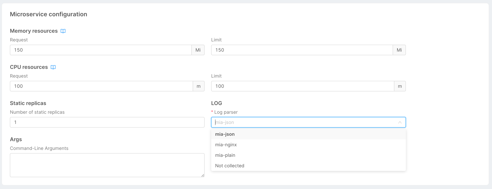

The objective of these guidelines is to guarantee uniformity between the logs from all services that run in a single project, regardless of whether they are custom or core.

## Log Parsers

Every micro-service from the Marketplace comes with an [annotation](/development_suite/api-console/api-design/services.md#annotations-configuration) called `mia-platform.eu/log-type`: this annotation allows log collection and processing
from your Kubernetes cluster to the ELK Stack.

Mia-Platform Console provides a series of log parsers that can be used as annotations and at runtime provides information to the loggin stack to parse and process fields of your service logs.

This information are available in the [Microservice configuration card](/development_suite/api-console/api-design/services.md#microservice-configuration) and will change accordingly the aforementioned annotation.



Possible parsers are:

- `mia-json`: parse log lines as JSON data structures, including nested fields.

  <details><summary>Example:</summary>
  <p>
  A possible log that can be parsed is:
  
  ```json
  {"level":30,"time":1531171074631,"msg":"hello world","pid":657,"hostname":"example.com"}
  ```

  This log will be parsed into the following fields:

  * `level`: 30
  * `time`: 1531171074631
  * `msg`: `hello world`
  * `pid`: 657
  * `hostname`: `example.com`

  </p>
  </details>

- `mia-nginx`: parse log lines from our [API Gateway based on NGINX](/runtime_suite/api-gateway/10_overview.md) having the following format:

  ```
  <remoteAddress> <remoteHostname> [<time>] "<requestMethod> <requestURL> HTTP/<requestHTTPVersion>" <statusCode> <responseSize> "<HTTPReferer>" "<userAgent>" - <responseTime> - <reqId>
  ```
  where `time` is in the format `%Y-%m-%dT%H:%M:%S%z`.
  <details><summary>Example:</summary>
  <p>
  A possible log that can be accepted by the parser is:
  
  ```
  1.1.1.1 example.com [2023-10-30T15:47:07+00:00] "GET / HTTP/1.1" 404 323 "-" "Some browser" - 0.002 - my_unique_request_id
  ```

  This log will be parsed into the following fields:
  * `remoteAddress`: `1.1.1.1`
  * `remoteHostname`: `example.com`
  * `time`: `2023-10-30T15:47:07+00:00`
  * `requestMethod`: `GET`
  * `requestURL`: `/`
  * `requestHTTPVersion`: `1.1`
  * `statusCode`: `404`
  * `responseSize`: 323
  * `HTTPReferer`: `-`
  * `userAgent`: `Some browser`
  * `responseTime`: 0.002
  * `reqId`: `my_unique_request_id`

  </p>
  </details>

- `mia-plain`: does not parse any information contained in log lines.

:::caution
Any log produced by the application that is not following this format will be stored but **NOT** indexed into logging fields. 

To not collect logs from a micro-service, you can specify `Not Collected` as log parser.
:::

## JSON Logging format

When a service uses the label with value `mia-json`, all of its key/values are collected and stored in Elastic. However, if you want to perform queries on the logs using Kibana, you'll need to create indexes.

A set of preconfigured indexes come with each Console project. These indexes run on a specific set of keys. The following document provides a list of available log keys (following the [Elastic Common Schema](https://www.elastic.co/guide/en/ecs/current/index.html) specifications) that can be used. Some of these log keys are indexed.

:::info
Each project has a set of preconfigured indexes. If you need custom indexes, please refer to your Mia-Platform representative.
:::

Here you can find some guidelines, drawn from [guidelines and best practices suggested by Elastic](https://www.elastic.co/guide/en/ecs/1.4/ecs-guidelines.html), which should be followed when application logs are generated:

- Field names must be in **camelCase**;
- Field names must not contain special characters;
- Field names should be singular or plural according to the content of the field;
- Whenever it makes sense, prefer nesting your fields in structured objects;
- Avoid using abbreviations in field names.

:::note
When creating a new server, consider offload the setup of the logging facilities to Mia-Platform service libraries:

- For **Node.js** services, you can use [lc39](https://github.com/mia-platform/lc39) and [custom-plugin-lib](https://github.com/mia-platform/custom-plugin-lib);
- For **Go** services, you can use [glogger](https://github.com/mia-platform/glogger).

:::

### Use the appropriate logging level

It is important to always use the correct log level. Each level has a value expressed in tenths: the higher is the number, the higher the severity of the log.
To choose which is the appropriate level, you should rely on the following criteria:

| Name      | Severity | Description                                                                                                                                       |
| --------- | ---------| ------------------------------------------------------------------------------------------------------------------------------------------------- |
| `trace`   | 10       | Trace the operations flow of the application (do not use in production).                                                                  |
| `debug`   | 20       | Report information that may be useful in troubleshooting (do not use in production).                                                           |
| `info`    | 30       | In cases where the service has to give information about the branch of code in execution.                                                         |
| `warning` | 40       | In cases of recoverable error, the service can continue to process the request.                                                                   |
| `error`   | 50       | In cases of not recoverable error and error for which the processing of the request (but not the service) must be interrupted.                    |
| `fatal`   | 60       | In cases of unexpected and not recoverable error, and as a result of which the service must stop its execution.                                   |

It is important to put in logs the right information that can be used to track operations, highlight problems, and allow troubleshooting.

:::warning  
Avoid, under any circumstance, to insert any private or sensitive value that can lead to privacy-related issues or incidents.
:::

### Best Practices

In each log, the following fields should always be present:

| Name    | Type   | Indexed |Description                                                                      |
| ------- | ------ | ------- |-------------------------------------------------------------------------------- |
| `msg`   | String |  Indexed | The text message specific for each log.                                          |
| `reqId` | String |  Indexed | Traces the flow of each request. It is taken from the platform headers  |
| `time`  | Number |  Indexed | Marks in Unix timestamp the moment when the log was generated.                 |
| `level` | Number |  Indexed | Identifies the severity level of the log.                                        |

:::caution
The `reqId` field is extremely useful to trace operations following a single request, and is considered mandatory since usually services expose APIs.  
However, if the concept of request tracing is not applicable, you can ignore it.
:::

### Track Requests

Each service exposing APIs must necessarily generate the logs shown in the table below, specifying the following fields in addition to the mandatory field specified above.

| Event             | Level   | Indexed | Field                                 |
| ----------------- | ------- | ------- | ------------------------------------- |
| Incoming request  | `trace` | Indexed | `host`, `url`                         |
| Request completed | `info`  | Indexed | `host`, `http`, `responseTime`, `url` |

:::note
If the service is not REST but takes its inputs from another source, the same criteria have to be applied.  
Use a `trace` log when the event processing starts, and a `info` log when the event ends.
The final log should contain as much useful information as possible.
:::

### ECS Field Definition

The following are examples taken from ECS documentation. None of the fields are mandatory, however it is important to use standard keys, whenever applicable.

#### Errors

If you want to create error logs, we recommend the following structure.
When an error log has been generated, the passed object must necessarily have the key `error`,
whose value has to be an object of the form specified by ECS for the [Error Fields](https://www.elastic.co/guide/en/ecs/1.4/ecs-error.html),
which are shown in the table below:

| Field                   | Type          | Level    | Indexed |Description                                                                                                                                       |
| ----------------------- | ------------- | -------- | ------- |------------------------------------------------------------------------------------------------------------------------------------------------- |
| `error.code`            | `keyword` | Core     | Indexed | Error code describing the error.                                                                                    |
| `error.id`              | `keyword` | Core     | Indexed | Unique identifier for the error.                                                                                        |
| `error.message`         | `text`    | Core     | Indexed | Error message.                                                                                                               |
| `error.stackTrace`      | `keyword` | Extended | Indexed | The stack trace of the error in plain text.             |
| `error.stackTrace.text` | `text` | Extended | Indexed | Multi-fields stack trace of the error in plain text.             |
| `error.type`            | `keyword` | Extended | Indexed | The type of the error, for example the class name of the exception. Example: `java.lang.NullPointerException` |

#### [*Host*](https://www.elastic.co/guide/en/ecs/1.4/ecs-host.html)

| Field           | Type      | Level    | Indexed |Description                                                                                                                                                                                                         |
| --------------- | --------- | -------- | ------- |------------------------------------------------------------------------------------------------------------------------------------------------------------------------------------------------------------------- |
| `host.hostname` | `keyword` | Core     | Indexed | Hostname of the host. It normally contains what the `hostname` command returns on the host machine.                                                                                  |
| `host.name`     | `keyword` | Core     | Indexed | Name of the host.      It can contain what `hostname` returns on Unix systems, the fully qualified domain name, or a name specified by the user. The sender decides which value to use.  |
| `host.uptime`   | `long`    | Extended | Indexed | Seconds the host has been up. Example: `1325`                                                                                                                                        |

#### [*HTTP*](https://www.elastic.co/guide/en/ecs/1.4/ecs-http.html)

| Field                                | Type      | Level    | Indexed    |Description                                                                                                                                                                                                         |
| ------------------------------------ | --------- | -------- | ---------- |------------------------------------------------------------------------------------------------------------------------------------------------------------------------------------------------------------------- |
| `http.request.body.bytes`            | `long`    | Extended | Indexed     | Size in bytes of the request body.     Example: `887`                                                                                                                                                                                                                     |
| `http.request.bytes`                 | `long`    | Extended | Indexed     | Total size in bytes of the request (body and headers).     Example: `1437`                                                                                                                                                                                                |
| `http.request.method`                | `keyword` | Extended | Indexed     | HTTP request method.      The field value must be normalized to lowercase for querying. See the documentation section "Implementing ECS".        Example: `get`, `post`, `put`                                                                                   |
| `http.request.referrer`              | `keyword` | Extended | Indexed     | Referrer for this HTTP request.     Example: `https://blog.example.com/`                                                                                                                                                                                               |
| `http.request.userAgent.device.name` | `keyword` | Extended | Not indexed | Name of the device.      Example: `iPhone`                                                                                                                                                                                                                              |
| `http.request.userAgent.name`        | `keyword` | Extended | Not indexed | Name of the user agent.       Example: `Safari`                                                                                                                                                                                                                        |
| `http.request.userAgent.original`    | `keyword` | Extended | Indexed     | Unparsed user_agent string.      example: `Mozilla/5.0 (iPhone; CPU iPhone OS 12_1 like Mac OS X) AppleWebKit/605.1.15 (KHTML, like Gecko) Version/12.0 Mobile/15E148 Safari/604.1` |
| `http.request.userAgent.original.text` | `text`  | Extended | Indexed     | Multi-fields unparsed user_agent string. |
| `http.request.userAgent.version`     | `keyword` | Extended | Not indexed | Version of the user agent.     example: `12.0`.                                                                                                                                                                                                                        |
| `http.response.body.bytes`           | `long`    | Extended | Indexed     | Size in bytes of the response body.      example: `887`                                                                                                                                                                                                                    |
| `http.response.bytes`                | `long`    | Extended | Indexed     | Total size in bytes of the response (body and headers).      example: `1437`                                                                                                                                                                                              |
| `http.response.status_code`          | `long`    | Extended | Indexed     | HTTP response status code.     example: `404`                                                                                                                                                                                                                            |
| `http.version`                       | `keyword` | Extended | Not indexed | HTTP version.      example: `1`                                                                                                                                                                                                                                        |

#### [*URL*](https://www.elastic.co/guide/en/ecs/1.4/ecs-url.html)

 | Field           | Type      | Level    | Indexed |Description                                                                                                                                                                                                         |
| ---------------- | --------- | -------- | ------- |------------------------------------------------------------------------------------------------------------------------------------------------------------------------------------------------------------------- |
 | `url.domain`    | `keyword` | Extended | Indexed | Domain of the URL, such as [www.mia-platform.eu](https://www.mia-platform.eu/).         In some cases a URL may refer to an IP and/or port directly, without a domain name.    In this case, the IP address would go to the `domain` field.  Example: `www.mia-platform.eu`                                                                        |
 | `url.fragment`  | `keyword` | Extended | Indexed | Portion of the URL after the `#`, such as "top".      The `#` is not part of the fragment.   |
 | `url.full`      | `keyword` | Extended | Indexed | If full URLs are important to your use case, they should be stored in `url.full`, whether this field is reconstructed or present in the event source.             |
 | `url.full.text` | `text`    | Extended | Indexed | Multi-fields. Example: `https://www.elastic.co:443/search?q=elasticsearch#top`                       |
 | `url.path`      | `keyword` | Extended | Indexed | Path of the request, such as `/search`.                                                                                         |
 | `url.port`      | `long`    | Extended | Indexed | Port of the request, such as 443.      Example: `443`                                                                                    |
 | `url.query`     |  `keyword` | Extended | Indexed | The query field describes the query string of the request, such as "q=elasticsearch".     The `?` is excluded from the query string. If a URL contains no `?`, there is no query field. If there is a `?` but no query, the query field exists with an empty string. The `exists` query can be used to differentiate between the two cases. |
 | `url.scheme`    | `keyword` | Extended | Indexed | Scheme of the request, such as "https".      Note: The `:` is not part of the scheme.      Example: `https`.                      |
