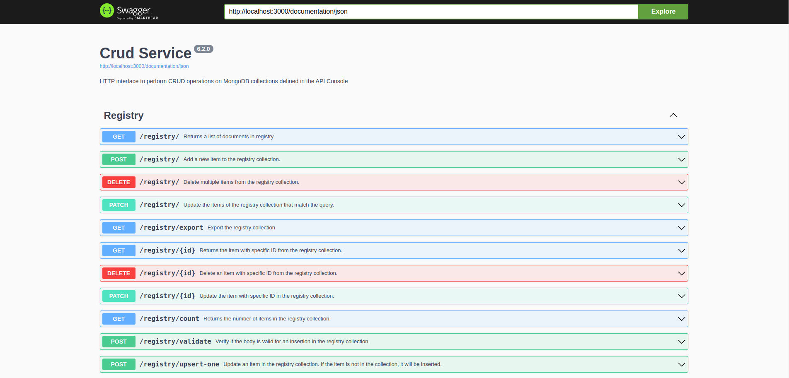
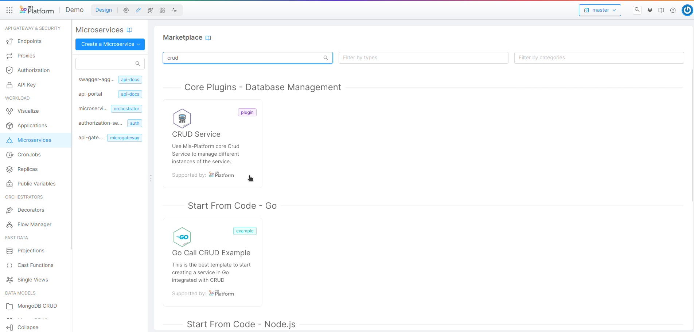

import SourceCodeBlock from "./../../../../src/components/SourceCodeBlock";

The CRUD Service Open Source Software (OSS) is a lightweight application useful to abstract MongoDB data collections allowing developers to expose CRUD APIs over the database in an easy, scalable, and secure way.

Mia-Platform Console takes advantage of the CRUD Service to let you easily configure CRUDs through a dedicated UI, the [MongoDB CRUD](/development_suite/api-console/api-design/crud_advanced.md) section.

In this guide you will see how to configure and interact with the CRUD Service and how it is integrated and easy to use in the Mia Platform Console.

## How to use the CRUD Service OSS

In this section you will learn how to configure and use the CRUD Service in your environment or as a component of your applications. We will use a simple example of CRUD operations over a registry of customers.

### Requirements

- Node.js version 14 or later (you can use _nvm_ to easily manage versions)
- MongoDB instance version 4.0 or later
- (Optional) Docker

### Repository

You can find the official repository of the CRUD Service [here](https://github.com/mia-platform/crud-service).

Clone the repository in your local system with the following command:

```bash
git clone https://github.com/mia-platform/crud-service
```

### MongoDB instance

If you do not have a MongoDB instance ready, you can quickly set up a Docker container with the **mongo** image locally with the following commands:

```bash
docker pull mongo:6.0.2
docker volume create mongo
docker run --detach --name mongo -p 27017:27017 --mount source=mongo,target=/data/db mongo:6.0.2
```

### Configuration

You can configure the CRUD Service through **environment variables**. In the `default.env` file on the root of the repository folder you can see some default settings. The environment variables in this file are the minimum required to run the service.

For the complete list of available environment variables you can see the `properties` in the `envSchema.js` file on the root of the repository folder.

You can create your own `.env` file with the configurations you need for your use case. Let's make a copy of the file.

```bash
cp ./default.env ./.env
```

Now we can review and update the environment variables values in the new file. For example, the **MONGODB_DATABASE_NAME** by default specifies to use a database named `crud`. You need to create the folders specified in the **COLLECTION_DEFINITION_FOLDER** and **VIEWS_DEFINITION_FOLDER** environment variables (or change them to a new path) and provide collection and view schemas of the MongDB instance you are using.

For a simple example we can use a collection schema for customer registries to be copied in the **COLLECTION_DEFINITION_FOLDER** folder. You can download the json schema <a download target="_blank" href="/docs_files_to_download/crud-service/registry.json">here</a>.

<details>
  <summary>click here to see the full json file</summary>
  <p>
    <SourceCodeBlock filePath="/docs_files_to_download/crud-service/registry.json" />
  </p>
</details>

### Run the CRUD Service

To run the CRUD Service enter these commands in a terminal:

```bash
nvm use # <-- only if you use nvm
npm i
npm run start:local
```

The last command will use the `.env` file with your custom configuration.

The CRUD Service will start and listen on http://localhost:3000 by default.

### Interact with CRUD Service

The CRUD Service exposes a **Swagger User Interface** available by default at http://localhost:3000/documentation.



You can view a list of APIs useful to perform CRUD operations on the collections discovered by the CRUD Service.

For the full list and description of the available operations please see [here](/runtime_suite/crud-service/10_overview_and_usage.md#crud-endpoints).

#### Create

You can create a new document by using the `POST /registry/` request or by using the following command:

```bash
curl -X 'POST' \
  'http://localhost:3000/registry/' \
  -H 'accept: application/json' \
  -H 'Content-Type: application/json' \
  -d '{
  "registry_id": "reg-1",
  "name": "customer 1",
  "email": "customer 1 email",
  "phone": "customer 1 phone",
  "address": "customer 1 address",
  "city": "customer 1 city",
  "state": "customer 1 state",
  "__STATE__": "PUBLIC"
}'
```

You will receive as response an object with the `_id` of the new document.

```json
{
  "_id": "63d15612676a93073b3a92e8"
}
```

#### Read

You can retrieve a list of all documents by using the `GET /registry/` request or by using the following command:

```bash
curl -X 'GET' \
  'http://localhost:3000/registry/' \
  -H 'accept: application/json'
```

You will receive as response an object with the `_id` of the new document.

```json
[
  {
    "_id": "63d15612676a93073b3a92e8",
    "registry_id": "reg-1",
    "name": "customer 1",
    "email": "customer 1 email",
    "phone": "customer 1 phone",
    "address": "customer 1 address",
    "city": "customer 1 city",
    "state": "customer 1 state",
    "__STATE__": "PUBLIC",
    "creatorId": "public",
    "updaterId": "public",
    "updatedAt": "2023-01-25T16:22:54.068Z",
    "createdAt": "2023-01-25T16:17:22.981Z"
  }
]
```

#### Update

You can update a document by using the `PATCH /registry/` request or by using the following command:

```bash
curl -X 'PATCH' \
  'http://localhost:3000/registry/?_id=63d15612676a93073b3a92e8' \
  -H 'accept: application/json' \
  -H 'Content-Type: application/json' \
  -d '{
  "$set": {
    "email": "customer1@mail.com"
  }
}'
```

You will see the count of updated documents.

```json
1
```

By using the read operation again we can see that the document has been updated.

```json {6}
[
  {
    "_id": "63d15612676a93073b3a92e8",
    "registry_id": "reg-1",
    "name": "customer 1",
    "email": "customer1@mail.com",
    "phone": "customer 1 phone",
    "address": "customer 1 address",
    "city": "customer 1 city",
    "state": "customer 1 state",
    "__STATE__": "PUBLIC",
    "creatorId": "public",
    "updaterId": "public",
    "updatedAt": "2023-01-25T16:22:54.068Z",
    "createdAt": "2023-01-25T16:17:22.981Z"
  }
]
```

#### Delete

You can delete a document by using the `DELETE /registry/` request or by using the following command:

```bash
curl -X 'DELETE' \
  'http://localhost:3000/registry/?registry_id=reg-1' \
  -H 'accept: application/json'
```

You will see the count of deleted documents.

```json
1
```

By using the read operation again we can see that the example document is not present anymore.

```json
[]
```

## How to use the CRUD Service OSS plugin

The Mia Platform Console lets you use the CRUD Service OSS as a [plugin](/runtime_suite/crud-service/10_overview_and_usage.md) from the [Marketplace](/marketplace/overview_marketplace.md).



The plugin is fully integrated and ready out of the box. You simply need to create your [MongoDB CRUD](/development_suite/api-console/api-design/crud_advanced.md) and deploy without any further configurations. The plugin is also integrated with the [Documentation Portal](/console/project-configuration/documentation-portal.md), with the advantage that you have in one place the APIs of all your services and CRUDs.

You can see a usage example of the plugin in this [tutorial](/getting-started/tutorials/rest-api-for-crud-on-data.mdx).
