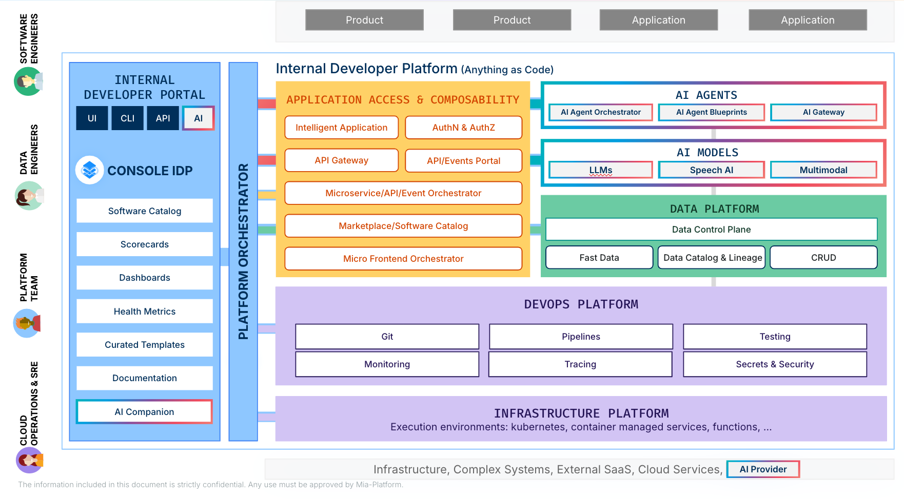
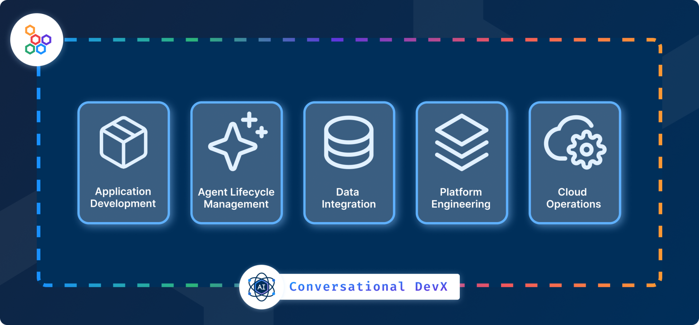

## What is Mia-Platform?

Mia-Platform is a cloud-native Platform Builder that helps you to build and manage your digital platform. By streamlining the **Developer Experience**, Mia-Platform allows organizations to **reduce cognitive load** on cloud-native complexity, increase software engineering productivity, and reach DevOps at scale, providing **golden paths** for a wide range of CNCF-landscape technologies.

With Mia-Platform, you can **standardize and reuse your code**, enabling you to adopt [composability](#enabling-a-composable-approach) in your organization. Accelerate your products' development and deployment by composing existing modules, relying on a flexible and consistent architecture.

To further foster composability, Mia-Platform features a **software catalog** full of ready-to-use components that you can plug into your software. Among these components, one of the most important is Mia-Platform Fast Data, a data management layer that can be used to build a **Digital Integration Hub**. Thanks to this solution, you can connect your cloud-native platform with existing systems, decouple and offload legacy systems, and serve real-time data 24/7. Thus, you can fully benefit from the [true power of your data](#unleash-the-true-power-of-your-data).

Mia-Platform products are built **by developers for developers**, and you can [actively contribute](#more-resources). Our main purpose is to streamline the software development lifecycle, and we do so by collecting all the tools you need in a single place.

*The image does not provide an exhaustive list of the technologies used in Mia-Platform. New technologies are constantly added.*

**In a single place Mia-Platform** enables you to:

- Create **modular and reusable microservices** with a couple of clicks starting from templates or importing them from a artifact registry;
- Take advantage of an **ever-expanding software catalog** full of plugins, templates, applications, and much more to speed up the development of your products;
- Define and manage **environmental variables** at different levels, with full control over user permissions and visibility;
- Manage **all configurations** abstracting the complexity of your microservices by taking advantage of **low-code and no-code features**;
- Deploy your microservices in a few clicks on **multiple cloud providers** (multi cloud) and on-premise environments and monitor them;
- Monitor runtime resources usage and optimize them;
- Expose all the APIs through an API Gateway of your choice, in an easy and secure way;
- Leverage a Data Fabric solution to govern the entire **data lifecycle**. Project data from your legacy systems and create single views - i.e. unified views of a subset of data with a specific purpose - to reduce access latency, and increase data availability;
- Create and evolve an entire **Microfrontend Composer application** like a backoffice application (and much more)* in a few clicks using the low-code features to read and write your data.

## Why Mia-Platform?

Mia-Platform supports you in creating, maintaining, and evolving your own digital platform tailored to your business.

### Platform Engineering is reshaping the IT landscape

By helping you build your Internal Developer Platform, Mia-Platform opens the doors of **Platform Engineering** to your organization. According to Gartner, “Platform Engineering is the discipline of building and operating self-service internal developer platforms (IDPs) for software delivery and life cycle management”. As software becomes more important for businesses to expand their services, **Platform Engineering enables the industrialization of software development and deployment**.

### Enabling a composable approach

By abstracting away most of the complexity related to microservices architecture, Mia-Platform enables the adoption of a **composable approach**. The deployment of new features and products can be further accelerated thanks to a software catalog of ready-to-use microservices and applications. The catalog also fosters **developer self-service, reusing existing assets, and helps standardization through different products**.

Thanks to the composable architecture, you can also easily create and connect existing Packaged Business Capabilities (PBCs) - i.e. projects running at runtime to perform a specific business task. This helps you to **reduce the time-to-market of your new products and features**, to avoid redundant and duplicated efforts, and ensures clear governance throughout the entire organization.

By using Mia-Platform, you can **define standards** such as templates, plugins, etc., and make them available to all development teams within your organization.

### Unleash the true power of your data

With Mia-Platform, you will be able to build your **Digital Integration Hub** relying on a solution that has repeatedly been [mentioned](https://mia-platform.eu/company/certifications-and-memberships/#:~:text=Analysts%20Mentions%20and%20Recognitions) by Gartner® as a sample implementation. This solution is a great example of **cohabitation between the paradigms of Data Mesh and Data Fabric**, featuring the best attributes of each approach.

This layer ingests data from different sources, aggregates it in single views according to business needs, and makes it available in near real-time. In this way, organizations can improve data availability, while also offloading legacy systems and decoupling them from external consumers.

## Mia-Platform products

Mia-Platform provides you with a suite of several products that supports you in governing your platform, tackling composable business, and making legacy systems coexist.

The products can be divided into two main categories: **core products** and **additional components**.

### Core products

These products are the backbone of Mia-Platform, and constitute the main solutions that our customers use on a daily basis. The core products are:

- [Mia-Platform Console](/development_suite/overview-dev-suite.md): industrialize and govern cloud-native development and operations, optimizing DevX and accelerating product teams’ delivery
- [Mia-Platform Marketplace](/marketplace/overview_marketplace.md): speed up the creation of new applications with reuse and composition.
- [Mia-Platform Fast Data](/fast_data/what_is_fast_data.md): adopt a Digital Integration Hub architecture and create your DIH-enabled API code Platform.

### Additional components

These components contribute to the realization of some specific tasks within your products. They are available through Mia-Platform Marketplace, and they are:

- [Mia-Platform Microfrontend Composer](/microfrontend-composer/what-is.md): create custom CMSs, or generic User Interfaces, with the ability to compose custom pages, putting whatever web component coming from the back-kit library or from a custom component library.
- [Mia-Platform External Developer Portal](/runtime_suite/api-portal/10_overview.md): a complete access point to your companies’ APIs for your partners and providers, containing live and testable API documentation and allowing standardization in the methods of use.
- [Mia-Platform Flow Manager](/runtime_suite/flow-manager-service/10_overview.md): a saga orchestrator, capable to manage flows structured by using the architectural pattern named Saga Pattern and, in particular, the Command/Orchestration approach.

Along with the components above, you can also find Mia-Platform’s **open-source projects**:

- [Rönd](https://github.com/rond-authz/rond): a lightweight container that distributes security policy enforcement throughout your application.
- [kube-green](https://github.com/kube-green/kube-green): the Kubernetes operator to reduce the CO2 footprint of your clusters - built by Davide Bianchi, Senior Technical Leader at Mia-Platform.
- [micro-lc](https://github.com/micro-lc): the micro-frontend orchestrator for building flexible, multi-tenant frontend applications.
- [MongoDB CRUD Service](https://github.com/mia-platform/crud-service): a CRUD Service specifically designed for interacting with MongoDB collections.

## How can I get Mia-Platform?

Mia-Platform is available for purchase in three different ways: SaaS, PaaS, and On-Premises.

For further details on the distribution model, please refer to [this page](/infrastructure/overview.md).
