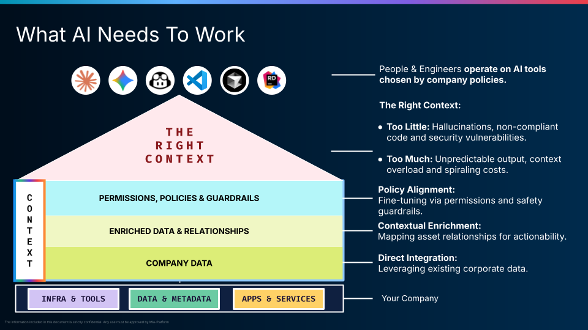
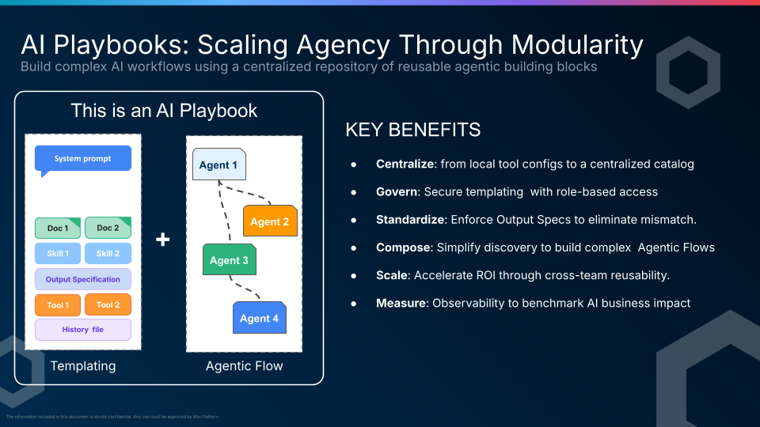
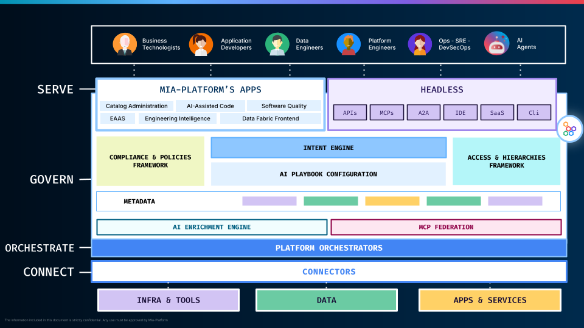

# Mia-Platform Overview

## Ship Production-Ready Software Grounded In Your Enterprise Context

Large enterprises are integrating AI as a structural component of their architecture to automate operations, accelerate delivery cycles, and achieve sustainable scalability. Yet, **Enterprise AI** does not fail due to a lack of intelligence or creativity, but due to the absence of context and robust governance.

While modern AI models are highly capable, deploying them within an enterprise architecture introduces severe operational friction. Without **comprehensive governance** and a **clear mapping of the organization’s assets**, AI deployments inevitably produce unreliable, disconnected outputs. This fragments operational control, reiterates technical debt, blocks validation pipelines, and compromises compliance, ultimately hampering scaling and standardization.

**Mia-Platform** is the **AI-Native Developer Platform** engineered to eliminate this friction and enable **fully governed AI adoption**. By seamlessly orchestrating data, infrastructure, operations and services, Mia-Platform transitions AI from an isolated utility into an active engine of co-creation. This entire system is anchored in a comprehensive digital twin of your enterprise, the **Context Catalog**, which provides the foundational knowledge for governed AI execution.

### The Core Pillars: Context Catalog and AI Foundry

The entire Mia-Platform ecosystem is built upon two foundational pillars that work symbiotically to turn fragmented, shadow AI into a secure, value-generating asset: the [**Context Catalog**](/products/context-catalog/overview.md) and the [**AI Foundry**](/products/ai-foundry/overview.md).

Together, they address both context overload and governance limitations. This allows you to accelerate your development lifecycle while maintaining predefined enterprise guardrails and strict boundaries of risk.

#### The Context Catalog: Your Actionable Digital Twin

The [**Context Catalog**](/products/context-catalog/overview.md) is a living, enriched metadata map of your entire IT ecosystem. Rather than acting as a static registry, the Catalog dynamically links software components, data products, infrastructure resources, APIs, policies, and AI agents, mapping their interrelations to enable semantic navigation.

Key features include:

* **Filtered Intelligence:** The Catalog feeds AI models with precise, governed context based on [item types](/products/context-catalog/basic-concepts/20_item-types.md) and [relationship maps](/products/context-catalog/basic-concepts/60_relationships.md). This drastically reduces token consumption, latency, and hallucination risks.  
* **Governance by Design:** The Catalog integrates access controls and deterministic rules directly into the foundational data model, eliminating the need for post-deployment patches. Then, you can manually add non-deterministic compliance directives and policies, ensuring that all generated code adheres to your desired standards.   
* **Orchestration-Ready Blueprint:** The Catalog enforces structural guardrails, golden paths, and organizational standards to guarantee that every deployed asset is optimized for Day 2 operations.

#### The AI Foundry & AI Playbooks: Intent-Driven Governance

To bridge the AI trust gap, enterprises must move beyond non-deterministic, black-box executions. The [**AI Foundry**](/products/ai-foundry/overview.md) is the necessary governance layer acting as a strict intermediary between user requests and AI actions. It ensures AI agents deliver predictable, **reproducible outcomes** that align perfectly with comprehensive enterprise standards and compliance.

This framework operates through [**AI Playbooks**](/products/ai-foundry/basic-concepts/60_playbook.md): pre-configured, reproducible templates that package specific [agent](/products/ai-foundry/basic-concepts/10_agent.md) instructions, specialized [skills](/products/ai-foundry/basic-concepts/50_skill.md), memory configurations, compliance policies, and curated AI [tools](/products/ai-foundry/basic-concepts/40_tool.md) tailored to the technology stack and to a given objective.

* When a user submits a natural language request, the **AI Foundry interprets the intent and routes it to a specific Playbook**, which triggers a multi-step execution converting unpredictable agentic flows into auditable processes.  
* Every generated task is cross-checked against enterprise constraints and the Context Catalog before execution, ensuring **compliance and adherence to the architectural reality of the organization**.  
* Identical goals always trigger **standardized automation workflows**, eliminating redundancy and architectural drift, ensuring predictable outcomes even for complex operational goals.

### Basic Components: The Standard Foundation

Every Mia-Platform configuration includes a **suite of basic components** designed to ensure a consistent developer experience and a unified interface for AI, maintaining **standardization** across the whole ecosystem.

* [**Catalog Administration**](/products/context-catalog/catalog-administration.md)**:** The central nervous system for governing your software, data, and logic in one unified dashboard.  
* [**AI Foundry**](/products/ai-foundry/overview.md)**:** The mechanism that automatically enforces policies, access hierarchies and approved templates for governed AI workflows.  
* [**Catalog MCP Server**](/products/context-catalog/api-interactions.md#mcp-server)**:** The native interface that uses the Model Context Protocol (MCP) to allow any AI agent or assistant to discover and interact with assets. It also connects the catalog to broader external tools and data lakes.  
* [**Flow**](/products/flow/overview.md)**:** An [AI-powered IDE](/products/flow/basic-concepts/40_agentic-ai.md) that uses platform context to help teams build and deploy faster without leaving the enterprise boundaries.

### Modular Configurations for Your Teams

The Context Catalog and AI Foundry provide the foundational framework. On top of them, Mia-Platform offers specialized **modular setups** designed to optimize software delivery for your engineering, infrastructure, and data departments.

#### 1\. Development (Software Engineering Teams)

To counter the budget waste of "Shadow AI" and help teams move fluidly from business ideas to production in a single governed workflow, this configuration accelerates delivery with API-integrated assets that are pre-validated and ready for production use.

Main components are:

* [**Predefined Item Types for Services**](/products/context-catalog/basic-concepts/20_item-types.md)**:** Readily available item types that grant developers a standardized, governed foundation for cataloging new software.  
* [**Connectors for Applications**](/products/context-catalog/connectors/10_overview.md)**:** Ready-made integrations that seamlessly pull your existing apps into the catalog, improving their discoverability and governance.  
* [**Marketplace**](/runtime-components/overview_marketplace.md)**:** An internal showcase where engineers can search, find, and reuse any approved building block to speed up the setup.

#### 2\. Infrastructure (Ops & Platform Teams)

Transforming invisible infrastructure into a governed, scalable ecosystem is crucial for modernizing legacy systems and reducing technical debt. This configuration gives teams and AI a reliable view of all infrastructure (cloud, legacy, and on-prem), enforces compliance with automated Scorecards, and uses targeted Campaigns to route remediation workflows.

Main components are:

* [**Item Types Infra/DevOps**](/products/context-catalog/basic-concepts/20_item-types.md)**:** A specialized library bringing complex infrastructure assets under unified catalog governance.  
* **Cloud & DevOps Connectors:** Automated integrations with major providers (e.g. [Azure](/products/context-catalog/connectors/azure.md), [Google Cloud](/products/context-catalog/connectors/google-cloud.md), [GitHub](/products/context-catalog/connectors/github.md), [GitLab](/products/context-catalog/connectors/gitlab.md)) that actively pull resources into the platform, ensuring live tracking alongside application assets.  
* **Engineering Intelligence:** A governance section within the Catalog, related to [Scorecards](/products/context-catalog/basic-concepts/40_scorecards.md) and [Campaigns](/products/context-catalog/basic-concepts/50_campaigns.md). They aggregate data into the catalog to offer leadership clear visibility into platform adoption, delivery metrics, and custom insights. See the Scorecards tutorial to get started.

#### 3\. Data (Data Teams)

Organizations have massive datasets but they are often siloed, ungoverned, and invisible. Essentially, they are not AI-ready. This configuration ensures this huge amount of data becomes contextually governed without disturbing existing systems of record.

Main components are:

* [**Data Catalog**](/products/data_catalog/overview.mdx)**:** A unified registry of tables, pipelines and models enriched with related metadata, ownership and classification to enable data discoverability and foster trust.  
* [**Data Lineage**](/products/data_catalog/frontend/data_lineage.mdx)**:** A visual map of data, from origin to consumption, enabling swift root-cause analysis and dependency tracking.  
* **Data Glossary**: A shared business dictionary directly linked to the [Data Catalog](/products/data_catalog/frontend/overview.mdx) to ensure organizational alignment.  
* **DPO Frontend & [Excel Plugin](/products/data_catalog/excel_add_in/overview.mdx):** Dedicated auditing interfaces for Data Protection Officers, allowing bulk metadata export and management natively.  
* **MCP Extensions for Data**: Model Context Protocol connectors that expose Data Catalog, Lineage and Glossary to AI agents and tools, respecting your governance boundaries and organizational context.

### Operational Add-ons: Platform Orchestrators

To bridge the gap between governance and runtime, Mia-Platform integrates **powerful orchestrators** that make your architecture actionable at scale, and allow for the personalization of specific vertical requirements.

These components power the platform behind the scenes: they act as the **operational layer** that transforms theoretical models into concrete executions, governing app exposure, provisioning, and real-time data flows:

* [**Console**](/products/console/overview-dev-suite.md)**:** It provides Environment as a Service (EaaS) through a self-service layer that abstracts infrastructure complexity, enabling on-demand provisioning across cloud and on-premise setups.  
* [**Fast Data**](/products/fast_data_v2/overview.md)**:** A real-time data pipeline engine for high-velocity data flows, ensuring the low-latency context required by event-driven architectures, live analytics, and modern AI workloads.

#### Specialized Extensions

* [**P4SAMD**](/runtime-components/applications/quality-assistant/10_overview.md#quality-assistant-for-healthcare-industry-p4samd)**:** An AI-powered solution built to govern the entire lifecycle of Software as a Medical Device (SaMD), fully compliant with IEC 62304 and GAMP5 standards.  
* [**Microfrontend Composer**](/products/microfrontend-composer/overview.md)**:** A composition layer to visually build modular backoffice interfaces from independent frontend components.

### Consumption Modes: Headless or Unified Experience

Mia-Platform is designed to fit your existing workflows, offering two complementary ways to interact with the ecosystem based on your technical requirements:

* **Headless & API-First**: The [Context Catalog](/products/context-catalog/api-interactions.md) and AI Foundry expose their capabilities via modern protocols ([**MCP, API, CLI and A2A**) to inject your enterprise context into external tools like IDEs, CI/CD pipelines, and custom AI assistants.  
* **Mia-Platform Apps**: It offers a guided, visual experience through dedicated interfaces (like [Catalog Administration](/products/context-catalog/catalog-administration.md), [Flow](/products/flow/overview.md), and the [EaaS portal](/products/console/overview-dev-suite.md#environment-as-a-service)) that optimize workflows for all organizational roles. These apps are modular and tailored to specific use cases, so the components included depend on the selected package or operational model.

### Why Mia-Platform?

Most enterprises must cope with a complex, widespread issue: trying to channel the power of AI tools within enterprise tracks to enhance reliability, ensure compliance, and minimize redundancy. 

Mia-Platform resolves this issue with an **actionable context layer** that guarantees governance by design, and promotes standardization. The [Context Catalog](/products/context-catalog/overview.md) is the single source of truth that maps all organization’s assets and guarantees AI outputs are grounded in reality. The [AI Foundry](/products/ai-foundry/overview.md) anchors AI workflows to predefined intents for specific goals, circumscribing their scope and fostering reusability.

This symbiosis ensures a **sustainable use of AI systems**, which produce reproducible results because they are secure and validated against enterprise standards.

Moreover, Mia-Platform is also fully usable through **user-friendly, ad-hoc interfaces** depending on your technical expertise. This facilitates the democratization of development for every platform role, ensuring a seamless flow and integration between the design phase and the engineering one.

Ultimately, Mia-Platform delivers tangible benefits: faster time-to-market, higher productivity, full compliance, better transparency, and lower technical risk.

### How to get Mia-Platform?

To meet diverse security, compliance, and operational requirements, Mia-Platform offers [three flexible distribution models](/requirements/overview.md):

* **Platform as a Service (PaaS)**: A fully managed, turn-key environment. Mia-Platform handles the infrastructure, updates, and maintenance, allowing your teams to focus exclusively on software delivery. See [PaaS requirements](/requirements/paas/overview.md).
* **Bring Your Own Infrastructure (SaaS)**: A hybrid approach where Mia-Platform is provided as a managed service, but the runtime infrastructure remains under your organization’s direct control and management. See [BYOI requirements](/requirements/byoi/overview.md).
* **Self-Hosted (On-Premise)**: The platform is installed and managed entirely within your own infrastructure. See [Self-Hosted requirements](/requirements/self-hosted/self-hosted-requirements.md).
