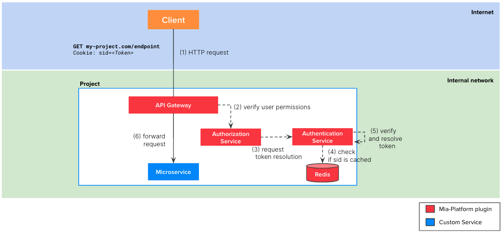
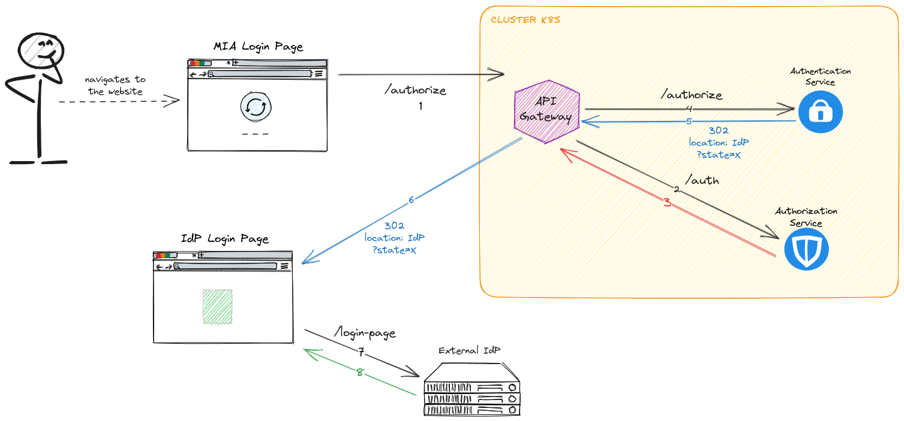
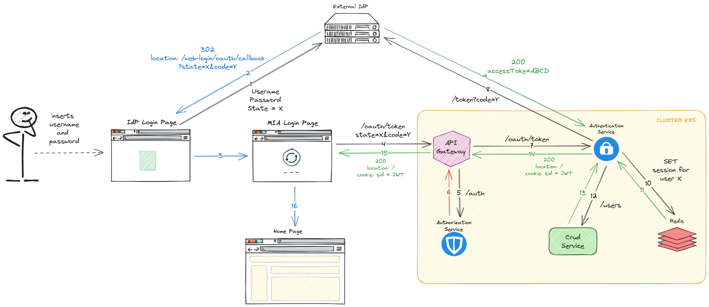
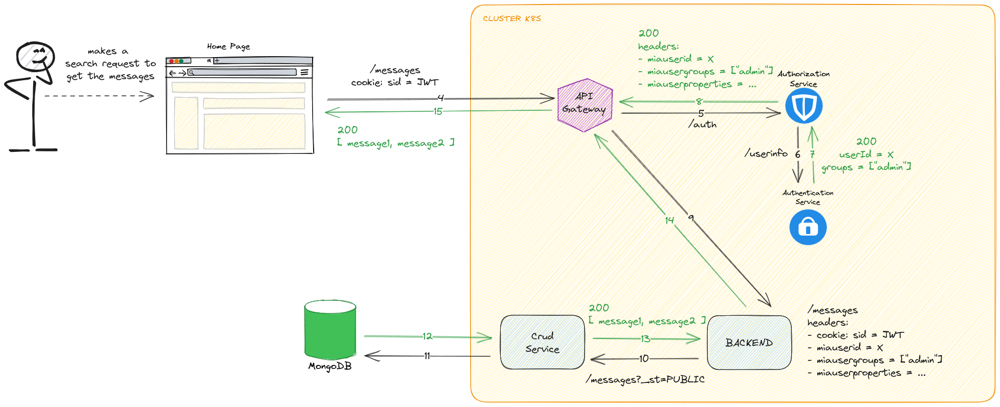

This scenario is a slight modification of [Scenario 2](/getting-started/tutorials/architecture/auth/external-idp.md). You still have an external Identity Provider (IdP) but the token used by the client is produced within your project so that you can manage the user groups within your project using a dedicated CRUD collection. Therefore, in this scenario, you will use the external IdP only to validate the users credentials.

:::info
This version is more complex than the one defined in the [Scenario 2](/getting-started/tutorials/architecture/auth/external-idp.md), and it is only useful if you really need to handle within your project both the token generation and users data. 
:::

## Definition

This architecture uses the [`Authentication Service`](/runtime_suite/authentication-service/10_overview.md) plugin. Note that, this time, it is a Mia-Platform plugin rather than a custom microservice as in [Scenario 2](/getting-started/tutorials/architecture/auth/external-idp.md). This imposes a limitations on the presented architecture: your external Identity Provider must be supported by the Authentication Service plugin (see [the list of supported IdPs](/runtime_suite/authentication-service/10_overview.md)) otherwise this scenario is not applicable.



The involved microservices of the flow are:
1. `API Gateway`: Mia-Platform plugin available in [Nginx](/runtime_suite/api-gateway/10_overview.md) or [Envoy](/runtime_suite/envoy-api-gateway/overview.md)
2. `Login Site`: Mia-Platform plugin
3. [`Authorization Service`](/runtime_suite/authorization-service/10_overview.md): Mia-Platform plugin
4. [`Authentication Service`](/runtime_suite/authentication-service/10_overview.md): Mia-Platform plugin
5. [`CRUD Service`](/runtime_suite/crud-service/10_overview_and_usage.md): Mia-Platform plugin

While in [Scenario 2](/getting-started/tutorials/architecture/auth/external-idp.md) the client gets the token directly on the IdP, this time the process of obtaining the token goes through the *Authentication Service*. 

The token is generated by the *Authentication Service* after merging the user info obtained from the IdP and the ones saved on a dedicated CRUD collection. In particular, the only user attributes that are inherited from the IdP are `id`, `name` and `email`; all the other attributes (`groups` included) must be added on the dedicated CRUD collection.  

Once, your client has obtained the token following the above flow, the authentication and authorization of the API calls made with that token is similar to [Scenario 2](/getting-started/tutorials/architecture/auth/external-idp.md) but not identical. 

Indeed, as you can notice from the picture above, the token resolution is performed directly from the Authentication Service rather than the Identity Provider.  

## Tutorial steps

To setup this flow you need to:
- configure some Mia-Platform plugins from the Marketplace
- add some endpoints to your project

In the following, we present both a manual way of doing it and a faster procedure using the [`Secure API Gateway`](/runtime_suite_applications/secure-api-gateway/10_overview.md) application.

### Manual configuration

:::note
We suppose that you have already created an API Gateway in your project and you already have some endpoints you want to secure.
:::

1. Create the [`CRUD Service`](/runtime_suite/crud-service/10_overview_and_usage.md) plugin from the Marketplace:
    - Click on `Microservices`
    - Click on `Create a Microservice` and select `From Markeplace`
    - Select `CRUD Service`
    - Click on `Create`
    - Create a `CRUD collection` in the dedicated section of the Mia-Platform Console following [this guide](/runtime_suite/authentication-service/20_configuration.mdx#users-collection)

2. Create the [`Authentication Service`](/runtime_suite/authentication-service/10_overview.md) plugin from Marketplace
    - Click on `Microservices`
    - Click on `Create a Microservice` and select `From Markeplace`
    - Select `Authentication Service`
    - Click on `Create`
    - Set the environment variables following the [documentation of the plugin](/runtime_suite/authentication-service/20_configuration.mdx#environment-variables)
      - remember to set all the required variables
      - the `USERS_CRUD_BASE_URL` must be the API of the crud-service created in the previous step, like `http://crud-service/users`
    - Set the configmap with the IdP specifications following the [documentation of the plugin](/runtime_suite/authentication-service/20_configuration.mdx#configurations-file) to set the correct values.  
    For a correct configuration, it is important to notice the following:
      - `redirectUrl` must be `https://<MY-HOST>/web-login/oauth/callback`. This relative path will be used to handle the callback from the IdP during the Oauth2 login flow, and there we will expose the logic to complete the authentication flow.
        - If you are using Auth0 as IdP and so `auth0-client` as your service, the path you need to set is `https://<MY-HOST>/web-login/callback`. The difference lies in the way the web page requests the token: with `/oauth` in the path will pass the info via the body of the request, without it will pass the info via the query parameters.
      - `isWebsiteApp` must be `true` if using the authentication for a web application, since it will make the Authentication Service return the session as a cookie.  


  This is an example of a configuration (using keycloak as an example of IdP):
  ```json
    {
      "apps": {
        "<app>": {
          "providers": {
            "<provider>": {
              "type": "keycloak",
              "clientId": "<client-id>",
              "clientSecret": "",
              "authUrl": "https://{{KEYCLOAK_URL}}/auth/realms/<realm>/protocol/openid-connect/auth",
              "tokenUrl": "https://{{KEYCLOAK_URL}}/auth/realms/<realm>/protocol/openid-connect/token",
              "userInfoUrl": "https://{{KEYCLOAK_URL}}/auth/realms/<realm>/protocol/openid-connect/userinfo",
              "logoutUrl": "https://{{KEYCLOAK_URL}}/auth/realms/<realm>/protocol/openid-connect/logout",
              "baseUrl": "https://{{KEYCLOAK_URL}}/auth/realms/<realm>/",
              "scope": [
                "openid"
              ],
              "order": 10,
              "userSettingsURL": "https://{{KEYCLOAK_URL}}/auth/realms/<realm>/account/"
            }
          },
          "redirectUrl": "https://<MY-HOST>/web-login/oauth/callback",
          "isWebsiteApp": true,
          "realm": "<realm>",
          "issuer": "<the signer of the jwt>",
          "defaultGroups": []
        }
      }
    }
  ``` 
3. Create the [`Authorization Service`](/runtime_suite/authorization-service/10_overview.md) plugin from Marketplace
    - Click on `Microservices`
    - Click on `Create a Microservice` and select `From Markeplace`
    - Search `authorization` in the search bar
    - Select `Authorization Service`
    - Click on `Create`
    - Update the values of the following environment variables:

      | Variable                       | Value                                                                        |
      | -------------------------------| ---------------------------------------------------------------------------  |
      | USERINFO_URL                   | http://authentication-service/userinfo                                       |
      | CUSTOM_USER_ID_KEY             | userID                                                                       |
      | HEADERS_TO_PROXY               | <header of the client's request containing the token> (e.g. `Authorization`) |
      | AUTHORIZATION_HEADERS_TO_PROXY | <header of the client's request containing the token> (e.g. `Authorization`) |
      | USER_PROPERTIES_TO_PROXY       | userID,groups

4. Create the [`Login Site`](/runtime_suite/authorization-service/10_overview.md) plugin from Marketplace
5. Create the following endpoints in your project:

   | Endpoint      | Authenticaton Required | Target Microservice      |
   | ---------     | ---------------------- | -------------------------|
   | `/web-login`  | false                  |  `login site`            |
   | `/authorize`  | false                  | `authentication-service` |
   | `/oauth/token`| false                  | `authentication-service` |
   | `/logout`     | true                   | `authentication-service` |


### Configuration with the Secure API Gateway application
To speed up the process, you can use the [Secure API Gateway application](/runtime_suite_applications/secure-api-gateway/10_overview.md), modifying it a little after the creation.

This is because the application uses Auth0 as a default IdP, so:
- if you want to use Auth0, then the application is ready to use, you don't need to do anything else.
- if you want to use another Oauth2 compliant IdP:
  - start by creating the `crud-service` and the `authentication-service` as in the manual configuration
  - install the application, modifying the `auth0-client` with the `authentication-service` in the wizard
  - change the environment variables of the `authorization-service` as described in [Scenario 2](/getting-started/tutorials/architecture/auth/external-idp.md#tutorial-steps)
  - remove the unnecessary environment variables specific of Auth0
  - the application will take care of creating:
    - api-gateway
    - authorization-service
    - login-site
    - all the endpoints

## How does it work?

You can divide the authentication flow in 3 step from the user point of view:
- the user is redirected to the IdP page
- the user inserts their credentials and the IdP will generate a unique code
  - the server will use the code to verify the user through the IdP, creating a token for the user's session
- the user uses the token to make an authorized call

This flow follows the OAuth2 standard: you can read more about its specifications [here](https://www.oauth.com/), or more specific [here](https://www.oauth.com/oauth2-servers/authorization/).

### Step 1: Redirect to IdP page



The client web application must redirect the user to this URL:   
```text
https://<MY-HOST>/authorize?appId=<app>&providerId=<provider>&redirect=/
``` 
where:
- `appId` is the one defined in the `authentication-service` configmap
- `providerId` is the one defined in the `authentication-service` configmap
- `redirect` is the path to witch you want to be redirected to after the successful flow

:::warning
The client must pass all of the above query parameters to make the flow complete successfully.
:::

You can let your client application do it or you can use a script of the API Gateway that will redirect your user to this location every time it encounters a 401 error.  
To do so, please follow [this guide](/runtime_suite_applications/secure-api-gateway/20_configuration.md#api-gateway).

The result of the `/authorize` request will be an HTTP 302 with the location of your IdP, passing a generated `state` as a query parameter.

### Step 2: Creation of the session



Using the IdP login page, the user will submit their credentials and, after the successful sign in, the IdP will redirect the user's browser to this URL:
```text
https://<MY-HOST>/web-login/oauth/callback?state=X&code=Y
```
where:
- `state` is the value previously passed to the IdP
- `code` is a new value created by the IdP representing the user

This endpoints points to the `Login Site` plugin and returns an HTML page that will perform an HTTP POST request to the following URL passing the `state` and the `code` in the request body.
```text
https://<MY-HOST>/oauth/token
```

The `authentication-service` handles this request by checking the `state` and by using the `code` to verify the user through the IdP. The token session returned by the IdP is saved on Redis and MongoDB.

After this operation, the `authentication-service` will create a session cookie (hence the `isWebsiteApp: true` set before) as a JWT with the following claims:
- `id`, `name` and `email` taken from the IdP  
- all the other attributes (`groups` included) from the CRUD collection. If you need to include custom attributes in the user claim, check this [documentation](/runtime_suite/authentication-service/30_usage.md#custom-claims) to understand how to congigure both the CRUD collection and the `Authorization Service`

The JWT is finally signed and returned to the user via the `/oauth/token` response, that will have:
- status code: 200
- `location` header equals to the one defined in the `/authorize` request
- cookie: `sid=<JWT>`

As a last step, the browser will redirect to the location specified by the client web application during Step 1 in the `redirect` query parameter (e.g. the homepage).

### Step 3: API usage as logged-in user



With the cookie `sid` the user can be authenticated and authorized to access the other APIs you are protecting (have a look [here](/development_suite/api-console/api-design/endpoints.md#manage-the-security-of-your-endpoints) to know how to protect your APIs).

The request is paused by API Gateways, that will request if the user is authenticated to access the resource to the `authorization-service`.

The `authorization-service` will call the `/userinfo` API of the `authentication-service`, who will reply with the claims of the `sid` token (if is valid and not expired).

:::info
As you can see here, no more calls are made to authenticate the user: if the JWT is valid (by looking at its signature) then the user is the one defined by the claims.
:::

After checking the reply of the `/userinfo`, the `authorization-service` will validate the user.

The API Gateway can now forward the request correctly to the backend, with the benefit of having custom headers containing the user information.
