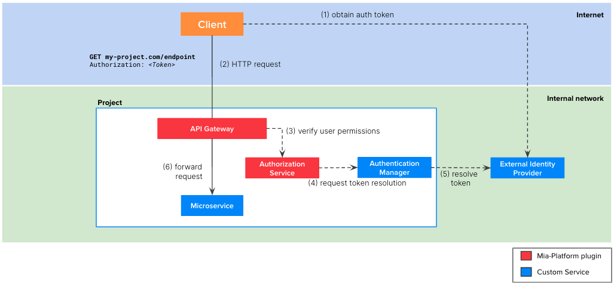

In order to provide a higher security level, you may need to protect your endpoints using an external Identity Provider (IDP) such as Okta, Keycloak, etc.

## Definition



The involved microservice of the flow at runtime are:
1. `API Gateway`: Mia-Platform plugin available in [Nginx](/runtime_suite/api-gateway/10_overview.md) or [Envoy](/runtime_suite/envoy-api-gateway/overview.md)
2. [`Authorization Service`](/runtime_suite/authorization-service/10_overview.md): Mia-Platform plugin
3. `Authentication Manager`: a custom microservice that you need to implement. It must integrate with your external IDP to resolve the user token.
4. The microservice connected to the endpoint 

The picture above illustrates the auth flow at runtime:
1. The client, be it a web application or backend software, need to implement the authentication flow required by the IDP to obtain a valid token. With this token, the client will be able to call the endpoints of your project.
2. The client calls the endpoint of your project, including the valid token in the request. Usually this token is placed in the `Authorization` header but it can be placed in other headers or cookies.
3. The `API Gateway` calls the `Authorization Service` which is in charge to verify if the user who made the request is authorized to access to the requested endpoint.
4. To do so, the `Authorization Service` requests to the `Authentication Manager` to resolve the token
5. The `Authentication Service` resolves the token by contacting the external IDP and returns the user payload to the `Authorization Service` that can now check if the user belongs to the authorized groups 
6. If the verification performed by the `Authentication Service` is successful, then the `API Gateway` forwards the API call the right microservice of the project. Note that the target microservice will receive the following additional headers that could be useful for their business logic:
  
  | Header              | Description                                                                                |
  | --------------------| ------------------------------------------------------------------------------------------ |
  | `Miausergroups`     | comma separated list of the groups the user belongs to                                     |
  | `Miauserid`         | the ID of the user                                                                         |
  | `Miauserproperties` | stringified JSON object containing the user payload returned by the Authentication Service |


## Tutorial steps
:::note
We suppose that you have already created an API Gateway in your project and you already have some endpoints you want to secure.
:::
In order to implement the flow depicted above, you can perform the following steps on Mia-Platform Console:
1. Create the `Authentication Manager` custom microservice
    - Click on `Microservices`
    - Click on `Create a Microservice` and select `From Markeplace`
    - Choose your preferred template to start coding your custom Authentication Service
    - Implement the `/userinfo` endpoint. It must resolve the token on the external IDP and then return as response body a JSON object with at least the `userID` and the `groups`. An example of response is:
      ```json
      {
        "userID": "123",
        "groups": ["admin", "users"]
      }
      ```
2. Create the [`Authorization Service`](/runtime_suite/authorization-service/10_overview.md) plugin from Marketplace
    - Click on `Microservices`
    - Click on `Create a Microservice` and select `From Markeplace`
    - Search `authorization` in the search bar
    - Select `Authorization Service`
    - Click on `Create`
    - Update the values of the following environment variables:

      | Variable                       | Value                                                                        |
      | -------------------------------| ---------------------------------------------------------------------------  |
      | USERINFO_URL                   | http://authentication-service/userinfo                                       |
      | CUSTOM_USER_ID_KEY             | userID                                                                       |
      | HEADERS_TO_PROXY               | <header of the client's request containing the token> (e.g. `Authorization`) |
      | AUTHORIZATION_HEADERS_TO_PROXY | <header of the client's request containing the token> (e.g. `Authorization`) |
      | USER_PROPERTIES_TO_PROXY       | userID,groups                                                                |

3. Secure the endpoint
    - Select the endpoint you want to secure in the `Endpoints` section
    - Use the `User Group Permission` textbox to choose the user groups authorized to call the endpoint. For example, if you want to allow access only to `admin` or `users` you should insert:
      ```
      groups.admin || groups.users
      ```
      :::info
      Scenario 1 and scenario 2 can be combined, and you could have complex group expressions like the following:
        ```
        (clientType === 'A' || clientType === 'B') && (groups.admin || groups.users)
        ```
      :::
