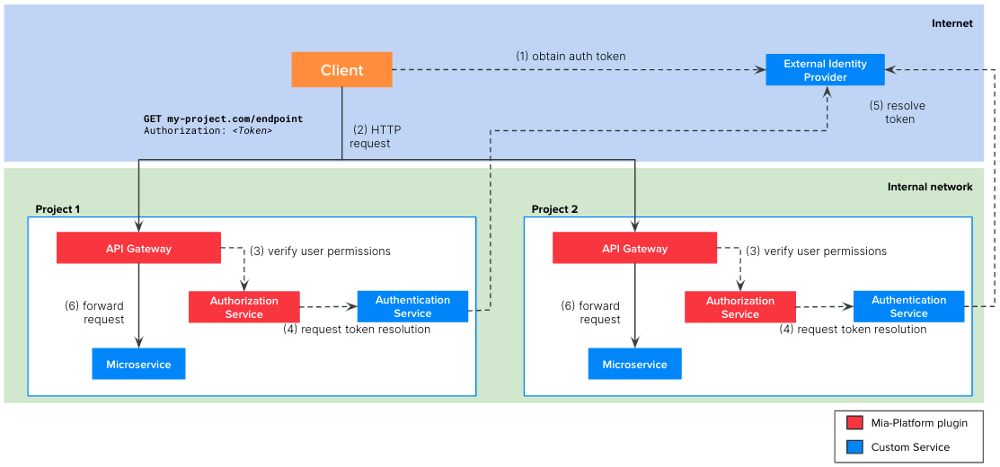

import Tabs from "@theme/Tabs";
import TabItem from "@theme/TabItem";

## Definition
In this scenario, we present the case where your architecture is composed by multiple Mia-Platform projects. Of course, you could think to treat each project as an independent entity and replicate, in each project, one of the scenarios presented so far.

For example, you could replicate Scenario 2 as in the following schema:


However, this replication brings some problems:
- The authentication service is replicated in every project. This is a waste of resources but it can also lead to problems when the service need to be updated for some projects
- In such architecture, it is likely that a service of one project need to call services of other projects. In this case, the token resolution call would be needlessly repeated.  
- You may want to centralize the Ingresses management in a single namespace of your cluster. In this way it is easier to verify which are all the FQDNs connected to your Kubernetes clusters.

Therefore, we recommend to introduce in your architecture an `Edge Gateway` project that will be the entry point of all the incoming requests to your company and where you will centralize the token resolution flow.


The picture above illustrates the architecture of a company composed by two projects and an `Edge Gateway` project.

The `Edge Gateway` contains the following microservices:
1. `API Gateway`: Mia-Platform plugin available in [Nginx](/runtime_suite/api-gateway/10_overview.md) or [Envoy](/runtime_suite/envoy-api-gateway/overview.md)
2. [`Authorization Service`](/runtime_suite/authorization-service/10_overview.md): Mia-Platform plugin
3. `Authentication Service`: a custom microservice that you need to implement. It must integrate with your external IDP to resolve the user token.

Each project contains the following microservices:
1. `API Gateway`: Mia-Platform plugin available in [Nginx](/runtime_suite/api-gateway/10_overview.md) or [Envoy](/runtime_suite/envoy-api-gateway/overview.md)
2. [`Authorization Service`](/runtime_suite/authorization-service/10_overview.md): Mia-Platform plugin
3. The microservice connected to the endpoint

The picture above illustrates the API calls at runtime:  

1. The client, be it a web application or backend software, need to implement the authentication flow required by the IDP to obtain a valid token. With this token, the client will be able to call the endpoints of your project.
2. The client calls the endpoint of your project, including the valid token in the request. Usually this token is placed in the `Authorization` header but it can be placed in other headers or cookies.
3. The API Gateway of the `Edge Gateway` project calls the `Authorization Service`
4. To do so, the `Authorization Service` requests to the `Authentication Manager` to resolve the token
5. The Authentication Service resolves the token contacting the external IDP and returns the user payload to the Authorization Service that can now check if the user belongs to the authorized groups 
6. If the verification performed by the Authentication Service is successful, then the API Gateway forwards the API call the right microservice of the project. Note that the target microservice will receive the following additional headers that could be useful for their business logic:
  
  | Header              | Description                                                                                |
  | --------------------| ------------------------------------------------------------------------------------------ |
  | `Miausergroups`     | comma separated list of the groups the user belongs to                                     |
  | `Miauserid`         | the ID of the user                                                                         |
  | `Miauserproperties` | stringified JSON object containing the user payload returned by the Authentication Service |

## Tutorial steps

### STEP 1: Gateway Project Configuration

The `Gateway Project` has to be aware of each project of the architecture to forward requests accordingly.

Imagine that there is a need to expose a project called `Project1` that needs to be mapped to endpoint `/project1`: so if the project has an endpoint defined as `/crud-collection`, the resource will be available using the endpoint `/project1/crud-collection`. This is possible by using a [Cross Project Proxy definition](/development_suite/api-console/api-design/proxy.md#type-cross-projects).


#### Manage Authorization Flow

The `Gateway Project` will manage in a unique way authentication and authorization for all Projects, by integrating into the `Gateway Project` the [Authorization Flow](/console/project-configuration/authorization-flow.md#authentication-manager) provided by MIA Platform.

Once the client has been authenticated, the `Gateway Project` needs to forward the resulting headers to sub-projects.

<Tabs
  defaultValue="nginx"
  groupId="multi-project-tutorial"
  values={[
      { label: "API Gateway NGINX", value: "nginx", },
      { label: "API Gateway Envoy", value: "envoy", }
  ]}
>
<TabItem value="nginx">

Using the Advanced Section of the API Gateway, [is possible to forward headers to proxied projects](/development_suite/api-console/advanced-section/api-gateway/how-to.md#how-to-manage-authorization-in-a-multi-gateway-architecture). 

</TabItem>
<TabItem value="envoy">

Using the Advanced Section of the API Gateway, [is possible to define a JWT filter](/development_suite/api-console/advanced-section/api-gateway-envoy/jwt-authn.md).

</TabItem>
</Tabs>


### Step 2: Manage Endpoint Security

On the `Edge Gateway`, you can also manage _API Keys_ for the different clients that are allowed to perform requests to secured endpoints.

:::caution
If you need to manage API Keys at Project level, you can skip this configuration and just use the [API Keys section](/development_suite/api-console/api-design/api_key.md) in the other MIA Console Projects.
:::

<Tabs
  defaultValue="nginx"
  groupId="multi-project-tutorial"
  values={[
      { label: "API Gateway NGINX", value: "nginx", },
      { label: "API Gateway Envoy", value: "envoy", }
  ]}
>
<TabItem value="nginx">

After defining the API Keys you need in the related section, you have to add an Advanced Map Configuration to the `custom-maps-extension.conf` configuration.

```
map $secret_resolution $proxied_client_key {
  default "";
  "secreted" "secreted";
}
```

The API Gateway microservice defines a called `secret_resolution` with the result of the API Key resolution: this variable is then mapped to a variable called `proxied_client_key`, which will be forwarded to the sub-project as an header called `client_key`.

</TabItem>
<TabItem value="envoy">

The microservice does not a variable containing the result of the secret resolution. 

So you have to define an Advanced Request Script in the `on-requests-script.yaml` where the API keys are manually translated into the `client-key` header.

```lua
- listener_name: frontend
  body: |+
    key_type_map = {
      ["<YOUR API KEY 1>"]={"all", "secreted"},
      ["<YOUR API KEY 2>"]={"all", "secreted"}
    }

    key = request_handle:streamInfo():dynamicMetadata():get("mia.metadata")["client_key"]

    if (key_type_map[key] ~= nil) then
      request_handle:streamInfo():dynamicMetadata():set("mia.metadata", "client_type", key_type_map[key][1])
      request_handle:streamInfo():dynamicMetadata():set("mia.metadata", "secret_resolution", key_type_map[key][2])
      request_handle:headers():replace("client-type", key_type_map[key][1])
      request_handle:headers():replace("client-key", key_type_map[key][2])
      request_handle:headers():replace("secret", key_type_map[key][2])
    else
      request_handle:streamInfo():dynamicMetadata():set("mia.metadata", "client_type", "")
      request_handle:streamInfo():dynamicMetadata():set("mia.metadata", "secret_resolution", "unsecreted")
      request_handle:headers():remove("client-key")
      request_handle:headers():remove("secret")
    end
```

By defining a custom map inside the script, you can assign the value `secreted`/`unsecreted`/`wrong`. 

</TabItem>
</Tabs>

Then, once the needed API Keys have been set on the `Edge Gateway`, the other projects can just have an API Key called `secreted`: using this approach, the secret resolution obtained in the `Edge Gateway` will be used as custom `client-key` in the other projects. 

### Step 3: Projects Configuration

Each project will assign user group permissions to endpoints that will be exposed by the `Edge Gateway`.

Since the user has already been authenticated in the previous steps, each project just have to check the authorization permissions of the logged user: this is possible by letting the Authorization Service extract the groups from [the trusted Mia Platform Headers](/runtime_suite/authorization-service/30_usage.md#trust-mia-platform-user-headers) injected by the `Edge Gateway`.