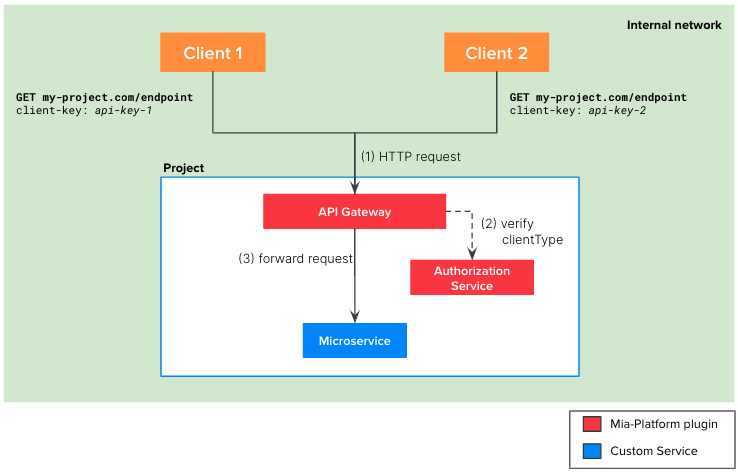

The simplest authentication method you can implement with Mia-Platform is using the [API Keys](/development_suite/api-console/api-design/api_key.md) offered by our API Gateway (both [Nginx](/runtime_suite/api-gateway/10_overview.md) or [Envoy](/runtime_suite/envoy-api-gateway/overview.md)).

:::danger
The authentication method suggested in this scenario is straightforward but comes with a **lower level of security**. Therefore, we recommend using it only in use cases where APIs are not exposed on the public internet or in situations where security is not a critical aspect of the project (e.g., MVPs, internal projects, etc.).
:::

## Definition
 
Basically, you can define a static client key for each client that needs to consume the APIs of your project. You can then decide which client has access to which APIs by configuring the correct group expression in the [Endpoints](/development_suite/api-console/api-design/endpoints.md#manage-the-security-of-your-endpoints) section.



The involved microservice of the flow at runtime are:
1. `API Gateway`: Mia-Platform plugin available in [Nginx](/runtime_suite/api-gateway/10_overview.md) or [Envoy](/runtime_suite/envoy-api-gateway/overview.md)
2. [`Authorization Service`](/runtime_suite/authorization-service/10_overview.md): Mia-Platform plugin
3. The microservice connected to the endpoint 

The picture above illustrates the auth flow at runtime:
1. The client calls the endpoint of your project, placing their own API key in the `client-key` header (or in the `mia_client_key` cookie).
2. The API gateway resolves the client type from the `client-key` header. Then, it calls the Authorization Service which is in charge to verify if the resolved client type has access to the requested endpoint.
3. If the client type verification performed by the authentication service is successful, the API Gateway forwards the API call the right microservice of the project.

## Tutorial steps
:::note
We suppose that you have already created an API Gateway in your project and you already have some endpoints you want to secure.
:::
In order to implement the flow depicted above, you can perform the following steps on Mia-Platform Console:
1. For each of the client that need to consume your APIs, create an API key:
    - Click on `API Key`
    - Click on `Add new`
    - Either manually create a key or generate a random one
    - Choose a meaningful name for your client and insert it in the `ClientType` textbox
    - Check the `Active` checkbox
    - Click on `Create`
2. Secure the endpoints
    - Select the endpoint you want to secure in the `Endpoints` section
    - Check the box `API Key required` in the Security tab

Once you deploy the above configuration, your clients will be able to call the protected endpoint only by providing one of the configured API keys either in the `client-key` HTTP header or in the `mia_client_key` HTTP cookie.  

Furthermore, you could need to have a more fine-grained authorization to your endpoint. For example, suppose to have three different clients of your project: `A`, `B` and `C` but you want only `A` and `B` to access your endpoint.
In this case, you need to:

3. Create the `Authorization Service` plugin from Marketplace
    - Click on `Microservices`
    - Click on `Create a Microservice` and select `From Markeplace`
    - Search `authorization` in the search bar
    - Select `Authorization Service`
    - Click on `Create`
4. Secure the endpoint
    - Select the endpoint you want to secure in the `Endpoints` section
    - Use the `User Group Permission` textbox to choose which client type is authorized. For the example above you should insert:
      ```
      clientType === 'A' || clientType === 'B'
      ```
