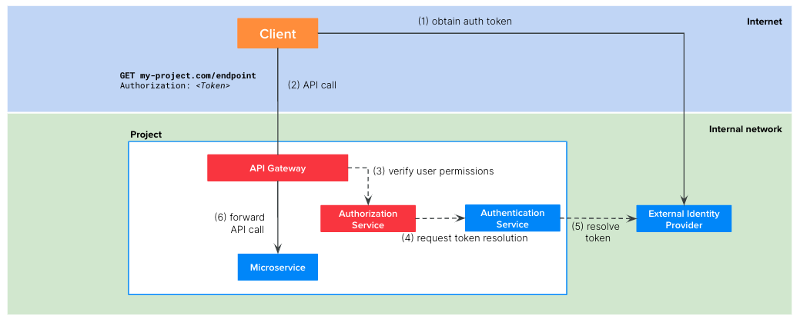

Welcome to the Mia-Platform AuthN/AuthZ Architecture tutorial! This is an holistic guide on the crucial realm of authentication, exploring all the possible AuthN/AuthZ architectures you could implement to secure your Digital Platform built with Mia-Platform.

We'll start with the basics, addressing the simplest scenarios first, and gradually advance, tackling multi-project architectures and integrating multiple external Identity Providers. 

For each of the following scenarios, we will provide an overview of the architecture and a complete step-by-step tutorial to implement it.
## Scenario 1: Use a static API Key to secure your endpoints
The simplest authentication method you can implement with Mia-Platform is using the [API Keys](/development_suite/api-console/api-design/api_key.md) offered by our API Gateway (both [Nginix](/runtime_suite/api-gateway/10_overview.md) or [Envoy](/runtime_suite/envoy-api-gateway/overview.md)) to secure your APIs.  

Basically, you can define a static client key for each client that needs to consume the APIs of your project. You can then decide which client has access to which APIs by configuring the correct group expression in the [Endpoints](/development_suite/api-console/api-design/endpoints.md#manage-the-security-of-your-endpoints) section.


The involved microservice of the flow at runtime are:
1. `API Gateway`: Mia-Platform plugin available in [Nginix](/runtime_suite/api-gateway/10_overview.md) or [Envoy](/runtime_suite/envoy-api-gateway/overview.md)
2. [`Authorization Service`](/runtime_suite/authorization-service/10_overview.md): Mia-Platform plugin
3. The microservice connected to the endpoint 

The picture above illustrates the auth flow at runtime:
1. The client calls the endpoint of your project, placing their own API key in the `client-key` header (or in the `mia_client_key` cookie).
2. The API gateway resolves the client type from the `client-key` header. Then, it calls the Authorization Service which is in charge to verify if the resolved client type has access to the requested endpoint.
3. If the client type verification performed by the authentication service is successful, the API Gateway forwards the API call the right microservice of the project.

:::warning
The authentication method suggested in this scenario is straightforward but comes with a lower level of security. Therefore, we recommend using it only in use cases where APIs are not exposed on the public internet or in situations where security is not a critical aspect of the project (e.g., MVPs, internal projects, etc.).
:::

### Tutorial steps
:::note
We suppose that you have already created an API Gateway in your project and you already have some endpoints you want to secure.
:::
In order to implement the flow depicted above, you can perform the following steps on Mia-Platform Console:
1. For each of the client that need to consume your APIs, create an API key:
    - Click on `API Key`
    - Click on `Add new`
    - Either manually create a key or generate a random one
    - Choose a meaningful name for your client and insert it in the `ClientType` textbox
    - Check the `Active` checkbox
    - Click on `Create`
2. Secure the endpoints
    - Select the endpoint you want to secure in the `Endpoints` section
    - Check the box `API Key required` in the Security tab

Once you deploy the above configuration, your clients will be able to call the protected endpoint only by providing one of the configured API keys either in the `client-key` HTTP header or in the `mia_client_key` HTTP cookie.  

Furthermore, you could need to have a more fine-grained authorization to your endpoint. For example, suppose to have three different clients of your project: `A`, `B` and `C` but you want only `A` and `B` to access your endpoint.
In this case, you need to:

3. Create the `Authorization Service` plugin from Marketplace
    - Click on `Microservices`
    - Click on `Create a Microservice` and select `From Markeplace`
    - Search `authorization` in the search bar
    - Select `Authorization Service`
    - Click on `Create`
4. Secure the endpoint
    - Select the endpoint you want to secure in the `Endpoints` section
    - Use the `User Group Permission` textbox to choose which client type is authorized. For the example above you should insert:
      ```
      clientType === 'A' || clientType === 'B'
      ```


## Scenario 2: Integrate an external Identity Provider to your project
In order to provide a higher security level, you may need to protect your endpoints using an external Identity Provider (IDP) such as Okta, Keycloak, etc.



The involved microservice of the flow at runtime are:
1. `API Gateway`: Mia-Platform plugin available in [Nginix](/runtime_suite/api-gateway/10_overview.md) or [Envoy](/runtime_suite/envoy-api-gateway/overview.md)
2. [`Authorization Service`](/runtime_suite/authorization-service/10_overview.md): Mia-Platform plugin
3. `Authentication Service`: a custom microservice that you need to implement. It must integrate with your external IDP to resolve the user token.
4. The microservice connected to the endpoint 

The picture above illustrates the auth flow at runtime:
1. The client, be it a web application or backend software, need to implement the authentication flow required by the IDP to obtain a valid token. With this token, the client will be able to call the endpoints of your project.
2. The client calls the endpoint of your project, including the valid token in the request. Usually this token is placed in the `Authorization` header but it can be placed in other headers or cookies.
3. The API Gateway calls the Authorization Service which is in charge to verify if the user who made the reqeust is authorized to access to the requested endpoint.
4. To do so, the Authorization Service requests to the Authentication Service to resolve the token
5. The Authentication Service resolves the token contacting the external IDP and returns the user payload to the Authorization Service that can now check if the user belongs to the authorized groups 
6. If the verification performed by the Authentication Service is successful, then the API Gateway forwards the API call the right microservice of the project. Note that the target microservice will receive the follwoing additional headers that could be useful for their business logic:
  
  | Header              | Description                                                                                |
  | --------------------| ------------------------------------------------------------------------------------------ |
  | `Miausergroups`     | comma separated list of the groups the user belongs to                                     |
  | `Miauserid`         | the ID of the user                                                                         |
  | `Miauserproperties` | stringified JSON object containing the user payload returned by the Authentication Service |


### Tutorial steps
:::note
We suppose that you have already created an API Gateway in your project and you already have some endpoints you want to secure.
:::
In order to implement the flow depicted above, you can perform the following steps on Mia-Platform Console:
1. Create the `Authentication Service` custom microservice
    - Click on `Microservices`
    - Click on `Create a Microservice` and select `From Markeplace`
    - Choose your preferred template to start coding your custom Authentication Service
    - Implement the `/userinfo` endpoint. It must resolve the token on the external IDP and then return as response body a JSON object with at least the `userID` and the `groups`. An example of response is:
      ```json
      {
        "userID": "123",
        "groups": ["admin", "users"]
      }
      ```
2. Create the [`Authorization Service`](/runtime_suite/authorization-service/10_overview.md) plugin from Marketplace
    - Click on `Microservices`
    - Click on `Create a Microservice` and select `From Markeplace`
    - Search `authorization` in the search bar
    - Select `Authorization Service`
    - Click on `Create`
    - Update the values of the following enviornment variables:

      | Variable                       | Value                                                                        |
      | -------------------------------| ---------------------------------------------------------------------------  |
      | USERINFO_URL                   | http://authentication-service/userinfo                                       |
      | CUSTOM_USER_ID_KEY             | userID                                                                       |
      | HEADERS_TO_PROXY               | <header of the client's request containing the token> (e.g. `Authorization`) |
      | AUTHORIZATION_HEADERS_TO_PROXY | <header of the client's request containing the token> (e.g. `Authorization`) |
      | USER_PROPERTIES_TO_PROXY       | userID,groups                                                                |

3. Secure the endpoint
    - Select the endpoint you want to secure in the `Endpoints` section
    - Use the `User Group Permission` textbox to choose the user groups authorized to call the endpoint. For example, if you want to allow access only to `admin` or `users` you should insert:
      ```
      groups.admin || groups.users
      ```
      :::info
      Scenario 1 and scenario 2 can be combined and you could have complex group expressions like the following:
        ```
        (clientType === 'A' || clientType === 'B') && (groups.admin || groups.users)
        ```
      :::


## Scenario 3: Use an external Identity Provider for the login phase but manage session and user groups within your project
This scenario is a slight modification of the previous-one: you keep your external Identity Provider (IDP) but the user will be linked to a custom session, and you can optionally manage the user groups within your project using a dedicated CRUD collection.

To do so, we need to introduce in the architecture the [`Authentication Service`](/runtime_suite/authentication-service/10_overview.md) plugin. Note that, this time, it is a Mia-Platform plugin rather than a custom microservice as in Scenario 2. This imposes a limitations on the presented architecture: your external Identity Provider must be supported by the Authentication Service plugin (see [the list of supported IDPs](/runtime_suite/authentication-service/10_overview.md)) otherwise this scenario is not applicable.

The involved microservices of the flow at runtime are:
1. `API Gateway`: Mia-Platform plugin available in [Nginix](/runtime_suite/api-gateway/10_overview.md) or [Envoy](/runtime_suite/envoy-api-gateway/overview.md)
2. [`Login Site`](TODO): Mia-Platform plugin
3. [`Authorization Service`](/runtime_suite/authorization-service/10_overview.md): Mia-Platform plugin
4. [`Authentication Service`](/runtime_suite/authentication-service/10_overview.md): Mia-Platform plugin
5. [`CRUD Service`](/runtime_suite/crud-service/10_overview_and_usage.md): Mia-Platform plugin
6. Your web app and eventually its backend

While in Scenario 2 the client gets the token directly on the IDP, this time the process of obtaining the token goes through the Authentication Service. The complete runtime flow is depicted below:
 


Note that the token is generated by the Authentication Service after merging the user info obtained from the IDP and the ones saved on a dedicated CRUD collection. In particular, the only user attributes that are inherited from the IDP are id, name and email; all the other attributes (`groups` included) must be added on the dedicated CRUD collection.  

Once, your web app has obtained the token following the above flow, the authentication and authorization of the API calls made with that token is similar to Scenario 2 but not identical. 


Indeed, as you can notice from the picture above, the token resolution is performed directly from the Authentication Service rather than the Identity Provider.  

### Tutorial steps
As introduced before, for thies method you need a couple of microservice from the marketplace.

If you want to speed up your process, have a look at [this section](#setup-the-flow-using-the-secure-apigateway-application).

#### Installing and configuring the services

##### API Gateway
Just install the service from the marketplace: you can choose between Nginx and Envoy

##### Crud Service
Just install the service from the marketplace.  
Create a collection in the dedicated section following this [doc](/runtime_suite/authentication-service/configuration#users-collection)

##### Authentication Service
Install it from the marketplace.  
You then need to configure it in the following way:
- set the environment variables following the [doc](/runtime_suite/authentication-service/configuration#environment-variables)
  - remember to set all the required variables
  - the `USERS_CRUD_BASE_URL` must be the API of the crud-service created in the previous step, like `http://crud-service/users`
- set the configmap with the IdP specifications
  - follow the [doc](/runtime_suite/authentication-service/configuration#configurations-file) to set the correct values

This is an example of a configuration (using keycloak as an example of IdP):
```json
{
  "apps": {
    "<app>": {
      "providers": {
        "<provider>": {
          "type": "keycloak",
          "clientId": "<client-id>",
          "clientSecret": "",
          "authUrl": "https://{{KEYCLOAK_URL}}/auth/realms/<realm>/protocol/openid-connect/auth",
          "tokenUrl": "https://{{KEYCLOAK_URL}}/auth/realms/<realm>/protocol/openid-connect/token",
          "userInfoUrl": "https://{{KEYCLOAK_URL}}/auth/realms/<realm>/protocol/openid-connect/userinfo",
          "logoutUrl": "https://{{KEYCLOAK_URL}}/auth/realms/<realm>/protocol/openid-connect/logout",
          "baseUrl": "https://{{KEYCLOAK_URL}}/auth/realms/<realm>/",
          "scope": [
            "openid"
          ],
          "order": 10,
          "userSettingsURL": "https://{{KEYCLOAK_URL}}/auth/realms/<realm>/account/"
        }
      },
      "redirectUrl": "https://<MY-HOST>/web-login/oauth/callback",
      "isWebsiteApp": true,
      "realm": "<realm>",
      "issuer": "<the signer of the jwt>",
      "defaultGroups": []
    }
  }
}
```

Here you can notice some important values to set:
- `redirectUrl` must be `https://<MY-HOST>/web-login/oauth/callback`. This relative path will be used to handle the callback from the IdP during the Oauth2 login flow, and there we will expose the logic to complete the authentication flow.
  - If you are using Auth0 as IdP and so `auth0-client` as your service, the path you need to set is `https://<MY-HOST>/web-login/callback`. The difference lies in the way the web page requests the token: with `/oauth` in the path will pass the info via the body of the request, without it will pass the info via the query parameters.
- `isWebsiteApp` must be `true` if using the authentication for a web application, since it will make the Authentication Service return the session as a cookie.

##### Authorization service
Follow the [tutorial of the previous scenario](#tutorial-steps-1)

##### Login Site
-- TODO

#### Exposing the auth flow APIs

You have to create the following APIs:
- `/web-login` [no auth] --> point to `login site`
- `/authorize` [no auth] --> point to `authentication-service`
- `/oauth/token` [no auth] --> point to `authentication-service`
- `/logout` --> point to `authentication-service`
- `/userinfo` (optional) --> point to `authorization-service`

:::warning
The first three have to be authentication free, otherwise the setup will not work.
:::

#### Setup the flow using the secure-apigateway application
To speed up the process, you can use the [secure-apigateway application](/runtime_suite_applications/secure-api-gateway/overview), modifying it a little after the creation.

This is because the application uses Auth0 as a default IdP, so:
- if you want to use Auth0, then the application is ready to use, you don't need to do anything else. Follow the application doc for more.
- if you want to use another Oauth2 compliant IdP:
  - start by creating the `crud-service` and the `authentication-service` as above
  - install the application, modifying the `auth0-client` with the `authentication-service` in the wizard
  - change the environment variables of the `authorization-service` following the [tutorial of the previous scenario](#tutorial-steps-1)
  - remove the unnecessary environment variables specific of Auth0
  - the application will take care of creating:
    - api-gateway
    - authorization-service
    - login-site
    - all the endpoints

### How does it work?

You can divide the authentication flow in 3 step from the user point of view:
- the user is redirected to the IdP page
- the user inserts their credentials and the IdP will generate a unique code
  - the server will use the code to verify the user through the IdP, creating a session for the user
- the user use the session to make an authorized call

This flow follows the standard Oauth2: you can read more about its specifications [here](https://www.oauth.com/), or more specific [here](https://www.oauth.com/oauth2-servers/authorization/).

#### Step 1: Redirect to IdP page


The first thing you will need to do is to redirect your user to this URL:   
```text
https://<MY-HOST>/authorize?appId=<app>&providerId=<provider>&redirect=/
``` 
where:
- `appId` is the one defined in the `authentication-service` configmap
- `providerId` is the one defined in the `authentication-service` configmap
- `redirect` is the path to witch you want to be redirected to after the successful flow

:::warning
You need to pass all of the above query parameters to make the flow complete successfully.
:::

You can do it manually or use a script of the API Gateway that will redirect your user to this location every time it encounters a 401 error.  
To do so, please follow [this guide](/runtime_suite_applications/secure-api-gateway/configuration#api-gateway).

The result of the `/authorize` request will be an HTTP 302 with the location of your IdP, passing a generated `state` as a query parameter.

#### Step 2: Creation of the session


Using the IdP form, the user will insert their credentials and press the 'Login' button: after the successful sign in the IdP will redirect the user's browser to this URL:
```text
https://<MY-HOST>/web-login/oauth/callback?state=X&code=Y
```
where:
- `state` is the value previously passed to the IdP
- `code` is a new value created by the IdP representing the user

At this point the web page will call this URL:
```text
https://<MY-HOST>/oauth/token
```
passing the `state` and the `code` received via query parameter from the IdP.

The `authentication-service` will check the `state` and use the `code` to verify the user through the IdP, creating a session for the user and saving it on Redis and MongoDB.

After this operation the `authentication-service` will create a session cookie (hence the `isWebsiteApp: true` set before) as a JWT with the following claims:
- id, name and email from the IdP  
- all the other attributes (groups included) from the Mongo collection
  - they must be defined as custom claims for the JWT, following this [doc](/runtime_suite/authentication-service/usage#custom-claims) and taking a look at the examples

The JWT is finally signed and returned to the user via the `/oauth/token` response, that will have:
- status code: 200
- `location` header equals to the one defined in the `/authorize` request
- cookie: `sid=<JWT>`

As a last step, the browser will redirect the location to the one specified (the homepage as an example).

#### Step 3: API usage as logged-in user


With the cookie `sid` the user can be authenticated and authorized to access the other APIs you are protecting (have a look [here](/development_suite/api-console/api-design/endpoints#manage-the-security-of-your-endpoints) to know how to protect you APIs).

The request is paused by API Gateways, that will request if the user is authenticated to access the resource to the `authorization-service`.

The `authorization-service` will call the `/userinfo` API of the `authentication-service`, who will reply with the claims of the `sid` token (if is valid and not expired).

:::info
As you can see here, no more calls are made to authenticate the user: if the JWT is valid (by looking at its signature) then the user is the one defined by the claims.
:::

After checking the reply of the `/userinfo`, the `authorization-service` will validate the user.

THe API Gateway can now forward the request correctly to the backend, with the benefit of having custom headers containing the user information.

The link between can be explored further by looking at this [doc](/runtime_suite/authentication-service/usage#integration-with-the-authorization-service).


## Scenario 4: Multiple projects
-> Problems
 - auth services are replicated
 - inter-project communication: user resolution would be repeated at runtime; (projects need to know API Keys of other projects)
 - maybe you want to centralize Ingress management and API Keys management in a Single project
 - I want to test my APIs without exposing on the internet

### Tutorial steps

## Scenario 5: Entrprise Architecture with edge gateways
- Use edge gateway(s) to centralize user resolution, API Keys, Ingresses (differentiate Ingresses exposed on the internet vs internal)
- What if I have multiple IDPs but still want to centralize -> exploit edge gateways

### Tutorial steps

