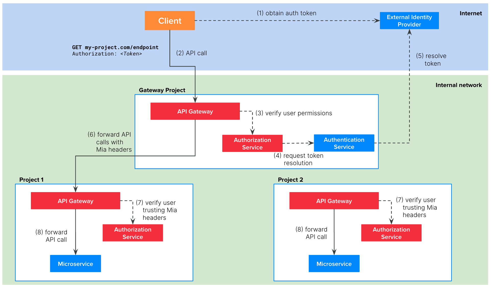

## Definition
In this scenario, we present the case where your architecture is composed by multiple Mia-Platform projects. Of course, you could think to treat each project as an independent entity and replicate, in each project, one of the scenarios presented so far.

For example, you could replicate Scenario 2 as in the following schema:

However, this replication brings some problems:
- The authentication service is replicated in every project. This is a waste of resources but it can also lead to problems when the service need to be updated for some projects
- In such architecture, it is likely that a service of one project need to call services of other projects. In this case, the token resolution call would be unnecessary repeated.  
- You may want to centralize the Ingresses management in a single namespace of your cluster. In this way it is easier to verify which are all the FQDNs connected to your Kuberntes clusters.

Therefore, we recommend to introduce in your architecture an `Edge Gateway` project that will be the entry point of all the incoming requests to your company and where you will centralize the token resolution flow.

The picture above illustrates the architecture of a company composed by two projects and an `Edge Gateway` project.

The `Edge Gateway` contains the following microservices:
1. `API Gateway`: Mia-Platform plugin available in [Nginix](/runtime_suite/api-gateway/10_overview.md) or [Envoy](/runtime_suite/envoy-api-gateway/overview.md)
2. [`Authorization Service`](/runtime_suite/authorization-service/10_overview.md): Mia-Platform plugin
3. `Authentication Service`: a custom microservice that you need to implement. It must integrate with your external IDP to resolve the user token.

Each project contains the following microservices:
1. `API Gateway`: Mia-Platform plugin available in [Nginix](/runtime_suite/api-gateway/10_overview.md) or [Envoy](/runtime_suite/envoy-api-gateway/overview.md)
2. [`Authorization Service`](/runtime_suite/authorization-service/10_overview.md): Mia-Platform plugin
3. The microservice connected to the endpoint

The picture above illustrates the auth flow at runtime:
1. The client, be it a web application or backend software, need to implement the authentication flow required by the IDP to obtain a valid token. With this token, the client will be able to call the endpoints of your project.
2. The client calls the endpoint of your project, including the valid token in the request. Usually this token is placed in the `Authorization` header but it can be placed in other headers or cookies.
3. The API Gateway of the `Edge Gateway` project calls the `Authorization Service`. Since the endpoint permissions will be set in 
4. To do so, the Authorization Service requests to the Authentication Service to resolve the token
5. The Authentication Service resolves the token contacting the external IDP and returns the user payload to the Authorization Service that can now check if the user belongs to the authorized groups 
6. If the verification performed by the Authentication Service is successful, then the API Gateway forwards the API call the right microservice of the project. Note that the target microservice will receive the follwoing additional headers that could be useful for their business logic:
  
  | Header              | Description                                                                                |
  | --------------------| ------------------------------------------------------------------------------------------ |
  | `Miausergroups`     | comma separated list of the groups the user belongs to                                     |
  | `Miauserid`         | the ID of the user                                                                         |
  | `Miauserproperties` | stringified JSON object containing the user payload returned by the Authentication Service |

## Tutorial steps
